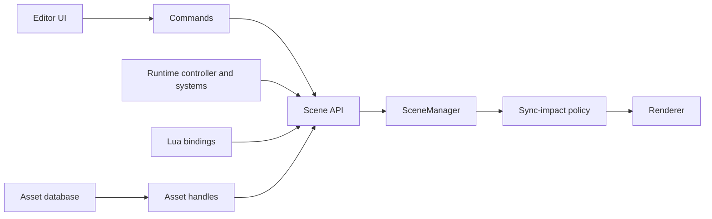

# Lightweight Game Engine Development Plan

Implementation roadmap for evolving RT2 from a renderer with scene-editing
facilities into a small, usable game engine. This plan is ordered around one
goal: close the authoring loop before expanding the renderer further.

The intended loop is:

```
create/import -> edit -> save -> play -> stop safely -> package -> run
```

## Existing foundation

RT2 already provides:

- an EnTT ECS with transforms, hierarchy, mesh references, materials, lights,
  cameras, names, and visibility;
- glTF/GLB and OBJ loading, scene import, primitive creation, and instancing;
- glTF/GLB scene saving with unit-tested geometry, material, texture, light,
  camera, and full-scene round trips;
- an outliner and inspector with transform, material, light, and camera editing;
- efficient full, material-only, and transform-only scene-to-GPU sync paths;
- a defined game loop and fixed-timestep integration point;
- headless rendering, regression scripts, and a Doctest-based `RT2Tests` target.

The glTF save path is useful for interchange and export. A native authoring
format is still needed because engine-only components and editor state should
not be forced into glTF extensions from the outset.

## Engineering principles

These apply across every phase.

1. **Editor and runtime state are distinct.** Playing a scene must not mutate
   the saved authoring scene unless the user explicitly applies a change.
2. **Stable identities cross persistence boundaries.** Serialized references
   use UUIDs or asset IDs, never raw `entt::entity` values or vector indices.
3. **Systems depend on narrow services.** Scripts do not access EnTT, GLFW,
   Vulkan, or ImGui directly.
4. **Scene mutations are centralized.** Editor operations use commands and the
   runtime uses a scene API, allowing validation, undo, dirty tracking, and the
   correct GPU synchronization path.
5. **CPU logic remains testable without a GPU.** Serialization, commands,
   input mapping, script bindings, asset resolution, prefab merging, physics
   mapping, and packaging should be separable from renderer initialization.
6. **Every phase leaves a usable increment.** Features are accepted through a
   small end-to-end workflow, not only isolated classes.

## Cross-phase architecture contracts

These contracts are prerequisites for work in later phases; they are not local
implementation choices.

### Scene mutation, synchronization, and dependency direction

All scene changes flow through the scene API. The editor reaches it through
commands; runtime systems reach it through narrow runtime services. The scene
API determines the only permitted renderer synchronization category:

| Impact | Required SceneManager path | Typical changes |
|---|---|---|
| `None` | No GPU sync | Editor selection, lock state, runtime-only counters |
| `Transform` | Transform-only sync | Rigid movement, hierarchy world-transform updates |
| `Material` | Material-only sync | Material assignment and editable material properties |
| `Structural` | Full scene/acceleration-structure rebuild | Entity, mesh, visibility, light, or topology changes |



No UI panel, script, asset importer, physics backend, or animation backend may
call EnTT mutation paths or renderer synchronization callbacks directly.

### Component ownership and persistence

Every component must be classified before it is introduced:

- **Shared authoring/runtime, persisted:** transform, hierarchy, mesh/material
  references, lights, cameras, and script field values.
- **Editor-only, never persisted in a scene:** selection, editor locks, gizmo
  state, outliner expansion, and editor camera state.
- **Runtime-only, never copied back to authoring:** physics bodies/handles,
  audio voices, Lua environments/timers, animation evaluation caches, and
  transient simulation state.

Runtime cloning copies persisted shared data into a runtime world, constructs
runtime-only state there, and destroys it on Stop. Editor-only state remains
outside both serialized scene data and the runtime world.

### Determinism and performance budgets

Fixed-step systems must define stable entity iteration, deferred-command/spawn
ordering, seed assignment, and event ordering. They must not depend on
unordered container traversal or order-dependent parallel accumulation.
Cross-platform floating-point results are compared with documented per-system
tolerances; exact byte equality is required only where the format or algorithm
is explicitly deterministic.

The vertical slice establishes baselines for Release build time, `RT2Tests`
runtime, headless runtime checks, and render-regression duration. Each later
phase must add at least one automated regression check for each public behavior
it introduces, and must record its measured build/test deltas. Until a project
specific budget replaces them, the default guardrails are: Release build median
within `max(10%, 60 s)` of baseline, `RT2Tests` plus required headless checks
within `max(20%, 30 s)`, and no unexplained renderer benchmark median regression
above 5% on the affected manifest cases. A justified baseline update is allowed
only with the reason and before/after measurements recorded. Renderer
performance work additionally uses the benchmark manifests and frame-time
thresholds in the rendering docs.

`UUID` is a core value type owned by a dedicated engine header/source pair
(`core/UUID.h` and `core/UUID.cpp`), with parsing, formatting, generation,
comparison, and hashing defined there. It is not a SceneManager-local alias.

### UUID generation policy

Entity identity uses RFC 9562 UUID v4 from the OS cryptographic RNG
(`CoCreateGuid`/`UuidCreate` on Windows). Generation is injectable through
`IUuidProvider` so tests and deterministic fixtures use
`DeterministicUuidProvider` while production uses `OsUuidProvider`.

- **Authored entities**: v4 from OS cryptographic RNG. Never use timestamps,
  pointers, `rand()`, EnTT IDs, or render seeds.
- **Asset IDs**: separate stable IDs, persisted in the asset database. They
  survive file renames and moves.
- **Linked imported nodes**: if stable source-node identity is required,
  derive UUID v5 from the asset ID plus a canonical importer node key.
  Ordinary "import into scene" entities receive fresh v4 IDs and retain them
  in the native scene.
- **Runtime cloning**: preserve UUIDs, because the runtime clone represents
  the same logical entities.
- **Duplication**: generate fresh v4 IDs for the duplicated subtree and
  remap internal references.
- **Undo/delete restoration**: restore the original IDs.

The render sampling seed must not influence UUID generation. UUID generation
is a pure identity concern, not a rendering or simulation concern.

## Test strategy

Use four layers of tests throughout the roadmap.

### Unit tests

Add deterministic Doctest cases to `RT2Tests`. Keep engine logic in source
files that can be linked by the test target without initializing Vulkan or a
window. Tests should use temporary directories and tiny programmatically built
scenes where practical.

### Integration tests

Exercise several CPU systems together: save/load round trips, command stacks,
play-scene cloning, script lifecycle, asset dependency resolution, prefab
overrides, and package manifests. These belong in `RT2Tests` when they do not
require an interactive window.

### Headless runtime tests

Extend the existing headless command line for deterministic smoke scenarios.
Return a non-zero exit code on load, script, asset, or runtime assertion
failures. Prefer state assertions or compact JSON reports to image comparison
for gameplay logic. Retain the existing render regression harness for visual
changes.

### Interactive acceptance tests

Some editor behavior cannot be proven economically through unit tests. Each
feature therefore lists a short manual runtime checklist. Keep these checks
small and repeatable; automate them later only when their regression frequency
justifies UI automation.

For all phases, the baseline gate is:

1. build `RT2App` and `RT2Tests` in Release x64;
2. run all `RT2Tests`;
3. run applicable headless smoke/regression tests;
4. complete the phase-specific interactive checklist.

## Phase 1 - Native scene persistence and stable IDs

### Outcome

Users can create a scene, save it, reopen it, and retain all authored state and
cross-entity references. Existing glTF/GLB saving remains an interchange/export
path.

### Work

- Add a stable `EntityIdComponent` containing a generated UUID.
- Add UUID lookup and enforce uniqueness during create, clone, import, and load.
- Define a versioned `.rt2scene` JSON schema.
- Store entity hierarchy and component data by UUID.
- Store source/imported mesh, texture, environment, and future script references
  as project-relative paths or asset IDs.
- Initially permit inline primitive geometry, but do not serialize large imported
  vertex arrays into readable JSON by default.
- Serialize camera, environment, materials, entities, and relevant render/world
  settings. Keep transient GPU and editor selection state out of the scene.
- Implement New, Open, Save, Save As, recent scenes, dirty tracking, and
  save/discard/cancel prompts.
- Write atomically via a temporary sibling file followed by replacement.
- Add a schema migration entry point even while only version 1 exists.
- Add bounded autosave and recovery records after explicit saving is stable;
  recovery must never overwrite the last explicitly saved scene.

### Unit and integration tests

- UUID generation produces non-null unique IDs and survives entity moves.
- Duplicate IDs in an input file are rejected with a useful error.
- Empty, primitive-only, imported-asset, hierarchy, light, camera, material, and
  mixed scenes round-trip structurally.
- Parent and component references resolve after entity creation order changes.
- Unknown optional fields are ignored; unsupported schema versions fail clearly.
- Relative paths are normalized without escaping the project root silently.
- Failed writes leave the previous valid scene intact.
- Recovery discovers an interrupted unsaved session, offers restore/discard, and
  leaves the explicitly saved scene unchanged in both cases.
- Dirty state changes only after authoring commands and clears after successful
  save/load.
- Continue running all existing glTF/GLB round-trip tests.

### Runtime acceptance

- Build a scene containing a parented primitive, imported mesh, material, light,
  and camera; save, restart RT2, reopen, and compare the viewport and inspector.
- Attempt New/Open/Exit with unsaved changes and verify all three prompt choices.
- Temporarily remove a referenced asset and verify a visible placeholder/error,
  not a crash or silent data loss.
- Simulate an interrupted session and verify the recovery prompt restores the
  autosave only when the user chooses it.

### Exit criteria

A non-trivial authored scene survives restart, recovery is available without
overwriting explicit saves, missing assets produce actionable diagnostics, and
existing interchange saving still passes its tests.

## Phase 2 - Scene-building ergonomics and viewport tools

### Outcome

A small level can be assembled efficiently from the viewport and outliner.

### Work

- Implement viewport picking with an entity/instance ID result. Prefer a small
  raster ID attachment or a CPU/GPU ray query with one-frame-safe readback over
  coupling selection to path-tracing samples.
- Add translate, rotate, and scale gizmos.
- Support local/world space, pivot choice, grid/angle/scale snapping, and numeric
  inspector entry.
- Add create-empty, create-child, rename, copy/paste, duplicate hierarchy,
  delete, and drag/drop reparenting.
- Add multi-selection, focus/frame selected, visibility, editor lock, and
  outliner search.
- Validate hierarchy edits against cycles and preserve world transform when the
  chosen reparent mode requests it.
- Add camera bookmarks and align active camera/entity camera to the editor view.

### Unit and integration tests

- Screen-coordinate/picking math maps known IDs and handles background pixels.
- Reparent rejects self-parenting and descendant cycles.
- Reparent preserve-world mode reconstructs the expected local transform.
- Duplicate hierarchy creates new UUIDs and remaps internal references.
- Deleting a hierarchy removes all descendants without invalid iteration.
- Snapping handles negative values, non-uniform scale, and configured increments.
- Locked entities reject editor mutations but remain available to runtime systems.

### Runtime acceptance

- Select overlapping objects from the viewport and outliner.
- Build a simple room using only primitives, gizmos, duplication, snapping, and
  reparenting.
- Verify selection stays correct while the renderer is accumulating and while
  frames are in flight.
- Verify transform edits use the transform-only GPU sync path.

### Exit criteria

The simple room can be built without editing source files or relying primarily
on inspector numeric fields.

## Phase 3 - Command system, undo, and redo

### Outcome

Every normal editor mutation is reversible and drives a deliberate scene/GPU
synchronization category.

### Work

- Introduce `IEditorCommand` with `Execute`, `Undo`, optional merge/coalesce,
  description, and sync impact (`None`, `Transform`, `Material`, `Structural`).
- Route every impact through the cross-phase SceneManager contract: `None` has
  no renderer work, `Transform` uses transform-only sync, `Material` uses
  material-only sync, and `Structural` uses full scene/AS rebuild.
- Add a bounded command history and redo stack.
- Route transform, create, delete, duplicate, rename, reparent, add/remove
  component, material assignment, and property edits through commands.
- Snapshot only the affected subtree/component data rather than the whole scene.
- Coalesce continuous gizmo drags and sliders into one history entry.
- Clear or deliberately preserve history on scene load; do not retain commands
  that refer to a previous scene instance.

### Unit and integration tests

- Every command restores the exact relevant before/after state.
- A new command after Undo clears the redo branch.
- Coalescing creates one transform command per drag, not per frame.
- Delete/undo restores UUIDs, hierarchy, components, and asset references.
- Sync impact selects only the expected SceneManager callback using
  spies/counters; transform commands must not trigger material or structural
  work, and structural commands must not silently downgrade.
- History limit evicts safely without corrupting retained commands.

### Runtime acceptance

- Build and then undo/redo a mixed sequence of create, transform, reparent,
  material edit, and delete operations.
- Hold a gizmo drag for many frames and confirm one Undo restores the starting
  transform.

### Exit criteria

All exposed authoring changes are command-backed or explicitly documented as
non-undoable.

## Phase 4 - Edit/Play/Pause lifecycle

### Outcome

The editor can run a temporary runtime world and return safely to authored state.

### Work

- Add explicit `Edit`, `Playing`, and `Paused` application states.
- Clone/serialize the authoring scene into a runtime scene on Play.
- Keep selection and editor camera separate from the runtime primary camera.
- Add Play, Pause, Step, and Stop controls plus shortcuts.
- Define system lifecycle: scene start, fixed update, variable update, scene stop.
- Snapshot previous transforms before simulation, update hierarchy after systems,
  then issue one batched transform sync before render.
- Disable or clearly scope authoring operations during Play.
- Restore the unchanged authoring scene on Stop.

[`game-loop.md`](game-loop.md#planned-runtime-frame-order-contract-phase-4) is
the canonical runtime frame-order contract. Phase 4 must implement its named
stages, including the deferred structural-change safe point and one batched
sync before render. Changes to runtime ordering are proposed there first; this
plan deliberately does not duplicate the sequence. Lifecycle-order tests
exercise the same named stages recorded in that contract.

### Unit and integration tests

- Runtime clone has the same UUIDs and data but independent storage.
- Runtime create/delete/transform changes do not affect the authoring scene.
- Stop restores authoring data byte-for-byte at the serialization level.
- Pause runs no simulation updates; Step runs exactly one fixed update.
- Lifecycle callbacks fire once and in the documented order.
- A long frame is clamped and fixed substeps obey a configurable maximum.

### Runtime acceptance

- Press Play, move/spawn/delete runtime entities through a temporary test system,
  Pause, Step, and Stop; verify the edit scene is unchanged.
- Verify the primary runtime camera controls the viewport during Play and the
  editor camera returns on Stop.

### Exit criteria

Repeated Play/Stop cycles neither leak entities/resources nor alter saved scene
state.

## Phase 5 - Input action system

### Outcome

Gameplay code consumes stable named actions and axes, independent of GLFW and
editor shortcuts.

### Work

- Add action and axis definitions with keyboard, mouse, and controller bindings.
- Track pressed, held, released, axis value, and mouse delta per frame.
- Add editor and runtime input contexts and explicit cursor capture modes.
- Serialize mappings in project settings, not individual scenes.
- Expose a read-only input service to scripts.
- Add controller dead zones and focus-loss reset behavior.

### Unit and integration tests

- Synthetic input events produce correct edge/held states.
- Multiple bindings combine predictably and axes clamp as documented.
- Focus loss releases held inputs and prevents stuck movement.
- Context switching prevents runtime input from triggering editor commands.
- Mapping serialization round-trips and unknown device inputs are ignored safely.

### Runtime acceptance

- Rebind a movement action, enter Play, and verify the new binding immediately.
- Switch window focus while holding a key and confirm no stuck action on return.
- Verify editor shortcuts do not move the player while editing script fields.

### Exit criteria

No gameplay-facing code reads GLFW key or mouse state directly.

## Phase 6 - Lua scripting

### Outcome

Entities can have persistent, hot-reloadable behavior authored outside C++.

### Work

- Embed Lua and add a serializable script component referencing a script asset.
- Use one engine Lua state with isolated per-entity environments unless profiling
  proves a different model necessary.
- Implement `OnCreate`, `OnFixedUpdate`, `OnUpdate`, and `OnDestroy`.
- Expose validated entity handles, transform/light/camera/visibility access,
  find, spawn, destroy, logging, timers, input, and later physics queries.
- Do not expose the EnTT registry, raw component pointers, renderer, or window.
- Reflect declared public fields with supported types into the inspector and
  serialize their values in the scene.
- Add file watching and safe hot reload. Preserve compatible public fields and
  report syntax/runtime errors with path, entity, callback, and stack trace.
- Define public-field compatibility precisely: same field name and supported
  type preserves its value; added fields receive declared defaults; removed
  fields are dropped with a warning; renamed fields require an explicit alias;
  incompatible type changes reset to the declared default with a diagnostic.
- Queue structural ECS changes made during iteration and apply them at a defined
  safe point.

### Unit and integration tests

- Lifecycle order and callback counts match Play/Pause/Stop rules.
- Two entities using one script have isolated environment state.
- Public fields serialize, deserialize, retain types, and preserve compatible
  values across reload.
- Reload tests cover added, removed, explicitly renamed, and incompatible-type
  public fields, including the required warning/diagnostic for each lossy case.
- Destroyed entity handles fail safely rather than aliasing a reused EnTT ID.
- Spawn/destroy during update is deferred and deterministic.
- Script syntax/runtime errors disable or quarantine only the affected instance.
- Timers respect pause and scene destruction.
- A scripted transform results in one batched transform sync per rendered frame.

### Headless/runtime acceptance

- Run a deterministic script that moves an entity for a fixed number of frames;
  emit a JSON state report and assert the final transform.
- Edit the script while Playing and confirm hot reload without restarting RT2.
- Introduce a syntax error and verify the scene continues running with a useful
  error in the console.

### Exit criteria

A saved script component can drive an entity using input and survive save/load,
Play/Stop, and hot reload.

## Phase 7 - Project model and asset database

### Outcome

Scenes, scripts, meshes, textures, environments, and generated data belong to a
portable project with stable references.

### Work

- Define `project.rt2proj` with project UUID, asset root, cache root, startup
  scene, input map, and default runtime settings.
- Add stable asset IDs, source paths, asset types, import settings, and dependency
  records.
- Add a content browser with search, rename/move/delete, drag/drop, and reimport.
- Watch source files and reimport asynchronously where safe.
- Keep generated cache artifacts outside source asset folders.
- Add placeholders and diagnostics for missing, invalid, or cyclic references.
- Make project moves portable by storing paths relative to the project root.

### Unit and integration tests

- Asset IDs survive rename/move and scene references continue resolving.
- Scanning produces the same database independent of directory enumeration order.
- Dependency graphs detect missing assets and cycles.
- Reimport updates cache metadata without changing asset identity.
- Project relocation preserves all valid relative references.
- Asset deletion reports dependants before committing the change.

### Runtime acceptance

- Move and rename a referenced mesh and script through the content browser; reload
  the scene and confirm both still resolve.
- Modify a source texture and verify reimport updates the viewport safely.

### Exit criteria

A project folder can be copied to another machine/location without rewriting
scene files manually.

## Phase 8 - Prefabs

### Outcome

Reusable entity hierarchies can be instantiated and customized without losing
their relationship to the source.

### Work

- Define a prefab asset as a serialized entity subtree with stable local IDs.
- Add instantiate, unpack, apply overrides, and revert overrides.
- Track instance-to-prefab local-ID mapping and property-level overrides.
- Remap internal entity references per instance; preserve external references only
  when explicitly supported.
- Defer nested prefabs until the single-level model is stable and tested.

### Unit and integration tests

- Multiple instances receive unique scene UUIDs with correct internal references.
- Source updates propagate to non-overridden properties.
- Overrides survive save/load and source updates.
- Apply/revert produces deterministic serialized output.
- Deleted or added prefab children merge predictably.

### Runtime acceptance

- Create a light fixture hierarchy, instantiate it several times, override one
  material, update the source, and verify expected propagation.

### Exit criteria

Common hierarchy reuse no longer requires copy/paste, and overrides are visible
and recoverable.

## Phase 9 - Physics and collision queries

### Outcome

Scenes support reliable rigid-body gameplay and scriptable spatial queries.

### Work

- Integrate Jolt behind an RT2-owned `PhysicsSystem` abstraction.
- Add rigid-body and collider components with static, dynamic, and kinematic modes.
- Support box, sphere, capsule, convex, trigger, and static triangle-mesh shapes in
  that order.
- Add collision layers/masks, materials, gravity, fixed timestep, and interpolation.
- Synchronize authored transforms into physics at scene start and physics results
  back to ECS after each fixed step.
- Add raycast, overlap, and shape-cast APIs and collision enter/stay/exit events.
- Add collider/contact/velocity debug drawing independent of the RT pipeline.
- Use CPU collision data; do not make simulation correctness depend on asynchronous
  GPU BLAS queries.
- Treat rigid-body transform changes as `Transform` syncs: update the matching
  RT instance transform/TLAS path once per rendered frame so path tracing sees
  dynamic rigid bodies. Static triangle-mesh collider geometry stays static;
  deforming geometry is deferred to the explicit animation/BLAS policy in Phase
  10. Do not pause or silently cheapen RT rendering during simulation.
- Measure and document the dynamic-instance/TLAS update cost in the physics
  acceptance scene before enabling large dynamic-body counts by default.

### Unit and integration tests

- Component-to-Jolt shape/body conversion preserves scale and mode constraints.
- Collision mask filtering, raycasts, overlaps, and triggers return expected IDs.
- Fixed-step integration is repeatable within documented floating-point tolerance.
- Parent/child and non-uniform-scale restrictions are validated clearly.
- Destroying an entity removes its body and pending events safely.
- Collision events fire with correct enter/stay/exit transitions.
- Dynamic rigid-body motion triggers transform-only renderer sync and the
  corresponding RT instance update, not a full BLAS rebuild.

### Headless/runtime acceptance

- Run a deterministic drop-and-collision scene for a fixed number of steps and
  validate final position, sleep state, and event counts.
- Interactively test stacked boxes, a kinematic platform, a trigger, and collider
  debug visualization.

### Exit criteria

Scripts can build a basic character/object interaction without touching the
physics library directly. Lua (Phase 6) is a hard prerequisite for this
script-facing acceptance criterion, not for the underlying physics integration.

## Phase 10 - Animation

### Outcome

Imported assets can play and blend transform and skeletal animations in runtime.

### Work

- Import glTF animation clips, skin data, and inverse bind matrices.
- Add animation clip assets and animator components.
- Begin with clip playback and cross-fade; add a parameterized state machine next.
- Evaluate animation before world-transform propagation.
- Implement skinning with a path usable by both raster and ray-tracing geometry;
  define the RT acceleration-structure update cost explicitly.
- Add inspector controls, playback preview, speed, looping, and script API.
- Defer root motion, animation events, IK, and blend trees until clip/state-machine
  playback is sound.

### Unit and integration tests

- Keyframe interpolation handles boundary, loop, step, linear, and supported cubic
  cases.
- Skeleton hierarchy and inverse-bind evaluation match known fixtures.
- Cross-fade weights remain normalized and reach exact endpoints.
- Animator state serialization and parameter transitions round-trip.
- Malformed clips fail without corrupting the scene.

### Runtime acceptance

- Play, pause, scrub, loop, and blend a known glTF character.
- Verify raster and RT representations remain spatially consistent during motion.
- Use render regression captures for a fixed animation frame sequence.

### Exit criteria

A scripted entity can select and blend imported clips reproducibly. Lua (Phase
6) is a hard prerequisite for the script-API portion of this phase, not for
implementing animation playback itself.

## Phase 11 - Audio

### Outcome

Games can play 2D and spatial sounds through a small mixer model.

### Work

- Integrate miniaudio behind RT2 audio interfaces.
- Add audio clip assets, source components, and a listener bound to the active
  runtime camera.
- Support play/stop/pause, loop, volume, pitch, spatial attenuation, and autoplay.
- Add master, music, effects, and UI buses.
- Expose safe script controls and update spatial state after transforms.

### Unit and integration tests

- Attenuation, pan, bus gain, and state transitions use deterministic math tests.
- Source/listener component serialization round-trips.
- Destroying a playing entity releases the voice safely.
- Mock backend tests verify play/stop/pause calls without requiring an audio device.

### Runtime acceptance

- Walk around a looping spatial source and verify attenuation/orientation.
- Pause/Stop Play mode and confirm runtime voices stop and do not accumulate across
  repeated sessions.

### Exit criteria

Audio can be authored, saved, controlled by scripts, and cleaned up reliably.
Lua (Phase 6) is a hard prerequisite for the script-control acceptance portion,
not for implementing the audio backend itself.

## Phase 12 - Standalone runtime and packaging

### Outcome

A project can be built and run without editor UI or source asset assumptions.

### Work

- Separate reusable engine/runtime startup from editor startup.
- Add a runtime executable/configuration that loads a packaged project and startup
  scene without editor panels.
- Build a dependency collector from the startup scene and referenced scenes,
  prefabs, scripts, and assets.
- Copy or archive runtime-ready assets, shaders, project settings, and manifests.
- Package the exact SPIR-V/shader set required by the selected runtime renderer;
  fail packaging if the package manifest and shader inventory disagree.
- Add Build, Build and Run, Debug, and Release options.
- Add window title, resolution, fullscreen, vsync, and logging settings.
- Detect missing package dependencies before launch.
- Validate runtime device assumptions before launch: required Vulkan version,
  ray-tracing/descriptor extensions and features, required formats, and the
  documented fallback or clear failure when unsupported. Debug validation layers
  are optional diagnostics and must not be a Release package dependency.
- Make package output reproducible where possible.

### Unit and integration tests

- Dependency collection is complete, deduplicated, cycle-safe, and deterministic.
- Package manifest hashes and paths are stable for identical inputs.
- Missing startup scenes/assets fail packaging with clear dependency chains.
- Runtime configuration parsing handles defaults and invalid values.
- Editor-only assets/code are absent from Release packages.
- Package validation detects missing or stale SPIR-V/shader files before launch.
- A device-capability preflight reports unsupported required Vulkan features and
  validates the documented fallback/failure path.
- Debug and Release package manifests differ only where documented; Release does
  not require validation layers or source-tree shader paths.

### Headless/runtime acceptance

- Package the vertical-slice project, launch its runtime executable headlessly for
  a fixed frame count, and verify a successful report/exit code.
- Launch interactively on a clean directory or test machine without source-tree
  working-directory assumptions.
- Launch on a clean machine/configuration with the packaged shaders and verify
  capability diagnostics or the supported renderer fallback before scene load.

### Exit criteria

The vertical slice runs from a self-contained package without launching the RT2
editor.

## Later backlog

These should follow the core authoring/runtime loop unless a concrete game needs
one earlier:

- particles and decals;
- runtime UI/canvas and menus;
- navigation mesh and AI helpers;
- additive scenes and scene streaming;
- mesh LOD, visibility culling, and mesh streaming;
- terrain tooling;
- networking and visual scripting.

Renderer-specific upscaling and display performance work (for example FSR/DLSS)
belongs in the rendering roadmap and must use renderer benchmarks, not this
engine-feature backlog. Before Phase 5 input mappings become a stable public
gameplay API, write a networking feasibility note covering authority, replicated
state ownership, input-command serialization, prediction/reconciliation, and
the determinism policy above. Networking remains deferred until a concrete game
requires it, but its dependency direction must not be designed retroactively.

# First tiny vertical slice development plan

## Goal

Deliver the smallest end-to-end proof that RT2 can author and run behavior
without committing to the full asset, physics, prefab, or packaging designs.

The slice is:

> Create a cube and camera, save the scene, press Play, run a built-in test
> behavior that moves the cube, Pause/Step, Stop, and confirm the authored cube
> returns to its saved transform; reopen the scene and confirm persistence.

This intentionally uses a native C++ `MotionComponent`/test runtime system, not
Lua. The purpose is to validate persistence, stable IDs, runtime scene cloning,
lifecycle, transform propagation, and GPU synchronization before embedding a
scripting language. The component is a temporary vertical-slice vehicle or a
generic reusable movement component; it must not become the long-term scripting
API accidentally.

### Migration contract with Phase 1

The slice is a constrained Phase 1 implementation, not a throwaway serializer.
It must use the production UUID type, schema-version header, atomic save path,
two-pass UUID reference resolution, and migration entry point. Its primitive
mesh identifiers are explicitly a v1 subset: Phase 1 migrates them to
project-relative asset references or asset IDs without changing entity UUIDs,
hierarchy references, or authored material identity. Slice-only shortcuts may
not become the general serializer contract, and Phase 1 must add fixtures that
load every slice scene before expanding the schema.

## In scope

- UUID component and lookup, backed by the core UUID value type.
- Minimal version-1 `.rt2scene` JSON containing:
  - scene version;
  - entity UUID, name, transform, hierarchy, visibility;
  - primitive mesh identity/reference and material assignment;
  - light and camera components needed by the fixture;
  - `MotionComponent` velocity for the test behavior.
- New/Open/Save/Save As and dirty marker. Recent scenes are deferred; recovery
  autosave is required by the subsequent full Phase 1 persistence gate.
- Edit, Play, Paused states plus Play/Pause/Step/Stop controls.
- Deep cloning of authoring scene to runtime scene.
- Fixed timestep accumulator with maximum substep count.
- `MotionSystem::FixedUpdate` moving runtime transforms.
- One batched transform propagation/sync per rendered frame.
- A deterministic headless slice runner or CLI flags.
- Focused tests and a checked-in tiny fixture scene.

## Explicitly out of scope

- Lua, user-configurable input, physics, prefabs, asset database, gizmos, undo,
  audio, animation, and standalone packaging.
- General serialization of arbitrary components through reflection.
- Embedded imported geometry in `.rt2scene`; use built-in primitive identifiers in
  this slice.
- Applying runtime changes back to the authoring scene.

## Proposed types and boundaries

```cpp
struct EntityIdComponent { UUID id; };

struct MotionComponent
{
    glm::vec3 linearVelocity{0.0f};
};

enum class SceneRunState { Edit, Playing, Paused };

class SceneSerializer
{
public:
    static bool Save(const ECSScene&, const std::filesystem::path&, Error&);
    static bool Load(ECSScene&, const std::filesystem::path&, Error&);
};

class RuntimeSceneController
{
public:
    bool Play(const ECSScene& authoringScene);
    void Pause();
    void Step();
    void Stop();
    void Update(float frameDt);
};
```

`RuntimeSceneController` owns the runtime clone. The editor retains ownership of
the authoring scene. Renderer scene selection must be explicit when entering and
leaving Play so callbacks do not retain references to the wrong scene.

## Work packages

### VS-1 - UUID foundation

- Implement UUID parse/format/generation and `EntityIdComponent`.
- Assign IDs in every current SceneManager entity-creation path and during import.
- Add lookup and uniqueness validation.

Tests:

- parse/format round trip;
- generation uniqueness over a practical sample;
- all SceneManager creation paths receive IDs;
- lookup and duplicate rejection.

Done when every authored entity has a stable ID and existing ECS tests pass.

### VS-2 - Minimal scene serializer

- Define and document schema version 1.
- Serialize the in-scope components and hierarchy references by UUID.
- Load in two passes: create entities/components, then resolve references.
- Save atomically and report path plus reason on failure.
- Add the file-menu actions and dirty title marker.

Tests:

- empty and slice fixture round trips;
- hierarchy resolves independent of serialized order;
- malformed UUID, duplicate UUID, missing parent, and unsupported version errors;
- failed save does not destroy an existing file;
- loaded scene generates equivalent GPU scene instance/material counts.

Runtime check:

- author fixture, save, restart, reopen, and visually compare.

Done when the fixture survives restart and its serialized form is deterministic
enough for readable source control diffs.

### VS-3 - Runtime scene clone and state machine

- Implement a deep CPU clone, preferably through an in-memory serializer path so
  clone and persistence exercise the same component coverage.
- Add Play/Pause/Stop and make renderer scene switching explicit.
- On Stop, destroy runtime systems/resources and resync the untouched edit scene.

Tests:

- clone equivalence and storage independence;
- legal and illegal state transitions;
- repeated Play/Stop cycles;
- runtime entity changes cannot affect authoring data;
- Stop restores serialized authoring state exactly.

Runtime check:

- enter and stop Play repeatedly while editing transforms between sessions.

Done when runtime state can be discarded without modifying or leaking the edit
scene.

### VS-4 - Fixed update and motion behavior

- Add the fixed accumulator, maximum substep guard, and `MotionSystem`.
- Update runtime local transforms, mark them dirty, propagate hierarchy once after
  simulation, and issue the appropriate transform-only GPU sync.
- Implement Pause and single fixed Step.

Tests:

- known velocity and step count produce the expected transform;
- frame-time partitioning produces equivalent results within tolerance;
- Pause performs zero updates and Step performs exactly one;
- large frame time respects clamp/substep cap;
- sync callback spy observes no structural sync during motion.

Headless check:

- load the fixture, run 60 fixed steps, emit final cube transform, compare it with
  the expected value, Stop, and verify the authoring transform.

Done when the cube moves deterministically in Play and snaps back on Stop.

### VS-5 - End-to-end hardening

- Add the fixture and vertical-slice invocation to regression scripts.
- Verify useful error behavior for unreadable scenes and invalid fixture data.
- Update `scene-management.md`, `game-loop.md`, and `future-extensions.md` so their
  implemented/planned status and lifecycle order agree.
- Run full Release build, all unit tests, headless slice, and existing render
  regressions affected by scene switching.

Done when a clean checkout can execute the documented slice without manual data
repair or hidden working-directory assumptions.

## Vertical slice acceptance script

1. Launch RT2 and create a new scene.
2. Add a cube, camera, and light; set the cube velocity to `(1, 0, 0)`.
3. Save as `vertical-slice.rt2scene`; close and reopen it.
4. Record the authored cube transform.
5. Press Play and observe the cube move.
6. Pause and verify it stops; press Step and verify exactly one small movement.
7. Press Stop and verify the original authored transform returns.
8. Save/reopen again and verify no runtime transform was persisted.
9. Run the headless form for 60 fixed steps and require a zero exit code plus the
   expected final runtime and restored authoring transforms.

## Vertical slice merge gates

- `RT2App` Release x64 builds.
- `RT2Tests` Release x64 builds and all tests pass.
- Headless vertical-slice test passes deterministically in repeated runs.
- Existing glTF save/load and GPU scene-data tests remain green.
- Manual acceptance script passes.
- New public formats and lifecycle behavior are documented.

## What follows immediately

After the slice, implement the full Phase 1 persistence requirements, including
the migration of every slice fixture to the general asset-reference schema and
autosave/recovery, then Phase 2 scene-building tools and Phase 3 commands/undo.
General Lua scripting should begin only after the Play lifecycle and mutation
boundaries proven by this slice are stable.

### Phase 1A — asset-backed native scene round-trip (implemented)

Phase 1A extends the vertical slice so an imported model plus an HDR/EXR
environment map survive save, restart, and reopen. It delivers:

- Schema version 2 with durable asset references (`ImportedMeshSourceComponent`,
  `MaterialOverrideComponent`) and v1 read + in-memory migration.
- `SceneAssetResolver`: a CPU-side, Vulkan-free service that rebuilds meshes,
  textures, materials, and environment pixels from durable references after a
  structural load, with `AssetDiagnostic` reporting for missing/malformed/
  unresolved assets.
- Import provenance attached at load/import time (glTF scene/node/mesh/
  primitive keys; OBJ whole-model + importer profile).
- Scene-relative, normalized, portable UTF-8 asset paths; absolute machine-
  specific paths are not persisted.
- `SetEditable(false)` enforced across all authoring mutation paths during
  Play.
- Transactional load (parse/schema/resolution failure cannot partially
  replace the open authoring document) and atomic save semantics retained.
- Checked-in tiny fixtures (textured GLB, tiny EXR) and focused RT2Tests
  covering UUID coverage, v1→v2 migration, malformed references, deterministic
  v2 saves, imported-asset round trip, environment round trip,
  transactionality, and the runtime boundary.

What remains in full Phase 1 (intentionally deferred from 1A):

- Bounded autosave and recovery records after explicit saving is stable.
- Recent-scenes UI and project-root settings.
- Later asset-database migration (Phase 7 global asset UUIDs) — explicitly
  out of scope for 1A; the slice uses scene-relative paths, not asset UUIDs.

### Phase 1B — crash-safe authoring and session recovery (implemented)

Phase 1B closes the remaining Phase 1 requirements: bounded autosave,
recovery, Save/Discard/Cancel prompts, recent-scenes, and project-root
editor settings. It delivers:

- `EditorSettingsStore`: versioned JSON, atomic write, MRU recents (bounded
  10, deduplicated case-insensitively on Windows), optional project root.
  Production path: `%LOCALAPPDATA%\RT2\Editor\settings.json`. Tests inject
  a temporary directory.
- `SceneRecoveryService`: one atomically-replaced `.rt2recovery` JSON envelope
  per
  logical document, global cap of 8 records (oldest evicted only AFTER a
  new record commits). `MaybeSnapshot` is guarded by dirty + interval +
  revision; the first dirty observation starts the interval rather than
  writing immediately. No work happens on clean frames or unchanged revisions.
  Snapshots use `SceneSerializer::SaveTo` so asset references stay
  relativized against the original authoring scene root, NOT the recovery
  directory. The complete document identity is hashed into the record filename,
  and discard is constrained to direct child records. A recovered scene with
  imported meshes/materials/env resolves correctly. Transactional restore,
  discard, `DiscardForDoc`, `OnSaveAs`.
  Recovery manifest has its own version (independent of `.rt2scene` v2).
- `UnsavedChangesCoordinator`: pure state machine (no ImGui) for
  New/Open/Recent/Exit with Save/Discard/Cancel. One pending action; a second
  request while pending is rejected. `SaveGate`/`ExecuteGate`/
  `DiscardRecoveryGate` callbacks support test injection. The host
  exposes one unified save gate and decides Save versus Save As from whether
  the document already has a native source path.
- `SceneManager::AuthoringRevision()`: a transient counter bumped on every
  authoring mutation via `NotifyAuthoringChanged()`. Used by the recovery
  service to skip identical snapshots. Not serialized into `.rt2scene`.
- `Walnut::Application::RequestClose()`: interactive, cancelable close
  request. `glfwSetWindowCloseCallback` cancels the OS close and routes
  through the coordinator. Headless/internal completion still uses
  `Close()` directly.
- Unicode Windows file/folder dialogs with long-path-sized buffers and the
  active scene/project root as the initial location. `FileDialog::OpenFolder()`
  supports project-root selection.
- RT2SliceRunner `--recovery-scenario` mode + `run_recovery_test.ps1`: a
  deterministic CPU-only, asset-backed recovery regression (generate textured
  GLB + EXR → load → save → edit transform/material →
  autosave → drop session → discover → restore → verify edit + UUIDs +
  imported assets + decoded environment + explicit file unchanged → discard).
  Emits structured JSON; exits non-zero on
  failure.
- RT2Tests Phase 1B coverage: 44 tests (14 EditorSettings + 30 Recovery/
  Coordinator) covering defaults, round trip, malformed/unsupported
  settings, Unicode paths, atomic replacement failure, MRU order/dedup,
  bounded recents, autosave scheduling, dirty/sourcePath/
  explicit-file preservation, retention eviction, discovery, restore
  (UUIDs, imported GLB/texture/EXR, authored material override, dirty,
  untitled), document adoption, full-path identity, contained discard,
  corrupt envelope, failed-restore-preserves-live-doc, asset-root, Save As
  retirement, and all coordinator transitions.
- Verified baseline delta: the implementation report's 275 passing tests rose
  to 281 (+6 targeted regression cases added during review). Release x64,
  RT2Tests, the original slice runner, and the asset-backed recovery scenario
  all pass. No renderer benchmark baseline changes are expected because this
  slice affects editor/session code and the recovery runner is CPU-only.

**Phase 1 exit criteria are now satisfied.** A non-trivial authored scene
survives restart, recovery is available without overwriting explicit
saves, missing assets produce actionable diagnostics, and existing
interchange saving still passes its tests.

### Phase 2A — stable viewport selection (implemented)

The first Phase 2 slice establishes selection and picking without coupling
editor identity to transient ECS handles or path-tracing samples:

- `EditorSelection` stores an ordered set of authoring UUIDs. The final UUID
  is the primary selection used by the Inspector. Selection is editor-only,
  is never serialized, and prunes UUIDs that no longer resolve.
- Outliner clicks and viewport clicks share that selection state. Ctrl-click
  toggles Outliner membership; hierarchy deletion clears/prunes affected IDs.
- `ScreenToRenderPixel` defines the single top-left-origin conversion from
  ImGui screen coordinates through displayed viewport size to render pixels.
- `Camera::GetPickingRay` is a deterministic pinhole ray. It deliberately
  ignores the path tracer's stochastic aperture sampling.
- A one-invocation Vulkan compute pass uses `GL_EXT_ray_query` against the
  existing TLAS. It evaluates MASK alpha cutoffs and deterministic BLEND alpha
  coverage before confirming an intersection.
- `RenderInstanceMap` is submission metadata outside `GPUSceneData`. It is
  produced by the same ECS iteration as the GPU instance array, so instance
  index `i` always maps to the UUID at entry `i`.
- Picking has one result buffer per frame in flight. A slot captures its own
  UUID map when recorded and is read only after that slot's normal render
  fence signals. No queue-idle/device-idle wait is added. Monotonic request
  serials suppress superseded clicks; scene/transform/resize changes cancel
  outstanding requests.
- Picking is active only in Edit state. A background miss clears selection.

Verification:

- Release x64 full solution builds, including `picking.comp`.
- RT2Tests: 286/286 test cases and 141,627/141,627 assertions pass.
- Live Release-layout test: cube click selected Cube in Outliner/Inspector,
  sphere click switched both to Sphere, and a background click cleared both.

### Phase 2B — transform editing and gizmos (implemented)

The second Phase 2 slice adds a viewport-first transform workflow while
preserving the existing renderer synchronization boundary:

- `EditableTRS` provides strict affine decomposition and composition. Singular
  matrices and results containing shear are rejected instead of silently
  changing the authored transform.
- `SceneManager` supports non-uniform local transforms, validated world-space
  edits through parent transforms, and atomic world edits for a selection. A
  failed batch leaves every selected entity unchanged.
- The Inspector exposes numeric local/world position, rotation, and non-uniform
  scale; primary/median/individual pivot choice; and configurable translation,
  angle, and scale snapping.
- The viewport provides move, rotate, and scale handles with W/E/R shortcuts,
  local/world axes, all pivot modes, snapping, and ordered UUID multi-selection.
  Continuous manipulation uses the transform-only GPU update path.
- A four-pixel drag threshold separates manipulation from selection. A plain
  click on an axis selects the object underneath it, preventing handles from
  masking small or nearby objects. Ctrl-click toggles viewport selection.
- Shared-pivot edits apply `D = currentPivot * inverse(startPivot)` and
  `world[i]' = D * world[i]`. Individual mode builds the corresponding delta
  around each entity's own pivot and, in local mode, its own orientation.

Verification:

- Release x64 full solution builds.
- RT2Tests: 297/297 test cases pass; focused Phase 2B coverage passes 11/11
  cases and 103/103 assertions.
- The vertical-slice and recovery regression scripts pass.
- Live Release-layout test: viewport click selected `Bishop_W2`; a click
  through its horizontal gizmo handle selected neighboring `Knight_W2`; a
  deliberate drag of the same handle changed the selected transform.

Phase 2 is not complete. The next vertical slice is Phase 2C: hierarchy
creation, duplication, reparenting, visibility/lock, and outliner search.
Phase 2D then adds framing and camera bookmarks. Undo/redo remains Phase 3.
