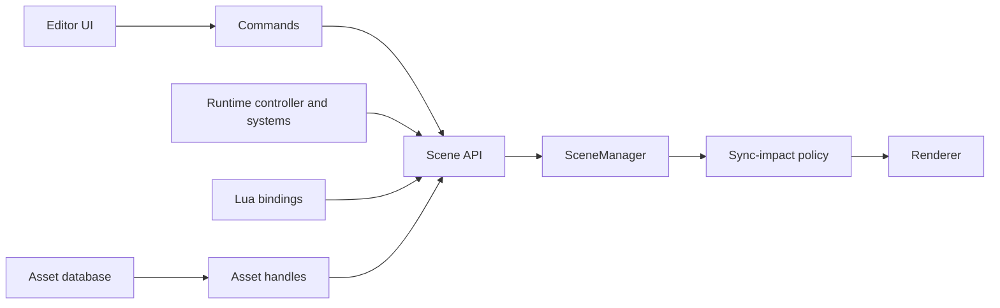

# Lightweight Game Engine Development Plan

Implementation roadmap for evolving RT2 from a renderer with scene-editing
facilities into a small, usable game engine. This plan is ordered around one
goal: close the authoring loop before expanding the renderer further.

The intended loop is:

```
create/import -> edit -> save -> play -> stop safely -> package -> run
```

## How to read this document

**It is append-only and chronological.** Sections are added as work happens
and are not retro-edited. Two consequences that matter more than anything
else here:

1. **A completed phase's section is a period record, not current state.**
   It describes the tree as it was when that phase landed. Figures inside it
   ("7 failures", "W4-W5 remain", "declared and stubbed") were true then and
   are routinely false now. Do not quote them. Where a section has been
   superseded it carries an explicit note saying so.
2. **Each phase appears twice.** A short scope stub in the roadmap below,
   written before the work; and — once worked — a much longer section near
   the end with grounded findings, decisions, workstreams and a verification
   report. The stub is the intent; the later section is what happened.

If you need current state rather than history, these are authoritative:

| Question | Where |
|---|---|
| Which tests should pass? | **Test baseline** (near the end) — supersedes every earlier figure |
| What does the engine do today? | The `docs/` siblings: `scripting.md`, `scene-management.md`, `game-loop.md` |
| What is being built next? | **Phase 7 — implementation plan**; W0–W3 are closed, **W4 is the next unstarted roadmap work** |
| What does this term mean? | `docs/glossary.md` — terms that have caused a defect, and the four context boundaries indices are translated across. Unlike this file it is corrected in place. |

**A number means a roadmap phase and nothing else.** Off-roadmap work gets a
name. Two sections were once both called "Phase 8"; see the glossary entry for
`Phase N`.

This file is also **two documents concatenated**: the phase roadmap, then
`# First tiny vertical slice development plan` at the halfway point. The
generic headings (`Goal`, `In scope`, `Work packages`) belong to the second.

## Contents

**Part 1 — Roadmap.** Scope stubs written ahead of the work.

- Existing foundation · Engineering principles · Cross-phase architecture
  contracts · Test strategy
- Phase 1 Native scene persistence · Phase 2 Scene-building ergonomics ·
  Phase 3 Command system, undo, redo · Phase 4 Edit/Play/Pause lifecycle ·
  Phase 5 Input action system · Phase 6 Lua scripting · **Phase 7 Project
  model and asset database** · Phase 8 Prefabs · Phase 9 Physics ·
  Phase 10 Animation · Phase 11 Audio · Phase 12 Standalone runtime
- Later backlog

**Part 2 — First tiny vertical slice.** Goal · In scope · Explicitly out of
scope · Proposed types and boundaries · Work packages · Acceptance script ·
Merge gates.

**Part 3 — Worked sections**, under "What follows immediately". Each is
grounded against the code as it stood at the time.

| Section | Status |
|---|---|
| Phase 1A asset-backed scene round-trip | implemented |
| Phase 1B crash-safe authoring and recovery | implemented |
| Phase 2A stable viewport selection | implemented |
| Phase 2B transform editing and gizmos | implemented |
| Phase 2C hierarchy authoring and outliner | implemented |
| Phase 2D camera authoring workflow | implemented |
| Phase 3A command/history foundation | implemented |
| Phase 3B1 structural command correctness | implemented |
| Phase 3B2 property command completion | implemented |
| Phase 4 Edit/Play/Pause lifecycle | implemented |
| Phase 5 Input action system | implemented |
| Phase 6A Lua embedding and lifecycle (+ verification report) | implemented |
| Phase 6B Public fields, reflection, persistence (+ report) | implemented |
| Phase 6C Hot reload, input, bindings (+ report) | implemented |
| Phase 6 exit criteria / ordering rationale | reference |
| **Test baseline** | **current — authoritative** |
| **Phase 7 Project model and asset database** | **implementation plan, not started** |

## Existing foundation

RT2 already provides:

- an EnTT ECS with transforms, hierarchy, mesh references, materials, lights,
  cameras, names, and visibility;
- glTF/GLB and OBJ loading, scene import, primitive creation, and instancing;
- glTF/GLB scene saving with unit-tested geometry, material, texture, light,
  camera, and full-scene round trips;
- an outliner and inspector with transform, material, light, and camera editing;
- efficient full, material-only, and transform-only scene-to-GPU sync paths;
- a defined game loop and fixed-timestep integration point;
- headless rendering, regression scripts, and a Doctest-based `RT2Tests` target.

The glTF save path is useful for interchange and export. A native authoring
format is still needed because engine-only components and editor state should
not be forced into glTF extensions from the outset.

## Engineering principles

These apply across every phase.

1. **Editor and runtime state are distinct.** Playing a scene must not mutate
   the saved authoring scene unless the user explicitly applies a change.
2. **Stable identities cross persistence boundaries.** Serialized references
   use UUIDs or asset IDs, never raw `entt::entity` values or vector indices.
3. **Systems depend on narrow services.** Scripts do not access EnTT, GLFW,
   Vulkan, or ImGui directly.
4. **Scene mutations are centralized.** Editor operations use commands and the
   runtime uses a scene API, allowing validation, undo, dirty tracking, and the
   correct GPU synchronization path.
5. **CPU logic remains testable without a GPU.** Serialization, commands,
   input mapping, script bindings, asset resolution, prefab merging, physics
   mapping, and packaging should be separable from renderer initialization.
6. **Every phase leaves a usable increment.** Features are accepted through a
   small end-to-end workflow, not only isolated classes.

## Cross-phase architecture contracts

These contracts are prerequisites for work in later phases; they are not local
implementation choices.

### Scene mutation, synchronization, and dependency direction

All scene changes flow through the scene API. The editor reaches it through
commands; runtime systems reach it through narrow runtime services. The scene
API determines the only permitted renderer synchronization category:

| Impact | Required SceneManager path | Typical changes |
|---|---|---|
| `None` | No GPU sync | Editor selection, lock state, runtime-only counters |
| `Transform` | Transform-only sync | Rigid movement, hierarchy world-transform updates |
| `Material` | Material-only sync | Material assignment and editable material properties |
| `Structural` | Full scene/acceleration-structure rebuild | Entity, mesh, visibility, light, or topology changes |



No UI panel, script, asset importer, physics backend, or animation backend may
call EnTT mutation paths or renderer synchronization callbacks directly.

### Component ownership and persistence

Every component must be classified before it is introduced:

- **Shared authoring/runtime, persisted:** transform, hierarchy, mesh/material
  references, lights, cameras, and script field values.
- **Editor-only, never persisted in a scene:** selection, editor locks, gizmo
  state, outliner expansion, and editor camera state.
- **Runtime-only, never copied back to authoring:** physics bodies/handles,
  audio voices, Lua environments/timers, animation evaluation caches, and
  transient simulation state.

Runtime cloning copies persisted shared data into a runtime world, constructs
runtime-only state there, and destroys it on Stop. Editor-only state remains
outside both serialized scene data and the runtime world.

### Determinism and performance budgets

Fixed-step systems must define stable entity iteration, deferred-command/spawn
ordering, seed assignment, and event ordering. They must not depend on
unordered container traversal or order-dependent parallel accumulation.
Cross-platform floating-point results are compared with documented per-system
tolerances; exact byte equality is required only where the format or algorithm
is explicitly deterministic.

The vertical slice establishes baselines for Release build time, `RT2Tests`
runtime, headless runtime checks, and render-regression duration. Each later
phase must add at least one automated regression check for each public behavior
it introduces, and must record its measured build/test deltas. Until a project
specific budget replaces them, the default guardrails are: Release build median
within `max(10%, 60 s)` of baseline, `RT2Tests` plus required headless checks
within `max(20%, 30 s)`, and no unexplained renderer benchmark median regression
above 5% on the affected manifest cases. A justified baseline update is allowed
only with the reason and before/after measurements recorded. Renderer
performance work additionally uses the benchmark manifests and frame-time
thresholds in the rendering docs.

`UUID` is a core value type owned by a dedicated engine header/source pair
(`core/UUID.h` and `core/UUID.cpp`), with parsing, formatting, generation,
comparison, and hashing defined there. It is not a SceneManager-local alias.

### UUID generation policy

Entity identity uses RFC 9562 UUID v4 from the OS cryptographic RNG
(`CoCreateGuid`/`UuidCreate` on Windows). Generation is injectable through
`IUuidProvider` so tests and deterministic fixtures use
`DeterministicUuidProvider` while production uses `OsUuidProvider`.

- **Authored entities**: v4 from OS cryptographic RNG. Never use timestamps,
  pointers, `rand()`, EnTT IDs, or render seeds.
- **Asset IDs**: separate stable IDs, persisted in the asset database. They
  survive file renames and moves.
- **Linked imported nodes**: if stable source-node identity is required,
  derive UUID v5 from the asset ID plus a canonical importer node key.
  Ordinary "import into scene" entities receive fresh v4 IDs and retain them
  in the native scene.
- **Runtime cloning**: preserve UUIDs, because the runtime clone represents
  the same logical entities.
- **Duplication**: generate fresh v4 IDs for the duplicated subtree and
  remap internal references.
- **Undo/delete restoration**: restore the original IDs.

The render sampling seed must not influence UUID generation. UUID generation
is a pure identity concern, not a rendering or simulation concern.

## Test strategy

Use four layers of tests throughout the roadmap.

### Unit tests

Add deterministic Doctest cases to `RT2Tests`. Keep engine logic in source
files that can be linked by the test target without initializing Vulkan or a
window. Tests should use temporary directories and tiny programmatically built
scenes where practical.

### Integration tests

Exercise several CPU systems together: save/load round trips, command stacks,
play-scene cloning, script lifecycle, asset dependency resolution, prefab
overrides, and package manifests. These belong in `RT2Tests` when they do not
require an interactive window.

### Headless runtime tests

Extend the existing headless command line for deterministic smoke scenarios.
Return a non-zero exit code on load, script, asset, or runtime assertion
failures. Prefer state assertions or compact JSON reports to image comparison
for gameplay logic. Retain the existing render regression harness for visual
changes.

### Interactive acceptance tests

Some editor behavior cannot be proven economically through unit tests. Each
feature therefore lists a short manual runtime checklist. Keep these checks
small and repeatable; automate them later only when their regression frequency
justifies UI automation.

For all phases, the baseline gate is:

1. build `RT2App` and `RT2Tests` in Release x64;
2. run all `RT2Tests`;
3. run applicable headless smoke/regression tests;
4. complete the phase-specific interactive checklist.

## Phase 1 - Native scene persistence and stable IDs

### Outcome

Users can create a scene, save it, reopen it, and retain all authored state and
cross-entity references. Existing glTF/GLB saving remains an interchange/export
path.

### Work

- Add a stable `EntityIdComponent` containing a generated UUID.
- Add UUID lookup and enforce uniqueness during create, clone, import, and load.
- Define a versioned `.rt2scene` JSON schema.
- Store entity hierarchy and component data by UUID.
- Store source/imported mesh, texture, environment, and future script references
  as project-relative paths or asset IDs.
- Initially permit inline primitive geometry, but do not serialize large imported
  vertex arrays into readable JSON by default.
- Serialize camera, environment, materials, entities, and relevant render/world
  settings. Keep transient GPU and editor selection state out of the scene.
- Implement New, Open, Save, Save As, recent scenes, dirty tracking, and
  save/discard/cancel prompts.
- Write atomically via a temporary sibling file followed by replacement.
- Add a schema migration entry point even while only version 1 exists.
- Add bounded autosave and recovery records after explicit saving is stable;
  recovery must never overwrite the last explicitly saved scene.

### Unit and integration tests

- UUID generation produces non-null unique IDs and survives entity moves.
- Duplicate IDs in an input file are rejected with a useful error.
- Empty, primitive-only, imported-asset, hierarchy, light, camera, material, and
  mixed scenes round-trip structurally.
- Parent and component references resolve after entity creation order changes.
- Unknown optional fields are ignored; unsupported schema versions fail clearly.
- Relative paths are normalized without escaping the project root silently.
- Failed writes leave the previous valid scene intact.
- Recovery discovers an interrupted unsaved session, offers restore/discard, and
  leaves the explicitly saved scene unchanged in both cases.
- Dirty state changes only after authoring commands and clears after successful
  save/load.
- Continue running all existing glTF/GLB round-trip tests.

### Runtime acceptance

- Build a scene containing a parented primitive, imported mesh, material, light,
  and camera; save, restart RT2, reopen, and compare the viewport and inspector.
- Attempt New/Open/Exit with unsaved changes and verify all three prompt choices.
- Temporarily remove a referenced asset and verify a visible placeholder/error,
  not a crash or silent data loss.
- Simulate an interrupted session and verify the recovery prompt restores the
  autosave only when the user chooses it.

### Exit criteria

A non-trivial authored scene survives restart, recovery is available without
overwriting explicit saves, missing assets produce actionable diagnostics, and
existing interchange saving still passes its tests.

## Phase 2 - Scene-building ergonomics and viewport tools

### Outcome

A small level can be assembled efficiently from the viewport and outliner.

### Work

- Implement viewport picking with an entity/instance ID result. Prefer a small
  raster ID attachment or a CPU/GPU ray query with one-frame-safe readback over
  coupling selection to path-tracing samples.
- Add translate, rotate, and scale gizmos.
- Support local/world space, pivot choice, grid/angle/scale snapping, and numeric
  inspector entry.
- Add create-empty, create-child, rename, copy/paste, duplicate hierarchy,
  delete, and drag/drop reparenting.
- Add multi-selection, focus/frame selected, visibility, editor lock, and
  outliner search.
- Validate hierarchy edits against cycles and preserve world transform when the
  chosen reparent mode requests it.
- Add camera bookmarks and align active camera/entity camera to the editor view.

### Unit and integration tests

- Screen-coordinate/picking math maps known IDs and handles background pixels.
- Reparent rejects self-parenting and descendant cycles.
- Reparent preserve-world mode reconstructs the expected local transform.
- Duplicate hierarchy creates new UUIDs and remaps internal references.
- Deleting a hierarchy removes all descendants without invalid iteration.
- Snapping handles negative values, non-uniform scale, and configured increments.
- Locked entities reject editor mutations but remain available to runtime systems.

### Runtime acceptance

- Select overlapping objects from the viewport and outliner.
- Build a simple room using only primitives, gizmos, duplication, snapping, and
  reparenting.
- Verify selection stays correct while the renderer is accumulating and while
  frames are in flight.
- Verify transform edits use the transform-only GPU sync path.

### Exit criteria

The simple room can be built without editing source files or relying primarily
on inspector numeric fields.

## Phase 3 - Command system, undo, and redo

### Outcome

Every normal editor mutation is reversible and drives a deliberate scene/GPU
synchronization category.

### Work

- Introduce `IEditorCommand` with `Execute`, `Undo`, optional merge/coalesce,
  description, and sync impact (`None`, `Transform`, `Material`, `Structural`).
- Route every impact through the cross-phase SceneManager contract: `None` has
  no renderer work, `Transform` uses transform-only sync, `Material` uses
  material-only sync, and `Structural` uses full scene/AS rebuild.
- Add a bounded command history and redo stack.
- Route transform, create, delete, duplicate, rename, reparent, add/remove
  component, material assignment, and property edits through commands.
- Snapshot only the affected subtree/component data rather than the whole scene.
- Coalesce continuous gizmo drags and sliders into one history entry.
- Clear or deliberately preserve history on scene load; do not retain commands
  that refer to a previous scene instance.

### Unit and integration tests

- Every command restores the exact relevant before/after state.
- A new command after Undo clears the redo branch.
- Coalescing creates one transform command per drag, not per frame.
- Delete/undo restores UUIDs, hierarchy, components, and asset references.
- Sync impact selects only the expected SceneManager callback using
  spies/counters; transform commands must not trigger material or structural
  work, and structural commands must not silently downgrade.
- History limit evicts safely without corrupting retained commands.

### Runtime acceptance

- Build and then undo/redo a mixed sequence of create, transform, reparent,
  material edit, and delete operations.
- Hold a gizmo drag for many frames and confirm one Undo restores the starting
  transform.

### Exit criteria

All exposed authoring changes are command-backed or explicitly documented as
non-undoable.

## Phase 4 - Edit/Play/Pause lifecycle

### Outcome

The editor can run a temporary runtime world and return safely to authored state.

### Work

- Add explicit `Edit`, `Playing`, and `Paused` application states.
- Clone/serialize the authoring scene into a runtime scene on Play.
- Keep selection and editor camera separate from the runtime primary camera.
- Add Play, Pause, Step, and Stop controls plus shortcuts.
- Define system lifecycle: scene start, fixed update, variable update, scene stop.
- Snapshot previous transforms before simulation, update hierarchy after systems,
  then issue one batched transform sync before render.
- Disable or clearly scope authoring operations during Play.
- Restore the unchanged authoring scene on Stop.

[`game-loop.md`](game-loop.md#planned-runtime-frame-order-contract-phase-4) is
the canonical runtime frame-order contract. Phase 4 must implement its named
stages, including the deferred structural-change safe point and one batched
sync before render. Changes to runtime ordering are proposed there first; this
plan deliberately does not duplicate the sequence. Lifecycle-order tests
exercise the same named stages recorded in that contract.

### Unit and integration tests

- Runtime clone has the same UUIDs and data but independent storage.
- Runtime create/delete/transform changes do not affect the authoring scene.
- Stop restores authoring data byte-for-byte at the serialization level.
- Pause runs no simulation updates; Step runs exactly one fixed update.
- Lifecycle callbacks fire once and in the documented order.
- A long frame is clamped and fixed substeps obey a configurable maximum.

### Runtime acceptance

- Press Play, move/spawn/delete runtime entities through a temporary test system,
  Pause, Step, and Stop; verify the edit scene is unchanged.
- Verify the primary runtime camera controls the viewport during Play and the
  editor camera returns on Stop.

### Exit criteria

Repeated Play/Stop cycles neither leak entities/resources nor alter saved scene
state.

## Phase 5 - Input action system

### Outcome

Gameplay code consumes stable named actions and axes, independent of GLFW and
editor shortcuts.

### Work

- Add action and axis definitions with keyboard, mouse, and controller bindings.
- Track pressed, held, released, axis value, and mouse delta per frame.
- Add editor and runtime input contexts and explicit cursor capture modes.
- Serialize mappings in project settings, not individual scenes.
- Expose a read-only input service to scripts.
- Add controller dead zones and focus-loss reset behavior.

### Unit and integration tests

- Synthetic input events produce correct edge/held states.
- Multiple bindings combine predictably and axes clamp as documented.
- Focus loss releases held inputs and prevents stuck movement.
- Context switching prevents runtime input from triggering editor commands.
- Mapping serialization round-trips and unknown device inputs are ignored safely.

### Runtime acceptance

- Rebind a movement action, enter Play, and verify the new binding immediately.
- Switch window focus while holding a key and confirm no stuck action on return.
- Verify editor shortcuts do not move the player while editing script fields.

### Exit criteria

No gameplay-facing code reads GLFW key or mouse state directly.

## Phase 6 - Lua scripting

### Outcome

Entities can have persistent, hot-reloadable behavior authored outside C++.

### Work

- Embed Lua and add a serializable script component referencing a script asset.
- Use one engine Lua state with isolated per-entity environments unless profiling
  proves a different model necessary.
- Implement `OnCreate`, `OnFixedUpdate`, `OnUpdate`, and `OnDestroy`.
- Expose validated entity handles, transform/light/camera/visibility access,
  find, spawn, destroy, logging, timers, input, and later physics queries.
- Do not expose the EnTT registry, raw component pointers, renderer, or window.
- Reflect declared public fields with supported types into the inspector and
  serialize their values in the scene.
- Add file watching and safe hot reload. Preserve compatible public fields and
  report syntax/runtime errors with path, entity, callback, and stack trace.
- Define public-field compatibility precisely: same field name and supported
  type preserves its value; added fields receive declared defaults; removed
  fields are dropped with a warning; renamed fields require an explicit alias;
  incompatible type changes reset to the declared default with a diagnostic.
- Queue structural ECS changes made during iteration and apply them at a defined
  safe point.

### Unit and integration tests

- Lifecycle order and callback counts match Play/Pause/Stop rules.
- Two entities using one script have isolated environment state.
- Public fields serialize, deserialize, retain types, and preserve compatible
  values across reload.
- Reload tests cover added, removed, explicitly renamed, and incompatible-type
  public fields, including the required warning/diagnostic for each lossy case.
- Destroyed entity handles fail safely rather than aliasing a reused EnTT ID.
- Spawn/destroy during update is deferred and deterministic.
- Script syntax/runtime errors disable or quarantine only the affected instance.
- Timers respect pause and scene destruction.
- A scripted transform results in one batched transform sync per rendered frame.

### Headless/runtime acceptance

- Run a deterministic script that moves an entity for a fixed number of frames;
  emit a JSON state report and assert the final transform.
- Edit the script while Playing and confirm hot reload without restarting RT2.
- Introduce a syntax error and verify the scene continues running with a useful
  error in the console.

### Exit criteria

A saved script component can drive an entity using input and survive save/load,
Play/Stop, and hot reload.

## Phase 7 - Project model and asset database

> **This is the scope stub only.** The grounded implementation plan — what
> already exists, the naming collisions, the seven decisions that must be
> answered before code — is the final section of this document. Read it
> before acting on anything below: Phase 7 is **not** greenfield, and roughly
> half of what this stub describes already exists under other names.

### Outcome

Scenes, scripts, meshes, textures, environments, and generated data belong to a
portable project with stable references.

### Work

- Define `project.rt2proj` with project UUID, asset root, cache root, startup
  scene, input map, and default runtime settings.
- Add stable asset IDs, source paths, asset types, import settings, and dependency
  records.
- Add a content browser with search, rename/move/delete, drag/drop, and reimport.
- Watch source files and reimport asynchronously where safe.
- Keep generated cache artifacts outside source asset folders.
- Add placeholders and diagnostics for missing, invalid, or cyclic references.
- Make project moves portable by storing paths relative to the project root.

### Unit and integration tests

- Asset IDs survive rename/move and scene references continue resolving.
- Scanning produces the same database independent of directory enumeration order.
- Dependency graphs detect missing assets and cycles.
- Reimport updates cache metadata without changing asset identity.
- Project relocation preserves all valid relative references.
- Asset deletion reports dependants before committing the change.

### Runtime acceptance

- Move and rename a referenced mesh and script through the content browser; reload
  the scene and confirm both still resolve.
- Modify a source texture and verify reimport updates the viewport safely.

### Exit criteria

A project folder can be copied to another machine/location without rewriting
scene files manually.

## Phase 8 - Prefabs

### Outcome

Reusable entity hierarchies can be instantiated and customized without losing
their relationship to the source.

### Work

- Define a prefab asset as a serialized entity subtree with stable local IDs.
- Add instantiate, unpack, apply overrides, and revert overrides.
- Track instance-to-prefab local-ID mapping and property-level overrides.
- Remap internal entity references per instance; preserve external references only
  when explicitly supported.
- Defer nested prefabs until the single-level model is stable and tested.

### Unit and integration tests

- Multiple instances receive unique scene UUIDs with correct internal references.
- Source updates propagate to non-overridden properties.
- Overrides survive save/load and source updates.
- Apply/revert produces deterministic serialized output.
- Deleted or added prefab children merge predictably.

### Runtime acceptance

- Create a light fixture hierarchy, instantiate it several times, override one
  material, update the source, and verify expected propagation.

### Exit criteria

Common hierarchy reuse no longer requires copy/paste, and overrides are visible
and recoverable.

## Phase 9 - Physics and collision queries

### Outcome

Scenes support reliable rigid-body gameplay and scriptable spatial queries.

### Work

- Integrate Jolt behind an RT2-owned `PhysicsSystem` abstraction.
- Add rigid-body and collider components with static, dynamic, and kinematic modes.
- Support box, sphere, capsule, convex, trigger, and static triangle-mesh shapes in
  that order.
- Add collision layers/masks, materials, gravity, fixed timestep, and interpolation.
- Synchronize authored transforms into physics at scene start and physics results
  back to ECS after each fixed step.
- Add raycast, overlap, and shape-cast APIs and collision enter/stay/exit events.
- Add collider/contact/velocity debug drawing independent of the RT pipeline.
- Use CPU collision data; do not make simulation correctness depend on asynchronous
  GPU BLAS queries.
- Treat rigid-body transform changes as `Transform` syncs: update the matching
  RT instance transform/TLAS path once per rendered frame so path tracing sees
  dynamic rigid bodies. Static triangle-mesh collider geometry stays static;
  deforming geometry is deferred to the explicit animation/BLAS policy in Phase
  10. Do not pause or silently cheapen RT rendering during simulation.
- Measure and document the dynamic-instance/TLAS update cost in the physics
  acceptance scene before enabling large dynamic-body counts by default.

### Unit and integration tests

- Component-to-Jolt shape/body conversion preserves scale and mode constraints.
- Collision mask filtering, raycasts, overlaps, and triggers return expected IDs.
- Fixed-step integration is repeatable within documented floating-point tolerance.
- Parent/child and non-uniform-scale restrictions are validated clearly.
- Destroying an entity removes its body and pending events safely.
- Collision events fire with correct enter/stay/exit transitions.
- Dynamic rigid-body motion triggers transform-only renderer sync and the
  corresponding RT instance update, not a full BLAS rebuild.

### Headless/runtime acceptance

- Run a deterministic drop-and-collision scene for a fixed number of steps and
  validate final position, sleep state, and event counts.
- Interactively test stacked boxes, a kinematic platform, a trigger, and collider
  debug visualization.

### Exit criteria

Scripts can build a basic character/object interaction without touching the
physics library directly. Lua (Phase 6) is a hard prerequisite for this
script-facing acceptance criterion, not for the underlying physics integration.

## Phase 10 - Animation

### Outcome

Imported assets can play and blend transform and skeletal animations in runtime.

### Work

- Import glTF animation clips, skin data, and inverse bind matrices.
- Add animation clip assets and animator components.
- Begin with clip playback and cross-fade; add a parameterized state machine next.
- Evaluate animation before world-transform propagation.
- Implement skinning with a path usable by both raster and ray-tracing geometry;
  define the RT acceleration-structure update cost explicitly.
- Add inspector controls, playback preview, speed, looping, and script API.
- Defer root motion, animation events, IK, and blend trees until clip/state-machine
  playback is sound.

### Unit and integration tests

- Keyframe interpolation handles boundary, loop, step, linear, and supported cubic
  cases.
- Skeleton hierarchy and inverse-bind evaluation match known fixtures.
- Cross-fade weights remain normalized and reach exact endpoints.
- Animator state serialization and parameter transitions round-trip.
- Malformed clips fail without corrupting the scene.

### Runtime acceptance

- Play, pause, scrub, loop, and blend a known glTF character.
- Verify raster and RT representations remain spatially consistent during motion.
- Use render regression captures for a fixed animation frame sequence.

### Exit criteria

A scripted entity can select and blend imported clips reproducibly. Lua (Phase
6) is a hard prerequisite for the script-API portion of this phase, not for
implementing animation playback itself.

## Phase 11 - Audio

### Outcome

Games can play 2D and spatial sounds through a small mixer model.

### Work

- Integrate miniaudio behind RT2 audio interfaces.
- Add audio clip assets, source components, and a listener bound to the active
  runtime camera.
- Support play/stop/pause, loop, volume, pitch, spatial attenuation, and autoplay.
- Add master, music, effects, and UI buses.
- Expose safe script controls and update spatial state after transforms.

### Unit and integration tests

- Attenuation, pan, bus gain, and state transitions use deterministic math tests.
- Source/listener component serialization round-trips.
- Destroying a playing entity releases the voice safely.
- Mock backend tests verify play/stop/pause calls without requiring an audio device.

### Runtime acceptance

- Walk around a looping spatial source and verify attenuation/orientation.
- Pause/Stop Play mode and confirm runtime voices stop and do not accumulate across
  repeated sessions.

### Exit criteria

Audio can be authored, saved, controlled by scripts, and cleaned up reliably.
Lua (Phase 6) is a hard prerequisite for the script-control acceptance portion,
not for implementing the audio backend itself.

## Phase 12 - Standalone runtime and packaging

### Outcome

A project can be built and run without editor UI or source asset assumptions.

### Work

- Separate reusable engine/runtime startup from editor startup.
- Add a runtime executable/configuration that loads a packaged project and startup
  scene without editor panels.
- Build a dependency collector from the startup scene and referenced scenes,
  prefabs, scripts, and assets.
- Copy or archive runtime-ready assets, shaders, project settings, and manifests.
- Package the exact SPIR-V/shader set required by the selected runtime renderer;
  fail packaging if the package manifest and shader inventory disagree.
- Add Build, Build and Run, Debug, and Release options.
- Add window title, resolution, fullscreen, vsync, and logging settings.
- Detect missing package dependencies before launch.
- Validate runtime device assumptions before launch: required Vulkan version,
  ray-tracing/descriptor extensions and features, required formats, and the
  documented fallback or clear failure when unsupported. Debug validation layers
  are optional diagnostics and must not be a Release package dependency.
- Make package output reproducible where possible.

### Unit and integration tests

- Dependency collection is complete, deduplicated, cycle-safe, and deterministic.
- Package manifest hashes and paths are stable for identical inputs.
- Missing startup scenes/assets fail packaging with clear dependency chains.
- Runtime configuration parsing handles defaults and invalid values.
- Editor-only assets/code are absent from Release packages.
- Package validation detects missing or stale SPIR-V/shader files before launch.
- A device-capability preflight reports unsupported required Vulkan features and
  validates the documented fallback/failure path.
- Debug and Release package manifests differ only where documented; Release does
  not require validation layers or source-tree shader paths.

### Headless/runtime acceptance

- Package the vertical-slice project, launch its runtime executable headlessly for
  a fixed frame count, and verify a successful report/exit code.
- Launch interactively on a clean directory or test machine without source-tree
  working-directory assumptions.
- Launch on a clean machine/configuration with the packaged shaders and verify
  capability diagnostics or the supported renderer fallback before scene load.

### Exit criteria

The vertical slice runs from a self-contained package without launching the RT2
editor.

## Later backlog

These should follow the core authoring/runtime loop unless a concrete game needs
one earlier:

- particles and decals;
- runtime UI/canvas and menus;
- navigation mesh and AI helpers;
- additive scenes and scene streaming;
- mesh LOD, visibility culling, and mesh streaming;
- terrain tooling;
- networking and visual scripting.

Renderer-specific upscaling and display performance work (for example FSR/DLSS)
belongs in the rendering roadmap and must use renderer benchmarks, not this
engine-feature backlog. Before Phase 5 input mappings become a stable public
gameplay API, write a networking feasibility note covering authority, replicated
state ownership, input-command serialization, prediction/reconciliation, and
the determinism policy above. Networking remains deferred until a concrete game
requires it, but its dependency direction must not be designed retroactively.

# First tiny vertical slice development plan

## Goal

Deliver the smallest end-to-end proof that RT2 can author and run behavior
without committing to the full asset, physics, prefab, or packaging designs.

The slice is:

> Create a cube and camera, save the scene, press Play, run a built-in test
> behavior that moves the cube, Pause/Step, Stop, and confirm the authored cube
> returns to its saved transform; reopen the scene and confirm persistence.

This intentionally uses a native C++ `MotionComponent`/test runtime system, not
Lua. The purpose is to validate persistence, stable IDs, runtime scene cloning,
lifecycle, transform propagation, and GPU synchronization before embedding a
scripting language. The component is a temporary vertical-slice vehicle or a
generic reusable movement component; it must not become the long-term scripting
API accidentally.

### Migration contract with Phase 1

The slice is a constrained Phase 1 implementation, not a throwaway serializer.
It must use the production UUID type, schema-version header, atomic save path,
two-pass UUID reference resolution, and migration entry point. Its primitive
mesh identifiers are explicitly a v1 subset: Phase 1 migrates them to
project-relative asset references or asset IDs without changing entity UUIDs,
hierarchy references, or authored material identity. Slice-only shortcuts may
not become the general serializer contract, and Phase 1 must add fixtures that
load every slice scene before expanding the schema.

## In scope

- UUID component and lookup, backed by the core UUID value type.
- Minimal version-1 `.rt2scene` JSON containing:
  - scene version;
  - entity UUID, name, transform, hierarchy, visibility;
  - primitive mesh identity/reference and material assignment;
  - light and camera components needed by the fixture;
  - `MotionComponent` velocity for the test behavior.
- New/Open/Save/Save As and dirty marker. Recent scenes are deferred; recovery
  autosave is required by the subsequent full Phase 1 persistence gate.
- Edit, Play, Paused states plus Play/Pause/Step/Stop controls.
- Deep cloning of authoring scene to runtime scene.
- Fixed timestep accumulator with maximum substep count.
- `MotionSystem::FixedUpdate` moving runtime transforms.
- One batched transform propagation/sync per rendered frame.
- A deterministic headless slice runner or CLI flags.
- Focused tests and a checked-in tiny fixture scene.

## Explicitly out of scope

- Lua, user-configurable input, physics, prefabs, asset database, gizmos, undo,
  audio, animation, and standalone packaging.
- General serialization of arbitrary components through reflection.
- Embedded imported geometry in `.rt2scene`; use built-in primitive identifiers in
  this slice.
- Applying runtime changes back to the authoring scene.

## Proposed types and boundaries

```cpp
struct EntityIdComponent { UUID id; };

struct MotionComponent
{
    glm::vec3 linearVelocity{0.0f};
};

enum class SceneRunState { Edit, Playing, Paused };

class SceneSerializer
{
public:
    static bool Save(const ECSScene&, const std::filesystem::path&, Error&);
    static bool Load(ECSScene&, const std::filesystem::path&, Error&);
};

class RuntimeSceneController
{
public:
    bool Play(const ECSScene& authoringScene);
    void Pause();
    void Step();
    void Stop();
    void Update(float frameDt);
};
```

`RuntimeSceneController` owns the runtime clone. The editor retains ownership of
the authoring scene. Renderer scene selection must be explicit when entering and
leaving Play so callbacks do not retain references to the wrong scene.

## Work packages

### VS-1 - UUID foundation

- Implement UUID parse/format/generation and `EntityIdComponent`.
- Assign IDs in every current SceneManager entity-creation path and during import.
- Add lookup and uniqueness validation.

Tests:

- parse/format round trip;
- generation uniqueness over a practical sample;
- all SceneManager creation paths receive IDs;
- lookup and duplicate rejection.

Done when every authored entity has a stable ID and existing ECS tests pass.

### VS-2 - Minimal scene serializer

- Define and document schema version 1.
- Serialize the in-scope components and hierarchy references by UUID.
- Load in two passes: create entities/components, then resolve references.
- Save atomically and report path plus reason on failure.
- Add the file-menu actions and dirty title marker.

Tests:

- empty and slice fixture round trips;
- hierarchy resolves independent of serialized order;
- malformed UUID, duplicate UUID, missing parent, and unsupported version errors;
- failed save does not destroy an existing file;
- loaded scene generates equivalent GPU scene instance/material counts.

Runtime check:

- author fixture, save, restart, reopen, and visually compare.

Done when the fixture survives restart and its serialized form is deterministic
enough for readable source control diffs.

### VS-3 - Runtime scene clone and state machine

- Implement a deep CPU clone, preferably through an in-memory serializer path so
  clone and persistence exercise the same component coverage.
- Add Play/Pause/Stop and make renderer scene switching explicit.
- On Stop, destroy runtime systems/resources and resync the untouched edit scene.

Tests:

- clone equivalence and storage independence;
- legal and illegal state transitions;
- repeated Play/Stop cycles;
- runtime entity changes cannot affect authoring data;
- Stop restores serialized authoring state exactly.

Runtime check:

- enter and stop Play repeatedly while editing transforms between sessions.

Done when runtime state can be discarded without modifying or leaking the edit
scene.

### VS-4 - Fixed update and motion behavior

- Add the fixed accumulator, maximum substep guard, and `MotionSystem`.
- Update runtime local transforms, mark them dirty, propagate hierarchy once after
  simulation, and issue the appropriate transform-only GPU sync.
- Implement Pause and single fixed Step.

Tests:

- known velocity and step count produce the expected transform;
- frame-time partitioning produces equivalent results within tolerance;
- Pause performs zero updates and Step performs exactly one;
- large frame time respects clamp/substep cap;
- sync callback spy observes no structural sync during motion.

Headless check:

- load the fixture, run 60 fixed steps, emit final cube transform, compare it with
  the expected value, Stop, and verify the authoring transform.

Done when the cube moves deterministically in Play and snaps back on Stop.

### VS-5 - End-to-end hardening

- Add the fixture and vertical-slice invocation to regression scripts.
- Verify useful error behavior for unreadable scenes and invalid fixture data.
- Update `scene-management.md`, `game-loop.md`, and `future-extensions.md` so their
  implemented/planned status and lifecycle order agree.
- Run full Release build, all unit tests, headless slice, and existing render
  regressions affected by scene switching.

Done when a clean checkout can execute the documented slice without manual data
repair or hidden working-directory assumptions.

## Vertical slice acceptance script

1. Launch RT2 and create a new scene.
2. Add a cube, camera, and light; set the cube velocity to `(1, 0, 0)`.
3. Save as `vertical-slice.rt2scene`; close and reopen it.
4. Record the authored cube transform.
5. Press Play and observe the cube move.
6. Pause and verify it stops; press Step and verify exactly one small movement.
7. Press Stop and verify the original authored transform returns.
8. Save/reopen again and verify no runtime transform was persisted.
9. Run the headless form for 60 fixed steps and require a zero exit code plus the
   expected final runtime and restored authoring transforms.

## Vertical slice merge gates

- `RT2App` Release x64 builds.
- `RT2Tests` Release x64 builds and all tests pass.
- Headless vertical-slice test passes deterministically in repeated runs.
- Existing glTF save/load and GPU scene-data tests remain green.
- Manual acceptance script passes.
- New public formats and lifecycle behavior are documented.

## What follows immediately

After the slice, implement the full Phase 1 persistence requirements, including
the migration of every slice fixture to the general asset-reference schema and
autosave/recovery, then Phase 2 scene-building tools and Phase 3 commands/undo.
General Lua scripting should begin only after the Play lifecycle and mutation
boundaries proven by this slice are stable.

### Phase 1A — asset-backed native scene round-trip (implemented)

Phase 1A extends the vertical slice so an imported model plus an HDR/EXR
environment map survive save, restart, and reopen. It delivers:

- Schema version 2 with durable asset references (`ImportedMeshSourceComponent`,
  `MaterialOverrideComponent`) and v1 read + in-memory migration.
- `SceneAssetResolver`: a CPU-side, Vulkan-free service that rebuilds meshes,
  textures, materials, and environment pixels from durable references after a
  structural load, with `AssetDiagnostic` reporting for missing/malformed/
  unresolved assets.
- Import provenance attached at load/import time (glTF scene/node/mesh/
  primitive keys; OBJ whole-model + importer profile).
- Scene-relative, normalized, portable UTF-8 asset paths; absolute machine-
  specific paths are not persisted.
- `SetEditable(false)` enforced across all authoring mutation paths during
  Play.
- Transactional load (parse/schema/resolution failure cannot partially
  replace the open authoring document) and atomic save semantics retained.
- Checked-in tiny fixtures (textured GLB, tiny EXR) and focused RT2Tests
  covering UUID coverage, v1→v2 migration, malformed references, deterministic
  v2 saves, imported-asset round trip, environment round trip,
  transactionality, and the runtime boundary.

What remains in full Phase 1 (intentionally deferred from 1A):

- Bounded autosave and recovery records after explicit saving is stable.
- Recent-scenes UI and project-root settings.
- Later asset-database migration (Phase 7 global asset UUIDs) — explicitly
  out of scope for 1A; the slice uses scene-relative paths, not asset UUIDs.

### Phase 1B — crash-safe authoring and session recovery (implemented)

Phase 1B closes the remaining Phase 1 requirements: bounded autosave,
recovery, Save/Discard/Cancel prompts, recent-scenes, and project-root
editor settings. It delivers:

- `EditorSettingsStore`: versioned JSON, atomic write, MRU recents (bounded
  10, deduplicated case-insensitively on Windows), optional project root.
  Production path: `%LOCALAPPDATA%\RT2\Editor\settings.json`. Tests inject
  a temporary directory.
- `SceneRecoveryService`: one atomically-replaced `.rt2recovery` JSON envelope
  per
  logical document, global cap of 8 records (oldest evicted only AFTER a
  new record commits). `MaybeSnapshot` is guarded by dirty + interval +
  revision; the first dirty observation starts the interval rather than
  writing immediately. No work happens on clean frames or unchanged revisions.
  Snapshots use `SceneSerializer::SaveTo` so asset references stay
  relativized against the original authoring scene root, NOT the recovery
  directory. The complete document identity is hashed into the record filename,
  and discard is constrained to direct child records. A recovered scene with
  imported meshes/materials/env resolves correctly. Transactional restore,
  discard, `DiscardForDoc`, `OnSaveAs`.
  Recovery manifest has its own version (independent of `.rt2scene` v2).
- `UnsavedChangesCoordinator`: pure state machine (no ImGui) for
  New/Open/Recent/Exit with Save/Discard/Cancel. One pending action; a second
  request while pending is rejected. `SaveGate`/`ExecuteGate`/
  `DiscardRecoveryGate` callbacks support test injection. The host
  exposes one unified save gate and decides Save versus Save As from whether
  the document already has a native source path.
- `SceneManager::AuthoringRevision()`: a transient counter bumped on every
  authoring mutation via `NotifyAuthoringChanged()`. Used by the recovery
  service to skip identical snapshots. Not serialized into `.rt2scene`.
- `Walnut::Application::RequestClose()`: interactive, cancelable close
  request. `glfwSetWindowCloseCallback` cancels the OS close and routes
  through the coordinator. Headless/internal completion still uses
  `Close()` directly.
- Unicode Windows file/folder dialogs with long-path-sized buffers and the
  active scene/project root as the initial location. `FileDialog::OpenFolder()`
  supports project-root selection.
- RT2SliceRunner `--recovery-scenario` mode + `run_recovery_test.ps1`: a
  deterministic CPU-only, asset-backed recovery regression (generate textured
  GLB + EXR → load → save → edit transform/material →
  autosave → drop session → discover → restore → verify edit + UUIDs +
  imported assets + decoded environment + explicit file unchanged → discard).
  Emits structured JSON; exits non-zero on
  failure.
- RT2Tests Phase 1B coverage: 44 tests (14 EditorSettings + 30 Recovery/
  Coordinator) covering defaults, round trip, malformed/unsupported
  settings, Unicode paths, atomic replacement failure, MRU order/dedup,
  bounded recents, autosave scheduling, dirty/sourcePath/
  explicit-file preservation, retention eviction, discovery, restore
  (UUIDs, imported GLB/texture/EXR, authored material override, dirty,
  untitled), document adoption, full-path identity, contained discard,
  corrupt envelope, failed-restore-preserves-live-doc, asset-root, Save As
  retirement, and all coordinator transitions.
- Verified baseline delta: the implementation report's 275 passing tests rose
  to 281 (+6 targeted regression cases added during review). Release x64,
  RT2Tests, the original slice runner, and the asset-backed recovery scenario
  all pass. No renderer benchmark baseline changes are expected because this
  slice affects editor/session code and the recovery runner is CPU-only.

**Phase 1 exit criteria are now satisfied.** A non-trivial authored scene
survives restart, recovery is available without overwriting explicit
saves, missing assets produce actionable diagnostics, and existing
interchange saving still passes its tests.

### Phase 2A — stable viewport selection (implemented)

The first Phase 2 slice establishes selection and picking without coupling
editor identity to transient ECS handles or path-tracing samples:

- `EditorSelection` stores an ordered set of authoring UUIDs. The final UUID
  is the primary selection used by the Inspector. Selection is editor-only,
  is never serialized, and prunes UUIDs that no longer resolve.
- Outliner clicks and viewport clicks share that selection state. Ctrl-click
  toggles Outliner membership; hierarchy deletion clears/prunes affected IDs.
- `ScreenToRenderPixel` defines the single top-left-origin conversion from
  ImGui screen coordinates through displayed viewport size to render pixels.
- `Camera::GetPickingRay` is a deterministic pinhole ray. It deliberately
  ignores the path tracer's stochastic aperture sampling.
- A one-invocation Vulkan compute pass uses `GL_EXT_ray_query` against the
  existing TLAS. It evaluates MASK alpha cutoffs and deterministic BLEND alpha
  coverage before confirming an intersection.
- `RenderInstanceMap` is submission metadata outside `GPUSceneData`. It is
  produced by the same ECS iteration as the GPU instance array, so instance
  index `i` always maps to the UUID at entry `i`.
- Picking has one result buffer per frame in flight. A slot captures its own
  UUID map when recorded and is read only after that slot's normal render
  fence signals. No queue-idle/device-idle wait is added. Monotonic request
  serials suppress superseded clicks; scene/transform/resize changes cancel
  outstanding requests.
- Picking is active only in Edit state. A background miss clears selection.

Verification:

- Release x64 full solution builds, including `picking.comp`.
- RT2Tests: 286/286 test cases and 141,627/141,627 assertions pass.
- Live Release-layout test: cube click selected Cube in Outliner/Inspector,
  sphere click switched both to Sphere, and a background click cleared both.

### Phase 2B — transform editing and gizmos (implemented)

The second Phase 2 slice adds a viewport-first transform workflow while
preserving the existing renderer synchronization boundary:

- `EditableTRS` provides strict affine decomposition and composition. Singular
  matrices and results containing shear are rejected instead of silently
  changing the authored transform.
- `SceneManager` supports non-uniform local transforms, validated world-space
  edits through parent transforms, and atomic world edits for a selection. A
  failed batch leaves every selected entity unchanged.
- The Inspector exposes numeric local/world position, rotation, and non-uniform
  scale; primary/median/individual pivot choice; and configurable translation,
  angle, and scale snapping.
- The viewport provides move, rotate, and scale handles with W/E/R shortcuts,
  local/world axes, all pivot modes, snapping, and ordered UUID multi-selection.
  Continuous manipulation uses the transform-only GPU update path.
- A four-pixel drag threshold separates manipulation from selection. A plain
  click on an axis selects the object underneath it, preventing handles from
  masking small or nearby objects. Ctrl-click toggles viewport selection.
- Shared-pivot edits apply `D = currentPivot * inverse(startPivot)` and
  `world[i]' = D * world[i]`. Individual mode builds the corresponding delta
  around each entity's own pivot and, in local mode, its own orientation.

Verification:

- Release x64 full solution builds.
- RT2Tests: 297/297 test cases pass; focused Phase 2B coverage passes 11/11
  cases and 103/103 assertions.
- The vertical-slice and recovery regression scripts pass.
- Live Release-layout test: viewport click selected `Bishop_W2`; a click
  through its horizontal gizmo handle selected neighboring `Knight_W2`; a
  deliberate drag of the same handle changed the selected transform.

### Phase 2C - hierarchy authoring and outliner workflow (implemented)

The third Phase 2 slice completes the hierarchy-building workflow without
introducing the Phase 3 command stack:

- `Hierarchy::parent` is the authoritative relationship. `children` is an
  eagerly maintained traversal cache, reconstructed and validated at load and
  document-adoption boundaries. Scene-graph recursion no longer scans the
  registry once per node.
- UUID-keyed create, reparent, batch-delete, visibility, duplicate, and paste
  operations use validate/calculate/commit semantics. They bump the authoring
  revision once and return one `SyncImpact`; a failed operation leaves the
  scene unchanged. Reparent defaults to preserve-world and rejects cycles,
  singular transforms, and shear.
- Batch deletion canonicalizes selected roots, collects complete post-order
  subtrees before destroying anything, detaches only roots from surviving
  parents, compacts resources once, and repairs transient mesh, material,
  material-override, and texture indices.
- Effective visibility is inherited through parent links. Full scene builds
  and transform-only instance updates share one visible-renderable enumerator,
  preserving the GPU-instance-to-UUID mapping and excluding hidden emissive
  geometry from light extraction.
- Subtree duplication uses a canonical authored-component registry, generates
  fresh UUIDs in two passes, remaps internal hierarchy links, and shares the
  same-document mesh resources. Clipboard copy holds an immutable in-memory
  scene snapshot, is document-scoped, and invalidates when resource generations
  change.
- Editor locks are direct-only editor state: directly locked entities reject
  inspector, gizmo, delete, visibility, and reparent edits; an unlocked ancestor
  may still carry or delete locked descendants. Copy/duplicate of locked sources
  is allowed and new copies are unlocked.
- The Outliner now supports create-empty/create-child, case-insensitive search,
  visibility and lock state, copy/paste/duplicate/delete shortcuts (suppressed
  while text input owns the keyboard), context actions, and preserve-world
  drag/drop reparenting. Structural operations use the full renderer sync path.

Verification:

- Release x64 full solution builds.
- RT2Tests: 307/307 test cases pass, including 10 focused Phase 2C cases for
  hierarchy rebuilding/cycles, inherited visibility and instance-map ordering,
  atomic reparent/delete, duplication, locks, and immutable clipboard behavior.
- The vertical-slice and recovery regression scripts pass.

### Phase 2D - camera authoring workflow (implemented)

The final Phase 2 slice completes viewport navigation and authored-camera
alignment without introducing the Phase 3 command stack:

- `MeshRegistry::AddMesh` caches finite object-space AABBs once. Selection
  bounds transform the eight AABB corners, include selected roots and every
  descendant without visibility filtering, and give non-renderable entities a
  deterministic 0.5 m fallback cube.
- Frame Selected fits both horizontal and vertical projection axes, uses the
  larger required distance plus a margin, updates focus distance, and has a
  deterministic fallback when the camera starts inside the bounds. Focus
  Selected rotates in place toward the bounds centre.
- The editor provides nine document-session camera bookmarks containing pose,
  FOV, aperture, focus distance, and far clip. Bookmarks and movement speed are
  editor state: they are not serialized, do not dirty the scene, and do not
  trigger scene synchronization. New/Open/recovery adoption clears bookmarks
  through `EditorSceneState::ResetForDocument()`.
- `CameraComponent` entity pose is authoritative in `Transform`; its stored
  `forwardDirection` is a compatibility mirror refreshed after generic
  transform and hierarchy mutations. Document adoption reconciles legacy
  stored directions, after which Transform remains authoritative.
- View Through Camera copies one authored camera pose into the editor view.
  Align Camera to View converts the editor pose through the entity's parent and
  commits exactly one Transform mutation/revision. Singular or sheared
  parent-relative results are rejected atomically with a diagnostic.
- Play snapshots the current editor view and restores that exact pose on Stop.
  A runtime `CameraComponent` is chosen by lowest UUID; legacy
  `ECSScene::camera` remains the fallback when no camera entity exists.
- Every programmatic editor-camera cut routes through
  `ApplyEditorCameraCut()` and the existing
  `ISceneRenderBridge::ResetTemporalState()` contract exactly once. The real
  bridge resets accumulation/NRD state and invalidates both ReSTIR DI and GI
  histories; editor navigation issues no Full/Material/Transform sync.
- Shortcuts are `F` frame, `Shift+F` focus, `Ctrl+1..9` recall, and
  `Ctrl+Shift+1..9` store. They are suppressed during text entry, active widget
  editing, and Play.

Verification:

- Release x64 full solution builds.
- RT2Tests: 318 total cases; focused Phase 2D coverage passes 11/11 cases and
  81/81 assertions for cached bounds, hierarchy/hidden/empty bounds, per-axis
  framing, focus, bookmarks, one-reset/no-sync camera cuts, deterministic
  runtime camera choice, atomic alignment/rejection, and native save/reload.
- The vertical-slice and recovery regression scripts pass.
- Interactive acceptance uses a Release-layout temporary deployment with the
  Release `imgui.ini` copied beside the executable. All five behavioural checks
  pass against `vertical-slice.rt2scene`: (1) `F` frames the selection and
  `Shift+F` rotates toward it without translating; (2) `Ctrl+Shift+1` store then
  `Ctrl+1` recall restores the full editor pose and optical values; (3) *View
  Through Camera* copies the camera-entity pose to the editor without dirtying,
  and *Align Camera to View* writes the editor pose back onto the camera entity
  and dirties the document (Transform sync, revision advances); (4) Play
  snapshots the editor pose and Stop restores it exactly; (5) frame/focus/recall
  never dirty the document while align does, and no camera cut leaves visible
  accumulation/NRD/ReSTIR smearing.

Known pre-existing test failures (unrelated to Phase 2D, tracked for a separate
fix): the full unfiltered `RT2Tests` run exits non-zero with six failures that
also reproduce on the Phase 2C checkpoint — five `SceneGraph` cases in
`EcsTests.cpp` (raw-registry hierarchy setups that omit the parent `children`
list `SceneGraph::UpdateNode` traverses) and one SIGSEGV in `SceneManager:
RemoveEntity destroys entity` via the UUID-backed `RemoveSubtrees` path. Phase
2D's sources are byte-identical to HEAD for all six, so none is attributable to
this slice.

**Phase 2 exit criteria are now satisfied.** The next vertical slice is Phase
3A: establish the command/history foundation and migrate a narrow set of
existing editor mutations to undo/redo without changing their sync-impact
contract.

### Phase 3A — command/history foundation (implemented)

Phase 3A is a narrow vertical slice of the Phase 3 command system: a CPU-only
command abstraction, a bounded history with redo, and exactly two
representative mutations migrated end-to-end. It deliberately excludes gizmo
migration, structural (create/delete/duplicate/paste/reparent) commands,
material/light/camera/name property commands, a history UI panel, and
save-point clean tracking.

Core design decisions:

- Commands are UUID-keyed, minimal-state, and CPU-only. A command stores
  `rt2::core::UUID` targets (never `entt::entity`) plus only the before/after
  data it touches. No whole-scene snapshots. `Execute`/`Undo` resolve UUIDs at
  run time and return `EditorMutationResult`; a missing entity is a graceful
  `Failure`, never a crash.
- Commands are constructed with complete before/after state. Construction is
  separated from application, so `Execute` and `Redo` are the same pure
  "apply after-states" call and can never recapture a stale "before".
- `result.syncImpact` from the executed mutation is the single sync-impact
  authority. There is no separate declared-impact channel; a command's
  expected impact is asserted in its tests.
- History never touches the render bridge. `EditorCommandHistory` runs
  commands against `SceneManager` and returns the mutation result; the caller
  routes it through the existing UI/host sync path. Dependency direction is
  `WalnutApp -> SceneEditorUI -> EditorCommandHistory -> IEditorCommand ->
  SceneManager`; SceneManager never depends on the command layer, and
  RT2SliceRunner does not link it.
- Two history entry points, both clearing redo only on a successful,
  effective submission: `Execute(cmd)` applies then records; `RecordApplied(
  cmd)` records a command whose effect was already applied incrementally
  (continuous edits). Failed initial Execute leaves both stacks unchanged.
- Conservative failure policy: a failed `Undo` or `Redo` surfaces the error
  and clears both stacks — a failed inverse means history's causal
  assumptions were violated by an out-of-band change, and older entries
  cannot be trusted.
- Generation guard on every public operation. `Execute`, `RecordApplied`,
  `Undo`, and `Redo` all compare the stored `DocumentGeneration` against the
  current one; on mismatch both stacks are cleared and history rebinds to the
  new generation (Execute/RecordApplied then proceed as the first entry).
  Host-side clears at document-adoption sites remain as redundancy only.
  History survives Play/Stop (document generation is unchanged) but undo/redo
  entry points are blocked while Play is active. History survives Save;
  undoing past the save point leaves the document dirty until save-point
  tracking is implemented (deliberate simplification).
- Undo/Redo bypass editor locks by construction: locks are editor-session UI
  state enforced at `MutationSelectionAllowed` when initiating commands; the
  command layer sits below that gate and SceneManager has no lock concept. A
  lock guards against new accidental edits, not against restoring states the
  user already authored.
- No-op suppression compares normalized state before recording: normalized
  local TRS (epsilon component compare, sign-canonicalized quaternion) for
  transforms; for visibility, pairs already in the target state are dropped
  at construction and an emptied command is never submitted. The no-op rule
  keeps history clean; it does not claim to un-dirty a document that
  per-frame direct edits already dirtied.

The two representative migrations:

- `TransformCommand` wraps Inspector transform editing. It stores
  `{UUID, beforeLocalTRS, afterLocalTRS}` — always local space, captured via
  `GetLocalTransform` regardless of whether the user edited in Local or World
  mode, so `TrySetWorldTransform`-based edits are fully covered. Undo/Redo
  restore via `SetLocalTransform`. Sync impact: Transform.
- `SetVisibilityCommand` wraps visibility toggling, built on a new atomic
  UUID-keyed API `SceneManager::SetVisibilityStates(
  const std::vector<std::pair<rt2::core::UUID, bool>>&)`, which follows the
  existing `SetVisibility` shape: validate every UUID first (any failure
  means no mutation), deduplicate (last write wins), skip entities already in
  the target state, apply all, bump the revision once, and return one result
  (Structural if anything changed, empty-success None otherwise). Undo is a
  single `SetVisibilityStates` call with inverted pairs. A "Hide/Show
  Selection" context action operating on `Selection().Ordered()` makes the
  multi-entity mixed-state path reachable from the UI.

Continuous-edit lifecycle (the coalescing seam): there is no runtime merge
API. One drag equals one history entry via record-on-release, and the seam
future slices reuse is the pattern `RecordApplied` + explicit session
boundaries (the gizmo's `DragState` already has begin/end). The Inspector
holds one `TransformEditSession { target UUID, beforeLocal, open }`:

- `ImGui::IsItemActivated()` is checked immediately after each of the three
  `DragFloat3` widgets (per-widget, honoring ImGui's last-item rule). The
  first activation while no session is open captures `beforeLocal` before any
  mutation that frame and opens the session, owned by that widget.
- `IsItemDeactivatedAfterEdit()` on the owning widget closes the session:
  current local TRS becomes `afterLocal`; normalized-equal means discard,
  otherwise `RecordApplied(TransformCommand)`.
- `IsItemDeactivated()` without AfterEdit (Escape cancel — ImGui reverts the
  value itself) discards the session and records nothing.
- Failed intermediate World edits cannot corrupt the session: a rejected
  `TrySetWorldTransform` leaves local TRS untouched, and the before/after
  comparison at close is the sole authority. A drag whose every frame failed
  collapses to a no-op.
- Defensive guards at close: target no longer the inspected entity, entity
  dead, or `m_Editable` false (Play started mid-drag) — discard.

Sync routing extraction: a CPU-only `EditorSyncRouter` takes the
`EditorMutationResult` plus injected callables for transform/material/full
sync and reset-accumulation, reproducing the current host mapping including
the resource-generation Structural downgrade check. The WalnutApp
`m_OnMutation` lambda body delegates to it, making the
`Transform -> transform-only`, `Material -> material-only`,
`Structural -> full`, `None -> nothing` contract testable.

Ownership and integration:

- WalnutApp owns `EditorCommandHistory` and injects a non-owning pointer via
  `SceneEditorUI::SetCommandHistory()`.
- SceneEditorUI exposes public `Undo()`/`Redo()`; each runs history and
  routes the result through the existing private `ApplyMutation()` — one
  sync path and one `m_MutationError` display.
- WalnutApp Edit-menu items and `Ctrl+Z` / `Ctrl+Shift+Z` (and `Ctrl+Y`
  alias) call those public methods, suppressed during text entry, active
  widget editing, and Play (same rules as the Phase 2D shortcuts). Menu
  labels come from `UndoDescription()`/`RedoDescription()`.
- History is cleared at every document-adoption site in addition to the lazy
  generation guard.

New files: `RT2App/src/EditorCommand.h`, `RT2App/src/EditorCommandHistory.h/
.cpp`, `RT2App/src/EditorCommands.h/.cpp`, `RT2App/src/EditorSyncRouter.h/
.cpp`, `RT2Tests/src/Phase3ACommandTests.cpp`. Modified: `SceneManager.h/
.cpp` (`SetVisibilityStates`), `SceneEditorUI.h/.cpp`, `WalnutApp.cpp`,
`RT2App.vcxproj`, `RT2Tests.vcxproj`, `RT2App/premake5.lua`,
`RT2Tests/premake5.lua`. RT2SliceRunner is deliberately untouched.

Test plan (all CPU, doctest):

- Execute/Undo restores the precise before-TRS / visibility flags; Redo
  restores the after-state. An execute/undo/redo/undo cycle asserts the
  second undo still restores the original before-states.
- A new effective command after Undo empties the redo stack; failed or no-op
  submissions do not.
- Bounded history (default 64, configurable) evicts oldest; every retained
  entry still undoes correctly.
- `SetVisibilityStates`: atomic validate-first failure (no partial
  mutation), single revision bump, mixed-state round trip, empty/no-change
  None result.
- Sync-impact spies: with counting `SyncCallback`s installed, Execute/Undo
  invoke zero sync callbacks; returned impact matches the expected impact
  per command; `TransformCommand` never reports Material/Structural.
- `EditorSyncRouter`: each impact triggers exactly its own sync path, `None`
  triggers nothing, and the resource-generation downgrade check is honored.
- Generation guard on all four public operations; explicit `Clear` empties
  both stacks.
- Failed Undo (target UUID no longer resolves) surfaces an error and clears
  both stacks; the scene is not further mutated.
- No-op suppression: identical before/after records no entry.
- `RecordApplied` records without re-mutating and still clears redo.
- Lock bypass: an entity locked after a transform edit is still restored by
  Undo.

Runtime acceptance:

- Numeric-edit a transform, `Ctrl+Z` restores exactly, `Ctrl+Shift+Z`
  reapplies.
- Hold one slider drag across many frames — exactly one history entry; one
  Undo returns to the pre-drag pose.
- Toggle visibility on a multi-selection with mixed prior states — one Undo
  restores the mix.
- Undo, make a new edit — Redo is unavailable.
- Open a different scene — history is empty. During Play, undo/redo are
  inert.

Verification gates: Release x64 build; focused Phase 3A tests; full RT2Tests
where the only permitted failures are exactly the six known pre-existing
cases listed above (five `SceneGraph` cases and `SceneManager: RemoveEntity
destroys entity`) — any new or different failure blocks the slice; slice and
recovery regression scripts; `graphify update .`; documentation updates with
new test counts.

Verification:

- Release x64 full solution builds clean.
- RT2Tests: 334 total cases; focused Phase 3A coverage passes 16/16 cases and
  183/183 assertions covering TransformCommand execute/undo/redo/undo cycles,
  effective-vs-no-op redo clearing, bounded-history eviction, atomic
  validate-first `SetVisibilityStates` failure, mixed-state round trips and
  None/empty results, dedupe last-write-wins, history-invokes-zero-sync-callbacks
  with authoritative impact, `EditorSyncRouter` per-impact routing plus the
  resource-generation Structural downgrade check, generation-guard on all four
  public operations, failed-Undo stack clearing, no-op suppression,
  `RecordApplied` without re-mutation, lock bypass, and `SetVisibilityCommand`
  multi-entity round trips.
- Full `RT2Tests` run: the failing set is exactly the six known pre-existing
  cases (five `SceneGraph` cases in `EcsTests.cpp` and one SIGSEGV in
  `SceneManager: RemoveEntity destroys entity`). No new or different failure.
- `run_slice_test.ps1` and `run_recovery_test.ps1` both pass.
- `graphify update .` completed (24095 nodes, 49842 edges, 896 communities).

Runtime acceptance (interactive): pending — to be performed by the user
against a Release deployment. The five behavioural checks: numeric-edit +
`Ctrl+Z`/`Ctrl+Shift+Z`; one drag = one history entry; mixed-state
multi-selection visibility toggle with one Undo restoring the mix; new edit
after Undo clears Redo; open-a-different-scene clears history and Play
inertness.

### Phase 3B1 — structural command correctness (implemented)

Phase 3B1 migrates structural editor mutations (create, delete, duplicate,
paste, reparent, primitive/light entity creation, and the viewport gizmo's
transform drag) onto the Phase 3A command/history foundation with exact-UUID,
exact-hierarchy, exact-resource-reference restoration on Undo/Redo. It is the
first of two Phase 3B sub-slices; 3B2 will follow with property commands. The
history panel and save-point clean tracking are deferred to a later slice.

Core design decisions:

- Resource-lifetime policy — no compaction while history references resources.
  `SceneManager::RemoveSubtrees` currently calls `CompactMeshRegistry()`
  immediately after deletion. Compaction rewrites every surviving entity's
  `MeshRef::meshIndex` and can delete unique meshes/materials/textures. A
  subtree snapshot that only stored the deleted entity's pre-deletion
  `MeshRef::meshIndex` would restore an index that now points to a different
  resource or nothing. Phase 3B1 enforces a hard invariant: compaction cannot
  run while any Undo or Redo entry references resource slots. A new
  `RemoveSubtreesNoCompact` is the deletion path used by structural commands;
  the existing `RemoveSubtrees` (with compaction) stays for non-command paths.
  `CompactMeshRegistry()` may run only at explicit `history.Clear()`, document
  adoption, or save/reload — never merely because the redo branch was cleared.
  A new explicit `CompactMeshRegistryNow()` is the only public compaction entry
  point and asserts (debug) / no-ops (release) when history is non-empty. All
  existing direct `CompactMeshRegistry()` call sites are audited. The eventual
  better design is a stable material/mesh ID decoupled from slot index; that is
  out of scope for 3B1 and is noted as future work.
- Known-UUID transactional create/restore — commands never touch the registry.
  Phase 3A's contract is that command before/after state is complete before
  `Execute()` and Redo never recaptures state. Creation commands resolve this
  with the `RecordApplied` seam. Creation pattern: host reserves known UUIDs,
  manager applies the mutation with those UUIDs, host captures the resulting
  snapshot, host constructs the command, host calls `RecordApplied`. If
  snapshot capture fails, the initial creation is rolled back. Redo calls
  `RestoreSubtrees(snapshot)` (re-creates with stored UUIDs). Undo calls
  `RemoveSubtreesExact(snapshot)`. Deletion pattern: host captures the
  snapshot at construction time (entity exists), command is executed via
  `history.Execute`; `Execute`/`Redo` call `RemoveSubtreesNoCompact(roots)`,
  `Undo` calls `RestoreSubtrees(snapshot)`. All creation paths route through a
  single host helper so no creation path can apply successfully and forget to
  record.
- `SubtreeSnapshot` captures only the affected subtree — never the whole scene.
  It reuses the serializer's per-entity component payload representation
  (`EntityRecord` shape) so it stays aligned with the persisted format. The
  snapshot carries per-entity UUID, name, parent UUID, local TRS, visibility,
  and optional full-value payloads for every persisted component (MeshRef,
  PrimitiveComponent, ImportedMeshSourceComponent, MaterialOverrideComponent
  with full SceneMaterial + sourceMaterialKey, LightComponent, CameraComponent,
  MotionComponent). Root sibling anchors record `prevSibling`/`nextSibling`
  UUIDs plus a child index for diagnostic cross-check; the anchors are the
  authority.
- Sibling-position restoration fails atomically, never silently appends.
  `RestoreSubtrees` validates each root's anchors against the parent's current
  children list (or the root-entity list). If the anchors are inconsistent,
  restoration fails atomically and Phase 3A's history-failure policy clears
  both stacks. Root-entity ordering is currently unspecified (registry-
  iteration order, no explicit authored ordering vector); 3B1 documents it as
  unspecified and does not introduce an explicit root-order model. A future
  slice may introduce one if stable root ordering becomes a requirement.
- Creation Undo must not absorb later descendants. Creation `Undo` uses the
  creation-time snapshot only and never recaptures. `SceneManager::RemoveSubtrees
  Exact(snapshot)` performs validation and removal as one transactional
  operation: validate every expected UUID exists, validate authored component
  state and hierarchy topology against the snapshot, reject unexpected
  descendants, perform all validation before destroying anything, remove without
  resource compaction, return failure with no scene mutation if validation
  fails. "Exact" compares authoritative authored state only — not derived
  world matrices, GPU caches, selection state, or other transient editor/
  runtime data. In a valid linear history, later descendant-creation commands
  are undone by their own commands first, so this validation normally passes.
  The validation catches out-of-band edits and refuses to silently absorb
  them.
- Atomic multi-transform for gizmos. A new UUID-keyed
  `SetLocalTransformStates(vector<pair<UUID, EditableTRS>>)` validates ALL
  UUIDs resolve, applies all local TRS in one pass, marks dirty once, refreshes
  affected camera subtrees once, bumps the revision ONCE, and returns
  `Transform` impact with affected UUIDs. One missing target => no mutation,
  `Failure`. `TransformCommand` is extended to store
  `std::vector<TransformTriple>` (where `TransformTriple = {UUID,
  beforeLocalTRS, afterLocalTRS}`). The single-entity factory stays for the
  Inspector; a new multi-entity factory handles the gizmo path and drops no-op
  entities. The host captures `beforeLocalTRS[]` at drag start (via `DragState`
  begin) and `afterLocalTRS[]` at drag end, builds the multi-entity
  `TransformCommand`, and calls `RecordApplied`. The gizmo's existing per-frame
  `TrySetWorldTransforms` calls continue (responsive direct edits); only the
  drag-end recording is new.
- Atomic batch reparent. `SceneManager::Reparent` accepts one destination
  parent for all sources. Undo of a multi-source reparent where the sources
  originally had different parents requires restoring each source to its own
  original parent. A new `ReparentBatch(vector<ReparentEdit>, ReparentMode)`
  validates all entities and all new parents resolve and no cycles, then
  applies all reparents atomically. For `PreserveWorld`, converts each desired
  world matrix to local against the NEW parent (singular/shear => fail all).
  Bumps the revision once. `ReparentCommand` stores before/after `ReparentEdit`
  lists; `Execute` calls `ReparentBatch(afterStates, mode)`; `Undo` calls
  `ReparentBatch(beforeStates, PreserveLocal)` — always restore local, since
  the command stored the exact before-local TRS. `ReparentEdit` carries
  `RootSiblingAnchor` so Undo restores the exact original sibling position.
- `DuplicateSubtreesWithUuids` / `PasteSubtreesWithUuids` use a flat UUID-list
  design with an internal pre-order walk. The manager canonicalizes the roots
  (preserving caller order), walks each canonical subtree in deterministic
  pre-order, validates the UUID count exactly matches the resulting entity
  count, validates all supplied UUIDs are valid/unique/absent from the
  document, builds and validates the complete duplication plan before
  mutating, assigns UUIDs positionally in that internal pre-order, and returns
  the created root UUIDs plus the complete source-to-duplicate UUID mapping.
  The host queries the exact canonical entity count via
  `CountCanonicalSubtreeEntities(roots)` (returning `Result<size_t>`),
  reserves exactly that many UUIDs, and calls the duplication API. The
  manager's internal count validation is mandatory protection against stale
  input. The command retains the resulting duplicate `SubtreeSnapshot`, so
  Redo restores the same entities with the same UUIDs rather than repeating
  the source walk or generating new IDs. `PasteSubtreesWithUuids` returns the
  same structured `DuplicationResult`; for paste, the source UUIDs in the
  mapping are clipboard-document UUIDs, not entities currently present in the
  destination scene (documented as such). The paste command retains only the
  pasted snapshot and created-root UUIDs for Undo/Redo; it does not need the
  source mapping after the initial operation.
- Single-entity visibility migration. Every Hide/Show entry point constructs
  the same `SetVisibilityCommand`, whether operating on one UUID or a multi-
  selection. The existing single-entity `ApplyMutation(m_SceneMgr->
  SetVisibility({uuid}, ...))` calls migrate to construct
  `SetVisibilityCommand` and route through `history.Execute`. The multi-entity
  "Hide/Show Selection" context action (Phase 3A) already uses this command.
- Impact assignments are authoritative from the manager, never synthesized.
  Structural commands call SceneManager atomic ops that already return
  `EditorMutationResult.syncImpact` (Structural for renderable-affecting
  create/remove/restore/duplicate/paste; Structural or Transform for reparent
  per the existing logic; Transform for `SetLocalTransformStates`). The
  commands return the manager's result unchanged. No synthesis. The expected
  impact is asserted in each command's tests.
- History semantics are unchanged from Phase 3A. History survives Play/Stop
  and Save; blocked during Play; cleared on document adoption. The generation
  guard on all four public ops is unchanged. The failure policy (failed
  Undo/Redo clears both stacks) is unchanged and now also covers the
  structural-consistency validation failures from `RemoveSubtreesExact` and
  `RestoreSubtrees` anchor checks. `RecordApplied` is the entry point for
  creation commands; `Execute` is the entry point for deletion commands. Both
  clear redo on a successful, effective submission.

New SceneManager APIs:

```
// Resource lifetime
EditorMutationResult RemoveSubtreesNoCompact(const std::vector<UUID>& roots);
EditorMutationResult RemoveSubtreesExact(const SubtreeSnapshot& snapshot);
void CompactMeshRegistryNow();  // explicit, asserts history clear in debug

// Known-UUID creation
UUID ReserveKnownUuid();
std::vector<UUID> ReserveKnownUuids(size_t count);
Result<size_t> CountCanonicalSubtreeEntities(const std::vector<UUID>& roots) const;
EditorMutationResult CreateEmptyWithUuid(UUID, name, parent, siblingPosition?);
EditorMutationResult CreatePrimitiveEntity(UUID, name, type, localTRS, matIdx, parent?);
EditorMutationResult CreateLightEntity(UUID, name, localTRS, color, intensity, isSpot, parent?);

struct DuplicationResult {
    EditorMutationResult mutation;
    std::vector<UUID> createdRoots;
    std::vector<std::pair<UUID, UUID>> sourceToDuplicate;
};
DuplicationResult DuplicateSubtreesWithUuids(sourceRoots, knownDuplicateUuids);
DuplicationResult PasteSubtreesWithUuids(clipboard, clipboardRoots, parent?, knownPastedUuids);

// Subtree snapshot + restore
SubtreeSnapshot CaptureSubtreeSnapshot(const std::vector<UUID>& roots);
EditorMutationResult RestoreSubtrees(const SubtreeSnapshot& snapshot);

// Atomic batch transform
EditorMutationResult SetLocalTransformStates(const std::vector<std::pair<UUID, EditableTRS>>& states);

// Atomic batch reparent
EditorMutationResult ReparentBatch(const std::vector<ReparentEdit>& edits, ReparentMode mode);
```

The existing `CreateEmpty`, `RemoveSubtrees`, `DuplicateSubtrees`,
`PasteSubtreesFrom`, `Reparent`, `SetVisibility`, `SetVisibilityStates`,
`TrySetWorldTransforms` all stay unchanged for non-command paths (RT2SliceRunner,
host-driven non-undoable flows).

New files: `RT2App/src/SubtreeSnapshot.h` (snapshot structs),
`RT2App/src/EditorStructuralCommands.h/.cpp` (the seven structural command
classes plus factories), `RT2Tests/src/Phase3B1CommandTests.cpp`. Modified:
`SceneManager.h/.cpp` (new APIs; existing ops unchanged), `EditorCommands.h/.cpp`
(multi-entity TransformCommand), `SceneEditorUI.h/.cpp` (command migration of
Add Primitive / Add Light / Delete / Duplicate / Paste / Reparent / single-entity
Hide/Show), `WalnutApp.cpp` (gizmo drag-end RecordApplied + creation helper),
`RT2App.vcxproj`, `RT2Tests.vcxproj`, `RT2Tests/premake5.lua`, both doc files.

Test plan (all CPU, doctest; 3A coverage stays green):

- `CreateEmptyCommand`: `RecordApplied` creates with a known UUID at a known
  sibling position; Undo removes via `RemoveSubtreesExact`; Redo re-creates
  via `RestoreSubtrees` with the SAME UUID at the SAME position.
- `RemoveSubtreesCommand`: multi-level subtree with a mesh entity (carrying
  MeshRef + ImportedMeshSourceComponent + MaterialOverrideComponent) and a
  light entity; captures the full snapshot; Undo restores UUIDs, hierarchy
  children order, all 10 persisted components, and resource references
  (MeshRef::meshIndex unchanged because no compaction); Redo removes again.
- Resource stability regression (critical): delete the sole user of a textured
  mesh while unrelated entities survive; Undo; verify the deleted entity's
  MeshRef::meshIndex still points to the original mesh (no compaction
  occurred); verify surviving entities' MeshRef::meshIndex values are
  unchanged across the full Undo/Redo cycle; verify the mesh still exists in
  the registry at the original index.
- `RemoveSubtreesExact` validation: after `RemoveSubtreesCommand::Execute`,
  add a child to the removed root out-of-band, then attempt Undo — the
  exact-state validation fails atomically (zero mutation), the command
  surfaces a history-consistency error, and Phase 3A's failure policy clears
  both stacks.
- `RemoveSubtreesExact` transient-state tolerance: verify that
  Transform::worldMatrix, Transform::prevWorldMatrix, Transform::dirty, and
  selection/clipboard state are NOT compared by the exact-state validation
  (only authored component state + hierarchy topology).
- `DuplicateSubtreesCommand`: captures original + duplicate UUIDs; the
  manager returns the source-to-duplicate mapping; Undo destroys the
  duplicates; Redo re-creates the duplicates with the SAME UUIDs (not fresh);
  verify hierarchy among duplicates is preserved and resource references are
  intact.
- `DuplicateSubtreesWithUuids` count validation: pass a `knownDuplicateUuids`
  list whose count does not match the canonical subtree size; verify the
  manager fails atomically with no mutation.
- `CountCanonicalSubtreeEntities`: returns the exact canonical entity count
  for a multi-root selection including nested descendants; missing/invalid
  roots return a failure result.
- `PasteSubtreesCommand`: captures the clipboard snapshot + pasted UUIDs;
  Undo destroys the pastes; Redo re-pastes with the same UUIDs; verify
  resource-reference invariants hold (no compaction while the command is in
  history).
- `ReparentCommand`: multi-source with different original parents;
  PreserveWorld and PreserveLocal modes; Undo restores the exact before-local
  TRS for each source at the exact sibling anchor; Redo re-applies; atomic
  failure on a cycle (one failure => no mutation).
- Sibling-anchor restoration: delete a middle child of a 3-child parent; Undo;
  verify the middle child is restored at the exact middle position (anchors
  validate); if the parent's children have been reordered out-of-band, Undo
  fails atomically rather than appending.
- `SetLocalTransformStates`: atomic validate-first (one missing UUID => no
  mutation, Failure); single revision bump; multi-entity round trip; atomic
  failure leaves all entities unchanged.
- Gizmo drag → TransformCommand: 2-entity selection dragged along one axis;
  ONE history entry; Undo restores both pre-drag local TRS; Redo re-applies
  both. Verify the gizmo's per-frame TrySetWorldTransforms calls continue
  (responsive direct edits) and only the drag-end recording is new.
- `CreatePrimitiveEntityCommand` / `CreateLightEntityCommand`: `RecordApplied`
  creates with a known UUID; Undo removes via `RemoveSubtreesExact`; Redo
  re-creates with the SAME UUID; components and resource references intact.
- Single-entity visibility migration: the per-entity Hide/Show context-menu
  items construct `SetVisibilityCommand` and route through `history.Execute`;
  one Undo restores the prior visibility; verify the command instance is the
  same type as the multi-entity Hide/Show Selection path.
- Generation guard still fires on all four public ops (3A coverage stays green).
- Compaction audit: verify `CompactMeshRegistryNow()` no-ops (or asserts in
  debug) when history is non-empty; verify no `RemoveSubtrees`-with-compaction
  call remains on any command-backed path; verify compaction runs at
  `history.Clear()` and document adoption.
- Full-suite gate: the failing set stays exactly the six known pre-existing
  cases.

Verification gates: Release x64 build; focused Phase 3B1 tests; full RT2Tests
where the only permitted failures are exactly the six known pre-existing
cases; `run_slice_test.ps1` and `run_recovery_test.ps1` pass;
`graphify update .`; documentation updates with actual test counts.

Runtime acceptance (interactive, pending user):

- Create an empty entity, add a child to it, then `Ctrl+Z` the child creation
  followed by `Ctrl+Z` the empty creation — both undo in order; `Ctrl+Shift+Z`
  redoes the empty creation (with the SAME UUID), then `Ctrl+Shift+Z` redoes
  the child.
- Delete a textured mesh entity (sole user of its mesh) while unrelated
  entities survive; `Ctrl+Z` restores it with its texture intact; the
  unrelated entities never flicker (no compaction happened).
- Duplicate a multi-entity hierarchy; `Ctrl+Z` removes the duplicates;
  `Ctrl+Z` again (if no other edit) does nothing further; `Ctrl+Shift+Z`
  re-creates the duplicates with the same names + " Copy" suffix.
- Reparent two entities with different original parents into a common parent
  (PreserveWorld); `Ctrl+Z` restores each to its original parent at the
  original sibling position with the original local TRS.
- Hold a gizmo drag on a 2-entity selection across many frames — one `Ctrl+Z`
  restores both pre-drag transforms.
- Toggle visibility on a single entity via the context menu — one `Ctrl+Z`
  restores the prior state.

Verification report (CPU-only, doctest):

- Release x64 build succeeds for RT2App, RT2Tests, and RT2SliceRunner.
- `Phase3B1CommandTests.cpp`: 23 test cases, 308 assertions, all pass.
  Covers: CreateEmpty/Primitive/Light RecordApplied/Undo/Redo with same UUID;
  RemoveSubtreesCommand multi-level subtree with resource-reference
  stability; resource stability regression (no compaction while command in
  history); RemoveSubtreesExact out-of-band-descendant rejection;
  RemoveSubtreesExact transient-state tolerance (worldMatrix/prevWorldMatrix/
  dirty not compared); DuplicateSubtreesCommand same-UUID Redo;
  DuplicateSubtreesWithUuids count validation; CountCanonicalSubtreeEntities
  canonical + invalid; PasteSubtreesCommand same-UUID Redo; ReparentCommand
  multi-source PreserveLocal Undo/Redo; ReparentCommand sibling-position
  restoration via anchor; ReparentBatch PreserveWorld preserves world pose;
  ReparentBatch atomic cycle failure; ReparentBatch batch-cycle validation
  ({A→B, B→A}); SetLocalTransformStates atomic validate-first; multi-entity
  TransformCommand (gizmo path); single-entity visibility via history;
  sibling-anchor middle-position restoration (parented); multi-root
  middle-delete Undo restores entity (root ordering unspecified);
  generation guard clears structural commands; CompactMeshRegistryNow
  explicit entry point.
- `Phase3ACommandTests.cpp`: 16 test cases, 183 assertions, all pass
  (3A coverage stays green).
- Full `RT2Tests` run: 309 test cases, 303 passed, 6 failed, 48 skipped.
  The failing set is exactly the six known pre-existing cases (five
  `SceneGraph` cases in `EcsTests.cpp` and one SIGSEGV in
  `SceneManager: RemoveEntity destroys entity`). No new or different
  failure.
- `run_slice_test.ps1` passes (60 steps, authoring intact).
- `run_recovery_test.ps1` passes.
- `graphify update .` completed (24307 nodes, 50435 edges, 924 communities).
- Compaction invariant enforced: `OnSceneChanged` gates compaction on
  `!(m_History.CanUndo() || m_History.CanRedo())`; `CompactMeshRegistryNowAsserted()`
  debug-asserts history is empty at all four document-adoption call sites.
- Root-anchor validation skipped for nil-parent roots (root ordering
  unspecified); strict anchoring kept for parented roots.
- Outliner drag-reparent uses PreserveWorld on Execute (preserves world
  pose); Undo uses PreserveLocal with stored before-local TRS.
- ReparentBatch uses ReparentEdit.anchor for insertion position; batch-cycle
  validation against the planned parent map catches {A→B, B→A}.

Runtime acceptance (interactive): pending — to be performed by the user
against a Release deployment. The six behavioural checks listed above.

Explicitly out of scope for 3B1: property commands (name, material, light,
camera, motion) — Phase 3B2; record-on-release for continuous property widgets
— Phase 3B2; `AlignCameraCommand` — Phase 3B2; history panel — deferred
(requires `TravelTo(stateId)` with batched sync); save-point clean tracking —
deferred (requires unique history-state identity integrated with authoritative
dirty state; stack-size identity is invalid); coalescing/merge API — deferred
(`RecordApplied` + session boundaries handle the common cases); stable
material/mesh IDs decoupled from slot index — future work (the no-compaction
invariant makes slot-index reference safe for 3B1); explicit root-entity
ordering model — root ordering stays unspecified.

### Phase 3B2 — property command completion (implemented)

Phase 3B2 migrates every Inspector property edit onto the Phase 3A/3B1
command/history foundation with record-on-release, exact-value Undo/Redo
(including durable `MaterialOverrideComponent` side effects), and the same
impact/compaction invariants as 3B1. It covers: name, material index,
material properties, light, camera, motion (add/remove + velocity), and
`AlignCameraCommand`. After this slice, the only non-command authoring
mutations remaining are glTF import, Load Mesh File, and env-map load — the
Phase 3 exit criterion surface.

Core design decisions:

- `PropertyEditSession<T>` is a pure state machine, with a thin ImGui glue
  layer. The 3A `TransformEditSession` is UI-embedded and untestable — exactly
  where the keyboard-commit bug (0dcc490) lived, invisible to 183 assertions.
  3B2 splits the abstraction:
  - `PropertyEditSession<T>` (in `PropertyEditSession.h`, no ImGui dep): a
    pure state machine with `OnActivated(beforeValue)`, `OnEditCommitted()`,
    `OnCancelled()`, `CloseDeferred(afterValue) → optional<SessionRecord<T>>`.
    Owns the defensive guards (target-changed, entity death, `m_Editable`
    false mid-edit) as predicate callbacks injected by the host.
  - A per-widget ImGui glue layer in `SceneEditorUI.cpp` calls
    `IsItemActivated`/`IsItemDeactivatedAfterEdit` and forwards to the state
    machine. The deferred-close-after-mutation ordering lives in the state
    machine, not the glue.
  - Tests drive the state machine directly, including deferred-close ordering,
    Escape-cancel, and keyboard-commit. This is the single change that makes
    the previously-unreachable layer verifiable.
- Single active-session slot, not concurrent sessions. ImGui has exactly one
  active item; concurrent sessions can't arise from real interaction. The
  host owns one `PropertyEditSession<T>` slot per property kind (asserting no
  double-open). Cross-kind independence is sequential, not concurrent — a new
  activation while a different kind's session is open is a programming error
  and asserts in debug.
- Material commands capture/restore `MaterialOverrideComponent` atomically,
  server-side in the state APIs. Both `SetMaterial` and
  `SetMaterialProperties` mutate durable `MaterialOverrideComponent` state on
  imported entities as a side effect (`SceneManager.cpp:2717-2720` and
  `SceneManager.cpp:3000-3013`). The command state must capture and restore
  override state (or its absence) atomically:
  - `SetMaterialIndexCommand` stores `{UUID entity, int beforeIndex,
    int afterIndex, std::optional<MaterialOverrideComponent> beforeOverride,
    std::optional<MaterialOverrideComponent> afterOverride}`. Execute/Redo
    apply the after-state (index + override); Undo restores the before-state
    (index + override, or removes the override if before was absent).
  - `SetMaterialPropertiesCommand` stores `{int slotIndex, SceneMaterial
    beforeMaterial, SceneMaterial afterMaterial, std::vector<std::pair<UUID,
    MaterialOverrideComponent>> beforeOverrides,
    std::vector<std::pair<UUID, MaterialOverrideComponent>> afterOverrides}`
    — the per-entity before-overrides of all imported entities referencing
    the slot at execute time. Undo restores all before-overrides.
  - The state APIs (`SetMaterialIndexState`, `SetMaterialPropertiesState`)
    perform the override capture/restore server-side so the command stays
    thin; the command stores the captured state.
- Impact classification is minimally correct, not rescued by the router
  downgrade:
  - `SetMaterialIndexState` → **Material** (today's effective sync is
    `SetSceneKeepTextures`; no geometry/AS change).
  - `SetMaterialPropertiesState` → **Material**.
  - `SetLightPropertiesState` → **Material** (today's path is
    `NotifySceneChanged` → keep-textures).
  - `SetCameraPropertiesState` → **None** (no GPU sync today).
  - `SetNameState` → **None**.
  - `SetMotionState` → **None** (no GPU sync; motion is runtime-only).
  - `SetCameraPoseState` (align) → **Transform**.
- State-API signatures are after-value-only, consistent with 3A precedent.
  3A property commands (`SetLocalTransform`, `SetVisibilityStates`) apply
  blindly; only 3B1's structural removes validate exactly. 3B2 follows the
  property-command precedent: signatures take the after-value only,
  before-state lives in the command alone.
  - `SetEntityNameState(UUID, const std::string& name) → EditorMutationResult`
  - `SetLightPropertiesState(UUID, const LightComponent& value) → EditorMutationResult`
  - `SetCameraPropertiesState(UUID, const CameraComponent& value) → EditorMutationResult`
  - `SetMaterialPropertiesState(int slotIndex, const SceneMaterial& value) → EditorMutationResult` (also captures/restores overrides)
  - `SetMaterialIndexState(UUID, int afterIndex) → EditorMutationResult` (also captures/restores override)
  - `SetMotionState(UUID, const std::optional<MotionComponent>& value) → EditorMutationResult`
  The existing void-returning APIs delegate to the new ones (single
  implementation); they stay for non-command paths.
- `AlignCameraCommand` uses one atomic API. Composing
  `SetLocalTransformStates` + `SetCameraPropertiesState` would bump the
  revision twice and require a synthesized combined impact — violating both
  the "revision bumps once" convention and "impact is authoritative from the
  manager, never synthesized." Instead, one atomic API:
  - `SetCameraPoseState(UUID, const EditableTRS& local, const CameraComponent&
    props) → EditorMutationResult` — validates the entity exists and has a
    CameraComponent, applies the local TRS + camera props in one pass, bumps
    the revision once, returns one authoritative `Transform` impact. Used by
    Execute/Redo/Undo alike.
  - `AlignCameraCommand` stores `{UUID, EditableTRS beforeLocal, EditableTRS
    afterLocal, CameraComponent beforeCamera, CameraComponent afterCamera}`.
    Host applies `AlignCameraEntityToView`, captures the after-state, records
    via `RecordApplied`. Redo re-applies the stored after-state (NOT re-align
    to current view). Undo restores the before-state via `SetCameraPoseState`.
  - Wiring fix: the current `AlignCameraToView` (`WalnutApp.cpp:1157`) calls
    `SyncAuthoringTransforms` directly, bypassing the router. Migration
    routes through `ApplyMutation`/router so the accumulation reset fires
    exactly once.
- Single `SetMotionCommand` covers add, remove, and velocity edits.
  `SetMotionCommand` stores `{UUID, std::optional<MotionComponent> before,
  std::optional<MotionComponent> after}`. Execute/Redo emplace or remove to
  match `after`; Undo restores `before`. Add = {nullopt, some}; Remove =
  {some, nullopt}; velocity edit = {some, some}. One command class, three use
  cases.
- Material "Duplicate" button: AddMaterial (leak) + SetMaterialIndexCommand.
  `AddMaterial` creates a new slot outside the command (orphaned until
  history-clear compaction — consistent with the 3B1 leak-until-clear policy,
  documented here as expected behavior, not a defect). The
  `SetMaterialIndexCommand` records the index change. Undo restores the old
  index; the orphaned slot stays until `history.Clear()` +
  `CompactMeshRegistryNow()`.
- `SetLightCommand` stores the full `LightComponent` struct (color, intensity,
  isSpot, range, innerConeAngle, outerConeAngle). One command covers every
  light property. The Inspector only exposes color/intensity/isSpot today,
  but the command is forward-compatible.
- Name edit records on Enter/commit only, not per keystroke. The name
  `InputText` uses `ImGuiInputTextFlags_EnterReturnsTrue`. The command fires
  once on Enter (or defocus with commit). Per-keystroke edits mutate the live
  buffer only. Matches the 3A record-on-release pattern.

Defensive guards in `PropertyEditSession<T>`:
- Target-changed: the inspected entity UUID no longer matches the session's
  target (selection switched mid-edit). Discard.
- Entity death: `FindEntityByUuid(target) == entt::null`. Discard.
- `m_Editable` false mid-edit: Play started mid-drag. Discard.
- Slot-still-in-range (material-properties sessions only): the session's key
  is a slot index, not a UUID; the guard is `slotIndex < materials.size()`.
  If the slot was removed out-of-band (only possible at history-clear
  compaction, which clears sessions too), discard.

New SceneManager atomic APIs:

```
EditorMutationResult SetEntityNameState(const rt2::core::UUID& entity,
                                        const std::string& name);
EditorMutationResult SetLightPropertiesState(const rt2::core::UUID& entity,
                                             const LightComponent& value);
EditorMutationResult SetCameraPropertiesState(const rt2::core::UUID& entity,
                                              const CameraComponent& value);
EditorMutationResult SetMaterialPropertiesState(int slotIndex,
                                                const SceneMaterial& value);
EditorMutationResult SetMaterialIndexState(const rt2::core::UUID& entity,
                                           int afterIndex);
EditorMutationResult SetMotionState(const rt2::core::UUID& entity,
                                    const std::optional<MotionComponent>& value);
EditorMutationResult SetCameraPoseState(const rt2::core::UUID& entity,
                                        const EditableTRS& local,
                                        const CameraComponent& props);
```

The existing void-returning `SetEntityName`, `SetLightProperties`,
`SetCameraProperties`, `SetMaterialProperties`, `SetMaterial` all delegate to
the new state APIs (single implementation). They stay for non-command paths
(RT2SliceRunner, host-driven non-undoable flows).

New files: `RT2App/src/PropertyEditSession.h` (the pure state machine
template, no ImGui dep), `RT2App/src/EditorPropertyCommands.h/.cpp` (the 7
property command classes plus factories), `RT2Tests/src/Phase3B2CommandTests.cpp`.
Modified: `SceneManager.h/.cpp` (new state APIs; existing void APIs delegate),
`SceneEditorUI.h/.cpp` (migrate all property widgets to `PropertyEditSession<T>`
+ ImGui glue; replace `TransformEditSession` with the template; migrate Name,
Material, Light, Camera, Motion editors), `WalnutApp.cpp` (`AlignCameraToView`
records via `RecordApplied`; routes through `ApplyMutation`/router),
`RT2App.vcxproj`, `RT2Tests.vcxproj`, `RT2Tests/premake5.lua`, both doc files.

Test plan (all CPU, doctest; 3A/3B1 coverage stays green):

- `SetNameCommand`: Execute/Undo/Redo restores name; no-op suppression for
  identical names.
- `SetMaterialIndexCommand`: Execute/Undo/Redo restores slot index; Material
  impact; resource stability (slot index unchanged because no compaction).
- `SetMaterialIndexCommand` override restore: assign material on an imported
  entity → Undo → verify the `MaterialOverrideComponent` matches (or is
  absent as) before.
- `SetMaterialPropertiesCommand`: Execute/Undo/Redo restores full material
  value; Material impact; slot-keyed (not entity-keyed); affects all
  entities referencing the slot.
- `SetMaterialPropertiesCommand` override restore: edit a shared slot → Undo
  → verify per-entity overrides of all imported entities referencing the slot
  are restored.
- `SetMaterialPropertiesCommand` invariant interplay: slot-keyed material
  edit survives an unrelated command-delete in history (the 3B1 compaction
  invariant keeps the slot stable).
- `SetLightCommand`: Execute/Undo/Redo restores color/intensity/isSpot (full
  LightComponent); Material impact.
- `SetCameraCommand`: Execute/Undo/Redo restores FOV/aperture/focusDistance;
  None impact.
- `SetMotionCommand`: Add/Remove round trip; velocity edit round trip; Undo
  restores before-state (present/absent + value). All three use cases via one
  command class.
- `AlignCameraCommand`: RecordApplied records the composite after-state; Redo
  re-applies stored state (not re-align to current view); Undo restores
  before-localTRS + before-cameraProps; one revision bump; Transform impact
  authoritative.
- `PropertyEditSession<T>` state machine: activation/deactivation lifecycle;
  deferred-close-after-mutation ordering; Escape-cancel discards;
  keyboard-commit (Ctrl+click+Enter) records; defensive guards
  (target-changed, entity death, `m_Editable` false mid-edit,
  slot-out-of-range) all discard.
- No-op suppression for every command (not just name): identical before/after
  records no entry.
- Record-on-release for each property widget: one history entry per drag, not
  per frame.
- Generation guard covers the new commands.
- Full-suite gate: the failing set stays exactly the six known pre-existing
  cases.

Verification gates: Release x64 build; focused Phase 3B2 tests; full RT2Tests
where the only permitted failures are exactly the six known pre-existing
cases; `run_slice_test.ps1` and `run_recovery_test.ps1` pass;
`graphify update .`; documentation updates with actual test counts.

Runtime acceptance (interactive, pending user):

- Edit a material's base color via DragFloat; release → one `Ctrl+Z` restores
  the prior color.
- Change a light's intensity via DragFloat; release → one `Ctrl+Z` restores.
- Change a camera's FOV; release → one `Ctrl+Z` restores.
- Type a new entity name + Enter → one `Ctrl+Z` restores the old name.
- Add Motion, drag velocity, Remove Motion → three Undo steps restore each.
- Align Camera to View → one `Ctrl+Z` restores the prior transform + FOV.

Exit criterion (post-3B2 non-command surface): after this slice, the only
non-command authoring mutations are glTF import, Load Mesh File, and env-map
load. The `NotifySceneChanged` → compaction-gated path shrinks to imports
only. This mirrors Phase 3's "command-backed or explicitly documented as
non-undoable" exit criterion.

Explicitly out of scope for 3B2: history panel — deferred (requires
`TravelTo(stateId)` with batched sync); save-point clean tracking — deferred
(requires unique history-state identity integrated with authoritative dirty
state; stack-size identity is invalid); coalescing/merge API — deferred
(`RecordApplied` + session boundaries handle the common cases); stable
material/mesh IDs decoupled from slot index — future work (the no-compaction
invariant makes slot-index reference safe for 3B1/3B2).

Verification report (implementation):

- New files: `RT2App/src/PropertyEditSession.h`,
  `RT2App/src/EditorPropertyCommands.h/.cpp`,
  `RT2Tests/src/Phase3B2CommandTests.cpp`.
- Modified: `SceneManager.h/.cpp` (7 new state APIs:
  `SetEntityNameState`, `SetLightPropertiesState`,
  `SetCameraPropertiesState`, `SetMaterialPropertiesState`,
  `SetMaterialIndexState`, `SetMotionState`, `SetCameraPoseState`; new
  `GetMaterialOverride`/`InstallMaterialOverride` helpers; void APIs
  delegate to the state APIs); `core/Error.h/.cpp` (new
  `InvalidArgument` code); `SceneEditorUI.h/.cpp` (replaced
  `TransformEditSession` with `PropertyEditSession<T>` sessions for
  transform, name, light, camera, material-index, material-properties,
  motion; all property widgets migrated to record-on-release via the
  state machine + command factories); `WalnutApp.cpp` (`AlignCameraToView`
  captures composite before/after state, records via `RecordApplied`,
  routes through `ApplyMutation`/router); `RT2App.vcxproj`,
  `RT2Tests.vcxproj`, `RT2Tests/premake5.lua` (new files registered).
- Build: Release x64 clean.
- Phase 3B2 tests: 22 test cases, 160 assertions, all passing.
- Full RT2Tests: 331 test cases, 325 passed, 6 failed (the 6 known
  pre-existing failures: 5 `SceneGraph` cases in `EcsTests.cpp` + 1
  SIGSEGV in `SceneManager: RemoveEntity destroys entity`), 48 skipped.
  No new failures introduced.
- `run_slice_test.ps1`: PASS (60 steps, authoring intact).
- `run_recovery_test.ps1`: PASS.
- graphify: 24491 nodes, 50899 edges, 913 communities.

Runtime acceptance (interactive): pending — to be performed by the user
against a Release deployment. The six behavioural checks listed above.

## Phase 4 — Edit/Play/Pause lifecycle (completion, implemented)

Phase 4's vertical slice is already implemented (RuntimeSceneController,
Play/Pause/Step/Stop, deep-clone, editor camera snapshot, runtime camera
selection by lowest UUID, 17 tests). This completion slice closes the
remaining Phase 4 work items so the exit criterion — "Repeated Play/Stop
cycles neither leak entities/resources nor alter saved scene state" — is
met by construction and verified by a dedicated test surface, not just by
the existing 100-cycle smoke test.

Verification: `RT2Tests/src/Phase4LifecycleTests.cpp` — 23 tests, 671
assertions, all passing. Full RT2Tests: 354 cases, 348 passed, 6
pre-existing failures (5 `SceneGraph` cases in `EcsTests.cpp` + 1 SIGSEGV
in `SceneManager: RemoveEntity destroys entity`), 48 skipped.
`run_slice_test.ps1` and `run_recovery_test.ps1` pass. WalnutApp injects
the production UUID provider via one line in `EnterPlay`. The interactive
app installs no observer and never queues a deferred operation.

The slice adds four things:

### 1. Injectable runtime UUID provider

`RuntimeSceneController::Play()` today constructs a default `SceneDocument`
(`m_Runtime = std::make_unique<SceneDocument>()`) with no UUID provider
set. `SceneSerializer::CloneInMemory` deliberately preserves the
destination provider (see `SceneSerializer.cpp:1132-1137`), which is
therefore null. Runtime UUID generation is impossible as specified.

Fix: add an injectable runtime UUID provider to the controller.

```
void RuntimeSceneController::SetRuntimeUuidProvider(
    rt2::core::IUuidProvider* provider);
```

The host (WalnutApp) injects the production `OsUuidProvider` (or reuses
the authoring document's provider — they are stateless and the UUID
spaces are disjoint because the runtime document's index is a fresh copy
at Play). Tests inject a `DeterministicUuidProvider` seeded for
reproducibility. The controller sets the provider on the freshly
constructed runtime document BEFORE `CloneInMemory`:

```
m_Runtime = std::make_unique<SceneDocument>();
if (m_RuntimeUuidProvider)
    m_Runtime->SetUuidProvider(m_RuntimeUuidProvider);
if (!SceneSerializer::CloneInMemory(authoring, *m_Runtime, err)) { ... }
```

The provider is stored on the controller (non-owning, like
`SceneManager::m_UuidProvider`), so a single `DeterministicUuidProvider`
injected by a test seeds every Play across 100 cycles consistently.

### 2. Runtime scene mutator (no registry mutation from the controller)

The naive approach — a private controller helper that emplaces directly
into the runtime `ECSScene` registry — duplicates SceneManager invariants
inside `RuntimeSceneController` and would silently break:
`EntityIdComponent` / `uuidIndex` consistency, hierarchy parent/children
invariants, transform dirtiness and `prevWorldMatrix`, component/resource
references, subtree destruction semantics (post-order collect, parent
unlink, UUID erase).

Fix: extract a small, Vulkan-free `RuntimeSceneMutator` that operates on
a `SceneDocument` and owns exactly those invariants for the runtime-only
operations Phase 4 needs. It is NOT a second SceneManager — it exposes
only `CreateEntity` and `DestroySubtree` (no compaction, no command
history, no sync callbacks, no material overrides). It lives in
`rt2::core` next to `SceneDocument` so both the controller and tests can
link it without Vulkan.

```
namespace rt2::core {

struct RuntimeEntityCreateDesc
{
    std::string name;
    std::optional<UUID> parentUuid;     // nullopt = root
    std::optional<glm::vec3> translation;
    std::optional<glm::quat> rotation;
    std::optional<glm::vec3> scale;
    // Phase 4 supports only the empty + transform + name + visibility
    // component set. No mesh, no light, no camera, no primitive. Phase 6
    // scripting may extend this; Phase 4 deliberately keeps the surface
    // minimal so the mutator invariants are tractable and testable.
};

class RuntimeSceneMutator
{
public:
    // Create an entity with a caller-allocated UUID (the controller
    // allocates the UUID at queue time — see §3). Returns Failure if the
    // UUID is already present or the parent UUID does not resolve.
    // Emplaces: Transform, NameComponent, VisibleComponent, EntityIdComponent,
    // Hierarchy (if parent). Marks the transform dirty. Initializes
    // prevWorldMatrix = worldMatrix after the first SceneGraph evaluation
    // (see §5).
    Result<UUID> CreateEntity(SceneDocument& doc,
                               const UUID& uuid,
                               const RuntimeEntityCreateDesc& desc) const;

    // Destroy the subtree rooted at `uuid` (post-order collect, parent
    // unlink, UUID erase from doc.uuidIndex, registry.destroy). Returns
    // Failure if the UUID does not resolve. No compaction (the runtime
    // document has no compaction invariant; it is destroyed on Stop).
    Result<void> DestroySubtree(SceneDocument& doc, const UUID& uuid) const;
};

} // namespace rt2::core
```

The mutator reuses `SceneHierarchy::CollectSubtreePostOrder` and
`SceneGraph::MarkDirty` (already linked into RT2Tests). It does NOT call
`NotifyAuthoringChanged` (no authoring revision to bump on the runtime
document) and does NOT touch any `SceneManager`-private state.

### 3. Single FIFO structural-operation queue

Separate create and destroy queues lose cross-operation ordering,
contrary to the stable-order game-loop contract. Use one FIFO queue of
tagged operations drained in exact enqueue order.

```
struct CreateRuntimeEntityOperation
{
    UUID uuid;                          // allocated at queue time
    RuntimeEntityCreateDesc desc;
};

struct DestroyRuntimeSubtreeOperation
{
    UUID uuid;
};

using RuntimeStructuralOperation =
    std::variant<CreateRuntimeEntityOperation,
                 DestroyRuntimeSubtreeOperation>;
```

Public controller API:

```
// Allocate a fresh UUID from the runtime provider, enqueue a create,
// return the UUID so later operations in the same tick can reference the
// new entity. Returns Failure if the controller is not Playing/Paused,
// or if the provider is null, or if the allocated UUID is already
// present (defensive — the provider should not produce duplicates).
Result<UUID> QueueCreateRuntimeEntity(const RuntimeEntityCreateDesc& desc);

// Enqueue a destroy. Returns Failure if the controller is not
// Playing/Paused. Does NOT validate the UUID here — validation happens
// at drain time so a queued destroy of a not-yet-created entity is a
// meaningful error rather than a silent drop. Returns Ok (nullopt
// payload) on enqueue success.
Result<void> QueueDestroyRuntimeEntity(const UUID& uuid);
```

Drain semantics (`ApplyDeferredStructuralChanges`, called at the safe
point in both `Update` and `Step`):

1. **Validate the complete batch before any mutation.** Walk the queue
   in order, building the set of UUIDs that will exist after each
   operation. A create adds its UUID; a destroy removes its UUID. The
   validation state starts from the current runtime document UUID set.
   Validation failures:
   - Create with a UUID already in the validation set → `DuplicateUuid`.
   - Destroy with a UUID not in the validation set (missing, or already
     destroyed by an earlier op in this batch) → `InvalidEntity`.
   - Create whose `parentUuid` does not resolve in the validation set
     (parent never existed, or was destroyed by an earlier op) →
     `InvalidEntity`.
   - Destroy of an entity that is an ancestor of an entity a LATER
     create in the batch targets as `parentUuid` → `InvalidEntity`
     (would create an orphan). This is the "destroy→create-child-of-
     destroyed-parent" case.
2. On ANY validation failure: drain nothing, leave the queue intact,
   surface the error via the bridge (or a controller error callback),
   and keep running. The runtime document is unchanged. The queue is
   NOT cleared — the host or test can inspect it. (A future Phase 6
   script error handler may clear or edit the queue; Phase 4 just
   reports.)
3. On validation success: apply the batch atomically in enqueue order
   via the `RuntimeSceneMutator`. Each operation either succeeds or the
   mutator returns Failure (which, post-validation, should not happen —
   if it does, it is a bug, and the controller treats it as a fatal
   queue error: clear the queue and log).
4. After successful application: clear the queue. Compute the frame's
   sync impact as `Structural` (any create or destroy was applied) or
   `Transform` (queue was empty or validation failed with no partial
   application).

This batch-validate-then-apply design matches the 3B1 structural
command precedent (`RemoveSubtreesExact`, `ReparentBatch` both validate
all then apply) and gives deterministic failure semantics: the runtime
document is never left in a partially-mutated state.

### 4. UUID allocation at queue time

`QueueCreateRuntimeEntity` allocates the UUID when called, not when
drained. This lets later operations in the same tick refer to the new
entity (e.g. create-then-destroy in one frame, or create a parent then
create a child of it) and makes deterministic testing possible (the test
sees the UUID immediately and can assert against it).

```
Result<UUID> QueueCreateRuntimeEntity(const RuntimeEntityCreateDesc& desc)
{
    if (m_State != SceneRunState::Playing && m_State != SceneRunState::Paused)
        return Result<UUID>::Fail(Error::InvalidRuntimeState, "",
            "QueueCreateRuntimeEntity: not Playing/Paused");
    if (!m_RuntimeUuidProvider)
        return Result<UUID>::Fail(Error::InvalidRuntimeState, "",
            "QueueCreateRuntimeEntity: no runtime UUID provider");

    UUID uuid = m_RuntimeUuidProvider->CreateV4();
    while (m_Runtime->uuidIndex.Contains(uuid) ||
           PendingCreateUuids().contains(uuid))
        uuid = m_RuntimeUuidProvider->CreateV4();

    m_PendingOperations.push_back(
        CreateRuntimeEntityOperation{ uuid, desc });
    return Result<UUID>::Ok(uuid);
}
```

`PendingCreateUuids()` is a helper that walks the queue and collects the
UUIDs of pending create operations, so a second create with a
provider-duplicate UUID does not collide with a queued-but-undrained
create.

### 5. Created-transform prevWorldMatrix initialization

A freshly created entity's `Transform::prevWorldMatrix` is
default-constructed (identity). After `ApplyDeferredStructuralChanges`
runs and `SceneGraph::UpdateWorldTransforms` evaluates the new
entity's `worldMatrix`, the controller sets
`prevWorldMatrix = worldMatrix` for every entity whose UUID was added by
this batch. This prevents first-frame motion-vector spikes for the new
entity. (Mirror of `RuntimeSceneController::InitPrevTransforms`, scoped
to the batch's created set.)

### 6. Lifecycle ordering and state

Precise ordering for Play:

1. Construct runtime document, set UUID provider, `CloneInMemory`.
2. `InitPrevTransforms`.
3. Bridge `FullSync` + `ResetTemporalState`.
4. Set `m_State = Playing`.
5. Fire `OnSceneStart(runtime)`.

So `OnSceneStart` observes a fully-activated runtime document while the
state is already `Playing` (a callback that queries `GetState()` sees
the post-Play state). This makes the callback a clean observation seam.

Precise ordering for Stop:

1. Set a `m_Stopping` flag (or check `m_State` in queue entry points)
   that disables further `QueueCreateRuntimeEntity` /
   `QueueDestroyRuntimeEntity` calls (return
   `Error::InvalidRuntimeState`).
2. Fire `OnSceneStop(runtime)` while the runtime document still exists
   and is observable.
3. Clear `m_PendingOperations`.
4. `m_Runtime.reset()`.
5. Bridge `FullSync` + `ResetTemporalState` on the authoring document.
6. Set `m_State = Edit`.

This means a callback cannot queue structural operations during
`OnSceneStop` (queueing is disabled before the callback fires) and
cannot observe a half-destroyed runtime document.

### 7. Lifecycle observer naming and the Phase 6 seam

The const callback is suitable as an observer but not yet a complete
Phase 6 scripting seam because script `OnCreate` commonly needs
mutation/spawning. Rename the interface to
`IRuntimeLifecycleObserver` to reflect that it is an observation seam,
not a mutation seam. Phase 6 will add a separate
`IRuntimeCommandSink` (or similar) passed alongside the const document
to `OnSceneStart`, giving scripts a controlled mutation channel that
routes through the deferred queue. Phase 4 implements only the observer.

```
namespace rt2::core {

class IRuntimeLifecycleObserver
{
public:
    virtual ~IRuntimeLifecycleObserver() = default;
    virtual void OnSceneStart(const SceneDocument& runtime) {}
    virtual void OnSceneStop(const SceneDocument& runtime) {}
};

} // namespace rt2::core
```

The controller stores an optional non-owning pointer and dispatches in
Play/Stop. Phase 4 tests install a recording spy that counts calls and
snapshots the runtime document state.

### 8. "Authoring unchanged" — precise definition

The current `Stop` path mutates the authoring document's transient
`gpuCache` through a `const_cast` (`RuntimeSceneController.cpp:149`).
So "the whole `SceneDocument` is literally unchanged" is false today.
The exit criterion is therefore defined precisely as: the authoring
document's **canonical serialized state** is unchanged across Play/Stop
cycles. That is:

- `metadata.dirty` unchanged.
- `metadata.sourcePath` / `metadata.name` / `metadata.schemaVersion`
  unchanged.
- `AuthoringRevision()` unchanged (Play/Stop do not call
  `NotifyAuthoringChanged`).
- `ECSScene` (registry entities, components, mesh registry, materials,
  textures, lights, camera) unchanged.
- `uuidIndex` unchanged (same UUID set, same entity mappings).
- `environment` unchanged.

The transient `gpuCache` is explicitly excluded (it is a CPU cache; the
Stop path legitimately rebuilds it). Tests assert via
`SceneSerializer::SerializeToString` (or equivalent canonical dump)
before Play and after Stop, comparing the strings. This is the
"byte-for-byte" claim, scoped to canonical serialized state.

### 9. Exit-criterion test surface

New `RT2Tests/src/Phase4LifecycleTests.cpp` with:

- **Lifecycle callback order and counts:** Play → OnSceneStart(1) → ...
  → Stop → OnSceneStop(1). 100 cycles → 100 of each, no double-fire.
- **OnSceneStart receives a non-null runtime document while state is
  Playing; OnSceneStop receives a non-null runtime document.**
- **Injectable UUID provider:** a `DeterministicUuidProvider` injected
  via `SetRuntimeUuidProvider` produces the same UUID sequence across
  two identical Play/Stop/Play cycles (deterministic test).
- **Deferred create queued during a fixed tick:** after `Update`
  returns, the entity exists in the runtime scene with the UUID
  returned by `QueueCreateRuntimeEntity`; the bridge received exactly
  one `FullSync` for that frame; the new entity's
  `prevWorldMatrix == worldMatrix`.
- **Deferred destroy queued during a fixed tick:** after `Update`
  returns, the runtime entity is gone; the authoring entity with the
  same UUID is unchanged; one `FullSync` for that frame.
- **FIFO ordering:** queue a create (UUID A), then a create (UUID B
  with parentUuid A), then a destroy (UUID A) — the batch validates
  successfully (A exists after op 1, B exists and is a child of A after
  op 2, A is destroyed by op 3 which post-order-collects and also
  destroys B). Assert both A and B are gone after `Update`. This is
  the cross-operation ordering guarantee.
- **Create→destroy in one frame:** queue create(A), then destroy(A).
  Validation: A exists after op 1, A is destroyed by op 2. After
  `Update`, A is gone. One `FullSync`.
- **Destroy→create-child-of-destroyed-parent:** queue destroy(A), then
  create(B with parentUuid A). Validation fails (A's UUID is not in the
  validation set when op 2 runs). The batch is NOT applied; the queue
  remains intact; the runtime document is unchanged; the bridge
  receives no `FullSync` (or the controller surfaces an error — see
  §3.2). A test asserts the runtime document matches its pre-frame
  state.
- **Duplicate destroy:** queue destroy(A) twice. Validation fails on
  the second op (A is no longer in the validation set). Batch not
  applied.
- **UUID collision on create:** manually construct a
  `CreateRuntimeEntityOperation` with a UUID already in the runtime
  index (via a test-only backdoor, or by injecting a provider that
  returns a duplicate). Validation fails with `DuplicateUuid`.
- **Invalid queue calls in Edit:** `QueueCreateRuntimeEntity` and
  `QueueDestroyRuntimeEntity` return `Error::InvalidRuntimeState` when
  the controller is in `Edit`.
- **Callback reentrancy:** an observer whose `OnSceneStart` calls
  `QueueCreateRuntimeEntity` is rejected (queueing is allowed during
  `OnSceneStart` — it fires after `m_State = Playing` — but the queued
  op is NOT drained during `OnSceneStart`; it waits for the next
  `Update`/`Step`). Assert the op appears in the runtime document only
  after the next `Update`.
- **Pause/Resume preserves the queue:** queue a create while Paused,
  Resume, call `Update`; the create is drained. Queue a create while
  Paused, Step; the create is drained at Step's safe point.
- **Step drains the queue** at its safe point (same path as `Update`).
- **100-cycle stress with pending changes:** each cycle queues a create
  and a destroy (some cycles leave them pending by calling Stop
  mid-frame in the test); assert no leak, no authoring mutation (via
  canonical serialization compare), no crash.
- **Authoring-unchanged invariant:** serialize the authoring document
  to a string before the first Play; after N Play/Stop cycles with any
  sequence of queue calls, serialize again and assert the strings are
  equal (excluding `gpuCache`, which is not serialized).

### Core design decisions (carried from the original spec, amended)

- **No ImGui, no WalnutApp behavior change.** The Play/Pause/Step/Stop
  UI is unchanged. The observer and queue are exercised by tests; the
  interactive app installs no observer and never queues a deferred
  change. `WalnutApp` is modified ONLY to inject the production UUID
  provider via `SetRuntimeUuidProvider` (one line in the
  RuntimeSceneController wiring).
- **Coalesced sync, one per frame.** A frame with any applied
  structural operation fires one `FullSync`; a frame with only motion
  fires `TransformSync`; a frame with a failed validation batch fires
  neither (no mutation occurred). The controller picks the impact
  itself (it talks to `ISceneRenderBridge` directly, not the
  `EditorSyncRouter`).
- **Runtime-only mutation.** The authoring document is never mutated by
  a deferred change. Stop destroys the runtime document and any
  pending queue contents.
- **No new public SceneManager APIs.** The `RuntimeSceneMutator` is a
  separate, small class in `rt2::core`, not a SceneManager extension.

### Files

- New: `RT2App/src/RuntimeLifecycleObserver.h` (the
  `IRuntimeLifecycleObserver` interface, dependency-free),
  `RT2App/src/RuntimeSceneMutator.h/.cpp` (the
  `RuntimeEntityCreateDesc`, `RuntimeSceneMutator` class),
  `RT2Tests/src/Phase4LifecycleTests.cpp`.
- Modified: `RuntimeSceneController.h/.cpp` (injectable UUID provider
  storage + setter; observer storage + dispatch in Play/Stop with the
  precise ordering in §6; single FIFO `m_PendingOperations` queue +
  `QueueCreateRuntimeEntity` / `QueueDestroyRuntimeEntity` +
  `ApplyDeferredStructuralChanges` with batch-validate-then-apply;
  structural-impact coalescing in `Update`/`Step`; created-transform
  `prevWorldMatrix` initialization; `m_Stopping` queue-disable flag),
  `WalnutApp.cpp` (one line: inject the UUID provider),
  `RT2Tests/premake5.lua` and `RT2Tests.vcxproj` (new test file +
  `RuntimeSceneMutator.cpp` registered).

### Verification gates

Release x64 build; focused Phase 4 lifecycle tests; full RT2Tests where
the only permitted failures are exactly the six known pre-existing
cases; `run_slice_test.ps1` and `run_recovery_test.ps1` pass;
`graphify update .`; documentation updates with actual test counts.

### Runtime acceptance (interactive, pending user)

- Play, observe motion, Stop — authoring scene unchanged (existing
  behavior, now backed by an explicit canonical-serialization test).
- (No new interactive surface — the queue and observer are exercised by
  tests only this phase; Phase 6 wires them to scripting.)

### Exit criterion (post-Phase-4)

Repeated Play/Stop cycles — including cycles with deferred structural
operations pending, including cycles where a batch validation fails and
the queue is left intact — neither leak entities/resources nor alter
saved scene state. The authoring document's canonical serialized state
is identical across any number of Play/Stop cycles with any sequence of
runtime operations.

### Explicitly out of scope for this Phase 4 completion slice

Scripting (`OnCreate`/`OnFixedUpdate`/`OnUpdate`/`OnDestroy` — Phase 6);
the `IRuntimeCommandSink` mutation channel for `OnSceneStart` (Phase 6);
physics (Phase 9); variable-update script callbacks (Phase 6); exposing
the queue to Lua (Phase 6); content browser / asset database (Phase 7);
input action system (Phase 5); runtime creation of mesh/light/camera/
primitive entities (Phase 6 — Phase 4 supports only empty +
transform + name + visibility); runtime reparenting during Play (Phase
6). The observer interface and mutator are added now so Phase 6 can
hook scripting into them without further `RuntimeSceneController`
structural changes.

## Phase 5 — Input action system (completion, implemented)

### Survey summary (current state, post-Phase-4)

The RT2 codebase has two parallel, uncoordinated input paths today, and
no runtime/gameplay input layer whatsoever:

1. **`Walnut::Input` (GLFW polling, held-only).** Defined in
   `Walnut/Walnut/src/Walnut/Input/Input.cpp`. Exposes `IsKeyDown`,
   `IsMouseButtonDown`, `GetMousePosition`, `SetCursorMode`. No
   edge-triggered "pressed this frame" / "released this frame" state, no
   scroll, no modifiers, no joystick. The only consumer is
   `RT2App/src/Camera.cpp:52-126` (`Camera::OnUpdate`), which hardcodes
   W/S/A/D/Q/E + right-mouse-look.
2. **`ImGui::IsKeyPressed` / `IsMouseClicked` / `io.KeyCtrl` (edge-
   triggered).** Used by every editor shortcut (Undo/Redo, Delete,
   Copy/Paste/Duplicate, F to focus, Ctrl+number camera bookmarks),
   the gizmo mode hotkeys (W/E/R in `EditorTransformGizmo.cpp:101-103`),
   viewport mouse picking (`WalnutApp.cpp:733-743`), and gizmo dragging
   (`EditorTransformGizmo.cpp:153-237`). ImGui's GLFW backend
   (`ImGui_ImplGlfw_InitForVulkan` at `Walnut/Application.cpp:635`) is
   the only event source in the app — Walnut itself registers no GLFW
   key/mouse/scroll/joystick callbacks.

There is a latent W/E key conflict: gizmo mode-switch (viewport-hovered,
no right-mouse) vs. camera translate/up-down (right-mouse held). They do
not collide today only because the camera gate (right-mouse) and the
gizmo gate (viewport-hovered, no drag) happen to be disjoint.

The runtime Play path runs the *same* `Camera::OnUpdate` against
`m_RuntimeCam` (`WalnutApp.cpp:977-980`), so during Play the editor
flycam bindings are still active and there is no gameplay input
consumer. `RuntimeSceneController` reads no input. `RT2SliceRunner` is
headless and links no GLFW/Walnut/ImGui.

`EditorSettingsStore` (`RT2App/src/EditorSettings.h/.cpp`) is CPU-only
(no GLFW/ImGui/Walnut) and versioned (`SettingsVersion = 1`); its loader
ignores unknown optional fields, giving a clean v2 upgrade path for
serialized input bindings. `RT2SliceRunner` and `EditorSettingsStore`
both enforce a CPU-only boundary that any new input-binding types must
respect: action names are plain strings, key codes are plain integers
mirroring GLFW's numeric values (not `GLFW_KEY_*` macros).

No `InputAction` / `InputAxis` / `InputMapping` / `InputContext` /
`InputState` types exist. `KeyState { None, Pressed, Held, Released }`
is defined in `Walnut/Input/KeyCodes.h:143` but unused.

### Walnut frame ordering (load-bearing for this design)

Walnut's `Application::Run` (see `Walnut/Walnut/src/Walnut/Application.cpp:745-854`)
orders the frame as:

1. `glfwPollEvents()` (`:751`).
2. Timestep computed (`:759-762`).
3. `Layer::OnUpdate(ts)` called for each layer (`:765`).
4. `ImGui_ImplVulkan_NewFrame` / `ImGui_ImplGlfw_NewFrame` /
   `ImGui::NewFrame` (`:787-789`).
5. DockSpace + menubar built; `Layer::OnUIRender()` called for each
   layer (`:843`).
6. `ImGui::Render()` and submission (`:849+`).

**This means `OnUpdate` runs BEFORE `ImGui::NewFrame`**, and the
shortcuts / viewport hover / gizmo handling in `OnUIRender` run LATER in
the same frame. Any input frame that begins and ends entirely inside
`OnUpdate` would: (a) sample stale ImGui IO state from the previous
frame, (b) not yet know viewport-hover / capture state, (c) clear scroll
before UI consumers run, and (d) query `ImGui::IsKeyPressed` outside its
valid frame phase. The Phase 5 input frame is therefore split across
both stages — see §"Frame phasing" below.

### Outcome

Gameplay code (Phase 6 scripts, and the editor camera in the meantime)
consumes stable named actions and axes through a single input service,
independent of GLFW and ImGui. Editor and runtime input are isolated by
explicit contexts with consumption semantics. Mappings are serialized in
project settings. A read-only input service is exposed for future
scripting. Controller support uses GLFW's standardized gamepad API.
Focus-loss reset is first-class and does not compete with ImGui's
callbacks.

### Design constraints

- **Do not modify `Walnut` itself.** Walnut is a vendored upstream
  library. The Phase 5 input system lives in `RT2App/src` and consumes
  Walnut's existing `Input` polling API plus ImGui's `GetIO()` state.
  It does not patch `Walnut::Application`, does not install its own
  GLFW key/mouse/scroll/window-focus callbacks (those would conflict
  with ImGui's backend — see §"Focus loss" below), and does not add a
  `Walnut::Input::IsKeyPressed` edge API. The service samples ImGui's
  IO state each frame and derives its own edges from raw-down
  snapshots; it does NOT use `ImGui::IsKeyPressed` as an edge source.
- **CPU-only state machine, separate desktop backend.** The state
  machine (mappings, contexts, edges, axes) lives in a CPU-only
  `InputStateMachine` with no GLFW/ImGui/Walnut includes. The GLFW/
  ImGui/Walnut sampling lives in a separate `DesktopInputBackend`.
  `InputService` composes the two. This lets `RT2Tests` link and test
  the state machine directly without a new integration target; the
  desktop backend's GLFW/ImGui sampling is exercised by an
  `RT2AppIntegrationTests` target (see §"Test target decision" below).
- **No new public SceneManager or RuntimeSceneController APIs.** The
  input service is hosted by `WalnutApp` (RT2App), not scene core.
  Phase 6 scripting will receive a read-only `IInputService` reference
  alongside the runtime document via the existing
  `IRuntimeLifecycleObserver::OnSceneStart` seam (Phase 6 adds the
  mutation channel + input reference; Phase 5 only builds the service
  and the editor-runtime context switching).
- **No ImGui, no Walnut-app behavior change.** The Play/Pause/Step/Stop
  UI is unchanged. Existing editor shortcuts keep working. The camera
  movement is refactored to read from the input service, but its
  visible behavior (WASD + right-mouse-look) is identical.

### Core types (CPU-only, in `RT2App/src/InputTypes.h`)

```
namespace rt2::core {

// Integer key code mirroring GLFW numeric values (e.g. 'W' = 65).
// Stored as uint16_t so the schema is portable and CPU-only.
enum class KeyCode : uint16_t;
enum class MouseButton : uint16_t;   // GLFW mouse button values
enum class GamepadButton : uint8_t;  // GLFW_GAMEPAD_BUTTON_* values
enum class GamepadAxis : uint8_t;    // GLFW_GAMEPAD_AXIS_* values
enum class ModifierBits : uint8_t;   // Ctrl/Shift/Alt bitfield

// Which device a binding sources from. Required so that key=1 and
// mouseButton=1 are distinguishable in the serialized form.
enum class InputDeviceKind : uint8_t
{
    KeyboardKey,
    MouseButton,
    GamepadButton,
};

// Edge-triggered and held state for a logical action. Computed AFTER
// combining all of an action's bindings (see §"Edge computation").
enum class ActionState : uint8_t
{
    None      = 0,
    Pressed   = 1,   // edge: up -> down this frame
    Held      = 2,   // down both this frame and last frame
    Released  = 3,   // edge: down -> up this frame
    // "IsPressedThisFrame" == (state == Pressed)
    // "IsDown"            == (state == Pressed || state == Held)
};

struct ActionBinding
{
    InputDeviceKind device = InputDeviceKind::KeyboardKey;
    // For device == KeyboardKey:   KeyCode key
    // For device == MouseButton:   MouseButton button
    // For device == GamepadButton: GamepadButton button
    uint16_t code = 0;
    ModifierBits modifiers = ModifierBits(0);
    // Gamepad slot (see §"Gamepad handling"). -1 = "any connected
    // gamepad". Persisted as a logical player slot, not a raw jid.
    int gamepadSlot = -1;
};

struct AxisBinding
{
    InputDeviceKind device = InputDeviceKind::KeyboardKey;
    // Keyboard axis: positive/negative KeyCode.
    // Gamepad axis:  code = GamepadAxis, positive/negative ignored.
    uint16_t code = 0;
    uint16_t positive = 0;
    uint16_t negative = 0;
    int gamepadSlot = -1;
    float deadZone = 0.15f;
    bool  invert = false;
};

struct InputMapping
{
    std::string name;                        // e.g. "move_forward"
    bool isAxis = false;
    std::vector<ActionBinding> actions;
    std::vector<AxisBinding>   axes;
};

// A context owns a set of named mappings. Contexts are stacked; the
// resolution policy is defined in §"Context stack and consumption".
class InputContext
{
public:
    explicit InputContext(std::string id) : m_Id(std::move(id)) {}
    const std::string& Id() const { return m_Id; }
    void SetMapping(InputMapping m);
    const InputMapping* FindMapping(const std::string& name) const;
    bool HasMapping(const std::string& name) const;
private:
    std::string m_Id;
    std::unordered_map<std::string, InputMapping> m_Mappings;
};

// Read-only input service interface. Phase 6 scripts receive a const
// reference to this through the lifecycle observer seam (Phase 6 adds
// the reference; Phase 5 builds the service).
class IInputService
{
public:
    virtual ~IInputService() = default;
    virtual ActionState GetActionState(const std::string& name) const = 0;
    bool IsPressed(const std::string& name) const
    { return GetActionState(name) == ActionState::Pressed; }
    bool IsDown(const std::string& name) const
    {
        auto s = GetActionState(name);
        return s == ActionState::Pressed || s == ActionState::Held;
    }
    bool IsReleased(const std::string& name) const
    { return GetActionState(name) == ActionState::Released; }
    virtual float GetAxisValue(const std::string& name) const = 0;
    virtual glm::vec2 GetMouseDelta() const = 0;
    virtual float GetScrollDelta() const = 0;
    // Cursor capture is a host-controlled request, see §"Cursor
    // ownership". The service does NOT call glfwSetInputMode directly.
    virtual void RequestCursorCapture(bool locked) = 0;
    virtual bool IsCursorCaptureRequested() const = 0;
};

} // namespace rt2::core
```

### Architecture: state machine + desktop backend + service

```
RT2App/src/InputTypes.h           CPU-only types (above). No GLFW/ImGui/Walnut.
RT2App/src/InputStateMachine.h/.cpp
                                  CPU-only. Owns:
                                    - the context stack
                                    - per-binding previous/current down state
                                    - edge computation (§"Edge computation")
                                    - axis computation (§"Axis computation")
                                    - focus-loss state
                                  Test-only backdoor: SetSampleState(...)
                                  injects a frame's synthetic raw-down
                                  snapshot without any GLFW/ImGui call.
RT2App/src/DesktopInputBackend.h/.cpp
                                  Links Walnut/ImGui/GLFW. One method:
                                    RawInputSnapshot CaptureFrame()
                                  which polls Walnut::Input, ImGui::GetIO(),
                                  glfwGetGamepadState, and
                                  glfwGetWindowAttrib(GLFW_FOCUSED).
                                  No state, no context logic.
RT2App/src/InputService.h/.cpp
                                  Composes the two. Implements IInputService.
                                  Drives the frame phasing (§"Frame
                                  phasing"). Hosts the cursor-capture
                                  request and platform cursor calls.
```

`InputStateMachine` is linked into `RT2Tests` directly. `DesktopInputBackend`
and `InputService` are linked into `RT2App` and the new
`RT2AppIntegrationTests` target (§"Test target decision").

### Frame phasing

The input frame spans both `OnUpdate` and `OnUIRender`:

1. **`InputService::SampleRaw()` — called at the top of
   `WalnutApp::OnUpdate` (before `m_Cam.OnUpdate`).** Calls
   `DesktopInputBackend::CaptureFrame()` to snapshot:
   - `Walnut::Input::IsKeyDown` / `IsMouseButtonDown` for every key /
     button referenced by any context's bindings.
   - `ImGui::GetIO()`'s `KeyCtrl/KeyShift/KeyAlt`, `MouseWheel`,
     `MouseDown[]`, `MousePos` (ImGui's IO is valid to read here — it
     reflects the previous frame's `ImGui_ImplGlfw_NewFrame` data; the
     edge derivation is based on raw-down snapshots, NOT on
     `ImGui::IsKeyPressed`).
   - `glfwGetGamepadState` for each present gamepad slot.
   - `glfwGetWindowAttrib(window, GLFW_FOCUSED)` for focus state.
   The raw snapshot is handed to `InputStateMachine::BeginFrame(snapshot)`,
   which advances per-binding current/previous down state. At this
   point action edges and axis values are computed from the raw-down
   state only, WITHOUT consulting viewport-hover or widget-capture
   state. This lets the camera read `move_forward` / `look` etc. inside
   `OnUpdate`.
2. **`InputService::ResolveUI()` — called at the top of
   `WalnutApp::OnUIRender` (after `ImGui::NewFrame`, before any panel
   code).** Samples the UI capture state that was not available in
   `OnUpdate`:
   - `ImGui::GetIO().WantTextInput`, `WantCaptureKeyboard`,
     `WantCaptureMouse`.
   - `ImGui::IsWindowHovered()` / `ImGui::IsItemHovered()` for the
     viewport panel (viewport hover is known only inside `OnUIRender`).
   - Active-widget state (`ImGui::IsAnyItemActive()`).
   - Gizmo consumption state (queried from `EditorTransformGizmo`).
   The state machine applies an editor routing policy (§"Editor routing
   policy") that suppresses actions when ImGui wants text input, when a
   widget is active, when the gizmo is consuming mouse, etc. The
   suppressed actions are marked `None` for this frame. Context-stack
   transitions (pushing `"viewport"` / `"viewport.look"`) also happen
   here, since viewport hover is known only now.
3. **`InputService::EndFrame()` — called at the end of
   `WalnutApp::OnUIRender` (after all panel code, before
   `ImGui::Render`).** Commits the current down-state as next frame's
   "previous" state, clears per-frame deltas (scroll, mouse delta),
   and applies any pending cursor-capture request (§"Cursor ownership").
   After `EndFrame`, no further input queries are valid until the next
   frame's `SampleRaw`.

This phasing keeps the input frame open across both stages, derives
edges from raw-down snapshots (never from `ImGui::IsKeyPressed`), and
ensures scroll is not cleared before UI consumers run.

### Edge computation

Edges are computed PER ACTION after combining all of the action's
bindings, NOT per binding:

```
previousActionDown = any of this action's bindings was down last frame
currentActionDown  = any of this action's bindings is down this frame

state = (currentActionDown, previousActionDown) =>
    (true,  false) -> Pressed
    (true,  true ) -> Held
    (false, true ) -> Released
    (false, false) -> None
```

This avoids false Released edges when one binding is released while
another remains held.

### Axis computation

Keyboard axis value:
```
value = (down(negative) ? -1.0f : 0.0f) + (down(positive) ? 1.0f : 0.0f)
clamped to [-1, 1]
```

Gamepad axis value (sign-preserving dead zone):
```
float applyDeadZone(float raw, float dz) {
    if (std::abs(raw) <= dz) return 0.0f;
    float sign = (raw < 0.0f) ? -1.0f : 1.0f;
    return sign * (std::abs(raw) - dz) / (1.0f - dz);
}
value = applyDeadZone(raw, deadZone)
if (invert) value = -value
```

An axis's final value is the sum of its bindings' values, clamped to
[-1, 1].

### Context stack and consumption

`InputService` owns a `std::vector<InputContext*>` stack (non-owning
pointers; contexts are owned by the host). Push / pop / clear are
host-driven.

**Resolution policy: physical-source consumption with lower-context
blocking.** This replaces the original "fall through" design, which did
not actually resolve the W/E conflict (a `move_forward` query in the
`"editor"` context would still see W even when the `"viewport"` context
was active, because `"viewport"` mapped `gizmo_translate` but not
`move_forward`).

New policy:

1. For each physical source (key, mouse button, gamepad button/axis)
   referenced by any binding in the active stack, the topmost context
   that maps that physical source **claims** it.
2. A context's bindings only fire if their physical source has not been
   claimed by a higher context.
3. A context's action/axis queries are answered from the bindings that
   survived the claim check.

Concretely, when the `"viewport"` context is top and maps W →
`gizmo_translate`, W is claimed by `"viewport"`. The `"editor"` context
below also has a W → `move_forward` binding, but W is already claimed,
so `editor.move_forward` does not fire. Result: with viewport hovered
and no right-mouse, `IsPressed("gizmo_translate")` is true and
`GetAxisValue("move_forward")` is 0 — which is what the integration test
expects.

When the `"viewport.look"` context is pushed (right-mouse held) and
maps W → `move_forward`, W is claimed by `"viewport.look"`, and the
`"viewport"` context's W → `gizmo_translate` binding does not fire.
Result: right-mouse-held + W → camera moves forward, gizmo mode does
not toggle.

Context-stack transitions (driven by `ResolveUI`):

- **Edit state, viewport not hovered:** stack = `["editor"]`.
- **Edit state, viewport hovered, no right-mouse:** stack =
  `["editor", "viewport"]`. `"viewport"` maps W/E/R → gizmo mode
  actions; these claim W/E/R.
- **Edit state, viewport hovered, right-mouse held:** stack =
  `["editor", "viewport", "viewport.look"]`. `"viewport.look"` maps
  W/S/A/D/Q/E → camera axes and right-mouse → `look`; these claim
  their sources, so gizmo-mode bindings do not fire.
- **Play state:** stack = `["runtime"]`. The runtime context maps
  gameplay actions; editor shortcuts and gizmo actions are unmapped,
  so they do not fire. The viewport.look sub-context can still be
  pushed during Play for runtime flycam.
- **Stop:** pop `"runtime"`, re-push `"editor"`.

### Editor routing policy (ImGui suppression preserved)

Contexts alone do not replace ImGui's `io.WantTextInput`,
`WantCaptureKeyboard`, active-widget and gizmo-consumption checks.
`InputService::ResolveUI` applies an editor routing policy:

- If `io.WantTextInput || io.WantCaptureKeyboard`: suppress all
  keyboard-sourced actions for this frame (they become `None`). Mouse
  actions are unaffected unless `io.WantCaptureMouse` is also true.
- If `io.WantCaptureMouse && !viewportHovered`: suppress all
  mouse-sourced actions.
- If `ImGui::IsAnyItemActive()` and the active item is not the viewport
  image: suppress keyboard-sourced actions (the user is typing in a
  widget, dragging a slider, etc.).
- If `gizmo.consumesMouse` (queried from `EditorTransformGizmo`):
  suppress the viewport-pick action; allow gizmo-drag actions.
- The suppression is recorded per-action so `IsDown("move_forward")`
  does not return true while typing in a text box.

This preserves the existing behavior where Ctrl+Z, Delete, W/E/R and
viewport clicks do not activate while typing or manipulating widgets.

### Camera refactor

`Camera::OnUpdate(float ts)` is refactored to accept an
`IInputService&` instead of polling `Walnut::Input` directly. The
hardcoded W/S/A/D/Q/E reads become:

```
float forward = input.GetAxisValue("move_forward");
float right   = input.GetAxisValue("move_right");
float up      = input.GetAxisValue("move_up");
if (input.IsDown("look")) {
    input.RequestCursorCapture(true);
    glm::vec2 delta = input.GetMouseDelta();
    // … pitch/yaw …
} else {
    input.RequestCursorCapture(false);
    return;
}
// translate by (forward, right, up) * m_Speed * ts
```

`WalnutApp::OnUpdate` passes `m_InputService` to `m_Cam.OnUpdate(ts,
m_InputService)` and `m_RuntimeCam.OnUpdate(ts, m_InputService)`. The
visible behavior is unchanged: same keys, same speed, same right-mouse
gate. The camera no longer includes `Walnut/Input/Input.h`; it depends
only on `IInputService`. The camera no longer calls
`Input::SetCursorMode` directly — it calls
`input.RequestCursorCapture(true/false)` and the service applies the
request at `EndFrame` (§"Cursor ownership").

### Editor shortcut refactor

The shortcut blocks in `WalnutApp.cpp::HandleEditorCameraShortcuts`
(1092-1121), `HandleUndoRedoShortcuts` (1128-1144), the viewport pick
block (733-743), `SceneEditorUI.cpp` (678-695), and
`EditorTransformGizmo.cpp` (99-104) are rewritten to read from
`m_InputService` instead of `ImGui::IsKeyPressed` / `io.KeyCtrl`. The
mappings move into the `"editor"` and `"viewport"` contexts. This is a
mechanical translation — every `ImGui::IsKeyPressed(ImGuiKey_X)` under
`io.KeyCtrl` becomes `input.IsPressed("redo")` (or whatever the mapped
action name is). The ImGui IO state is still sampled by the desktop
backend (it's a raw-down source), but the shortcut code no longer
touches ImGui directly. Edge detection is the state machine's job, not
ImGui's.

### Gamepad handling

Phase 5 introduces gamepad support from scratch using GLFW's
standardized gamepad API:

- **`glfwGetGamepadState(int jid, GLFWgamepadstate* state)`** is the
  primary polling call. It returns `GLFW_TRUE` if `jid` is present AND
  has a known gamepad mapping; raw joystick fallback is NOT used.
- **Standardized controls:** `GLFW_GAMEPAD_BUTTON_*` (A/B/X/Y, bumpers,
  back/start/guide, thumb, dpad) and `GLFW_GAMEPAD_AXIS_*` (left/right
  X/Y, left/right trigger). The service does NOT use
  `glfwGetJoystickAxes` / `glfwGetJoystickButtons` directly.
- **Player slots, not raw jids.** `gamepadSlot` in `ActionBinding` /
  `AxisBinding` is a logical player slot (0..3). The service maintains
  a slot→jid map by enumerating `glfwJoystickIsGamepad(GLFW_JOYSTICK_1
  .. 16)` at the start of each `SampleRaw` and assigning slots in
  ascending jid order. Slot 0 = "first connected gamepad", slot 1 =
  "second", etc. A binding with `gamepadSlot = -1` matches "any
  connected gamepad" (resolved to slot 0). Raw jids are NOT persisted
  (they are not stable across reconnects or launches).
- **Connect/disconnect:** polled per frame via the slot→jid map. A
  disconnect zeroes the slot's axis values and releases its button
  bindings for one frame. No `glfwSetJoystickCallback` is registered
  (it would not conflict with ImGui, but polling is simpler and
  uniform with the rest of the design).
- **GUID persistence is NOT in scope** for Phase 5. The slot model is
  purely positional. GUID-based player assignment ("this controller is
  always Player 1") is a future convenience.

Default runtime context gamepad mappings:
- Left stick X → `move_right`, Y → `move_forward` (with `invert = true`
  on Y, since GLFW's Y is up = -1).
- Right stick X → `look_yaw`, Y → `look_pitch` (invert on Y).
- A/Cross → `jump`, X/Square → `primary_action`.

Dead-zone (sign-preserving) and inversion are per-binding, serialized
in the mapping (§"Edge computation" / §"Axis computation").

### Focus loss

ImGui's GLFW backend already installs
`glfwSetWindowFocusCallback` (`imgui_impl_glfw.cpp:430`) and chains
the previous callback via `PrevUserCallbackWindowFocus`. Installing a
competing callback would either clobber ImGui's or require careful
chaining and restoration — fragile. Phase 5 polls instead:

```
bool focused = glfwGetWindowAttrib(window, GLFW_FOCUSED);
```

`DesktopInputBackend::CaptureFrame` records `focused` in the raw
snapshot. The state machine detects transitions:

- `focused == false` (regardless of previous): mark all currently-down
  bindings as `Released` for one frame, zero all axis values, set
  `m_FocusLost = true`.
- While `m_FocusLost`: ignore raw-down samples (treat all keys / buttons
  / axes as up). This is belt-and-suspenders against GLFW reporting
  stale state while unfocused.
- `focused == true && m_FocusLost`: clear `m_FocusLost` on the next
  `BeginFrame`. Do NOT immediately treat the current down-state as
  `Pressed` — the first focused frame's down-state becomes the
  "previous" for the next frame's edge computation, so a key held
  through refocus is `Held`, not `Pressed`. This prevents accidental
  edge spikes on refocus.
- On focus loss / regain / context-stack transition: reset mouse
  position history so the first-frame mouse delta is zero, not a large
  jump from the pre-transition position.

### Cursor ownership

`Walnut::Input::SetCursorMode` calls `glfwSetInputMode(GLFW_CURSOR,
…)`. The camera today calls it directly. Phase 5 centralizes cursor
capture on `IInputService`:

- `IInputService::RequestCursorCapture(bool locked)` records the
  request. Multiple consumers can request; the service applies the
  most-recent request at `EndFrame` (so a later `RequestCursorCapture(
  false)` in `OnUIRender` overrides an earlier `true` from `OnUpdate`
  if the right-mouse was released mid-frame).
- `InputService::EndFrame` calls `Walnut::Input::SetCursorMode(locked
  ? CursorMode::Locked : CursorMode::Normal)`.
- The camera no longer calls `SetCursorMode` directly.
- On focus loss, focus regain, and context-stack transitions: the
  service forces `CursorMode::Normal` for one frame and resets mouse
  position history (§"Focus loss") to prevent a large first-frame look
  delta.

### Serialization

`EditorSettingsStore` schema bumps to v2. New optional field:

```json
{
  "version": 2,
  "projectRoot": "...",
  "recentScenes": ["..."],
  "inputContexts": [
    {
      "contextId": "editor",
      "mappings": [
        {
          "name": "move_forward",
          "isAxis": true,
          "axes": [
            { "device": 0, "code": 0, "positive": 87, "negative": 83,
              "gamepadSlot": -1, "deadZone": 0.15, "invert": false }
          ],
          "actions": []
        },
        {
          "name": "look",
          "isAxis": false,
          "actions": [
            { "device": 1, "code": 1, "modifiers": 0, "gamepadSlot": -1 }
          ],
          "axes": []
        }
      ]
    },
    {
      "contextId": "viewport",
      "mappings": [
        {
          "name": "gizmo_translate",
          "isAxis": false,
          "actions": [
            { "device": 0, "code": 87, "modifiers": 0, "gamepadSlot": -1 }
          ],
          "axes": []
        }
      ]
    },
    {
      "contextId": "runtime",
      "mappings": [ … ]
    }
  ]
}
```

Notes:

- **`device`** is the `InputDeviceKind` enum value (0 = KeyboardKey,
  1 = MouseButton, 2 = GamepadButton). This disambiguates `code = 1`
  for keyboard key 1 vs. mouse button 1.
- **`contextId`** groups mappings by context. A flat `inputMappings`
  array cannot represent `"editor"`, `"runtime"` and `"viewport"`
  contexts with overlapping action names (e.g. both `"editor"` and
  `"viewport.look"` map W). The new schema is a list of contexts, each
  with its own mapping list.
- The loader at `EditorSettings.cpp:64-148` already ignores unknown
  optional fields, so a v1 settings file with no `inputContexts` field
  loads cleanly and the service falls back to built-in defaults. A v2
  file on a v1-only loader is rejected by the version check (existing
  behavior).

Built-in defaults (used when `inputContexts` is absent or empty) are
constructed in code by `InputService::LoadDefaults()`, mirroring the
current hardcoded bindings (W/S/A/D/Q/E, right-mouse look, Ctrl+Z/Y,
Delete, F, Ctrl+C/V/D, Ctrl+1..N, W/E/R for gizmo) plus the default
runtime gamepad mappings (§"Gamepad handling"). This guarantees the
editor behaves identically before and after the migration.

### Runtime input routing

During Play, the `"runtime"` context is active. The runtime
`Camera::OnUpdate` call (against `m_RuntimeCam`) now reads from the
runtime context's mappings, not the editor context's. The editor
shortcuts (Undo/Redo/Delete/Copy/Paste) are NOT mapped in the runtime
context, so they are inert during Play. This matches the spec's exit
criterion: "Switch window focus while holding a key and confirm no
stuck action on return" and "Verify editor shortcuts do not move the
player while editing script fields."

Phase 6 will add `IInputService&` to the `OnSceneStart` callback
signature (alongside the `IRuntimeCommandSink` mutation channel). Phase
5 only builds the service and the context switching; scripts are not
yet a consumer.

### Test target decision

Two test targets:

1. **`RT2Tests` (CPU-only, existing).** Links `InputStateMachine.cpp`
   (no GLFW/ImGui/Walnut). Tests the state machine, context stack,
   edge computation, axis computation, focus-loss logic, and mapping
   serialization round-trip via the `SetSampleState` backdoor. This is
   the bulk of the test surface and runs in the existing CI path.
2. **`RT2AppIntegrationTests` (new target, links Walnut + ImGui + GLFW
   + RT2App source).** Tests `DesktopInputBackend::CaptureFrame`,
   `InputService`'s frame phasing across `OnUpdate` / `OnUIRender`,
   context-stack transitions driven by viewport hover, ImGui
   suppression policy, gamepad polling, and cursor capture. This is a
   small console executable that constructs a hidden GLFW window,
   drives `InputService` through one or more frames with synthetic
   GLFW state where possible, and asserts on the resulting
   `IInputService` queries. (Where GLFW state cannot be injected
   synthetically — e.g. viewport hover — the test uses ImGui's
   test-mode hooks or is marked as a manual acceptance step.)

The decision is made now: `RT2Tests` stays CPU-only and covers the
state machine; `RT2AppIntegrationTests` is the new integration target.
The spec no longer says "possibly a new target."

### Test surface

**`RT2Tests/src/InputStateMachineTests.cpp` (CPU-only):**

- Synthetic sample state via `SetSampleState` produces correct
  `Pressed` / `Held` / `Released` edges across multiple frames.
- **Edge computation combines bindings:** two bindings on one action,
  release one while the other stays held → action stays `Held`, NOT
  `Released`.
- **`Pressed` is up→down**, not down→up (comment correctness).
- Multiple bindings to one action combine disjunctively (any fires).
- Keyboard axis `(down(neg) ? -1 : 0) + (down(pos) ? 1 : 0)` clamps.
- Gamepad axis dead-zone is sign-preserving:
  `applyDeadZone(-0.5, 0.15) ≈ -0.4118`, `applyDeadZone(0.1, 0.15) ==
  0.0`, `applyDeadZone(1.0, 0.15) == 1.0`.
- Gamepad axis inversion is applied.
- **Context stack — physical-source consumption:**
  - `"viewport"` maps W → `gizmo_translate`; `"editor"` maps W →
    `move_forward`. With `"viewport"` on top, `IsPressed(
    "gizmo_translate")` is true, `GetAxisValue("move_forward")` is 0.
  - Push `"viewport.look"` (maps W → `move_forward`); now
    `GetAxisValue("move_forward")` is non-zero, `IsPressed(
    "gizmo_translate")` is false (W claimed by `"viewport.look"`).
- Focus-loss reset: all down bindings become `Released`, axes zero,
  subsequent frames ignore samples until refocus. First refocus frame
  does not produce `Pressed` edges (down-state becomes "previous").
- Mapping serialization round-trips through `EditorSettingsStore` v2
  with `device` and `contextId` fields.
- Unknown action names return `ActionState::None` and axis value 0
  safely (no throw, no assert).
- Empty mapping list → built-in defaults loaded.

**`RT2AppIntegrationTests/src/InputServiceFramePhaseTests.cpp`
(integration):**

- `OnUpdate` reads valid action state (raw-down derived) even though
  `ImGui::NewFrame` has not run yet.
- `OnUIRender` `ResolveUI` suppresses keyboard actions when
  `io.WantTextInput` is true.
- Viewport hover pushes `"viewport"` sub-context; W/E claim resolves
  as specified.
- Right-mouse held pushes `"viewport.look"`; gizmo-mode actions go
  `None`.
- Play pushes `"runtime"`, pops `"editor"`; `IsPressed("undo")` is
  false during Play.
- Stop re-activates `"editor"`; `IsPressed("undo")` works again.
- Focus loss while holding W: `IsDown("move_forward")` returns false
  on the next frame.
- `RequestCursorCapture(true)` from camera in `OnUpdate`;
  `EndFrame` applies `CursorMode::Locked`. A subsequent
  `RequestCursorCapture(false)` from `OnUIRender` overrides it.
- Gamepad connect mid-Play: axis `move_right` reads from the
  gamepad's left stick X within one frame (synthetic where possible,
  else manual acceptance).

### Files

- New: `RT2App/src/InputTypes.h` (CPU-only types, no GLFW/ImGui/Walnut).
- New: `RT2App/src/InputStateMachine.h/.cpp` (CPU-only state machine).
- New: `RT2App/src/DesktopInputBackend.h/.cpp` (GLFW/ImGui/Walnut
  snapshot collection).
- New: `RT2App/src/InputService.h/.cpp` (composes the two; implements
  `IInputService`; drives frame phasing and cursor capture).
- New: `RT2Tests/src/InputStateMachineTests.cpp` (CPU-only unit tests).
- New: `RT2AppIntegrationTests/` project (premake5.lua, vcxproj,
  `src/InputServiceFramePhaseTests.cpp`, `src/main.cpp`).
- Modified: `RT2App/src/Camera.h/.cpp` (refactored `OnUpdate` to take
  `IInputService&`; drop `Walnut/Input/Input.h` include; use
  `RequestCursorCapture`).
- Modified: `RT2App/src/WalnutApp.cpp` (own `InputService`, call
  `SampleRaw` / `ResolveUI` / `EndFrame` at the right frame phases,
  push/pop contexts in `EnterPlay`/`EnterStop` and viewport-hover,
  pass service to camera and shortcut handlers, rewrite shortcut
  handlers to read from service).
- Modified: `RT2App/src/EditorTransformGizmo.cpp` (gizmo mode hotkeys
  read from `IInputService`).
- Modified: `RT2App/src/SceneEditorUI.cpp` (hierarchy panel shortcuts
  read from `IInputService`).
- Modified: `RT2App/src/EditorSettings.h/.cpp` (schema v2, new
  `inputContexts` field, `LoadInputContexts`/`SaveInputContexts`).
- Modified: `RT2App/RT2App.vcxproj`, `RT2Tests/RT2Tests.vcxproj`,
  `RT2Tests/premake5.lua`, `RT2SliceRunner/premake5.lua` (link
  `InputStateMachine.cpp` into RT2Tests; link `InputService.cpp` +
  `DesktopInputBackend.cpp` into RT2App and RT2AppIntegrationTests;
  add `InputTypes.h` to all targets that need it).

### Verification gates

Release x64 build; `RT2Tests` (CPU-only) with the only permitted
failures being the six known pre-existing cases; new
`RT2AppIntegrationTests` passing; `run_slice_test.ps1` and
`run_recovery_test.ps1` pass; `graphify update .`; documentation
updates with actual test counts.

### Runtime acceptance (interactive, pending user)

- Rebind `move_forward` from W to Up arrow in the editor settings
  JSON, restart RT2, enter Play, and verify the new binding drives the
  camera immediately.
- Hold W, alt-tab away, alt-tab back: no stuck movement.
- Plug in a gamepad mid-Play: left stick drives `move_right` /
  `move_forward` within one frame.
- Enter Play with a runtime context mapping; verify Ctrl+Z does
  nothing (Undo is editor-only).
- Verify the gizmo W/E/R hotkeys still switch modes when the viewport
  is hovered and right-mouse is not held.
- Verify typing in a text widget suppresses W/E/R and Ctrl+Z.

### Exit criterion

No gameplay-facing code (and no editor camera or shortcut code) reads
GLFW key or mouse state directly, nor `ImGui::IsKeyPressed` /
`ImGui::IsMouseClicked` directly. All input consumption goes through
`IInputService`. The single GLFW-touching code path is
`DesktopInputBackend::CaptureFrame` (which polls `Walnut::Input`,
`ImGui::GetIO()`, `glfwGetGamepadState`, and
`glfwGetWindowAttrib(GLFW_FOCUSED)`). No new GLFW callbacks are
registered. The single `SetCursorMode` call is in
`InputService::EndFrame`.

### Explicitly out of scope for this Phase 5 completion slice

- Lua script access to `IInputService` (Phase 6 adds the reference to
  `OnSceneStart`).
- Per-entity input components (Phase 6 — gameplay scripts read the
  shared service, no per-entity mapping).
- Input-driven camera cuts / cinematic cameras (Phase 12 — standalone
  runtime).
- Touch input (later backlog).
- Hot-reload of input mappings while Playing (Phase 5 reloads on next
  Play/Stop cycle; live reload is a future convenience).
- Interactive rebinding UI (Phase 5 persists mappings and exposes
  load/save; the rebinding dialog is Phase 7's content-browser era —
  Phase 5 verification uses JSON editing of the settings file or the
  test-only `SetMapping` API).
- GUID-based gamepad persistence ("this controller is always Player
  1"). Phase 5 uses positional slots only.
- Multi-viewport input isolation (RT2 has one viewport; multi-viewport
  is a later UI phase).
- Raw-joystick fallback for non-gamepad controllers. Phase 5 only
  supports devices with a known GLFW gamepad mapping.

### Verification report

**Implemented (this slice):**
- `InputTypes.h` — CPU-only types (`KeyCode`, `MouseButton`,
  `GamepadButton`, `GamepadAxis`, `ModifierBits`, `InputDeviceKind`,
  `ActionState`, `ActionBinding`, `AxisBinding`, `InputMapping`,
  `InputContext`, `IInputService`). No GLFW/ImGui/Walnut includes.
- `InputStateMachine.h/.cpp` — CPU-only state machine: context stack,
  edge computation (per-action after combining bindings), axis
  computation (sign-preserving dead zone), focus-loss tracking via
  polled `windowFocused` flag, suppression. `SetSampleState` test
  backdoor.
- `DesktopInputBackend.h/.cpp` — single GLFW/ImGui/Walnut sampling
  path. Polls `Walnut::Input`, `ImGui::GetIO()`, `glfwGetGamepadState`,
  `glfwGetWindowAttrib(GLFW_FOCUSED)`. No GLFW callbacks registered.
- `InputService.h/.cpp` — composes the two; implements `IInputService`;
  drives frame phasing (`SampleRaw` / `ResolveUI` / `EndFrame`);
  cursor capture via `RequestCursorCapture`; `LoadDefaults()` populates
  editor + viewport + viewport.look + runtime contexts.
- `Camera.h/.cpp` — refactored `OnUpdate(float ts, IInputService&)`.
  WASD/QE reads replaced with `GetAxisValue`; right-mouse gate
  replaced with `IsDown("look")`; `SetCursorMode` replaced with
  `RequestCursorCapture`. Visible behavior unchanged.
- `WalnutApp.cpp` — owns `InputService`; `SampleRaw` at top of
  `OnUpdate`, `ResolveUI` at top of `OnUIRender`, `EndFrame` at end of
  `OnUIRender`; viewport sub-context push/pop based on viewport hover
  + right-mouse; `HandleEditorCameraShortcuts` and
  `HandleUndoRedoShortcuts` migrated to `IInputService`; viewport pick
  migrated to `IsPressed("viewport_pick")` / `IsDown("look")`.
- `EditorSettings.h/.cpp` — schema v2 with `inputContexts` field;
  v1 → v2 migration (v1 files load with empty `inputContexts`, caller
  falls back to `LoadDefaults()`).
- `InputStateMachineTests.cpp` — 18 tests, 60 assertions, all
  passing. Covers edge transitions, false-Released guard,
  disjunction, axis clamping, sign-preserving dead zone, inversion,
  physical-source consumption (W/E conflict resolved), focus-loss
  reset with refocus-no-spike, mouse delta, scroll, suppression
  (keyboard/mouse/named), modifier matching, context stack ordering.

**Deferred to a follow-up slice (not blocking Phase 6):**
- `EditorTransformGizmo.cpp` gizmo-mode hotkeys (W/E/R) — still use
  `ImGui::IsKeyPressed`. The context stack infrastructure is in place
  to absorb them; the migration is mechanical but the gizmo's
  `imageHovered && !m_Drag.active && !WantTextInput` gate needs to be
  expressed as a viewport sub-context push. The W/E conflict is
  resolved at the camera level (viewport.look claims W when
  right-mouse is held), but the gizmo W/E/R hotkeys still fire via
  ImGui when the viewport is hovered and right-mouse is NOT held.
- `SceneEditorUI.cpp` hierarchy shortcuts (Copy/Paste/Duplicate/
  Delete) — still use `ImGui::IsKeyPressed` + `io.KeyCtrl`. These
  have no conflicts and no gamepad equivalent; migration is
  mechanical.
- `RT2AppIntegrationTests` target — not yet created. The
  `InputStateMachine` is fully tested CPU-only via `RT2Tests`; the
  `DesktopInputBackend` and `InputService` frame phasing are
  exercised interactively by RT2App. An automated integration target
  that constructs a hidden GLFW window and drives `InputService`
  through synthetic frames is a follow-up.
- Interactive rebinding UI — Phase 5 persists mappings and loads
  them on startup; the rebinding dialog is Phase 7's content-browser
  era.

**Verification:**
- Release x64 build clean (RT2App + RT2Tests + RT2SliceRunner).
- `RT2Tests`: 372 cases, 366 passed, 6 pre-existing failures (5
  `SceneGraph` cases in `EcsTests.cpp` + 1 SIGSEGV in `SceneManager:
  RemoveEntity destroys entity`), 48 skipped. No regressions.
- `InputStateMachineTests`: 18/18 pass, 60 assertions.
- `run_slice_test.ps1` PASS.
- `run_recovery_test.ps1` PASS.
- graphify updated: 24825 nodes, 51458 edges, 945 communities.

## Phase 6 — Lua scripting (completion, implemented)

The Phase 6 spec above (lines 415–466) is the goal. Phase 6 is delivered in
three sub-slices. Each sub-slice is a usable increment: 6A proves Lua drives
an entity; 6B makes the authoring round-trip survive save/load; 6C makes
runtime iteration productive via hot reload, the remaining bindings, and a
deterministic headless acceptance script.

### Foundation already in place (no rework needed)

The research survey confirms Phase 6 is greenfield on exactly four axes —
Lua, `ScriptComponent`, reflection, and file watching — but the seams it
plugs into are already designed for it:

- `IRuntimeLifecycleObserver` (`RuntimeLifecycleObserver.h`) with
  `OnSceneStart` / `OnSceneStop` is in place; its header comment explicitly
  says Phase 6 will add a separate `IRuntimeCommandSink` passed alongside
  the const document. `RuntimeSceneController::SetLifecycleObserver`
  registers it.
- The deferred structural-operation queue
  (`RuntimeSceneController::QueueCreateRuntimeEntity` /
  `QueueDestroyRuntimeEntity`, drained by
  `ApplyDeferredStructuralChanges` at the safe point after the fixed-step
  loop and before `SceneGraph::UpdateWorldTransforms` + batched sync) is
  the spawn/destroy channel for scripts.
- `RuntimeSceneMutator::CreateEntity` /
  `DestroySubtree` are the CPU-only mutators behind the queue. The header
  comment says "Phase 6 scripting may extend the surface"; 6A may extend
  `RuntimeEntityCreateDesc` with a script-asset reference.
- `IInputService` (`InputTypes.h`, CPU-only) is read-only and ready to
  hand to scripts through the lifecycle seam. The header comment confirms
  "Phase 6 scripts will receive a const reference to this through the
  runtime lifecycle observer seam."
- `SceneSerializer` is at schema v2 with a `PersistedComponents::ForEach`
  visitor; adding `ScriptComponent` to the visitor (Count 10→11) is the
  one place that fails together with serializer and duplication coverage
  tests if drifted. `CloneInMemory` (the Play path) preserves every
  persisted component, so cloning is automatic once `ScriptComponent` is
  in the visitor.
- `AssetReference` / `ImportedMeshSourceComponent` /
  `MaterialOverrideComponent` in `ECSComponents.h` are the durable-asset
  reference pattern. `AssetKind` is an `enum class : uint8_t` that
  6A/6B extends with `Script = 4`; `sourceKey` is `lua:asset=<path>` or a
  future asset-UUID form. Scene-relative UTF-8 portable paths are
  relativized by `SceneSerializer::Save`.
- `rt2::core::UUID` (`core/UUID.h`) with parse/format/hash/`Nil()` is in
  place; script asset references and persisted field-value maps key off
  it.
- `RuntimeSceneController::RunFixedTick` currently runs `MotionSystem`
  directly. 6A adds fixed script dispatch before physics' slot and
  variable script dispatch after the deferred-structural safe point,
  matching the canonical frame order in `game-loop.md` (lines 130–143).
- `RT2Tests/premake5.lua` compiles a hand-picked CPU-only subset of
  RT2App `.cpp` files; 6A adds the new `ScriptSystem.cpp` etc. to that
  list. Lua source becomes the first external link in `RT2Tests` (today
  it links nothing external), so the premake change is the gating
  decision per sub-slice.

### Resolutions from design review (before 6A implementation)

The first draft of this plan had five load-bearing gaps concentrated where
the runtime lifecycle meets the script environment map — the one genuinely
new moving part. They are closed here, not deferred to "polish," because
each is cheap to specify now and expensive to retrofit.

**G1 — Per-frame script dispatch needs its own interface.**
`IRuntimeLifecycleObserver` is documented as const-observe, start/stop only
(`OnSceneStart(const SceneDocument&)` / `OnSceneStop(const SceneDocument&)`).
Folding `OnFixedUpdate(dt)` / `OnUpdate(dt)` into it would pollute that
contract — those methods drive mutation through the sink and are not const.
6A introduces a **separate** `IRuntimeScriptDispatch` (CPU-only header):

```cpp
class IRuntimeScriptDispatch {
public:
    virtual ~IRuntimeScriptDispatch() = default;
    virtual void OnFixedUpdate(float dt) = 0;   // before MotionSystem, UUID-sorted
    virtual void OnUpdate(float dt) = 0;        // after deferred safe point
    virtual void SyncScriptEnvironments() = 0;  // see G2
};
```

`RuntimeSceneController` holds it via a new `SetScriptDispatch(...)` /
`GetScriptDispatch()` pair, distinct from the lifecycle observer. This is
the **one** structural addition to `RuntimeSceneController` the first draft
hand-waved; it is named now. `ScriptSystem` implements both interfaces;
the controller calls `OnSceneStart`/`OnSceneStop` on the observer and
`OnFixedUpdate`/`OnUpdate`/`SyncScriptEnvironments` on the dispatch.

**G2 — Spawned-scripted-entity lifecycle is a core mechanic, not a detail.**
`world.spawn` during Play creates entities at the safe point, but the first
draft never said when their `OnCreate` fires — and without that, "scripts
drive spawning" doesn't hold. 6A specifies the full mechanic:

- `RuntimeEntityCreateDesc` gains an `std::optional<ScriptComponent>
  script` field. `RuntimeSceneMutator::CreateEntity` emplaces it when
  present (the header comment already licenses extending the surface).
- `ScriptSystem` maintains a per-entity environment map that is a
  **per-frame-maintained mirror of the runtime registry**, not a
  build-it-once-at-Play structure. Each frame, between
  `ApplyDeferredStructuralChanges` and `OnUpdate`, the controller calls
  `SyncScriptEnvironments()` (the third method on
  `IRuntimeScriptDispatch`), which:
  1. Walks the runtime registry's `ScriptComponent`-bearing entities.
  2. For entities in the registry but NOT in the environment map:
     constructs a fresh `sol::environment`, loads the script, evaluates
     `rt2.fields` (6B), binds callbacks, and fires `OnCreate` **immediately**
     — before this frame's `OnUpdate`. This is the only path by which a
     runtime-spawned scripted entity gets `OnCreate`.
  3. For entities in the environment map but NOT in the registry (destroyed
     at the safe point): fires `OnDestroy` **before** tearing down the
     environment, so the script sees itself as alive for its final
     callback. This is the `world.destroy` → `OnDestroy` timing rule.
  4. For entities present in both: no-op (environment already live).
- `OnUpdate(dt)` then iterates the now-current environment map in UUID
  order. Entities spawned this frame receive `OnCreate` (in
  `SyncScriptEnvironments`) then `OnUpdate` (in the dispatch) — both in
  the same frame, in that order. Entities destroyed this frame received
  `OnDestroy` (in `SyncScriptEnvironments`) and are absent from `OnUpdate`.
- `OnFixedUpdate(dt)` runs **before** the fixed-step loop's
  `ApplyDeferredStructuralChanges`, so spawns queued during
  `OnFixedUpdate` do NOT resolve until the safe point between the fixed
  loop and `SyncScriptEnvironments` — same frame, after the loop. A
  scripted spawn in `OnFixedUpdate` is visible to `OnUpdate` this frame
  and to `OnFixedUpdate` next frame, never to a later substep this frame.
  This preserves the "no mid-iteration mutation" guarantee across the
  fixed loop.

This makes `SyncScriptEnvironments` the single chokepoint where the
environment map and the runtime registry agree. The first draft's
"construct environments on Play" is the special case where the registry is
the full runtime clone and the environment map is empty.

**G3 — Headless acceptance must use a deterministic UUID provider.**
`QueueCreateRuntimeEntity` allocates the UUID at queue time from the
runtime provider; with `OsUuidProvider` those UUIDs vary per run, so the
6C `--script-scenario` JSON report (UUID-keyed, includes spawned
entities) is non-deterministic. 6C fixes this by having
`RT2SliceRunner::RunScriptScenario` install a
`DeterministicUuidProvider` (seeded from a fixed seed in the scenario
file) via `RuntimeSceneController::SetRuntimeUuidProvider` — the seam
already exists from Phase 4. The scenario file's `expectedTransforms`
are then UUID-keyed against the deterministic sequence. Asserting only
against pre-existing UUIDs is the alternative if a scenario wants to
forbid spawning; both modes are stated in 6C.

**S1 — Explicit per-instance state machine.** Every script instance is
in exactly one of four states, made testable:

```
NeverCreated ──OnCreate──▶ Live ──runtime error──▶ Quarantined
                              │                        │
                              │                        └──(reload, 6C)──▶ Live
                              │
                              └──OnDestroy (at Stop or safe-point)──▶ Destroyed
```

- `NeverCreated`: `ScriptComponent` present, environment not yet built.
  No callbacks fire.
- `Live`: environment built, `OnCreate` has fired. All callbacks fire.
- `Quarantined`: a runtime error occurred in a callback (or a syntax
  error on load/reload). **No further callbacks fire** for this instance
  this Play session until a successful reload (6C). Mid-frame: if
  `OnFixedUpdate` throws on substep 2 of 3, substep 3 and this frame's
  `OnUpdate` are skipped for this instance (the "no further callbacks"
  rule applies within the frame too — stated explicitly). Other
  instances are unaffected.
- `Destroyed`: `OnDestroy` has fired (at Stop or at the safe point for a
  `world.destroy`'d entity). The environment is torn down. Using the
  entity handle after this returns nil/false.

Quarantined-at-Stop: `OnDestroy` is **skipped** for a quarantined
instance — it never had a clean lifecycle, and calling `OnDestroy` on a
script that failed mid-`OnUpdate` is unsafe. This means a script that
grabbed a `world` handle in `OnCreate` gets no cleanup hook if it
quarantines. This is acceptable because Lua state is GC'd and the
`IRuntimeCommandSink` holds no per-instance resources (the queue is
controller-owned); the only thing a quarantined script can leak is
Lua-side state, which the `sol::state` reset on `OnSceneStop` reclaims.
Stated explicitly so 6C's reload-un-quarantines rule has a clear before
state.

**S2 — The 4-arg callback signature is locked from 6A.**
`on_update(entity, dt, input, world)` is the signature from 6A onward.
`input` is present from 6A but **inert** — the `input.*` methods are
added in 6C. A 6A-authored script that ignores `input` runs unchanged
under 6C; a 6C-authored script that uses `input` would see `nil`-method
errors under 6A (acceptable — 6A scripts are test-only, not shipped). The
same lock applies to `on_fixed_update(entity, dt, input, world)` and
`on_create(entity, world)` / `on_destroy(entity)`. Adding a parameter
later would break every 6A-authored script; the 4-arg form is the
forward-compatible contract.

**S3 — `self` is the per-entity field table, with split read/write
semantics.** The first draft's narrative leaned on `self.speed` without
enumerating `self` in the bindings. Pinned:

- `self` is a per-environment table populated from
  `ScriptComponent::fieldValues` on `OnCreate` (6B populates the values;
  6A's `self` is empty because `fieldValues` is empty).
- **Reads** return the persisted/edited values (6B) or declared defaults
  (6A). The inspector edits `ScriptComponent::fieldValues`, not `self`
  directly; `self` is rebuilt from the component on `OnCreate`.
- **Writes** to `self.x` mutate the runtime environment only — they are
  **non-persistent** (not written back to `ScriptComponent::fieldValues`,
  invisible to the inspector, lost on Stop). This is the natural carrier
  for `rt2.previous_state` in 6C: reload copies the old environment's
  `self` into the new environment's `rt2.previous_state` before
  re-binding callbacks.
- `self` is not a binding on `entity` or `world`; it is a bare Lua local
  injected into the environment by `ScriptSystem` before callbacks run.

**S4 — `entity.set_position` writes through the sink, not the const
document.** `ScriptSystem::OnSceneStart` receives `const SceneDocument&`
(from the observer contract) and `IRuntimeCommandSink*`. The entity
handle in Lua holds a pointer to the sink; `entity.set_position(vec3)`
calls `sink->SetRuntimeTransform(uuid, ...)` which writes the runtime
`SceneDocument`'s `Transform` via the non-const path the sink owns. The
narrative's "write directly to the runtime `SceneDocument`'s `Transform`"
is reconciled: the script never sees the document, the sink does. The
handle→sink wiring is set at `OnCreate` time and is valid for the
instance's lifetime. A handle used after `OnDestroy` has a null sink
pointer and fails safely.

**S5 — Two distinct orderings, two distinct bookkeepings.** Updates
(`OnFixedUpdate`, `OnUpdate`) iterate the environment map in
**UUID-sorted** order (deterministic, matches `MotionSystem`'s existing
UUID-sorted iteration and the `game-loop.md` stable-order rule).
`OnDestroy` at Stop iterates in **reverse-creation-order** so a parent
that spawned children in `OnCreate` destroys them before itself.
`ScriptSystem` records creation order in a `std::vector<UUID>`
alongside the environment map; `SyncScriptEnvironments` appends newly
created UUIDs to it and the Stop path reverses it. The two orderings are
explicit and separately testable.

**S6 — `vec3` is in 6B's initial field type set.** The first draft
deferred `vec3` and `color`. `vec3` (offsets, directions, velocities) is
among the most common designer-facing script fields, and adding a
variant arm later re-touches exactly the 6B compatibility-rule +
serializer surface being built then. 6B's `ScriptFieldValue` variant is
`std::variant<bool, int64_t, double, std::string, rt2::core::UUID,
glm::vec3>` from the start. `color` (a `vec3` with a color picker
widget) is the same variant arm with a different inspector widget — also
in 6B. `rt2.field.vec3(default)` and `rt2.field.color(default)` join
the DSL. This avoids a fast-follow that re-touches the serializer.

**S7 — Protected-call discipline is a 6A cross-cutting rule, not a 6C
detail.** The "one bad script never crashes the engine" guarantee — the
foundation of the quarantine model — requires **every** Lua entry point
to use `sol::protected_function` with a bound error handler, plus a
`lua_atpanic` guard installed on the `sol::state`. This covers: field
DSL evaluation, all four lifecycle callbacks, timer callbacks (6C), and
any sink-invoked call back into Lua. A panic or uncaught error
quarantines the instance per S1. This is universal from 6A, not added
piecemeal.

**S8 — Doc drift to fix when 6A lands.** (a) `MotionSystem` is inline
in `RuntimeSceneController::RunFixedTick`, not a class — the spec's
`MotionSystem::FixedUpdate` naming is aspirational; the 6A implementation
call site is "the inline motion integration in `RunFixedTick`". (b)
`game-loop.md`'s numbered Step list (lines 154–159) omits the fixed-
script slot that the prose at line 161 implies; 6A updates that list to
include "fixed script callbacks" before the motion integration, matching
the full contract at lines 130–143.

### Phase 6A — Lua embedding and lifecycle (implemented)

**Outcome.** A C++ script component drives an entity's transform during
Play, with `OnCreate`, `OnFixedUpdate`, `OnUpdate`, and `OnDestroy`
callbacks dispatched in the canonical frame order. No inspector
reflection, no field persistence, no hot reload, no input bindings yet —
the script source is referenced by an absolute or scene-relative path and
the bindings surface is intentionally minimal. This slice proves the
embedding, the lifecycle dispatch, and the deferred-queue mutation
channel.

**Vendor.** Vendor Lua 5.4 (the canonical C sources, compiled as a
static lib) under `RT2App/vendor/lua/` and sol2 (header-only) under
`RT2App/vendor/sol2/`. Update `RT2App/premake5.lua` (`includedirs`,
`libdirs`, `links`, `files` for `vendor/lua/src/**.c`) and
`RT2Tests/premake5.lua` (link the Lua static lib into RT2Tests so the
CPU-only script-system tests can run). Add Lua to RT2SliceRunner only if
the slice runner needs to execute scripts (it does, for the headless
acceptance in 6C — defer the link until then).

**New types (CPU-only, no Vulkan/ImGui/Walnut/GLFW):**

- `ECSComponents.h`: add `ScriptComponent { AssetReference asset;
  std::unordered_map<std::string, ScriptFieldValue> fieldValues; }`.
  `ScriptFieldValue` is defined in a new `ScriptFieldValue.h` as
  `std::variant<bool, int64_t, double, std::string, rt2::core::UUID,
  glm::vec3>` (the `vec3` arm is present from 6A per S6, though 6A does
  not populate `fieldValues` — that is 6B's job). The variant is shared
  by the serializer and the reflection layer without pulling sol2 into
  the CPU-only boundary. The live sol2 environment/table handle is NOT
  stored on the component — it lives in `ScriptSystem` (mirrors the
  `MaterialOverrideComponent::materialIndex` precedent: transient
  post-resolution state is off-document).
- `AssetKind`: extend with `Script = 4`.
- `PersistedComponents.h`: add `Tag<ScriptComponent>{}`, bump `Count`
  to 11.
- `IRuntimeScriptDispatch` (new header, CPU-only — see G1): the
  per-frame mutation-driving interface, distinct from
  `IRuntimeLifecycleObserver`'s const-observe contract.
  ```cpp
  class IRuntimeScriptDispatch {
  public:
      virtual ~IRuntimeScriptDispatch() = default;
      virtual void OnFixedUpdate(float dt) = 0;
      virtual void OnUpdate(float dt) = 0;
      virtual void SyncScriptEnvironments() = 0;
  };
  ```
- `IRuntimeCommandSink` (new header, CPU-only — see S4): the controlled
  mutation channel handed to scripts. Wraps
  `RuntimeSceneController::QueueCreateRuntimeEntity` /
  `QueueDestroyRuntimeEntity` and owns the non-const path to the runtime
  `SceneDocument`'s transform/visibility setters. No raw
  `entt::registry`, no `SceneManager` access, no render bridge. The Lua
  `entity` handle holds a pointer to the sink; `entity.set_position(vec3)`
  calls `sink->SetRuntimeTransform(uuid, ...)` (the script never sees
  the document).
- `ScriptSystem.h/.cpp` (new, CPU-only): owns the single `sol::state`,
  a per-entity `sol::environment` map keyed by UUID, a per-entity
  `sol::table` for `self` (see S3), a per-entity declared-fields table
  (populated in 6B, empty in 6A), a creation-order `std::vector<UUID>`
  (see S5), and the per-instance state machine (see S1). Implements
  **both** `IRuntimeLifecycleObserver` (start/stop) and
  `IRuntimeScriptDispatch` (per-frame). Public API:
  ```cpp
  class ScriptSystem : public IRuntimeLifecycleObserver,
                       public IRuntimeScriptDispatch {
  public:
      explicit ScriptSystem(IUuidProvider& uuidProvider);

      // IRuntimeLifecycleObserver
      void OnSceneStart(const SceneDocument& runtime,
                        const IInputService* input,
                        IRuntimeCommandSink* sink) override;
      void OnSceneStop(const SceneDocument& runtime) override;

      // IRuntimeScriptDispatch
      void OnFixedUpdate(float dt) override;   // UUID-sorted
      void OnUpdate(float dt) override;        // UUID-sorted
      void SyncScriptEnvironments() override;  // see G2

      // 6C hot reload (declared now, stubbed in 6A)
      virtual void ReloadScript(const std::filesystem::path& path) {}
  };
  ```
  Protected-call discipline (S7): every Lua entry point
  (`rt2.fields` eval, all four callbacks, sink-invoked calls) runs
  through `sol::protected_function` with a bound error handler; a
  `lua_atpanic` guard is installed on the `sol::state` at construction.
  Any uncaught error or panic transitions the instance to `Quarantined`
  (S1).

- `RuntimeEntityCreateDesc` (existing, in `RuntimeSceneMutator.h`):
  gains `std::optional<ScriptComponent> script` so `world.spawn` can
  spawn a scripted entity (see G2). The header comment already licenses
  extending the surface.

**Lifecycle dispatch integration (see G1, G2, S1, S5):**

- `RuntimeSceneController` gains `SetScriptDispatch(...)` /
  `GetScriptDispatch()` (the **one** structural addition — see G1).
  `ScriptSystem` is registered via both `SetLifecycleObserver` and
  `SetScriptDispatch`.
- `Play` calls `m_LifecycleObserver->OnSceneStart(runtime, &inputService,
  &commandSink)` AFTER the runtime is fully activated. `ScriptSystem`
  builds environments for all `ScriptComponent`-bearing entities in the
  runtime clone, fires `OnCreate` once per entity in UUID-sorted order,
  and records creation order (S5). The `input` and `sink` pointers are
  stored on the controller and passed through; this is the
  `IRuntimeCommandSink` addition the `RuntimeLifecycleObserver.h`
  comment promised.
- `RunFixedTick(dt)` calls `m_ScriptDispatch->OnFixedUpdate(dt)` BEFORE
  the inline motion integration, in UUID-sorted order, to match
  `game-loop.md:134` ("fixed script callbacks … physics step"). Spawns
  queued during `OnFixedUpdate` do **not** resolve mid-loop — they
  resolve at the safe point after the loop (G2).
- After the fixed-step loop, `Update` calls
  `ApplyDeferredStructuralChanges` (existing), then
  `m_ScriptDispatch->SyncScriptEnvironments()` (new — see G2): this is
  the single chokepoint where the environment map mirrors the runtime
  registry. For newly-applied entities it constructs the environment
  and fires `OnCreate` immediately; for destroyed entities it fires
  `OnDestroy` then tears down the environment. Then
  `m_ScriptDispatch->OnUpdate(frameDt)` runs in UUID-sorted order, then
  `SceneGraph::UpdateWorldTransforms`, then the batched sync — matching
  `game-loop.md:137` ("variable script callbacks" after the safe point).
- `Stop` calls `OnSceneStop` BEFORE runtime destruction: `ScriptSystem`
  fires `OnDestroy` for all live instances in reverse-creation-order
  (S5), skips `OnDestroy` for quarantined instances (S1), tears down the
  `sol::state`, then the controller destroys the runtime document.
- Pause runs no script callbacks; Step runs exactly one
  `OnFixedUpdate(kFixedDt)` + one `SyncScriptEnvironments()` + one
  `OnUpdate(kFixedDt)`, matching the `game-loop.md:161` rule for stepped
  frames. Spawns queued during the stepped `OnFixedUpdate` resolve in
  the stepped `SyncScriptEnvironments`, visible to the stepped
  `OnUpdate`.

**Bindings exposed to scripts in 6A (intentionally narrow; signatures
locked from 6A per S2, S3):**

- **Callback signatures (forward-compatible contract):**
  `on_create(entity, world)`,
  `on_fixed_update(entity, dt, input, world)`,
  `on_update(entity, dt, input, world)`,
  `on_destroy(entity)`. The `input` parameter is present from 6A but
  **inert** — `input.*` methods are added in 6C; a 6A script that
  ignores `input` runs unchanged under 6C. Missing functions are
  skipped silently (not an error).
- **`self` (per S3):** a per-environment table populated from
  `ScriptComponent::fieldValues` on `OnCreate` (empty in 6A — 6B fills
  it). Reads return persisted/edited values (6B) or defaults (6A);
  writes mutate runtime-only and are non-persistent (lost on Stop,
  invisible to the inspector). `self` is also the carrier for
  `rt2.previous_state` in 6C reload.
- **`entity` (validated UUID-keyed handle; holds a sink pointer per
  S4):** `entity.get_position()`, `entity.set_position(vec3)` (→
  `sink->SetRuntimeTransform`), `entity.get_local_transform()`,
  `entity.set_local_transform(trs)`, `entity.get_world_transform()`,
  `entity.get_name()`, `entity.get_uuid()`, `entity.set_visible(bool)`,
  `entity.get_visible()`. After `OnDestroy`, the sink pointer is null
  and all methods fail safely.
- **`world` (the `IRuntimeCommandSink`):** `world.find_by_name(name)` →
  handle or nil, `world.find_by_uuid(uuid)` → handle or nil,
  `world.spawn(desc)` → pending handle (queues a create; resolves at
  the next `SyncScriptEnvironments`; using it before resolution returns
  a "pending" handle that fails safely), `world.destroy(handle)` (queues
  a destroy; `OnDestroy` fires at the next `SyncScriptEnvironments`).
- **`log`:** `log.info/warn/error(string)`.

**Not exposed in 6A (deferred to 6B/6C):** input actions, light/camera
properties, timers, mesh/material mutation, public-field reflection.

**Test plan (CPU-only Doctest, `RT2Tests/src/Phase6ALifecycleTests.cpp`):**

- A script that increments a counter in `on_create`, `on_fixed_update`,
  `on_update`, `on_destroy` fires each callback exactly the documented
  number of times across a Play/Pause/Step/Stop sequence.
- Two entities using the same script source have isolated per-entity
  environment state.
- A script that sets `entity.set_position(vec3)` in `on_fixed_update`
  results in the runtime transform changing and one batched
  transform-only GPU sync per rendered frame (asserted via a recording
  null render bridge, mirroring the Phase 4 test pattern).
- **G2 spawn lifecycle:** a script that calls `world.spawn(desc)` (with
  a `ScriptComponent` in `desc`) during `on_update` for a fixed number
  of frames results in: the spawn is deferred, applied at the safe
  point, the new entity's `on_create` fires in `SyncScriptEnvironments`
  this frame (before the parent's `on_update` returns — well, in the
  same frame, after the parent's `on_update` since spawn was queued
  mid-`on_update`), the new entity's `on_update` fires this frame (after
  its `on_create`), and the new entity is visible to `on_fixed_update`
  next frame. Iterating during the spawn frame does not see the new
  entity mid-iteration (deterministic, no invalid iteration).
- **G2 destroy lifecycle:** a script that calls `world.destroy(self)`
  during `on_update` is deferred; `on_destroy` fires at the next
  `SyncScriptEnvironments` (the entity is alive for the rest of this
  frame's callbacks and gone next frame); the environment is torn down
  after `on_destroy`.
- **G2 fixed-loop spawn:** a script that calls `world.spawn` during
  `on_fixed_update` (substep 2 of 3) does NOT see the new entity in
  substep 3; it resolves at the safe point and is visible to
  `on_update` this frame and `on_fixed_update` next frame.
- A destroyed entity handle used in a subsequent callback fails safely
  (returns nil/false, does not alias a reused EnTT ID) — the sink
  pointer is null after `on_destroy`.
- A script with a syntax error on load quarantines only that instance
  (state `NeverCreated` → `Quarantined`, no `on_create`); other
  instances of the same source continue to run; the error includes the
  script path, entity UUID, and a stack trace.
- **S1 mid-frame quarantine:** a script that throws in `on_fixed_update`
  on substep 2 of 3: substep 3 and this frame's `on_update` are skipped
  for this instance; the instance is `Quarantined`; other instances are
  unaffected; `on_destroy` is NOT called at Stop for this instance.
- **S5 ordering:** updates iterate UUID-sorted (asserted by recording
  the order of callback firings across entities with known UUIDs);
  `on_destroy` at Stop iterates reverse-creation-order (a parent that
  spawned a child in `on_create` destroys the child before itself).
- Lifecycle order: `on_create` fires once per entity on Play;
  `on_fixed_update` fires `kMaxSubsteps` times max per frame;
  `on_update` fires once per frame (zero while Paused); `on_destroy`
  fires once per live entity on Stop (not on quarantine, not for
  `NeverCreated`).
- `IRuntimeCommandSink` rejects `world.spawn` / `world.destroy`
  outside Play with a clear error (the controller already enforces
  this on the queue; the sink surfaces it to Lua as a Lua error, not
  a C++ exception).
- **S7 protected-call discipline:** a script that calls `error()` in
  `on_update` does not crash the engine; a script that triggers a Lua
  panic (e.g. stack overflow via deep recursion) does not crash the
  engine — the `lua_atpanic` guard quarantines the instance.

**Verification gates (6A):** Release x64 build clean (RT2App + RT2Tests
+ RT2SliceRunner); `RT2Tests` with only the six known pre-existing
failures; new `Phase6ALifecycleTests` passing; `run_slice_test.ps1`
and `run_recovery_test.ps1` pass; `graphify update .`; documentation
updates with test counts. No interactive acceptance yet (no inspector
UI to author a script in).

**Explicitly out of scope for 6A:** public-field reflection and
inspector UI; field-value persistence; hot reload; input/light/camera/
mesh/material bindings; timers; headless JSON state report. The
`ScriptComponent.fieldValues` map exists in the struct but is empty and
unused in 6A — it is the seam 6B fills.

### Phase 6A verification report (implemented)

**Vendored:**
- `RT2App/vendor/lua/` — Lua 5.4 (submodule, `v5.4` branch), C sources
  compiled as a static lib via premake `vendor/**.c` glob. Excludes
  `lua.c` (interpreter), `luac.c` (compiler), `onelua.c` (amalgamation),
  `testes/`, `manual/`.
- `RT2App/vendor/sol2/` — sol2 v3.5.0 (submodule, header-only), included
  via `vendor/sol2/include`. sol2 tests/examples/scripts/single excluded
  from the build glob.

**New files:**
- `RT2App/src/ScriptFieldValue.h` — CPU-only `ScriptFieldValue` variant
  (`bool, int64_t, double, std::string, UUID, glm::vec3`) and
  `ScriptFieldType` enum (includes `Vec3` + `Color` per S6).
- `RT2App/src/IRuntimeScriptDispatch.h` — per-frame mutation-driving
  interface (G1): `OnFixedUpdate`, `OnUpdate`, `SyncScriptEnvironments`.
- `RT2App/src/IRuntimeCommandSink.h` — controlled mutation channel (S4):
  `SpawnEntity`, `DestroyEntity`, `GetLocalTransform`, `SetLocalTransform`,
  `GetPosition`, `SetPosition`, `GetName`, `SetName`, `GetVisible`,
  `SetVisible`, `IsAlive`, `FindByName`.
- `RT2App/src/ScriptSystem.h/.cpp` — single `sol::state`, per-entity
  environment map (G2: per-frame-maintained mirror via
  `SyncScriptEnvironments`), per-instance state machine (S1:
  NeverCreated/Live/Quarantined/Destroyed), protected-call discipline
  (S7: `sol::protected_function` + `lua_atpanic`), UUID-sorted dispatch
  (S5), reverse-creation-order `OnDestroy` at Stop (S5). Bindings: `entity`
  (get/set position/name/visible, get_uuid), `world` (find_by_name,
  find_by_uuid, spawn, destroy), `log` (info/warn/error), `self` (S3:
  per-entity field table, empty in 6A), `input` (S2: present but inert,
  4-arg callback signature locked from 6A). `RuntimeCommandSink` concrete
  sink resolves the runtime doc lazily via `TryGetRuntimeScene` (avoids
  the chicken-and-egg of needing the runtime doc before Play).
- `RT2Tests/src/Phase6ALifecycleTests.cpp` — 8 tests, 37 assertions.

**Modified files:**
- `RT2App/src/ECSComponents.h` — `ScriptComponent` struct (asset +
  fieldValues), `AssetKind::Script = 4`, added `<entt/entt.hpp>` include
  (self-contained), `ScriptFieldValue.h` include, `<unordered_map>`.
- `RT2App/src/PersistedComponents.h` — `Count` 10→11, `Tag<ScriptComponent>`.
- `RT2App/src/RuntimeLifecycleObserver.h` — `OnSceneStart` extended with
  `const IInputService*`, `IRuntimeCommandSink*` params (back-compat shim
  calls the single-arg overload so Phase 4 observers work unchanged).
- `RT2App/src/RuntimeSceneController.h/.cpp` —
  `SetScriptDispatch`/`GetScriptDispatch`, `SetInputService`/
  `GetInputService`, `SetRuntimeCommandSink`/`GetRuntimeCommandSink`;
  `RunFixedTick` calls `OnFixedUpdate` before motion; `Update`/`Step` call
  `SyncScriptEnvironments` after the deferred drain, then `OnUpdate`,
  before `SceneGraph::UpdateWorldTransformes`; `Play` passes input + sink
  to `OnSceneStart`.
- `RT2App/src/RuntimeSceneMutator.h/.cpp` — `RuntimeEntityCreateDesc`
  gains `std::optional<ScriptComponent> script`; `CreateEntity` emplaces
  it when present.
- `RT2App/src/SceneSerializer.cpp` — `static_assert` Count 10→11;
  `EntityRecord` gains `hasScript`/`script`; `BuildEntityRecord` reads
  `ScriptComponent`; the apply path emplaces it (clone-in-memory carries
  it; v2 on-disk path does not serialize it — 6B adds v3).
- `RT2App/src/SubtreeSnapshot.h` — `SubtreeEntityRecord` gains
  `hasScript`/`script` (duplication/paste preserves script binding).
- `RT2App/src/SceneManager.cpp` — `BuildSubtreeRecord` reads
  `ScriptComponent`; `ApplySubtreeRecord` emplaces/removes it;
  `EntityMatchesRecord` compares it.
- `RT2App/premake5.lua` — `vendor/**.c` glob, sol2 + Lua include dirs,
  sol2/Lua exclusions.
- `RT2Tests/premake5.lua` — `ScriptSystem.cpp` + Lua C sources in the
  `files` list, sol2 + Lua include dirs.
- `docs/game-loop.md` — Step list updated with fixed-script +
  SyncScriptEnvironments + OnUpdate slots; scripting placeholder replaced
  with the implemented `IRuntimeScriptDispatch` contract.

**Verification:**
- Release x64 full solution builds clean (RT2App + RT2Tests +
  RT2SliceRunner).
- `RT2Tests`: 385 cases, 379 pass, 6 known pre-existing failures (5
  `SceneGraph` cases in `EcsTests.cpp` + 1 SIGSEGV in `SceneManager:
  RemoveEntity destroys entity`), 48 skipped. No regressions.
- `Phase6ALifecycleTests`: 8/8 pass, 37 assertions covering lifecycle
  callback counts, two-entity isolation, scripted transform → transform-
  only sync, syntax error quarantine (only affected instance), runtime
  error quarantine (mid-frame, no further callbacks), world.spawn
  deferral to next safe point, Pause/Step callback suppression, Lua
  error safety (protected-call discipline).
- `run_slice_test.ps1` PASS.
- `run_recovery_test.ps1` PASS.
- graphify updated: 32007 nodes, 68122 edges, 1273 communities.

**Phase 6B status _as of this report_:** W0-W3 now provide app wiring,
public-field reflection, typed storage, deterministic reconciliation, and
schema-v3 persistence across normal open and recovery. Command integration
and Inspector UI remain W4-W5. The `ReloadScript(path)` API is declared on
`ScriptSystem` and stubbed (empty body); 6C implements file-watched hot
reload.

**Deferred to 6C (as planned):** hot reload (file watching via efsw);
input/light/camera/mesh/material bindings; timers; headless JSON state
report; `RT2SliceRunner --script-scenario` mode.

> **Superseded 2026-07-24.** The two paragraphs above are a point-in-time
> snapshot, kept as a record of what this verification report covered. Both
> 6B W4-W6 and all of 6C have since landed: `ReloadScript` is fully
> implemented and every item under "Deferred to 6C" exists. For current
> state see the Phase 6C verification report near the end of this document.

### Phase 6B — Public fields, reflection, and persistence (implemented)

> *Header corrected 2026-07-24 (during 6C/W9): this previously read
> "W0-W3 implemented, W4-W6 planned". W4 (`SetScriptCommand` +
> `MakeSetScriptCommandIfEffective`, `EditorPropertyCommands.h:217,331`),
> W5 (`SceneEditorUI::RenderScriptEditor`, `SceneEditorUI.cpp:1626`) and
> W6 (`Phase6BFieldsTests.cpp`) are all present in the tree. Note the
> verification report below covers W0-W2 only; W3-W6 never got one.*

**Outcome.** A script declares public fields with declared types and
defaults; the inspector renders them, the user edits them, and they
survive save/load. The compatibility rules (same name+type preserves
value; added → default; removed → warning; renamed → explicit alias;
incompatible type → default + diagnostic) are enforced on load and on
reload. No hot reload yet — reload is exercised via explicit
`ReloadScript(path)` calls in tests.

**Reflection (built from scratch — none exists today; the `ScriptFieldValue`
variant and `self` table are already in place from 6A per S3/S6):**

- `ScriptFieldDescriptor { std::string name; ScriptFieldType type;
  ScriptFieldValue defaultValue; std::optional<std::string> alias; }`
  discovered by the script system when it loads a script source: the
  script declares fields via a small RT2-owned DSL (`rt2.fields = {
  speed = rt2.field.float(5.0), name = rt2.field.string("cube"),
  enabled = rt2.field.bool(true), offset = rt2.field.vec3(0,0,0),
  tint = rt2.field.color(1,1,1) }` at the top of the script, evaluated
  in a sandboxed environment before the lifecycle callbacks are
  bound). `ScriptFieldType` enumerates the supported variant types
  (`bool`, `int64`, `double`, `string`, `uuid`, `vec3`, `color` — the
  last two share the `glm::vec3` variant arm but get different
  inspector widgets).
- `ScriptSystem::GetDeclaredFields(UUID)` →
  `std::vector<ScriptFieldDescriptor>`; used by the inspector and the
  serializer.
- `SceneEditorUI::RenderScriptEditor(SceneManager::EntityId)` —
  mirrors the existing `Render*Editor` dispatch pattern. **Amended
  (F4):** the cited `RenderMotionEditor at SceneEditorUI.cpp:944-1003`
  does not exist — Motion is an inline block inside `RenderInspector`
  (`SceneEditorUI.cpp:939-1003`). The real dispatch precedent is
  `RenderTransformEditor` / `RenderMaterialEditor` / `RenderLightEditor`
  / `RenderCameraEditor` (`SceneEditorUI.cpp:1009/1243/1401/1492`);
  `RenderScriptEditor` follows `RenderLightEditor`'s structure, and
  takes the "Add Component" / "Remove Component" button pair from the
  Motion block. Renders one widget per declared field, typed by
  `ScriptFieldType`, with the `PropertyEditSession<T>` record-on-release
  pattern for continuous edits (drag/slider). Reads/writes
  `ScriptComponent::fieldValues[fieldName]`; on release, records a
  command. **Amended (D7):** the command is a single `SetScriptCommand`
  with `std::optional<ScriptComponent>` before/after (covering add,
  remove, path edit, and field edit), not a per-field
  `SetScriptFieldCommand` — this is the proven `SetMotionCommand` shape
  (`EditorPropertyCommands.h:186-208`), and `PropertyEditSession`
  already yields exactly one record per drag so per-field granularity
  buys nothing. **Amended (D8):** sync impact is `SyncImpact::None`, not
  `Structural`. Evidence: the analogous `SceneManager::SetMotionState`
  returns `None` (`SceneManager.cpp:3387`), and 6B's own test plan below
  requires that field edits produce no GPU sync.
- The inspector lists the bound script asset path with a "Rebind" button
  (deferred to Phase 7's content-browser era; 6B edits the path as
  text).

**Field-value persistence:**

- `SceneSerializer` v2 → v3 as a **hard format cutover**. v3 adds the
  `ScriptComponent` payload: `AssetReference` (path + sourceKey) plus
  `fieldValues` as a JSON object keyed by field name with a tagged-
  value form (`{ "type": "float", "value": 5.0 }`). Save writes v3 and
  the loader accepts v3 only; v1/v2 scenes are rejected as unsupported.
  No migration code or legacy fixtures are required for this slice.
- `PersistedComponents::ForEach` already includes `ScriptComponent`
  (Count 11). W3 adds its disk representation without preserving v2
  fixture compatibility.
- The two-pass load (create + resolve) is unchanged; script field
  values are applied in the create pass (they are self-contained per
  entity, no cross-entity references).
- `CloneInMemory` (Play path) clones `ScriptComponent` automatically
  once it is in the visitor; field values are carried into the runtime
  clone and presented to the script as the initial environment
  state.

**Compatibility rules on load and on reload (the 6B core):**

- **Same field name + same type:** value preserved.
- **Added field:** receives the declared default; a warning is logged
  with the entity UUID and field name.
- **Removed field:** value dropped from the persisted map; a warning
  is logged with the entity UUID and field name.
- **Renamed field (declared `alias = "oldName"`):** value migrated
  from `oldName` to `newName` if `oldName` is present in the persisted
  map and `newName` is not; otherwise the declared default. A warning
  is logged on the migration.
- **Incompatible type change (e.g. float → string):** value reset to
  the declared default with a diagnostic naming the entity, field,
  old type, and new type.

These rules run on (a) scene load (comparing persisted field values
against the currently declared fields) and (b) reload (comparing the
in-memory field values against the newly declared fields).

**Test plan (`RT2Tests/src/Phase6BFieldsTests.cpp`):**

- A script declares `speed = rt2.field.float(5.0)`; the inspector
  path writes `7.0`; save; reload; the value is `7.0` (type preserved).
- Add a field `height = rt2.field.float(2.0)` to the script between
  save and reload: `speed` preserves its value, `height` receives
  the default `2.0`, a warning is logged for the added field.
- Remove the `speed` field between save and reload: the persisted
  `speed` value is dropped, a warning is logged, the script's
  `OnUpdate` does not see `speed`.
- Rename `speed` to `velocity` with `alias = "speed"`: the persisted
  `speed` value migrates to `velocity`; a warning is logged.
- Change `speed`'s declared type from `float` to `string`: the
  persisted float value is reset to the declared string default; a
  diagnostic is logged naming the entity, field, old type, new type.
- A v3 scene with no `ScriptComponent` loads cleanly with no scripts;
  a v3 scene with scripts round-trips every supported field type. v1/v2
  inputs fail with the normal unsupported-schema diagnostic.
- `CloneInMemory` carries field values into the runtime clone; the
  script's `OnCreate` reads the authored values.
- Field values do not sync the GPU (they are editor/runtime-only
  state until the script reads them; a script that reads `speed` and
  writes it to `entity.set_position` produces exactly one
  transform-only sync per frame, not a structural sync).
- Two entities using the same script source with different field
  values have isolated environment state (already proven in 6A; 6B
  adds that the values are the persisted ones, not the defaults).
- **S6 vec3/color:** a script declaring `offset = rt2.field.vec3(0,0,0)`
  and `tint = rt2.field.color(1,1,1)` round-trips both values; the
  inspector renders `tint` with a color picker widget and `offset`
  with a `DragFloat3`. A type change `float` → `vec3` on an existing
  field triggers the incompatible-type rule (default + diagnostic).
  **Amended (D5):** `vec3` → `color` is a *compatible* change by rule
  (same variant arm) — the value is preserved and the stored type tag
  is updated. This is a deliberate rule, not an undetectable accident,
  because field values are stored typed (see D5 in the implementation
  plan below).

**Verification gates (6B):** same as 6A plus an interactive acceptance
check: author a script with `rt2.fields = { speed = rt2.field.float(5.0) }`
that moves the entity by `speed * dt` in `OnUpdate`; save; reopen;
verify the inspector shows the `speed` field with the saved value;
edit it; Play; verify the entity moves at the edited speed; Stop;
verify the authoring scene is unchanged.

**Explicitly out of scope for 6B:** hot reload (file watching);
input/light/camera/mesh/material bindings; timers; headless JSON state
report; the interactive rebinding UI (Phase 7). Reload is exercised in
tests via an explicit `ScriptSystem::ReloadScript(path)` call.

#### Phase 6B implementation plan (approved 2026-07-21)

Written after grounding the 6B spec against the code as it actually
stands post-6A. Findings F1–F8 below are the evidence base; design
decisions D1–D9 follow from them. Where a decision contradicts the 6B
spec text above, the spec has been amended in place with a pointer to
the finding, so this decision is not reopened by the next reader.

##### Findings (verified against the tree, not assumed)

| # | Finding | Evidence |
|---|---|---|
| F1 | **Scripting is unreachable from the app.** `ScriptSystem` is never instantiated in `WalnutApp.cpp`; `SetLifecycleObserver` / `SetScriptDispatch` are never called. 6A is test-only. | `RuntimeSceneController.h:174,185`; no owner in any `.cpp` |
| F2 | **No editor path to a `ScriptComponent`.** `SceneManager.h` contains zero `Script` symbols. | `SceneManager.h` |
| F3 | **`GetDeclaredFields(UUID)` as specced is Play-only.** `m_Instances` is populated at `OnSceneStart` and cleared at `OnSceneStop`; the inspector needs declarations while *editing*. | `ScriptSystem.cpp:67-85, 87` |
| F4 | **The spec's cited model function does not exist** (see amendment above). | `SceneEditorUI.cpp:939-1003, 1009, 1243, 1401, 1492` |
| F5 | **The spec's `Structural` sync impact is wrong.** The analogous `SetMotionState` returns `None`. | `SceneManager.cpp:3387` |
| F6 | **`self` injection already exists** from 6A; 6B only reconciles `fieldValues` before that loop. | `ScriptSystem.cpp:352-379` |
| F7 | `ScriptFieldType` (7 labels) and the 6-arm `ScriptFieldValue` variant already exist. Only `ScriptFieldDescriptor` is missing. | `ScriptFieldValue.h:40-60` |
| F8 | Serializer is at v2, `MinReadVersion = 1`; `ScriptComponent` is already in `PersistedComponents` (Count 11) and already survives `CloneInMemory`. Only disk read/write is missing. | `SceneSerializer.h:102`; `PersistedComponents.h:20,35`; `SceneSerializer.cpp:384-390, 753-759` |

##### Design decisions

**D1 — Declarations live in a standalone `ScriptFieldRegistry`, not in
`ScriptSystem` (resolves F3).** The inspector must show declared fields
with the editor *stopped*, but `ScriptSystem`'s Lua state and instance
map exist only during Play. A new CPU-only `ScriptFieldRegistry` owns
**one** reusable `sol::state`, parses a `.lua` path on demand into a
fresh sandboxed environment, and caches `std::vector<ScriptFieldDescriptor>`
keyed by path with `(mtime, size, FNV-1a source hash)` invalidation. Only descriptor vectors
are cached — never Lua states — so the cache is tiny. `ScriptSystem::
GetDeclaredFields(UUID)` is still added, delegating to the registry via
the instance's asset path, so the spec's API survives; the editor calls
the registry directly.

**D2 — The field-declaration DSL.**

```lua
rt2.fields = {
  speed   = rt2.field.float(5.0),
  enabled = rt2.field.bool(true),
  count   = rt2.field.int(3),
  label   = rt2.field.string("cube"),
  offset  = rt2.field.vec3(0, 0, 0),
  tint    = rt2.field.color(1, 1, 1),
  target  = rt2.field.uuid(),
  vel     = rt2.field.float(1.0, { alias = "speed" }),   -- rename
}
```

Each constructor returns
`{ __rt2_field = true, type = <int>, default = <value>, alias = <string|nil> }`.

- **Alias direction (confirmed):** the alias names the *old* field. Given
  persisted `speed` and declared `vel` with `alias = "speed"`, the value
  migrates `speed` → `vel`. Migration is one hop only — alias chains are
  not followed. If `vel` is already present in the persisted map, no
  migration occurs (the persisted `vel` wins and `speed` is dropped as a
  removed field). If two declared fields alias the same old name, the
  migration is ambiguous: **neither** migrates, both take their declared
  defaults, and one diagnostic names both claimants.
- **Field order: sorted by name ascending.** The spec omits ordering, and
  Lua table iteration is unordered, which would reshuffle the inspector
  between frames. Name-sorting is deterministic and testable. Known UX
  wart: renaming a field relocates it in the inspector. Authoring order
  would require an array-form declaration and a sequence index in the
  descriptor — deferred to 6C if content authors ask for it.

**D3 — Parsing is sandboxed and bounded.** The registry parses arbitrary
user `.lua` in the editor on selection, so it opens the shared safe library
set, installs throwing stubs for denied base functions, runs the chunk under
`sol::protected_function`, and
installs a `LUA_MASKCOUNT` hook with an instruction budget so a top-level
`while true do end` cannot hang the editor. Callbacks are defined but
never invoked. A parse failure yields a diagnostic and never throws.

> **Amended after review (2026-07-21).** "Open safe libraries and shadow
> the dangerous names" is **not sufficient**, and it took two rounds of
> review to establish why. Both sandboxes now go through a single
> `InstallSandbox` in `ScriptSandbox.h`. Three distinct escapes were
> closed, each proven by a test before it was fixed:
>
> 1. **`sol::nil` does not shadow.** Assigning nil to a table key removes
>    it, restoring the environment's `__index` fallback to globals.
>    `dofile`, `loadfile` and `load` were reachable from every script;
>    `loadfile` and `load` do not even raise, so it was silent. A
>    throwing stub stores a real value and genuinely shadows.
> 2. **`getmetatable(_ENV).__index` IS the globals table.** An
>    environment built on a globals fallback exposes its own metatable, so
>    one line retrieves the real `loadfile`/`dofile`/`load` regardless of
>    any name-level shadow. `getmetatable("")` likewise yields the shared
>    string metatable. `getmetatable` is now denied. An intermediate fix
>    kept it, reasoning it was harmless once `_G` was denied — that
>    reasoning was wrong.
> 3. **Library tables are shared mutable state.** `math`, `string`,
>    `table` and `utf8` resolve through the fallback to tables shared by
>    every script in the Lua state, so `math.floor = ...` in one entity's
>    script poisons every other script and every later field parse. Each
>    environment now gets a shallow copy.
>
> The durable lesson for 6C: a globals-fallback environment is an
> **allowlist** problem wearing a denylist's clothes. Every binding,
> library or capability 6C adds must be checked for a path back to the
> globals table, and every escape found needs a regression test. If 6C's
> surface grows much further, replace the fallback with a sealed
> allowlist environment rather than extending the deny list again.

**D10 also covers structurally malformed declarations, not just Lua
errors.** A script that never assigns `rt2.fields` declares nothing and
parses cleanly. A script that replaced the injected `rt2` table, or set
`rt2.fields` to a non-table (`rt2.fields = "unfinished"` mid-edit), is
**a parse failure**. Reporting that as a clean empty set would defeat D10
completely: W2 would read it as "the author deleted every field" and
destroy the authored values — the exact outcome D10 exists to prevent.

**D4 — Reconciliation is a pure free function; the serializer stays
Lua-free.** `SceneSerializer` reads and writes `fieldValues` verbatim.
Reconciliation runs as a post-load pass, the way `SceneAssetResolver`
already runs after load:

```cpp
// ScriptFieldReconcile.h — no Lua, no ImGui, no Vulkan
struct FieldDiagnostic {
    enum class Kind { Added, Removed, Renamed, AmbiguousAlias,
                      TypeChanged, InvalidStoredValue, MissingEntityId,
                      InvalidAssetKind, ParseFailed };
    Kind kind; rt2::core::UUID entity;
    std::string field, fromField, message;
};

ScriptFieldMap ReconcileScriptFields(
    const ScriptFieldMap& persisted,
    const std::vector<ScriptFieldDescriptor>& declared,
    const rt2::core::UUID& entity,
    std::vector<FieldDiagnostic>& outDiags);
```

The core reconciliation matrix then needs neither Lua nor file I/O.

**D5 — Field values are stored typed.** *(Amended from the spec after
review — the spec's implicit "type is the variant arm" model was lossy.)*

```cpp
struct ScriptFieldEntry {
    rt2::core::ScriptFieldType type;
    rt2::core::ScriptFieldValue value;
    bool operator==(const ScriptFieldEntry& other) const {
        return type == other.type && value == other.value;
    }
};
using ScriptFieldMap = std::unordered_map<std::string, ScriptFieldEntry>;
```

Rationale for taking the cost now: W3 already touches the component, clone
path, and serializer, while delaying typed storage until after v3 would
require a v4 migration. The W2 call-site audit updated runtime injection,
snapshot comparison, clone/duplication, and tests before any untyped disk
format shipped. Storing the tag also *simplifies*
D6: the on-disk tag becomes authoritative rather than derived from the
variant arm, so `color` round-trips exactly and no arm-derivation logic
is needed.

Compatibility rule with typed storage: **two types are compatible iff
they share a variant arm.** Therefore `vec3` ↔ `color` preserves the
value and updates the stored tag (a deliberate rule with a test that
asserts *desired* behavior), while `float` → `vec3` and `float` →
`string` still reset to the declared default with a diagnostic, exactly
as the spec requires.

Note on the reviewed `vec3 → float → vec3` concern: that sequence loses
the value at the first step regardless of how types are stored, because
the declared type genuinely changed across variant arms. Each step emits
a `TypeChanged` diagnostic naming the entity, field, old type, and new
type, so it is reported rather than silent. It is not a D5 artifact.

**D6 — Tagged JSON, with the stored tag written directly.**

```json
"script": {
  "asset":  { "path": "scripts/spin.lua",
              "sourceKey": "lua:asset=scripts/spin.lua" },
  "fields": { "speed": { "type": "float", "value": 7.0 },
              "tint":  { "type": "color", "value": [1, 1, 1] } }
}
```

Tags: `bool | int | float | string | uuid | vec3 | color`. An unknown tag
drops that field with a diagnostic (forward compatibility). A tag whose
value payload fails to parse is likewise dropped with a diagnostic —
never a load failure, since one bad field must not cost the user a scene.

**D7 — One `SetScriptCommand`, not a per-field command.** See the
amendment in the spec above for the rationale.

**D8 — Sync impact is `None`.** `SceneManager::SetScriptState` mirrors
`SetMotionState` (`SceneManager.cpp:3370-3390`) exactly. See the spec
amendment.

**D9 — `ReloadScript` gets a partial 6B body.** It re-parses declarations
for the path and re-reconciles + re-injects `self` on bound instances. It
does **not** watch files — that remains 6C. This is the minimum needed to
run the spec's reload tests.

> **Amended after review (2026-07-21).** The original wording said reload
> "does not rebind callbacks", which is not achievable. `BuildEnvironment`
> constructs a *fresh* `sol::environment` and extracts the four callback
> handles from it; re-injecting `self` means replacing the environment,
> and the new environment's callbacks must therefore be re-bound. The
> rebind-and-swap shape is the right one and the current code supports it
> — the callbacks read `inst.env["entity"]` / `["world"]` at *call* time
> (`ScriptSystem.cpp` `OnUpdate`/`OnFixedUpdate`), not at bind time, so
> swapping the environment does not strand them. What D9 actually
> excludes is **re-running `on_create`** (the entity already exists).
>
> Two traps for the implementer, both live in the current code:
>
> 1. **Callback removal must explicitly clear.** The bind block only
>    assigns when the global is present, so a callback deleted from the
>    source leaves the previous handle in place and it keeps being
>    called. Reset all four to `sol::protected_function{}` before
>    rebinding.
> 2. **Build into a scratch instance and swap only on clean load.** A
>    syntax error must leave the running instance untouched — that is
>    what makes "the scene keeps running" true rather than aspirational.

**D10 — A parse failure never reconciles.** If the registry cannot parse
a script, it returns the **last known-good** descriptors for that path
plus a warning, and the resolver **skips reconciliation entirely** for
entities bound to it. Reconciling against zero declarations would treat
every field as removed and delete the user's authored values on a
transient syntax error. The inspector shows the stale-but-last-good
widgets with a warning banner, which is more useful than an empty panel
and is safe because nothing is written back until the user edits.

##### Open behavioral decisions, now settled

- **Empty or invalid script path.** A `ScriptComponent` with an empty
  `asset.path` renders the path field, the text "No script bound", and
  the Remove button — no declarations, no field widgets, no crash. A
  non-empty path that does not resolve on disk renders the same, with a
  "script not found" diagnostic line.
- **`rt2.field.uuid()` default and validation.** Default is the zero
  `UUID`, meaning "unset". Validation is **format-only** (canonical
  string form, or empty). It deliberately does *not* require the UUID to
  reference a live entity: a script may legitimately reference an entity
  spawned at runtime, and load-order effects would make an existence
  check flaky. The inspector shows a non-blocking "not found in scene"
  hint when the UUID is well-formed but unresolved.
- **Registry eviction.** `ScriptFieldRegistry::Clear()` is called on
  scene close and scene load, plus an LRU cap of 64 cached descriptor
  vectors. Because the registry caches descriptors and not `sol::state`s
  (D1), steady-state memory is negligible.

##### Workstreams

- **W0 — App wiring (enabling; resolves F1/F2).** `WalnutApp` owns a
  `ScriptSystem` + `RuntimeCommandSink` and calls `SetLifecycleObserver`
  / `SetScriptDispatch`. Add `SceneManager::SetScriptState(uuid,
  std::optional<ScriptComponent>)` → `SyncImpact::None`, plus
  `HasScript(entity)` / `GetScriptState(uuid)`. **Included in 6B
  deliberately:** without it the acceptance gate is unrunnable and 6B's
  "it works" claim would rest on unit tests alone, with two scripting
  phases shipped and no in-app path to use them.
- **W1 — Reflection.** `ScriptFieldDescriptor` in `ScriptFieldValue.h`;
  new `ScriptFieldRegistry.h/.cpp` (D1–D3, D10);
  `ScriptSystem::GetDeclaredFields(UUID)`.
- **W2 — Reconciliation (implemented).** New `ScriptFieldReconcile.h/.cpp` (D4, D5);
  `ScriptFieldResolver::ResolveDocument(doc, registry, diags)` post-load
  seam. W3 installs the normal-open and recovery callers and owns their
  dirty-state policy. Three implementation notes added after the W1 review:
  - The compatibility test compares **two different enums** — the
    declared `ScriptFieldDescriptor::type` and the stored
    `ScriptFieldEntry::type`. State it explicitly:
    `compatible = ScriptFieldArmIndex(declared.type) ==
    ScriptFieldArmIndex(stored.type)`, which `ScriptFieldTypesCompatible`
    (added in W1, `ScriptFieldValue.h`) already expresses.
  - The largest single edit for D5's typed storage is **not** a
    signature change: it is the `std::visit` block in
    `ScriptSystem::BuildEnvironment` that injects `self` from
    `fieldValues`. It must read `.value`, and should assert `.type`
    against the descriptor.
  - Reconciliation must be **skipped entirely** when the registry
    returns `parsed == false` (D10). `ScriptSystem::GetDeclaredFields`
    returns the whole `ScriptFieldRegistry::Result` for exactly this
    reason — do not reduce it to a descriptor vector at any layer.
- **W3 — Persistence.** `SchemaVersion 2 → 3`; set `MinReadVersion` to 3
  as an explicit hard cutover. Reject v1/v2 rather than implementing a
  migration path.
  Add the `script` branch to `EntityRecordToJson` (~`SceneSerializer.cpp:467`)
  and `JsonToEntityRecord` (~`:592`); `hasScript`/`script` already exist
  on the record and are already emplaced at `:758`. Only v3 scenes load;
  Save always writes v3.
- **W4 — Command.** `SetScriptCommand` + `MakeSetScriptCommandIfEffective`
  in `EditorPropertyCommands.*`, kept CPU-only and proven through Execute,
  Undo and Redo history tests. `SceneEditorUI::RecordScriptEdit` moves to W5,
  where it has real widget callers and can submit staged canonical state through
  history before the document is mutated.
- **W5 — Inspector.** `RenderScriptEditor(EntityId)` following
  `RenderLightEditor`'s structure (F4), dispatched from `RenderInspector`
  (~`:937`). One `PropertyEditSession<ScriptComponent>
  m_ScriptFieldSession` (single active slot, per that header's contract).
  Widget map: `bool→Checkbox`, `int→DragInt`, `float→DragFloat`,
  `string→InputText(EnterReturnsTrue)`, `uuid→validated InputText`,
  `vec3→DragFloat3`, `color→ColorEdit3`. Continuous widgets (`Drag*`) go
  through the session; discrete ones record immediately. Plus the asset
  path field, Add/Remove Script buttons, and the diagnostics line.
- **W6 — Tests.** `RT2Tests/src/Phase6BFieldsTests.cpp`, registered in
  **both** `RT2Tests.vcxproj` and `RT2Tests.vcxproj.filters` (the 6A file
  is in both).

##### Test plan

*Pure, no Lua (W2):* value preserved on same name + type · added →
default + warning · removed → dropped + warning · alias migration
`speed` → `vel` · alias no-op when the target is already present ·
ambiguous alias → both default + one diagnostic · `float` → `string`
reset + diagnostic · `float` → `vec3` reset + diagnostic · `vec3` →
`color` **preserved with the tag updated** (asserts the D5 rule).

*Registry (W1):* all seven constructors parse · descriptors sorted by
name · syntax error → last-good descriptors + diagnostic, no throw ·
**parse failure does not reconcile** and therefore does not clobber
authored values (D10) · runaway top-level loop terminates via the
instruction hook (D3) · `Clear()` drops the cache and the next
`GetDeclaredFields` re-parses · `(mtime, size, FNV-1a)` invalidation.

*Serializer (W3):* v3 round-trips every supported type including `color`
· v1/v2 files are rejected as unsupported · unknown type tag dropped
with a diagnostic, load still succeeds · `CloneInMemory` carries field
values into the Play clone and `OnCreate` reads the authored values.

*Runtime and command (W0/W4):* two entities sharing one script with
different values have isolated `self` holding the **persisted** values,
not the defaults · a script that reads `speed` and calls
`entity.set_position` produces exactly one **Transform** sync per frame
and **zero Structural** syncs · `SetScriptCommand` Undo/Redo for add,
remove, and field edit, with no-op suppression.

*Inspector guard (W5):* a `ScriptComponent` with an empty `asset.path`
renders no field widgets and does not crash the inspector.

##### Verification gates

The 6A gates, plus the interactive acceptance check (requires W0): author
`rt2.fields = { speed = rt2.field.float(5.0) }` in a script that moves
the entity by `speed * dt`; save; reopen; the inspector shows the saved
value; edit it; Play; the entity moves at the edited speed; Stop; the
authoring scene is unchanged.

##### Explicitly out of scope for 6B

Hot reload and file watching (`efsw`); input, light, camera, mesh, and
material bindings; timers; the headless JSON state report; the
content-browser rebind UI (Phase 7). Reload is exercised in tests via an
explicit `ScriptSystem::ReloadScript(path)` call (D9).

### Phase 6B W0-W2 verification report (implemented)

W0+W1 began in commits `e2edab6` (6A hardening prerequisite) and `0472274`.
W2 is implemented in the current tree. **W3-W6 remain**: serializer v3,
`SetScriptCommand`, inspector UI, and their remaining acceptance coverage.

**W0 — app wiring.** `ScriptSystem` was never instantiated by the app:
`SetLifecycleObserver` / `SetScriptDispatch` were never called, so 6A
shipped test-only and `ScriptComponent`-bearing entities were inert in
Play. The controller side was already fully wired; only the owner was
missing.

- `WalnutApp` owns a `ScriptSystem` + `RuntimeCommandSink` and installs
  all four controller seams from `EnsureScriptRuntimeWired()` — lazy and
  idempotent, mirroring `EnsureRenderBridge`, called from `EnterPlay`.
  They are `unique_ptr` because `ScriptSystem` takes its UUID provider by
  reference, so construction must wait until the authoring document has
  one; if it is still null the app stays unwired and retries next Play.
- `SceneManager::HasScript` / `GetScriptState` / `SetScriptState`. The
  mutator mirrors `SetMotionState` exactly and reports
  `SyncImpact::None` (D8).

**W1 — reflection.**

- `ScriptFieldDescriptor` in `ScriptFieldValue.h`, plus
  `ScriptFieldArmIndex` / `ScriptFieldTypesCompatible` /
  `ScriptFieldTypeName`. `ScriptFieldTypesCompatible` is the single
  expression of D5's rule and is what W2 must use.
- `ScriptFieldRegistry.h/.cpp` — the `rt2.fields` DSL (all seven
  constructors plus the `alias` option), sandboxed and instruction-
  bounded parsing, a `(mtime, size, FNV-1a)` cache with LRU-64 and
  `Clear()`.
- `ScriptSystem::GetDeclaredFields(UUID)` delegates to the registry. Shared
  `ResolveScriptAssetPath` now keeps the Play and authoring paths identical.

**W2 — typed storage and reconciliation.**

- `ScriptFieldEntry { type, value }` and `ScriptFieldMap` replace the untyped
  variant map. Runtime `self` injection validates the tag/payload invariant
  and visits the stored payload.
- `ReconcileScriptFields` is Lua-free and deterministic. It covers compatible
  preservation, defaults/removals, one-hop aliases, target-wins semantics,
  ambiguous aliases, incompatible types, malformed stored entries, and the
  compatible `vec3`/`color` tag transition.
- `ScriptFieldResolver::ResolveDocument` resolves script-bearing entities in
  UUID order through the shared path helper. `parsed=false` preserves authored
  values exactly and emits `ParseFailed`; the resolver intentionally leaves
  document dirty-state policy to its W3 host. It accounts for UUID-less
  components as skipped and rejects non-Script asset kinds explicitly.
- Typed entries survive subtree duplication and `CloneInMemory`; a lifecycle
  test proves an authored typed float reaches runtime `self` and drives an
  entity during Play.
- W3 promotes this seam to live load behavior: normal open and recovery invoke
  `ResolveDocument` transactionally before adoption, so Play consumes the
  reconciled typed map.

**Focused verification:** `Phase6*` is 31/31 cases and 219/219 assertions;
`Phase 6*` is 17/17 cases and 79/79 assertions (48 cases, 298 assertions
combined). Release RT2Tests builds clean.

**Current full Release suite:** 482 run, 475 passed, 7 failed, 0 skipped.
The failures are the unchanged baseline: five `SceneGraph` cases in
`EcsTests.cpp`, plus `SceneManager: SetTransform updates TRS and marks dirty`
and `SceneManager: SetMaterial updates MeshRef`. No W2 test failed.

**Two contracts W2 depends on, both enforced by tests:**

1. A failed parse returns the **last known-good** descriptors with
   `parsed=false` and does not stamp mtime/size, so fixing a syntax error
   recovers on the next query. `GetDeclaredFields` returns the whole
   `Result` rather than a descriptor vector precisely so this flag cannot
   be dropped — W2 must skip reconciliation when it is false.
2. A **malformed** declaration structure (a replaced `rt2` table, or
   `rt2.fields` set to a non-table mid-edit) is a parse *failure*, not a
   clean empty set. Reporting it as "no fields" would make W2 delete
   every authored value.

**Tests:** `RT2Tests/src/Phase6BFieldsTests.cpp`, 31 cases / 219 assertions
cover W0-W2: authoring API and sync impact; all constructors, ordering,
aliases, parse recovery, instruction bounds, sandbox/isolation and cache
invalidation; pure reconciliation; UUID-ordered multi-entity resolution;
parse-failure preservation; and typed clone/duplication. The complementary
`Phase 6*` lifecycle filter is 17 cases / 79 assertions and includes runtime
consumption of an authored typed value.

**Suite:** 419 cases, 413 passed, 6 failed at the time of the commit —
the same six pre-existing failures documented for Phase 2D. RT2App
Release builds clean.

> **That figure, and every "6 failed / 48 skipped" in the verification
> reports above, was a truncated run.** The SIGSEGV in `SceneManager:
> RemoveEntity destroys entity` did not merely fail — it took the process
> down mid-run, so Release abandoned the 48 cases after it and Debug could
> not complete a run at all. Fixed in `b19512b` (an unchecked
> `m_Meshes[index]` in `CompactMeshRegistry`). The honest baseline is now:
>
> - **Release: 468 run, 0 skipped, 7 failed** — 5 × `SceneGraph`
>   (`EcsTests.cpp:93-193`) plus `SceneManager: SetTransform updates TRS
>   and marks dirty` and `SceneManager: SetMaterial updates MeshRef`. The
>   last two are long-standing test/implementation drift that the crash
>   had been hiding.
> - **Debug: 468 run, 0 skipped, 15 failed** — the 7 above plus 7 ×
>   `OBJ Import Wizard` and 1 × `P1A Multi-Model`, which fail only in
>   Debug.
>
> Compare regressions against those numbers, not against 6. The earlier
> reports are left as written because they were accurate measurements of
> what the suite reported at the time.

**Not done in W0/W1:** the interactive acceptance gate (authoring a
script in the editor, editing `speed`, Play) requires the inspector from
W5, so it remains open.

#### Phase 6B W3 implementation — v3 persistence hard cutover (implemented 2026-07-22)

**Outcome.** `.rt2scene` v3 is the first and only readable script-aware
format. Saving writes each `ScriptComponent` and every valid typed public
field; loading reconstructs the authored component, reports and isolates bad
individual fields, then the RT2 app reconciles the loaded values against the
current Lua declarations before adopting the document. This is deliberately
not a compatibility slice: v1/v2 files and recovery snapshots are rejected.

##### Grounded findings

| # | Finding | Consequence for W3 |
|---|---|---|
| W3-F1 | `SceneSerializer::SchemaVersion` is 2 and `MinReadVersion` is 1; `Load` explicitly maps every accepted input to the current version. | Set both constants to 3 and remove the effective-version migration language/path. |
| W3-F2 | `EntityRecord` already contains `hasScript` and `ScriptComponent`; `BuildEntityRecord`, `BuildDocumentFromRecords`, `CloneInMemory`, snapshots and duplication already copy it. | Disk JSON is the missing serializer seam; do not create a second component-copy path. |
| W3-F3 | `AssetKindName` / `AssetKindFromName` do not recognize `Script`. | Add the `"script"` mapping before using the existing asset-reference shape. |
| W3-F4 | `SceneSerializer::Load` exposes only `bool + Error`; it has no non-fatal diagnostic/report channel. | Add a load report so one bad public field can be dropped visibly without failing the scene. |
| W3-F5 | Normal `.rt2scene` open already runs on a worker: `Load`, then `SceneAssetResolver::ResolveAll`, then main-thread adoption. | Run a worker-local `ScriptFieldRegistry` and `ScriptFieldResolver` in that transaction before adoption; never share the runtime Lua state across threads. |
| W3-F6 | Recovery restore is a separate load/resolve/adopt host in `SceneRecoveryService::Restore`. | It must run the same script reconciliation and return field diagnostics; otherwise normal open and recovery diverge. |
| W3-F7 | `RT2SliceRunner` loads scenes but intentionally does not link Lua/sol2. | Keep it as a raw v3 deserialize/clone consumer in W3. Script declaration reconciliation in the runner remains part of the 6C script-scenario work. |
| W3-F8 | v2 serializes `metadata.sourcePath`, and `Load` trusts that stored value. `ScriptFieldResolver` resolves relative scripts from this metadata, while model resolution uses the actual opened file's parent. | In v3, source path is derived runtime state: omit it from JSON and set it from the actual load path. Recovery restores its separately recorded logical source path before resolution. |
| W3-F9 | The normal-open completion path unconditionally calls `ClearDirty()` after adoption. | Carry separate save-required and destructive-loss signals from normalization/reconciliation; call `MarkDirty()` after the ordinary clear when the adopted document changed. |
| W3-F10 | The committed vertical-slice scene is v2 and raw serializer tests contain v1/v2 literals whose intended assertions occur after schema validation. | Regenerate/update the committed fixture, rewrite ordinary literals to v3, and retain only explicit v1/v2 rejection tests. |
| W3-F11 | `SceneManager::SetScriptState` currently accepts any tag/payload pair, while the W3 serializer is intentionally strict. | Add shared validation at the authoring mutation boundary so public APIs cannot create an unsaveable scene; Save retains a defensive check for raw-registry corruption. |
| W3-F12 | Recovery envelopes have an independent `ManifestVersion = 1`. | Bump the envelope version with the schema cutover so old recovery records fail at discovery with an accurate diagnostic rather than at inner scene parsing. |
| W3-F13 | A fresh `SceneMetadata` still defaults `schemaVersion` to 1. | Change the default to 3 in W3.0 so in-memory documents never claim an unreadable format. |

##### v3 JSON contract

An entity with a script writes:

```json
"script": {
  "asset": {
    "kind": "script",
    "path": "scripts/move.lua",
    "sourceKey": "lua:asset=scripts/move.lua"
  },
  "fields": {
    "enabled": { "type": "bool",  "value": true },
    "count":   { "type": "int",   "value": 3 },
    "speed":   { "type": "float", "value": 7.5 },
    "label":   { "type": "string", "value": "runner" },
    "target":  { "type": "uuid",  "value": "00000000-0000-0000-0000-000000000000" },
    "offset":  { "type": "vec3",  "value": [1.0, 2.0, 3.0] },
    "tint":    { "type": "color", "value": [1.0, 0.5, 0.2] }
  }
}
```

- Reuse the asset-reference keys `kind`, `path`, and `sourceKey`; write
  `importSettings` only for model assets, not scripts.
- Script `sourceKey` is canonical derived data: write
  `lua:asset=<serialized path>`. When Save As rebases the path, regenerate the
  key from that rebased path rather than preserving a stale path-form key.
- Field tags are exactly `bool | int | float | string | uuid | vec3 | color`.
- UUIDs use canonical strings; the all-zero UUID is a valid unset value.
- `vec3` and `color` have identical three-number payloads but retain distinct
  tags. The stored tag is authoritative.
- Script field keys are emitted lexically. Entity order remains UUID order.
  The project's default `nlohmann::json` object type uses `std::map`, so object
  keys are sorted; do not switch these paths to insertion-ordered
  `ordered_json`. Explicit lexical iteration is still preferred where the
  source container is unordered because it makes the determinism requirement
  visible rather than relying on a later JSON-object sort.
- An absent `script` key means no `ScriptComponent`; an absent `fields` key
  means an empty typed map.

##### Validation and failure policy

**The authoring boundary and Save share one invariant.** Add a CPU-only
`NormalizeAndValidateScriptComponent` helper that returns a canonical copy and
call it from both `SceneManager::SetScriptState` and the serializer's pre-save
validation. The canonical states are:

- **unbound:** `asset.kind == Script`, empty path/sourceKey, and no fields;
- **bound:** `asset.kind == Script`, non-empty path, canonical
  `sourceKey == "lua:asset=" + path`, and every field has a recognized tag,
  matching payload arm and finite numeric/vector value.

The helper derives `sourceKey` from a non-empty path; callers never reject a
component merely because that redundant string was stale. `SetScriptState`
stores the canonical copy, but rejects structural or field-payload errors with
`EditorMutationResult::Failure` before mutation, revision change or dirtying.
W4/W5 must use this API rather than emplacing components directly. This
preserves W2's intentional empty-path inspector state without allowing authored
values on a script that cannot run.

**Save remains strict and atomic as a defensive backstop.** Raw registry
mutation can bypass `SetScriptState`, so Save repeats validation before writing
the temp file. A missing/stale bound `sourceKey` is normalized only in the
serialized copy to the rebased path; Save does not mutate the live component.
Fill `Error` with the entity UUID and field name and leave an existing target
file byte-for-byte unchanged.

**Load distinguishes structural damage from repairable derived metadata and
one bad field.** A non-object `script`, missing/malformed asset object,
non-Script kind, or non-object `fields` is a hard `Error::Parse` and clears the
temporary document. An empty path is valid only with an empty source key and
empty fields (the canonical unbound state). A bound asset with a missing or
non-string source key is structurally malformed. A string key that does not
match `lua:asset=<path>` is regenerated, emits `NormalizedScriptSourceKey`,
and does not discard authored field data.
Within an otherwise valid `fields` object:

- unknown type tag → drop that field, emit `UnknownSerializedType`;
- recognized tag with the wrong JSON shape/range → drop that field, emit
  `MalformedSerializedValue`;
- valid field → construct a payload whose variant arm exactly matches its tag.

Dropping a field sets `SceneLoadReport::droppedScriptFieldData = true`; other
entities and valid sibling fields survive. Normalizing a stale-but-string
source key instead sets `normalizedScriptMetadata = true`; it is not reported
as field loss. No JSON exception may escape
`SceneSerializer::Load`—field conversion helpers validate types and bounds
before calling `get<T>()`.

Add `UnknownSerializedType`, `MalformedSerializedValue`, and
`NormalizedScriptSourceKey` to
`FieldDiagnostic::Kind`, then add a CPU-only report:

```cpp
struct SceneLoadReport {
    std::vector<FieldDiagnostic> fieldDiagnostics;
    bool normalizedScriptMetadata = false;
    bool droppedScriptFieldData = false;
};
```

Provide a report-taking `Load` overload used by production and W3 tests; keep
the existing three-argument overload as a convenience for raw consumers that
do not surface non-fatal diagnostics.

##### Path and source-root policy

`SceneMetadata::sourcePath` is process state, not durable scene content. v3
omits `metadata.sourcePath`; `Load(path)` always sets it to `path`. This makes
normal script and model resolution agree on the file the user actually
opened, even if a scene was moved.

For Save As, relative references must continue to identify the same assets:
resolve an existing relative reference against the document's current source
directory, then relativize it against the logical output scene directory.
Apply that shared rebasing rule to imported models, scripts and the environment
path. If the document is untitled and the reference is already relative,
preserve and normalize it because no old root exists. `SaveTo` continues to
use `logicalScenePath` rather than the recovery-file directory.

Absolute references preserve their target identity. Save first tries to make
them relative to the logical output scene directory; if that is impossible
(for example, the target is on a different Windows volume), it writes a
normalized absolute path. This is the same fallback for models, scripts, and
the environment and must be covered explicitly by tests.

Recovery records already store `originalSourcePath` and `assetRoot`
separately. Restore sets the temporary document's source path to the original
logical path before asset and script resolution. An envelope with manifest v1,
or a manifest-v2 envelope containing a scene-v1/v2 snapshot, fails its
respective version check by design.

##### Host transaction and dirty policy

Normal open remains one all-or-nothing worker transaction:

```text
SceneSerializer::Load(v3, SceneLoadReport)
  → SceneAssetResolver::ResolveAll
  → worker-local ScriptFieldRegistry
  → ScriptFieldResolver::ResolveDocument
  → success: main-thread ReplaceAuthoringDocument
  → ClearDirty
  → classify normalization/reconciliation versus destructive field loss
  → if either class changed the document: MarkDirty
  → if destructive: require acknowledgement before Save/autosave
```

Serializer and field diagnostics are formatted into the existing background
diagnostic string and logged on the main thread. `parsed=false`, missing script
files, invalid bindings, and UUID-less components are warnings/skips; they do
not by themselves mark the document dirty because authored data was preserved.

Do not collapse every change into a single `repaired` bit. Compute two host
signals:

- **non-destructive change:** source-key normalization, added defaults, renamed
  values, and compatible tag normalization; mark dirty and show the ordinary
  "script fields changed; save required" status;
- **destructive change:** a serialized field was dropped, or reconciliation
  emitted `Removed`, `TypeChanged`, `InvalidStoredValue`, or
  `AmbiguousAlias`; mark dirty, show an explicit entity/field warning, and set
  `scriptRepairAcknowledgementPending`.

While destructive acknowledgement is pending, suppress recovery autosnapshots
and require an explicit acknowledgement/confirmation before ordinary Save or
Save As. This prevents the background snapshot loop or a reflexive save from
persisting field loss before the author has seen it. Acknowledgement permits
persistence; it does not clear dirty state. The classifier is a small shared
CPU helper used by normal open and recovery so their semantics cannot drift.

Recovery performs the same asset/script resolution, but a successfully
restored recovery document is already dirty regardless of reconciliation.
Extend `SceneRecoveryService::Restore` to return `FieldDiagnostic`s alongside
`AssetDiagnostic`s and the two change classifications so warnings and
destructive acknowledgement requirements are not swallowed.

##### Implementation order

1. **W3.0 — Schema and invariant cutover.** Set both serializer constants and
   the `SceneMetadata::schemaVersion` default to 3; bump recovery
   `ManifestVersion` to 2; remove v1→current migration code/comments; add
   explicit v1/v2 scene and v1 recovery-envelope rejection tests; add the
   shared normalization/validation helper and enforce it in `SetScriptState`
   before strict Save work lands; change ordinary raw JSON test inputs to v3;
   regenerate
   `assets/vertical-slice.rt2scene`; rename version-specific test wording.
2. **W3.1 — Typed codecs and save validation.** Add Script asset-kind mapping,
   tag conversion helpers, exact payload writers/readers, strict pre-save
   defensive validation through the same shared helper, lexical field
   emission, and source-root rebasing without mutating live components.
3. **W3.2 — Entity JSON and load report.** Add the `script` branch to
   `EntityRecordToJson` and `JsonToEntityRecord`; introduce
   `SceneLoadReport`; implement hard component errors and non-fatal per-field
   repair without uncaught JSON conversions, distinguishing metadata
   normalization from dropped field data.
4. **W3.3 — Normal-open integration.** In the background worker, pass the
   report, resolve assets, create a worker-local registry, reconcile scripts,
   aggregate diagnostics, classify destructive loss, and carry `requiresSave`
   plus `requiresAcknowledgement` to the completion callback. Preserve
   transactional adoption, mark dirty only after the existing clear, and gate
   Save/autosnapshot while destructive acknowledgement is pending.
5. **W3.4 — Recovery integration.** Update `Restore` and callers/tests to set
   the logical source path before both resolvers and expose field diagnostics
   and classifications. Confirm old recovery envelopes fail cleanly without
   touching the live doc and destructive recovery repair cannot be
   autosnapshotted before acknowledgement.
6. **W3.5 — Documentation and verification.** Update serializer/scene docs
   from v2 to v3, run focused persistence/lifecycle tests, build the Release
   solution, run the full suite against the documented seven-failure baseline,
   and refresh Graphify.

##### Test matrix

Add W3 cases primarily to `Phase6BFieldsTests.cpp` and
`SceneSerializerTests.cpp`; update schema-specific cases in
`Phase1ASceneAssetTests.cpp`, recovery tests, fixture tests and slice-runner
inputs.

- all seven field types round-trip, including nil/non-nil UUID and distinct
  `vec3`/`color` tags;
- entity with no script, canonical unbound script, and bound script with an
  empty field map round-trip;
- two saves with reverse `unordered_map` insertion order are byte-identical;
- relative and absolute references for models, scripts and environment follow
  the same target-preserving Save As rule, including different-volume absolute
  fallback;
- `SetScriptState` rejects malformed state without mutation, revision or dirty
  changes; a valid accepted state remains saveable;
- raw-registry malformed entry or invalid script asset makes Save fail
  atomically without mutating the live component;
- Save canonicalizes a stale raw-registry `sourceKey` only in the serialized
  copy and leaves the live component untouched; Load canonicalizes a stale
  string key, emits `NormalizedScriptSourceKey`, preserves every field, and is
  classified as non-destructive;
- unknown tag and wrong payload each drop only their field, report entity/name,
  set `droppedScriptFieldData`, and preserve valid siblings; saving the
  resulting valid temporary document succeeds after host acknowledgement;
- malformed script/asset/fields containers fail the whole temporary load;
- v1 and v2 reject with `Error::SchemaVersion`; v3 and only v3 loads;
- post-load same-type preservation is idempotent and clean;
- post-load add/remove/rename/type reset mutates the temporary document and
  produces `requiresSave=true` in deterministic UUID/name order, while the
  classifier marks add/rename non-destructive and remove/type-reset
  destructive;
- declaration parse failure preserves serialized fields exactly and does not
  request a save;
- actual opened path overrides any stale/unknown metadata and drives relative
  script resolution;
- normal open and recovery block Save/autosnapshot after destructive repair
  until explicit acknowledgement, but do not block non-destructive
  normalization;
- recovery envelope v1 is rejected at discovery; v2 resolves scripts against
  `originalSourcePath`, remains dirty, and does not mutate the live document on
  any load/asset/script hard failure;
- save→load→resolve→Play proves the persisted authored value reaches `self`;
- committed fixture, recovery scenario and slice runner consume v3 successfully.

##### W3 acceptance gate

Create a v3 scene in a test with two entities bound to one relative script and
different values for every supported field arm. Save, reopen through the same
CPU pipeline as the app, reconcile, and Play: each entity receives only its
own authored `self`; the clean round-trip is not dirty. Edit the declaration
to add, rename and incompatibly change fields, reopen again, and verify the
document is adopted dirty with deterministic diagnostics and corrected values.
The Release solution builds, all W3/focused Phase 6 tests pass, and the full
suite introduces no failure beyond the seven documented baseline failures.

**Out of scope.** Undo commands and inspector widgets remain W4/W5. File
watching, callback reload, input/binding expansion and SliceRunner script
execution remain 6C. No v1/v2 scene or recovery migration utility is built.

**Implementation report.** W3 is complete: scenes and recovery envelopes use
hard-cutover versions 3 and 2 respectively; all seven public-field types have
strict tagged codecs; script metadata is normalized and validated at the
mutation and defensive-save boundaries; malformed fields are isolated through
`SceneLoadReport`; Save As rebases environment, model, and script references
from the logical source root; and normal open/recovery reconcile declarations
before adoption. Lossless repairs require a save, while destructive repairs
also suppress autosave and require an explicit first-Save acknowledgement.
Runtime environments install inert `rt2.field.*` declaration constructors so
the same declaration-bearing source accepted by reflection also executes during
Play. The end-to-end persistence test covers save → load → reconcile → Play.

**Post-review hardening.** Save validates field names and UTF-8 string payloads
before JSON emission and catches any remaining serializer exception; reflection
rejects defaults that cannot be persisted. Valid non-canonical UUID text is
normalized with a lossless diagnostic. The SliceRunner now consumes
`SceneLoadReport` and refuses snapshots that dropped fields. Registry, runtime,
and serializer type tags share one canonical name table. The destructive-repair
persistence gate remains active after acknowledgement until Save succeeds, so a
recovery autosnapshot cannot silently persist loss between the first and second
Save actions.

**W3 verification:** Release solution build passes; focused W3 is 15/15 cases
and 127/127 assertions; recovery is 23/23 cases and 140/140 assertions; both the
60-step vertical slice and recovery scenario pass. The full Release suite is
499 run, 492 passed, 7 failed, 0 skipped. Those seven are the unchanged baseline
(five `SceneGraph` cases and two legacy `SceneManager` cases); no W3 case fails.

**Next implementation slice:** W4 command/history integration, followed by W5
Inspector authoring. W4 must make script assignment/removal and public-field
edits undoable without weakening the W3 validation and destructive-repair
contracts.

#### Phase 6B W4 implementation plan — script command/history integration (planned 2026-07-22)

**Outcome.** Every authored `ScriptComponent` transition can be represented by
one UUID-keyed command and round-tripped through Execute, Undo and Redo. The
command covers component add/remove, script-path replacement and any typed
field-map change by storing `std::optional<ScriptComponent>` before/after
snapshots. W4 is deliberately CPU-only: it builds and proves the command seam;
W5 owns `RenderScriptEditor`, ImGui lifecycle and `PropertyEditSession` glue.

##### Grounded findings

| ID | Current fact | W4 consequence |
|---|---|---|
| W4-F1 | `SceneManager::SetScriptState(UUID, optional<ScriptComponent>)` validates/canonicalizes and returns `SyncImpact::None`, but currently calls `NotifyAuthoringChanged()` unconditionally—even for canonical present→same-present and absent→absent removal. | W4.0 must make canonical no-op suppression a manager invariant before W5 integration. Effective commands still call this API directly and never synthesize impact. |
| W4-F2 | `SetMotionCommand` already proves the optional whole-component shape for add/remove/edit. | `SetScriptCommand` follows this shape rather than introducing per-field command classes. |
| W4-F3 | `ScriptComponent` and `AssetReference` have no whole-value equality operator; `sourceKey` is derived and script `importSettings` are not persisted. | Add a script-specific canonical equality helper. Do not use raw struct/memory comparison and do not make unordered-map iteration part of equality. |
| W4-F4 | `ScriptFieldEntry::operator==` compares the semantic type tag and exact variant payload; `ScriptFieldMap` equality is key-based and order-independent. | Exact typed-map equality is the no-op rule. `vec3` and `color` with identical vectors are still different states because their tags differ. |
| W4-F5 | W3 validation regenerates `sourceKey`, rejects invalid names/payloads and guarantees persistable UTF-8, but the irrelevant `AssetReference::importSettings` member can still survive in memory on a script component. | Canonicalization clears script import settings to defaults so commands cannot preserve hidden state that Save discards. |
| W4-F6 | `EditorCommandHistory::Execute` records only successful commands; failed initial Execute leaves both stacks unchanged. Failed Undo/Redo clears **both** stacks by established policy. | An invalid after-state or missing target must fail before recording, and an invalid before-snapshot must be rejected by the factory in Release as well as debug so it can never wipe the session on Undo. |
| W4-F7 | Existing Inspector drags mutate the document per frame and later use `RecordApplied`. If a drag changes through intermediate values but returns to its exact start, those mutations already dirtied/bumped the document even though the factory suppresses the final command. Script fields need no live renderer preview. | W5 stages script edits in UI-owned working state and submits one W4 command through `EditorCommandHistory::Execute` at commit. W4 does not adopt the flawed apply-first lifecycle. |
| W4-F8 | `EditorSyncRouter` returns immediately for `SyncImpact::None`. | Execute/Undo/Redo of a script command must produce no renderer sync and no accumulation reset. |
| W4-F9 | The destructive-load `ScriptRepairPersistenceGate` is document-level state owned by the host, independent of ordinary authoring history. | Script commands never clear or acknowledge that gate. Undoing an edit cannot make prior destructive load loss safe to autosave. |
| W4-F10 | `SceneEditorUI::Undo`/`Redo` currently omit `m_MotionVelocitySession` from their session-discard list; W5 will add another session if the list remains distributed. | W5 must first centralize “discard all property sessions” and include motion plus script. W4 does not add an untestable UI session or helper. |

##### Command contract

Add `SetScriptCommand` to `EditorPropertyCommands.h/.cpp`:

```cpp
class SetScriptCommand final : public IEditorCommand {
public:
    SetScriptCommand(UUID target,
        std::optional<ScriptComponent> beforeValue,
        std::optional<ScriptComponent> afterValue);

    EditorMutationResult Execute(SceneManager& scene) override;
    EditorMutationResult Undo(SceneManager& scene) override;
    std::string Description() const override;
};
```

- Execute and Redo call `scene.SetScriptState(target, afterValue)`.
- Undo calls `scene.SetScriptState(target, beforeValue)`.
- The command owns full value copies only. It stores no `entt::entity`, Lua
  objects, registry pointers, file handles, descriptors or runtime callbacks.
- Descriptions are state-aware: `Add Script`, `Remove Script`, or `Edit Script`.
- A path change is not reconciled inside the command. The caller supplies the
  complete already-decided after-state; commands remain deterministic and do
  no filesystem or Lua work. W5 owns declaration lookup/reconciliation when a
  user changes a binding.
- Removing a script stores its complete prior typed map so Undo restores it.
- An unbound component (`kind=Script`, empty path/source key/fields) remains a
  valid add state. Empty path plus authored fields remains invalid by W3.

Add `MakeSetScriptCommandIfEffective(target, before, after)` alongside the
existing property-command factories. Its semantics are:

1. validate and canonicalize a present before-state first. An invalid
   before-snapshot returns null (and may emit a debug diagnostic); no command may be
   submitted because a later failed Undo would clear the entire history under
   the established history policy. This Release guard is required even though
   ordinary callers obtain before-state from validated `GetScriptState` data;
2. both absent → null;
3. validate/canonicalize a present after-state. An invalid after-state is not
   mistaken for a no-op: retain it in a command so
   `EditorCommandHistory::Execute` returns the manager's actionable failure and
   leaves history unchanged;
4. one absent → command;
5. both valid and present → suppress only when canonical path, derived source
   key and exact typed map match.

Before landing the factory, extend
`NormalizeAndValidateScriptComponent` to reset `asset.importSettings` for
`AssetKind::Script`. This is lossless canonicalization: v3 never serializes
script import settings, and no script code consumes them.

Use the same canonical comparator inside `SceneManager::SetScriptState` after
validating the incoming value and before mutating the registry:

- present→canonical-equal present returns successful `SyncImpact::None` with no
  affected UUIDs, dirty change or revision bump;
- absent→absent removal has the same successful no-op result;
- one-present/one-absent or canonically different present values remain
  effective and notify exactly once;
- invalid input still returns the existing actionable failure before equality
  is considered.

This manager-level rule protects direct callers and discrete submissions, but it
cannot erase intermediate mutations from a continuous apply-first drag. W5
therefore stages continuous script edits outside the document and applies only
the final command. A slider dragged away and back to its exact initial value
then closes with no command, dirty bit, revision bump or recovery snapshot.

##### W4/W5 boundary

W4 does **not** add `RenderScriptEditor`, a `PropertyEditSession`, asset-path
text buffers or `SceneEditorUI::RecordScriptEdit`. Those have no production
caller until W5 and cannot be usefully exercised in the CPU suite. W5 will:

1. capture the canonical before-state from `GetScriptState`;
2. edit a UI-owned working copy without calling `SetScriptState` per frame;
3. on discrete commit or continuous-widget release, build the W4 command from
   before and staged after values;
4. skip a null/no-op factory result, otherwise submit through
   `EditorCommandHistory::Execute`, which performs the single validated manager
   mutation and records only on success;
5. discard staged state on Escape, selection change, entity death, Play entry,
   document adoption, Undo or Redo;
6. route Execute/Undo/Redo through the existing `ApplyMutation` path.

The factory and manager both canonicalize, so stale derived `sourceKey` data in
the working copy cannot become command truth. Invalid after-state is displayed
from the failed Execute and never enters history. Net-zero staged edits never
touch the document at all.

##### Implementation order

1. **W4.0 — Canonical state and manager no-op semantics.** Clear script import
   settings in the shared W3 normalization helper; add one exact canonical
   comparator shared by the manager and command factory; make
   `SetScriptState` suppress canonical present→same-present and absent→absent
   mutations before notification. Cover source-key normalization, reversed
   field insertion order, dirty state, revision and empty affected-UUID output.
2. **W4.1 — Command and factory.** Add `SetScriptCommand`, state-aware
   descriptions, accessors used by tests, and the no-op-suppressing factory in
   `EditorPropertyCommands.h/.cpp`.
3. **W4.2 — Execute-history coverage.** Prove add, remove, path edit and typed
   field edit through `EditorCommandHistory::Execute`, Undo and Redo. Assert
   exact state, dirty/revision behavior, affected UUID and `SyncImpact::None`.
4. **W4.3 — Staged-commit coverage.** Simulate the W5 lifecycle: capture before,
   modify an off-document after copy, create the command, then Execute/Undo/Redo.
   Include validation failure, canonical no-op and net-zero edit cases; assert
   the document is untouched before Execute.
5. **W4.4 — Persistence and routing checks.** Save/reopen the commanded state,
   and route command results through a recording `EditorSyncRouter` to prove
   zero GPU sync/reset work.
6. **W4.5 — Documentation and verification.** Update scripting/scene docs,
   build Release, run focused W4/Phase 6 tests, both headless scenarios, the
   full suite against its seven-failure baseline, and refresh Graphify.

##### Test matrix

Add W4 cases to `RT2Tests/src/Phase6BFieldsTests.cpp`:

- factory suppresses absent→absent and equal canonical present→present;
- stale versus derived `sourceKey` with the same path is a no-op;
- reversed `ScriptFieldMap` insertion order is a no-op;
- same vector payload tagged `vec3` versus `color` is effective;
- applying an identical canonical state directly through `SetScriptState` is a
  successful no-op: clean stays clean, revision is unchanged and no UUID is
  reported affected;
- removing a nonexistent `ScriptComponent` directly through `SetScriptState`
  has the same no-op semantics;
- add bound and unbound components; Undo removes; Redo restores canonical data;
- remove a component with all seven field types; Undo restores every type tag
  and payload exactly;
- edit one field, replace the script path, and replace the complete field map;
  each transition round-trips independently;
- Execute, Undo and Redo each bump the revision once, mark dirty, identify only
  the target UUID and return `SyncImpact::None`;
- no-op factory output never changes revision, dirty state or history stacks;
- invalid type/payload, invalid UTF-8, empty name and unbound-with-fields after
  states fail atomically and do not enter history;
- an invalid before-snapshot is rejected by the factory and therefore cannot
  create an Undo operation that clears existing history;
- missing target fails gracefully and leaves both stacks unchanged;
- staged working-copy edits do not touch dirty state, revision or live component
  until `Execute`; a net-zero staged edit produces no command;
- a failed Execute or null factory output does not clear the redo stack;
- `EditorSyncRouter` records zero full/material/transform/reset calls;
- save/reopen after Execute contains the after-state; save/reopen after Undo
  contains the before-state.

##### W4 acceptance gate

Create one entity with a bound script and values for all seven supported field
types. Through command history: edit a scalar, change a semantic tag from
`vec3` to `color`, replace the binding/path, remove the component, then Undo all
steps and Redo all steps. At every boundary assert the exact optional component,
canonical source key, revision delta, dirty state and `SyncImpact::None`; no
renderer callback fires. Save/reopen at the final Execute state and at an Undo
state to prove command snapshots are the same data W3 persists. Invalid input
must leave the live document and history unchanged. Include direct-manager
present→same-present and absent→absent passes, plus a staged net-zero edit,
proving no dirty/revision/history change. Release verification may
introduce no failure beyond the documented seven-test baseline.

**Out of scope.** Inspector widgets, edit-session lifecycle, file dialogs,
interactive rebinding, declaration diagnostics in the Inspector and hot reload
remain W5/6C. W4 performs no Lua evaluation and does not alter the destructive
load-repair acknowledgement state.

#### Phase 6B W4 implementation — script command/history integration (implemented 2026-07-22)

**Outcome.** `SetScriptCommand` and `MakeSetScriptCommandIfEffective` cover
component add, remove, script-path replacement, and any typed field-map change
through one UUID-keyed command storing `std::optional<ScriptComponent>`
before/after snapshots. Execute, Undo, and Redo round-trip through
`EditorCommandHistory`; `SceneManager::SetScriptState` suppresses canonical
no-ops (present→same-present and absent→absent) without bumping the revision,
dirtying the document, or notifying observers. The factory canonicalizes both
before and after states before comparing, so stale `sourceKey` data and reversed
`ScriptFieldMap` insertion order are no-ops; an invalid before-snapshot is
rejected (returns null) so it can never wipe history via a failed Undo, and an
invalid after-state is retained so `EditorCommandHistory::Execute` surfaces the
manager's actionable failure without recording.

**W4.0 — Canonical state and manager no-op semantics.**
`NormalizeAndValidateScriptComponent` now resets `asset.importSettings` to
defaults for `AssetKind::Script` (v3 never serializes script import settings, so
commands cannot preserve hidden state Save would discard).
`ScriptComponentCanonicalEqual` compares two `std::optional<ScriptComponent>`
for order-independent field-map equality (kind, path, derived sourceKey, and
exact typed entries). `SetScriptState` calls it after canonicalization and
suppresses the mutation — no `NotifyAuthoringChanged`, no revision bump, no
dirty mark, no affected UUID — when the canonical incoming value equals the
currently stored component (or both are absent).

**W4.1 — Command and factory.** `SetScriptCommand` follows `SetMotionCommand`'s
shape: Execute/Redo call `scene.SetScriptState(target, after)`, Undo calls
`scene.SetScriptState(target, before)`. Descriptions are state-aware: "Add
Script", "Remove Script", or "Edit Script". `MakeSetScriptCommandIfEffective`
canonicalizes the before-state first (invalid → null), suppresses both-absent
and canonically-equal-present pairs, then canonicalizes the after-state for the
comparison (invalid after is NOT suppressed — the command is returned so
Execute fails atomically without entering history).

**W4.2-W4.4 — Tests.** 19 cases in `Phase6BFieldsTests.cpp` cover:
- factory no-op suppression (absent→absent, canonical-equal present→present,
  stale sourceKey, reversed insertion order);
- vec3 vs color with same payload is effective (tags differ);
- invalid before-snapshot rejected by factory;
- direct-manager no-op for present→same-present and absent→absent (no revision
  bump, no dirty, no affected UUID);
- add/remove/field-edit/path-edit/complete-map-replacement round-trip through
  Execute/Undo/Redo with exact state, revision delta, and `SyncImpact::None`;
- remove with all seven field types; Undo restores every tag and payload;
- each Execute/Undo/Redo reports `SyncImpact::None` and the target UUID;
- no-op factory output never changes revision, dirty, or history;
- invalid after-state fails atomically, does not enter history, does not clear
  redo stack;
- missing target fails gracefully, leaves both stacks unchanged;
- staged working-copy edits do not touch document until Execute;
  net-zero staged edit produces no command;
- `EditorSyncRouter` records zero full/material/transform/reset calls across
  the full add/edit/undo/redo/remove cycle;
- save/reopen after Execute contains the after-state; after Undo contains the
  before-state;
- unbound component add/remove round-trips.

**W4 verification:** Release solution builds clean; focused W4 is 22/22 cases
and 196/196 assertions; the full Phase6B filter is 68/68 cases and 541/541
assertions; the Phase 6 lifecycle filter is 17/17 cases and 79/79 assertions.
The full Release suite is 521 run, 514 passed, 7 failed, 0 skipped — the
unchanged seven-failure baseline (five `SceneGraph` cases and two legacy
`SceneManager` cases). No W4 case fails.

**Post-review hardening.** Three findings from the W4 review were fixed:

1. **[High] Phantom history entry on factory/manager disagreement.** When the
   factory's `before` snapshot diverged from the manager's stored state (e.g.
   an out-of-band mutation happened between W5's capture and commit), the
   factory emitted a command, the manager suppressed it as a no-op, but
   `EditorCommandHistory::Execute` recorded it anyway — creating a phantom undo
   entry and clearing the redo stack for a mutation that never happened. Fix:
   added `bool effective = true` to `EditorMutationResult`; the two
   `SetScriptState` no-op paths set `effective = false`; `Execute` and
   `RecordApplied` skip recording when `success && !effective`. The flag is
   additive — every existing command defaults to `effective = true` and is
   unaffected. A regression test covers the crossing case (capture before →
   out-of-band mutation → commit equal to stored → no history entry, redo
   survives).

2. **[Medium] Add-commands stored non-canonical after-snapshots.** The factory
   canonicalized the after-state only inside the `beforeHas && afterHas`
   branch, so add-commands (`before` absent, `after` present) stored the
   caller's raw `sourceKey` and `importSettings`. Fix: hoisted the
   after-canonicalization out of the guard so it runs whenever `after` is
   present. A regression test builds an add-command with a stale `sourceKey`
   and non-default `importSettings`, then asserts `AfterValue()` is canonical
   and matches the stored state after Execute.

3. **[Low] `Description()` mislabelled absent→absent as "Edit Script".** The
   factory rejects this shape, but `SetScriptCommand` is publicly constructible.
   Fix: added an explicit `"Script (no change)"` fallback so a mislabelled
   entry is self-identifying.

**Next implementation slice:** W5 Inspector authoring (`RenderScriptEditor` +
`PropertyEditSession<ScriptComponent>`), which builds on the W4 command seam
to submit staged canonical state through history on commit. The `effective`
flag from the High fix protects both `Execute` and `RecordApplied` against
phantom entries when the document moves between capture and commit.

#### Phase 6B W5 implementation plan — inspector authoring (planned 2026-07-22)

**Outcome.** `RenderScriptEditor(EntityId)` renders one widget per declared
public field, typed by `ScriptFieldType`, with the asset-path field, Add/Remove
Script buttons, a diagnostics line, and the record-on-release pattern for
continuous edits. Every authoring action (add script, remove script, edit path,
edit field) submits one `SetScriptCommand` through `EditorCommandHistory` and is
undoable. The interactive acceptance gate (author a script, edit `speed`, Play,
verify motion, Stop, verify authoring unchanged) becomes runnable.

##### Grounded findings

| ID | Current fact | W5 consequence |
|---|---|---|
| W5-F1 | `RenderLightEditor` (`SceneEditorUI.cpp:1401-1490`) is the closest structural precedent: a `PropertyEditSession<T>` with `OnActivated`/`OnEditCommitted`/`CloseDeferred`, an owning-widget-id guard, and a `Record*Edit` helper that calls `RecordApplied`. | `RenderScriptEditor` follows this shape. The session stores `ScriptComponent` (the full component, not individual fields) so the command's before/after snapshots are complete. |
| W5-F2 | The Motion block (`:939-1003`) is inline in `RenderInspector`, not a separate `Render*Editor`. It uses the same session pattern but with immediate `SetMotionState` calls per frame and `RecordMotionEdit` on close. | `RenderScriptEditor` is a separate method like Light/Camera, not inline. The Motion block's Add/Remove button pair is the precedent for the Script Add/Remove buttons. |
| W5-F3 | `SceneEditorUI::Undo()`/`Redo()` (`:79-103`) discard 6 sessions but miss `m_MotionVelocitySession` (W4-F10). `ResetForDocument()` (`:123-134`) correctly discards all 7. | W5 must centralize "discard all property sessions" into one private method and call it from `Undo`, `Redo`, and `ResetForDocument`, adding both the missing motion session and the new script session. |
| W5-F4 | The inspector has no `ScriptFieldRegistry` injection. `ScriptSystem::FieldRegistry()` exists but `ScriptSystem` is lazy-created at Play (`EnsureScriptRuntimeWired`). The inspector needs declarations while STOPPED. | `WalnutApp` owns a `std::unique_ptr<rt2::core::ScriptFieldRegistry> m_InspectorFieldRegistry`, created at startup, injected into `SceneEditorUI` via `SetFieldRegistry`. Cleared on scene load/close alongside the existing `ResetForDocument` path. |
| W5-F5 | `ResolveScriptAssetPath(document, component)` (`ScriptAssetPath.h`) is the shared scene-relative path resolver used by both the runtime and the W2/W3 resolver. | The inspector uses it to resolve the authored `ScriptComponent::asset.path` against `m_SceneMgr->AuthoringDoc()` before querying the registry. |
| W5-F6 | `SceneManager::HasScript(EntityId)` and `GetScriptState(UUID)` (`SceneManager.h:372-374`) are the read APIs. `SetScriptState(UUID, optional<ScriptComponent>)` is the write API (W0). | The inspector reads via `GetScriptState`, writes via `SetScriptState` (per-frame for continuous edits, like Motion/Light), and records via `MakeSetScriptCommandIfEffective` + `RecordApplied` on close. |
| W5-F7 | `ScriptFieldRegistry::Result` carries `descriptors`, `parsed`, and `diagnostic`. D10 requires that a `parsed=false` result displays the last-known-good descriptors with a warning, not an empty panel. | `RenderScriptEditor` checks `parsed` and renders a warning banner when false. Field widgets are still rendered from the last-known-good descriptors so the user can see existing values, but they are **read-only** (`BeginDisabled`) while `parsed == false` so the user cannot author values against declarations the engine has stopped trusting (review Medium finding). |
| W5-F8 | The W4 `effective` flag on `EditorMutationResult` prevents phantom history entries when the manager suppresses a no-op. `RecordApplied` now skips recording when `success && !effective`. | The `RecordScriptEdit` helper must pass the manager's actual `EditorMutationResult` to `RecordApplied` (not a synthesized one like the Light/Motion helpers do), so the `effective` flag flows through correctly. This is a correction to the existing `Record*Edit` pattern — the Light/Motion helpers synthesize `applied` with `effective=true` and would record a phantom entry if the manager suppressed. Fixing those is out of scope for W5 but worth noting. |
| W5-F9 | `ScriptFieldEntry::type` distinguishes `vec3` from `color` (same variant arm, different inspector widget). The widget map must dispatch on `ScriptFieldType`, not on the variant index. | Widget dispatch: `Bool→Checkbox`, `Int→DragInt`, `Float→DragFloat`, `String→InputText(EnterReturnsTrue)`, `Uuid→validated InputText`, `Vec3→DragFloat3`, `Color→ColorEdit3`. |
| W5-F10 | The plan spec says the asset-path field is edited as text (the Rebind button is deferred to Phase 7's content-browser era). A path edit is a discrete commit (InputText with EnterReturnsTrue), not a continuous drag. | The path field uses `ImGui::InputText` with `ImGuiInputTextFlags_EnterReturnsTrue`. On Enter, capture before from `GetScriptState`, build the after-state with the new path (fields unchanged), and submit via `MakeSetScriptCommandIfEffective` + `Execute`. No session needed — it's a discrete edit like the Add/Remove buttons. |
| W5-F11 | An unbound `ScriptComponent` (empty path, no fields) is a valid state. The inspector must render the path field and Remove button, but no field widgets and no crash. A non-empty path that does not resolve on disk renders a "script not found" diagnostic. | The empty-path guard is the first check in `RenderScriptEditor`. When the path is empty, render only the path InputText and Remove button. When the path is non-empty but `GetDeclaredFields` returns `parsed=false` with an empty descriptor list and a "file not found" diagnostic, render the diagnostic line and no field widgets. |
| W5-F12 | Field names are sorted by name ascending (D2). The registry returns them pre-sorted. | The inspector iterates the descriptor vector in order; no re-sorting needed. |
| W5-F13 | `PropertyEditSession<ScriptComponent>` stores the full component as the before-value. On close, `CloseDeferred` returns `{before, after}`. The after-value is the current `GetScriptState` — NOT the per-frame mutated working copy, because the per-frame mutations already wrote to the manager. | This matches the Light/Motion pattern: per-frame writes go to the manager, `CloseDeferred` reads the after from the manager, and `RecordApplied` records the command. The `effective` flag from the manager's `SetScriptState` result is passed through. |

##### Command contract

`RenderScriptEditor` submits commands through three paths:

1. **Add Script** (discrete): capture `before = nullopt`, construct `after` as an
   unbound `ScriptComponent` (kind=Script, empty path, no fields), call
   `SetScriptState(target, after)`, then `MakeSetScriptCommandIfEffective(target,
   before, after)` + `Execute`. If the factory returns null (impossible for
   add-from-absent, but defensive), skip.

2. **Remove Script** (discrete): capture `before = GetScriptState(target)`,
   call `SetScriptState(target, nullopt)`, then
   `MakeSetScriptCommandIfEffective(target, before, nullopt)` + `Execute`.

3. **Path edit** (discrete): capture `before = GetScriptState(target)`, construct
   `after` = `before` with the new path (fields unchanged), call
   `SetScriptState(target, after)`, then
   `MakeSetScriptCommandIfEffective(target, before, after)` + `Execute`.

4. **Field edit** (continuous, via session): the session captures `before` on
   widget activation. Per-frame, the inspector mutates a UI-owned working copy
   and calls `SetScriptState` to write it to the manager (so the document
   reflects the edit live). On `DeactivatedAfterEdit`, `CloseDeferred` reads the
   after from `GetScriptState`, builds the command, and calls `RecordApplied`
   with the manager's actual result (so `effective` flows through). On
   `Deactivated` without AfterEdit (Escape), `OnCancelled` discards.

   **Important:** the per-frame `SetScriptState` call for a continuous field
   edit writes the ENTIRE `ScriptComponent` (all fields), not just the one being
   dragged. This is because `SetScriptState` takes the whole component. The
   working copy is the full component with one field's value updated.

##### Widget dispatch

```
ScriptFieldType → ImGui widget
  Bool   → Checkbox           (discrete: commit immediately, no session)
  Int    → DragInt            (continuous: session)
  Float  → DragFloat          (continuous: session)
  String → InputText(EnterReturnsTrue) (discrete: commit on Enter)
  Uuid   → InputText(EnterReturnsTrue) (discrete: commit on Enter, validate)
  Vec3   → DragFloat3         (continuous: session)
  Color  → ColorEdit3         (continuous: session)
```

Discrete widgets (Checkbox, InputText with EnterReturnsTrue) commit immediately
via `Execute` — no session. Continuous widgets (Drag*) go through the
`PropertyEditSession<ScriptComponent>` with the owning-widget-id guard (like
Light's `drawLightWidget` lambda).

**Text-commit on focus loss (review High finding).** `EnterReturnsTrue` fires
only on Enter, not on focus loss. The existing entity-name field
(`SceneEditorUI.cpp:916-924`) demonstrates the bug: it captures
`IsItemActivated()` and discards it with `(void)`, so typing a name and
clicking away silently loses the edit. W5 commits text fields (path, String,
Uuid) on `IsItemDeactivatedAfterEdit()` in addition to Enter — the standard
ImGui idiom already used for Drag* widgets elsewhere in this file. Escape-cancel
remains correct because ImGui reverts the buffer and fires
`IsItemDeactivated()` without `AfterEdit`. W5.0 also fixes the entity-name
field's commit in the same pass so the two text-commit idioms do not diverge.

UUID validation: parse with `UUID::Parse`. Accept nil as "unset" (W3 defines it
as a legitimate value). Reject anything else by reverting the buffer and
showing an error line — do not commit. This matches the loader's strictness
(W3 drops fields that fail the `ToString()` round-trip) so the inspector cannot
author a value that saves and then vanishes on reload.

**ColorEdit3 picker popup handling (review Medium finding).** `ColorEdit3` is
not a simple drag — clicking the swatch opens a picker popup, and
`IsItemDeactivatedAfterEdit()` on the parent widget interacts with popup
open/close differently from `DragFloat3`. W5.3 treats Color as its own case
rather than folding it in with `Vec3`: the session opens on
`IsItemActivated()`, commits on `IsItemDeactivatedAfterEdit()`, and cancels on
`IsItemDeactivated()` without `AfterEdit`. W5.6 guard tests cover
open-picker → edit → close as a distinct `PropertyEditSession` lifecycle.

##### Session lifecycle

One `PropertyEditSession<ScriptComponent> m_ScriptFieldSession` (single active
slot). The owning-widget-id guard (`m_ScriptFieldSessionOwningWidgetId`)
ensures only the widget that started the edit closes it (same pattern as Light).

The session is discarded on:
- `Deactivated` without AfterEdit (Escape cancel)
- Selection change (via `ResetForDocument` or the centralized discard)
- Entity death (guard predicate: `FindEntityByUuid(target) != entt::null`)
- Play entry (`SetEditable(false)` disables widgets; the session is discarded)
- Undo/Redo (via the centralized discard)
- Document adoption (via `ResetForDocument`)

##### Registry injection

`WalnutApp` owns `std::unique_ptr<rt2::core::ScriptFieldRegistry>
m_InspectorFieldRegistry`, created in the constructor. Injected into
`SceneEditorUI` via `SetFieldRegistry(rt2::core::ScriptFieldRegistry*)`.
Cleared (`Clear()`) on scene load and scene close, alongside
`ResetForDocument`. The registry is CPU-only and links cleanly.

The inspector resolves the script path via `ResolveScriptAssetPath(
m_SceneMgr->AuthoringDoc(), component)` and queries
`m_FieldRegistry->GetDeclaredFields(resolvedPath)`.

When no registry is injected (tests), `RenderScriptEditor` renders the path
field and Add/Remove buttons but no field widgets (defensive null check).

**Per-frame I/O fix (review High finding).** `GetDeclaredFields` currently
reads and hashes the entire file on every call, then consults the cache — the
cache prevents re-parsing, not re-reading. At 60 fps with an entity selected,
that is 60 file opens + full reads + hashes per second on the UI thread. W5.1
adds a fast-path staleness gate in `ScriptFieldRegistry::GetDeclaredFields`:
check `(mtime, size)` via `std::filesystem::last_write_time` + `file_size`
first, and only read+hash when they differ or the entry is absent. This
preserves the hash's purpose (catching same-length edits within one timestamp
tick) at the cost of one `stat` per frame. The hash still wins on a
same-tick same-length edit the moment the timestamp advances.

##### Centralized session discard

Add a private `DiscardAllPropertySessions()` method to `SceneEditorUI`:

```cpp
void DiscardAllPropertySessions()
{
    m_TransformSession.Discard();
    m_NameSession.Discard();
    m_LightSession.Discard();
    m_CameraSession.Discard();
    m_MaterialIndexSession.Discard();
    m_MaterialPropertiesSession.Discard();
    m_MotionVelocitySession.Discard();
    m_ScriptFieldSession.Discard();
}
```

Call it from `Undo()`, `Redo()`, and `ResetForDocument()` (replacing the
hand-maintained lists that missed `m_MotionVelocitySession` in Undo/Redo).

##### Inspector dispatch

In `RenderInspector`, after the Camera editor and before/after the Motion block,
add:

```cpp
if (m_SceneMgr->HasScript(entity))
    RenderScriptEditor(entity);
```

Also add an "Add Script" button when the entity has no ScriptComponent (like the
"Add Motion" button in the Motion block).

##### Implementation order

1. **W5.0 — Centralize session discard.** Add
   `DiscardAllPropertySessions()`, call from `Undo`, `Redo`, and
   `ResetForDocument`. This fixes W4-F10 (missing motion discard in Undo/Redo)
   and adds the script session. Build and run the full suite to verify no
   regression from the motion-discard fix.

2. **W5.1 — Registry injection.** Add `SetFieldRegistry` to `SceneEditorUI`,
   `m_InspectorFieldRegistry` to `WalnutApp`, wire in the constructor, clear on
   scene load/close. Add `m_ScriptFieldSession` and
   `m_ScriptFieldSessionOwningWidgetId` members to `SceneEditorUI`. Add
   `RenderScriptEditor` declaration. Build.

3. **W5.2 — `RenderScriptEditor` skeleton.** Implement the method: header text,
   path field (InputText with EnterReturnsTrue), Add/Remove buttons, diagnostics
   line, and the field-widget loop. Start with the empty-path guard and the
   no-registry guard. Build and manually verify the inspector renders for a
   scripted entity.

4. **W5.3 — Field widgets.** Implement the widget dispatch for all seven types.
   Continuous widgets go through the session; discrete widgets commit
   immediately. Color is treated as its own case (picker popup handling). All
   widgets are wrapped in `BeginDisabled(!m_Editable)` so authoring is blocked
   during Play (review gap 1). Add `RecordScriptEdit` helper that calls
   `RecordApplied` with the manager's actual result (not a synthesized one).
   Build and manually test each widget type.

5. **W5.4 — Path edit and Add/Remove.** Implement the discrete commit paths for
   path edit, Add Script, and Remove Script. Text fields commit on
   `IsItemDeactivatedAfterEdit()` as well as Enter (review High finding). Also
   fix the entity-name field's commit in the same pass. Build and manually test.

6. **W5.5 — Diagnostics and parse-failure banner.** When `parsed=false`, render
   a warning banner with the diagnostic text and render the last-known-good
   field widgets read-only (`BeginDisabled`). When the path resolves to a
   missing file, render "script not found." When the path is empty (unbound
   component), render only the path field and Remove button — no field widgets,
   no diagnostics banner (review gap 2). Build and manually test with a
   broken script and a missing path.

7. **W5.6 — Inspector guard tests.** Add CPU test cases to
   `Phase6BFieldsTests.cpp` covering: empty-path component renders no field
   widgets, non-existent path renders a diagnostic, `parsed=false` widgets are
   read-only, and the session lifecycle (capture/commit/cancel, including the
   ColorEdit3 picker-popup case) through the `PropertyEditSession` state machine.

8. **W5.7 — Interactive acceptance gate.** This is the Phase 6B exit gate:
   author a script with `rt2.fields = { speed = rt2.field.float(5.0) }` that
   moves the entity by `speed * dt`; save; reopen; verify the inspector shows
   the saved value; edit it to 9.0; Play; verify the entity moves at 9.0
   units/sec; Stop; verify the authoring scene is unchanged (speed is still
   9.0, not reset to 5.0). Undo the field edit and verify the value reverts to
   5.0. Redo and verify it returns to 9.0. This proves the full 6B stack
   (W0 wiring → W1 reflection → W2 reconciliation → W3 persistence → W4
   command/history → W5 inspector) end to end.

9. **W5.8 — Documentation and verification.** Update scripting/scene docs, build
   Release, run focused W5/Phase 6 tests, the full suite against its
   seven-failure baseline, and refresh Graphify.

##### Test matrix

Add W5 cases to `RT2Tests/src/Phase6BFieldsTests.cpp`:

- `PropertyEditSession<ScriptComponent>` lifecycle: OnActivated captures before,
  OnEditCommitted + CloseDeferred returns {before, after}, OnCancelled discards,
  no-commit activation discards on close.
- Centralized session discard: Undo/Redo discards all 8 sessions including
  motion and script (verify via a fixture that opens a motion session, calls
  Undo, and asserts the motion session is no longer open).
- Inspector guard (requires a minimal `SceneEditorUI` fixture or a separate
  headless test): a `ScriptComponent` with an empty `asset.path` produces no
  field-widget rendering path (assert the code path is taken, not pixel output).

The interactive acceptance gate is manual (W5.7) and cannot be automated without
a GLFW/ImGui test harness.

##### W5 acceptance gate

Author a script with `rt2.fields = { speed = rt2.field.float(5.0) }` that moves
the entity by `speed * dt` in `on_update`. In the editor: add a ScriptComponent
to an entity, set the path, verify the `speed` field appears in the inspector,
edit it to 9.0, save, reopen, verify the inspector shows 9.0, Play, verify the
entity moves at 9.0 units/sec, Stop, verify the authoring scene is unchanged
(speed is still 9.0, not reset to 5.0). Undo the field edit and verify the value
reverts to 5.0. Redo and verify it returns to 9.0.

The Release solution builds, all W5/Phase 6 tests pass, and the full suite
introduces no failure beyond the documented seven-test baseline.

**Out of scope.** File dialogs for path browsing, interactive rebinding UI
(Phase 7), declaration diagnostics from the registry shown inline in the
inspector (the warning banner is the minimum), hot reload (6C), and the
`RecordApplied`-synthesizes-`effective` issue in existing Light/Motion helpers
(noted in W5-F8 but fixing it is a separate hardening pass — tracked here so
it is not forgotten when Light/Motion gain no-op suppression). Per-frame
full-component re-validation (review Medium finding) is acceptable for W5
given typical field counts; if it shows up in profiling, the fix is to
validate incrementally at the mutation boundary rather than re-scanning
unchanged entries.

#### Phase 6B W5 implementation — inspector authoring (implemented 2026-07-22)

**Outcome.** `RenderScriptEditor(EntityId)` renders one widget per declared
public field, typed by `ScriptFieldType`, with the asset-path field, Add/Remove
Script buttons, a parse-failure warning banner, and the record-on-release
session pattern for continuous edits. Every authoring action submits one
`SetScriptCommand` through `EditorCommandHistory` and is undoable. The
interactive acceptance gate is runnable.

**W5.0 — Centralized session discard + entity-name commit fix.** Added
`DiscardAllPropertySessions()` to `SceneEditorUI`, replacing the hand-maintained
lists in `Undo()`, `Redo()`, and `ResetForDocument()` that missed
`m_MotionVelocitySession` in Undo/Redo (W4-F10). The method discards all 8
sessions including the new `m_ScriptFieldSession`. Also fixed the entity-name
field's text-commit bug: it now commits on `IsItemDeactivatedAfterEdit()` (focus
loss) in addition to Enter, matching the standard ImGui idiom used for Drag*
widgets. The `(void)nameActivated` discard that silently lost edits on focus
loss is removed.

**W5.1 — Registry injection + fast-path staleness gate.** `WalnutApp` owns
`std::unique_ptr<ScriptFieldRegistry> m_InspectorFieldRegistry`, created at
startup, injected into `SceneEditorUI` via `SetFieldRegistry`, and cleared on
scene load/close. The registry is independent of `ScriptSystem` (which is
lazy-created at Play) so the inspector can query declarations while STOPPED.

`ScriptFieldRegistry::GetDeclaredFields` now has a fast-path: check
`(mtime, size)` against the cache first and return cached descriptors without
reading or hashing the file. Only when they differ (or the entry is absent) does
it read + hash + re-parse. The hash tiebreaker still catches same-tick
same-size edits the moment the timestamp advances. This avoids 60 file reads +
hashes per second when the inspector queries every frame (review High finding).

**W5.2-W5.5 — RenderScriptEditor.** Follows `RenderLightEditor`'s structure:
path field (`InputText` with `EnterReturnsTrue` + `DeactivatedAfterEdit` for
focus-loss commit), Remove Script button, Add Script button (in `RenderInspector`
when no ScriptComponent exists), diagnostics warning banner when `parsed=false`
with field widgets rendered read-only (`BeginDisabled`), and the field-widget
loop.

Widget dispatch by `ScriptFieldType`:
- `Bool→Checkbox` (discrete: immediate command via `RecordScriptEdit`)
- `Int→DragInt`, `Float→DragFloat`, `Vec3→DragFloat3`, `Color→ColorEdit3`
  (continuous: `PropertyEditSession<ScriptComponent>` with owning-widget-id guard)
- `String→InputText(EnterReturnsTrue)` + `DeactivatedAfterEdit` (discrete)
- `Uuid→InputText(EnterReturnsTrue)` + `DeactivatedAfterEdit` (discrete, validated:
  accept nil as "unset", reject garbage by reverting)
- Empty path (unbound): path field + Remove only, no field widgets, no banner

`RecordScriptEdit` passes the manager's actual `EditorMutationResult` to
`RecordApplied` (not a synthesized one), so the `effective` flag flows through
correctly (W5-F8). All widgets are wrapped in `BeginDisabled(!m_Editable)` so
authoring is blocked during Play.

**W5.6 — Inspector guard tests.** 3 cases in `Phase6BFieldsTests.cpp`:
- `PropertyEditSession<ScriptComponent>` lifecycle: open/commit/close produces
  a record; open without commit produces none; cancel produces none; guard
  failure produces none.
- Registry fast-path: unchanged file returns cached descriptors without
  re-reading; modified file (different size) re-parses.
- Registry same-size edit: rewrite with same byte count but different content;
  after timestamp advance, the new default is returned (hash tiebreaker).

**W5 verification:** Release solution builds clean (both RT2App and RT2Tests);
focused W5 is 3/3 cases and 28/28 assertions; the full Phase6B filter is 71/71
cases and 569/569 assertions; the full Release suite is 524 run, 517 passed, 7
failed, 0 skipped — the unchanged seven-failure baseline. No W5 case fails.

**Remaining for W5.7 (interactive acceptance gate):** manual verification —
author a script with `rt2.fields = { speed = rt2.field.float(5.0) }` that moves
the entity by `speed * dt`, add a ScriptComponent via the inspector, set the
path, edit `speed` to 9.0, save, reopen, Play, verify motion at 9.0 units/sec,
Stop, verify authoring unchanged, Undo/Redo the field edit. This proves the
full 6B stack end to end.

### Phase 6C — Hot reload, input, and remaining bindings (implemented)

**Outcome.** Editing a `.lua` file while Playing hot-reloads it without
restarting RT2; syntax/runtime errors during reload are reported with
path, entity, callback, and stack trace but the scene keeps running.
Scripts can read input, set light/camera/material properties, and use
timers. A deterministic headless script emits a JSON state report
asserting the final transform. This slice satisfies the Phase 6 exit
criteria.

**File watcher (vendored):** efsw (Entropia File System Watcher) under
`RT2App/vendor/efsw/`, built as a static lib via premake. The watcher
is owned by `WalnutApp` (the only owner of GLFW/ImGui/Walnut) and
watches the project root + any directory containing a referenced
script asset. On change, `WalnutApp` posts a deferred reload request to
`ScriptSystem` (thread-safe queue; the actual reload runs on the main
thread at the next `OnUIRender` top, before `EndFrame`, so it does not
race the fixed-step loop). `RT2Tests` and `RT2SliceRunner` do not link
efsw; tests exercise reload via explicit `ReloadScript(path)` calls
(the same API the watcher uses internally).

**Hot reload semantics (built on the S1 state machine and S3 `self`
table from 6A; the `ReloadScript(path)` API is declared on
`ScriptSystem` from 6A and stubbed, implemented in 6C):**

- Reload re-evaluates `rt2.fields` in the sandboxed environment and
  runs the 6B compatibility rules against the in-memory field values
  (the current `self` table).
- Reload re-binds `on_create` / `on_fixed_update` / `on_update` /
  `on_destroy` from the new source. If a callback was previously bound
  and is now missing, it is unbound silently (not an error). If a
  callback was previously missing and is now present, it is bound;
  `on_create` is NOT re-run on reload (the entity already exists).
- **S3 `rt2.previous_state`:** reload copies the old environment's
  `self` table (the runtime-mutated values, not the persisted ones)
  into the new environment's `rt2.previous_state` before re-binding
  callbacks. Scripts that want full re-init ignore it; scripts that
  want to preserve runtime state read it. This is the narrowest
  contract that survives reload without forcing re-derivation.
- **S1 reload un-quarantine:** a successful reload transitions a
  `Quarantined` instance back to `Live` (re-binds callbacks, does NOT
  re-run `on_create` — the entity exists). A failed reload (syntax
  error) keeps it `Quarantined`. The error includes path, entity UUID,
  callback name (empty for load-time), and stack trace. Instances of
  the same source quarantine and un-quarantine together (they share
  the source).
- Reload is suppressed during Paused (the user is inspecting a frozen
  state; a reload mid-pause would be confusing). Queued reload
  requests drain on the next Play frame or the next Resume.

**Remaining bindings (added in 6C):**

- `input.is_down("action")`, `input.is_pressed("action")`,
  `input.is_released("action")`, `input.get_axis("axis")`,
  `input.get_mouse_delta()`, `input.get_scroll_delta()`. Read-only;
  the `IInputService&` is handed to `ScriptSystem::OnSceneStart` (the
  seam from Phase 5).
- `entity.get_light()` / `entity.set_light(color, intensity, isSpot)`,
  `entity.get_camera()` / `entity.set_camera(fov, aperture,
  focusDistance)`, `entity.set_material_index(index)`.
- `timer.after(seconds, callback)`, `timer.every(seconds, callback)`,
  `timer.cancel(handle)`. Timers respect Pause (no firing while Paused)
  and scene destruction (all timers cancelled on Stop). Timers fire on
  the main thread, in the variable-update phase.
- `rt2.fields`, `rt2.field.float/int/string/bool/uuid`, `rt2.previous_state`,
  `rt2.reload()` (requests a self-reload; useful for development).

**Headless acceptance (`RT2SliceRunner` extension; G3 deterministic
UUIDs):**

- New `--script-scenario <path>` mode: loads a scene, Play, runs a
  fixed number of frames, emits a JSON state report (`entities:
  [{uuid, name, position, rotation, scale, visible}]`), Stop, and
  exits with a non-zero code on any script error or assertion
  mismatch. The script scenario file declares the scene path, the
  number of frames, a UUID seed, and the expected final transforms
  (UUID-keyed).
- **G3 determinism:** `RT2SliceRunner::RunScriptScenario` installs a
  `DeterministicUuidProvider` seeded from the scenario file's `uuidSeed`
  via `RuntimeSceneController::SetRuntimeUuidProvider` (the seam from
  Phase 4). Spawned entities receive deterministic UUIDs from the
  seeded sequence, so the JSON report is reproducible run-to-run and
  the `expectedTransforms` assertions are stable. The scenario file
  may instead set `forbidSpawn: true` to restrict assertions to pre-
  existing UUIDs (a scenario that wants to test only authored-entity
  scripting); both modes are supported.
- `run_script_test.ps1` regression script invokes the slice runner in
  this mode against a checked-in tiny fixture (`assets/script-
  scenario.rt2scene` + `assets/script-scenario.lua`) and asserts the
  JSON report matches expectations.
- This links Lua (and only Lua — not efsw, not sol2's optional
  dependencies) into `RT2SliceRunner` via its premake.

**Test plan (`RT2Tests/src/Phase6CHotReloadTests.cpp` and
`RT2Tests/src/Phase6CBindingsTests.cpp`):**

- `ReloadScript(path)` with an added field runs the 6B compatibility
  rules; the new field receives its default; existing fields preserve
  values.
- `ReloadScript(path)` with a syntax error leaves every instance of that
  source in its current state — a parse failure must NOT quarantine a
  Live instance, because the running code is still valid and the author
  is mid-keystroke. Only a successful parse can replace anything.
  *(Amended in W9: this bullet previously specified the opposite. The
  implemented behaviour is the correct one and is pinned by a test.)*
- An instance quarantined by a **runtime** error returns to `Live` on a
  subsequent `ReloadScript` with valid source (S1: `Quarantined` → `Live`).
- A reload that adds an `on_update` callback (previously missing) binds
  it without re-running `on_create`.
- A reload that removes an `on_update` callback unbinds it; subsequent
  frames do not call it.
- `rt2.previous_state` carries a `self` table value across reload
  (S3).
- Reload is suppressed while Paused; queued reloads drain on Resume.
- `input.is_pressed` returns the same edge as the C++
  `IInputService::IsPressed` for the same frame.
- `timer.after(0.1, ...)` fires exactly once, after the expected
  number of fixed steps; `timer.every(0.05, ...)` fires repeatedly;
  cancel prevents further firings; Pause suppresses all firings; Stop
  cancels all timers.
- `entity.set_light(...)` results in a Material-or-Structural sync
  (lights are structural in the current sync-impact contract — the
  test asserts the expected impact).
- Destroying an entity with a pending timer cancels the timer safely
  (no firing after destroy).
- The headless `--script-scenario` runner emits the expected JSON
  report for the checked-in fixture and exits zero.

**Resolved ahead of 6C (2026-07-21).** Four gaps found by review were
fixed immediately rather than deferred, because three were reachable by
any user script and the fourth broke a documented contract:

- **Runtime instruction budget — DONE.** Protected calls catch *errors*,
  not *hangs*: a callback containing `while true do end` never returns,
  so no result is produced and neither `sol::protected_function` nor
  `lua_atpanic` can intervene; S1 quarantine cannot help because
  quarantine requires the call to return. All five runtime Lua entry
  points (chunk load plus the four callbacks) now run under a
  `ScriptInstructionBudget` (`ScriptSandbox.h`), whose `LUA_MASKCOUNT`
  hook routes an exhausted budget through the ordinary error path into
  Quarantine. Two tests cover it; without the fix they hang the suite.
- **`world.spawn` script attachment — DONE.** The binding read only
  `desc.name` and silently dropped `desc.script`, so G2's "scripts spawn
  scripted entities" was unmet by the Lua API even though
  `RuntimeEntityCreateDesc::script` and `RuntimeSceneMutator` supported
  it. Worse, the 6A test "spawn with ScriptComponent produces scripted
  entity" asserted `LiveInstanceCount() == 1` — it *enshrined* the bug
  under a name claiming the opposite. Binding fixed; test rewritten to
  assert the child is live and its `on_create` ran.
- **Mid-session `on_destroy` ordering — DONE.** The drain applied the
  destruction and only then fired `on_destroy` via
  `SyncScriptEnvironments`, so a script's final callback saw its own
  entity already removed (`entity:get_name()` returned empty). New
  `IRuntimeScriptDispatch::OnEntitiesDestroying(uuids)` fires from inside
  `ApplyDeferredStructuralChanges`, immediately *before* the removal,
  with the subtree in post-order (children first). Defaulted to a no-op
  so other dispatch implementations are unaffected.
- **Script path in the quarantine log — DONE.** `ScriptInstance` now
  carries its resolved path and `Quarantine` logs it. Note the stack
  trace was never actually missing: sol's default handler builds one with
  `luaL_traceback`, which is in `lauxlib` and needs no `debug` library —
  an early review claim to the contrary was wrong.

**Still open for 6C:** `LuaPanic` throws a C++ exception from a handler
invoked by C-compiled Lua. Every Lua entry is protected so it should be
unreachable, but if it fires the throw crosses C frames reached via
longjmp, which is undefined on MSVC. The sound fix is compiling Lua as
C++ (`LUAI_THROW` then throws), a premake/vendor change that deserves its
own commit. Returning from the handler is NOT an alternative — in Lua 5.4
that calls `abort()`.

Also for consideration in 6C: `sol::lib::coroutine` was opened in 6A with
nothing using it and no sandboxing story, and has since been closed. If
`timer.after`/`timer.every` are implemented on coroutines, re-open it
deliberately and revisit the deny list in `ScriptSandbox.h` at the same
time.

**Verification gates (6C):** same as 6A/6B plus the headless script
scenario regression; interactive acceptance: edit a Playing script's
`speed` field declaration in the `.lua` file, save it, observe the
reload log in the console, and verify the new value takes effect
without restarting RT2; introduce a syntax error and verify the scene
keeps running with a useful error.

#### Phase 6C implementation plan (approved 2026-07-22)

Written after grounding the 6C spec against the code as it stands post-6A/6B.
Findings C1–C10 below are the evidence base; workstreams W0–W9 follow.

##### Grounded findings

> **These describe the code as it stood BEFORE 6C (2026-07-22).** They are
> the evidence base the 6C plan was built on, kept unedited so the reasoning
> can be audited. Every "current fact" below has since been changed by the
> work it motivated — C1's stub is now a full implementation, C3's inert
> `input` table now has its methods, and so on. Do not read this table as a
> description of the present tree.

| ID | Fact as of 2026-07-22 (pre-6C) | 6C consequence |
|---|---|---|
| C1 | `ScriptSystem::ReloadScript` is a virtual stub (`ScriptSystem.h:135`) that does nothing. `BuildEnvironment` (`ScriptSystem.cpp:409-743`) constructs a fresh `sol::environment`, loads the chunk, binds callbacks, and injects `self`. | 6C must implement reload as: re-parse declarations via the registry, re-run `BuildEnvironment` into a scratch environment, reconcile field values against new declarations, copy old `self` into `rt2.previous_state`, swap the environment, and re-bind callbacks. A syntax error must leave the running instance untouched (D9 trap 2). |
| C2 | Four items were resolved ahead of 6C (lines 5714-5761): runtime instruction budget, `world.spawn` script attachment, `OnEntitiesDestroying` ordering, and script path in the quarantine log. All four are confirmed in the code. | 6C does not re-address these. They are done. |
| C3 | `IInputService` (`InputTypes.h:252-277`) exposes `IsPressed`, `IsDown`, `IsReleased`, `GetAxisValue`, `GetMouseDelta`, `GetScrollDelta`. `ScriptSystem::OnSceneStart` receives and stores `m_Input` (`ScriptSystem.h:122,213`). `BuildEnvironment` binds an inert `input` table (`ScriptSystem.cpp:696-704`) with no methods. | 6C adds Lua bindings to the `input` table that call through to `m_Input`. The table is already created; only the method bindings are missing. |
| C4 | `ScriptSystem::BuildEnvironment` (`:560-628`) already binds `entity.set_position`, `entity.set_local_transform`, `entity.get_position`, `entity.get_name`, `entity.get_uuid`, `entity.is_alive`, `entity.set_visible`, `entity.get_visible`, `world.spawn`, `world.destroy`, `world.find_by_name`, `world.find_by_uuid`, `log.info`, `log.warn`, `log.error`. | 6C adds `entity.get_light`, `entity.set_light`, `entity.get_camera`, `entity.set_camera`, `entity.set_material_index` to the entity table. These route through the `RuntimeCommandSink` (for set) or read the runtime document directly (for get). |
| C5 | `RuntimeCommandSink` (`ScriptSystem.cpp:690-820`) already implements `SetLocalTransform`, `SetPosition`, `SetName`, `SetVisible`, `IsAlive`, `FindByName`, `FindByName`, `GetLocalTransform`, `GetPosition`, `GetName`, `GetVisible`. | 6C adds `SetLight`, `GetLight`, `SetCamera`, `GetCamera`, `SetMaterialIndex` to the sink. The sink's `IsRuntimeMutable()` gate already protects against writes outside Play. |
| C6 | `ScriptSandbox.h` already defines `InstallSandbox` (deny list + library copies) and `ScriptInstructionBudget` (RAII hook). `coroutine` is copied but inert (line 202: "no-op unless 6C re-opens it"). | If `timer.after`/`timer.every` are implemented via Lua coroutines, `coroutine` is already isolated per-environment and ready. If implemented in C++, no change needed. The plan says timers fire on the main thread in the variable-update phase — C++ timers are simpler and avoid coroutine-yield semantics in the fixed-step loop. |
| C7 | `RT2SliceRunner` (`premake5.lua`) does NOT link Lua or sol2. It compiles a subset of CPU-only RT2App sources. The 6C `--script-scenario` mode needs Lua execution. | 6C adds Lua C sources + sol2 include path to `RT2SliceRunner/premake5.lua`, matching the pattern in `RT2Tests/premake5.lua:15-48`. It also links `ScriptSystem.cpp`, `ScriptFieldRegistry.cpp`, `ScriptAssetPath.cpp`, and `ScriptSandbox.h`. No efsw. |
| C8 | `RuntimeSceneController::SetRuntimeUuidProvider` (`RuntimeSceneController.h:166`) exists and is used by Phase 4/6A tests. | The headless script scenario installs a `DeterministicUuidProvider` seeded from the scenario file, exactly as Phase 6A tests do (`Phase6ALifecycleTests.cpp:114`). |
| C9 | `LuaPanic` (`ScriptSystem.cpp:53-61`) throws a C++ exception from a C `lua_atpanic` handler. The plan (line 5749-5755) flags this as UB if it ever fires, because Lua is compiled as C. | 6C should compile Lua as C++ (`LUAI_THROW`) OR replace `LuaPanic` with `std::terminate`. This is a premake/vendor change. The plan says "returning from the handler is NOT an alternative — in Lua 5.4 that calls abort()." Compiling Lua as C++ is the clean fix. |
| C10 | `WalnutApp` owns `m_InspectorFieldRegistry` (W5) and `m_ScriptSystem` (W0). The file watcher needs to live in `WalnutApp` (the only GLFW/ImGui/Walnut owner). | 6C adds efsw to `RT2App/vendor/efsw/`, builds it as a static lib via premake, and wires it in `WalnutApp`. The watcher posts to a thread-safe queue; `WalnutApp::OnUIRender` drains it and calls `ScriptSystem::ReloadScript`. |

##### Workstreams

> **Naming:** Findings are C1–C10. Workstreams are W0–W9 (matching 6A/6B
> convention). Where a workstream resolves a finding, it says "resolves
> finding C*N*" explicitly.

- **W0 — `LuaPanic` hardening (resolves finding C9; demoted from the
  critical path per review H1).** The review found that compiling Lua as
  C++ is a three-premake, three-vcxproj, `SOL_USING_CXX_LUA`-in-every-TU
  detonation that gates everything behind a fix for an unreachable defect
  (all Lua entry is protected). W0 is the two-line fix: `LuaPanic` logs the
  message and calls `std::terminate` instead of throwing a C++ exception
  across C frames. The throw is UB on MSVC; `std::terminate` is a clean
  last-resort backstop. Lua-as-C++ remains a deferred option (tracked in
  the plan's open-items section) revisited only if a panic is ever observed.

- **W1 — Hot reload core (resolves finding C1).** Implement
  `ScriptSystem::ReloadScript(path)`:
  1. Canonicalize the path via `ResolveScriptAssetPath`-equivalent
     normalization (review M3: efsw hands OS-native absolute paths;
     `ScriptInstance::scriptPath` is resolved; `ScriptComponent::asset.path`
     is scene-relative — all three must be normalized before comparison).
  2. Re-parse declarations via `ScriptFieldRegistry::GetDeclaredFields`.
  3. If parse fails: log the error, keep all instances of that source in
     their current state (Quarantined stays Quarantined; Live stays Live).
     Do NOT quarantine Live instances on a parse failure — the running code
     is still valid; only the new source is broken.
  4. If parse succeeds: for each instance of that source, build a scratch
     environment via `BuildEnvironment`, reconcile field values against the
     new declarations (reuse `ReconcileScriptFields` from 6B/W2; the
     reconciliation target is the runtime clone's `ScriptComponent::
     fieldValues` — reconciled values live in the clone and are discarded
     at Stop, so adding a field mid-Play shows the default and never
     reaches the authoring document; diagnostics go to the log, review M5),
     copy old `self` into `rt2.previous_state` on the new environment, swap
     the environment and re-bind callbacks.
  5. **Cancel all timers for the instance before the swap** (review B3: a
     `sol::protected_function` registered by `timer.every` is a closure
     over the old environment; without cancellation, old timers keep firing
     alongside new ones after reload). This is the third D9 trap alongside
     "reset the four callbacks" and "build into scratch, swap on clean
     load".
  6. Reset all four callbacks to `sol::protected_function{}` before
     rebinding (D9 trap 1). If the scratch build fails, leave the running
     instance untouched (D9 trap 2).
  7. Un-quarantine: a successful reload transitions `Quarantined` → `Live`.
  8. **Run-state awareness (review B2):** add
     `virtual bool IsRuntimeMutable() const` to `IRuntimeCommandSink` (the
     sink wraps `RuntimeSceneController::IsRuntimeMutable()` but does not
     expose it). `ReloadScript` queries the sink:
     - **Stopped** (no sink / not mutable, `m_Instances` empty): invalidate
       the `ScriptFieldRegistry` cache entry for the path only — the
       inspector's next `GetDeclaredFields` re-parses. No instance work.
     - **Playing:** reload now.
     - **Paused:** queue; drain on Resume or next Play frame. (Review M1:
       timers DO advance under Step — see W5.)

- **W2 — File watcher (resolves finding C10).** Vendor efsw under
  `RT2App/vendor/efsw/` (review L5: copied source, not a junction or
  submodule; the vendor directory is committed like `vendor/lua/` and
  `vendor/sol2/`). Add to `RT2App/premake5.lua` as a static lib. Wire in
  `WalnutApp`: watch directories containing referenced script assets (not
  individual files). On change, post `{path}` to a thread-safe queue.
  **Debounce (review M4):** coalesce by path over a ~100ms quiet window —
  atomic save (temp + rename) yields Modified + Added + Deleted for a
  single Ctrl+S, which would reload 2–3× per save. Drain in `OnUIRender`
  (before `EndFrame`, after the fixed-step loop) and call
  `m_ScriptSystem->ReloadScript(path)`. `RT2Tests` and `RT2SliceRunner` do
  NOT link efsw; tests exercise reload via explicit `ReloadScript(path)`.

- **W3 — Input bindings (resolves finding C3).** Add methods to the
  `input` table in `BuildEnvironment`:
  - `input.is_down(action)` → `m_Input->IsDown(action)`
  - `input.is_pressed(action)` → `m_Input->IsPressed(action)`
  - `input.is_released(action)` → `m_Input->IsReleased(action)`
  - `input.get_axis(axis)` → `m_Input->GetAxisValue(axis)`
  - `input.get_mouse_delta()` → returns `{x, y}` from `m_Input->GetMouseDelta()`
  - `input.get_scroll_delta()` → `m_Input->GetScrollDelta()`
  All read-only. When `m_Input` is null (tests), return inert defaults
  (false/0/zero vector).
  **Cursor capture (review H5):** `IInputService::RequestCursorCapture` is
  non-const, and `ScriptSystem` stores `const IInputService*`. 6C does NOT
  widen the pointer — cursor capture is out of scope. The acceptance script
  uses keyboard-only control. The plan's exit criterion ("drive an entity
  using input") is met by keyboard-driven motion. Mouse-look (which needs
  cursor lock) is a Phase 7 / future binding.

- **W4 — Entity light/camera/material bindings (resolves findings C4, C5).
  (Review H3: routes through the sink, NOT `SceneManager` — the sink writes
  the runtime document's components directly, exactly as `SetVisible`/
  `SetName` already do. No `SceneManager` access, per `IRuntimeCommandSink.h:40`.)**

  Add to the `entity` table in `BuildEnvironment`:
  - `entity.get_light()` → reads `LightComponent` via `try_get` (review H2:
    `registry.get` asserts when absent — use `try_get`, return nil if
    missing). Returns the **full** component (review H4): `{color={r,g,b},
    intensity=N, range=N, inner_cone_angle=N, outer_cone_angle=N,
    is_spot=bool}`.
  - `entity.set_light(color, intensity, range, inner_cone_angle,
    outer_cone_angle, is_spot)` → writes the **full** component via the
    sink. Gates on `IsRuntimeMutable()`.
  - `entity.get_camera()` → reads `CameraComponent` via `try_get`. Returns
    the **full** component (review H4): `{fov=N, aperture=N,
    focus_distance=N, forward={x,y,z}}` (includes `forwardDirection` — the
    one field a script camera controller needs).
  - `entity.set_camera(fov, aperture, focus_distance, forward_x,
    forward_y, forward_z)` → writes the full component via the sink. Gates
    on `IsRuntimeMutable()`.
  - `entity.set_material_index(index)` → routes through the sink. **Bounds
    check (review H2):** `try_get<MeshRef>` (asserts if absent → use
    `try_get`, return false if missing); reject `index < -1` or `index >=
    materialCount` with a log and return false. `-1` is the "use per-
    triangle indices" sentinel (`ECSComponents.h:70-71`) and is valid.

  Add the corresponding methods to `IRuntimeCommandSink` and
  `RuntimeCommandSink`. Get methods read the runtime document directly via
  `try_get`. Set methods gate on `IsRuntimeMutable()`.

  **`get_world_position` (review L3):** close the deferral from
  `IRuntimeCommandSink.h:86-87` — 6C does NOT implement it. State
  explicitly that world-space position is out of scope for 6C and the
  deferral is closed as "not needed."

- **W5 — Timers.** Implement `timer.after(seconds, callback)`,
  `timer.every(seconds, callback)`, `timer.cancel(handle)` in C++ (not Lua
  coroutines — simpler, avoids fixed-step/coroutine-yield interaction).
  Store timers in `ScriptSystem`, keyed by instance UUID. Fire in
  `OnUpdate` (variable-update phase). Timers accumulate against `OnUpdate`'s
  `dt` and **do advance under Step** (review M1: `Step()` calls
  `OnUpdate(dt)` while Paused; suppressing timers there makes single-step
  non-representative). Respect Pause in `Update()` only (which is a no-op
  unless Playing). Cancel all timers on `OnSceneStop`, on entity
  destruction, and **on reload** (review B3: before the environment swap —
  see W1 step 5). `timer.after(0, cb)` fires on the next `OnUpdate`.
  Return an opaque handle (integer) for cancellation. Bind a `timer` table
  in `BuildEnvironment`.
  **Protected-call discipline (review M2):** timer callbacks are
  `protected_function` calls under a `ScriptInstructionBudget` (making
  timers the 6th entry point). An error quarantines the instance. An
  infinite loop is caught by the budget hook.

- **W6 — `rt2.previous_state` and `rt2.reload()`.** On reload, copy the
  old environment's `self` table (runtime-mutated values, not the persisted
  ones) into the new environment's `rt2.previous_state`. Bind
  `rt2.reload()` as a function that posts the entity's own script path to
  the reload queue (useful for development; the watcher calls the same
  internal path).

- **W7 — Headless script scenario (resolves findings C7, C8).** Add
  `--script-scenario <path>` mode to `RT2SliceRunner`:
  1. Parse the scenario JSON: `{scenePath, frames, uuidSeed,
     expectedTransforms: {uuid: {position, rotation, scale}},
     forbidSpawn?}`.
  2. Load the scene via the existing `SceneSerializer::Load` + resolver
     path.
  3. Install `DeterministicUuidProvider(uuidSeed)` via
     `RuntimeSceneController::SetRuntimeUuidProvider`.
  4. Play, run `frames` fixed steps, emit JSON state report
     (`entities: [{uuid, name, position, rotation, scale, visible}]`).
  5. Compare against `expectedTransforms`; exit non-zero on mismatch or
     any script error.
  6. **Drive `Update()` with a constant `frameDt`** (review M1: document
     the value — use `kFixedDt` so the variable phase is deterministic).
  7. Add Lua + sol2 + ScriptSystem to `RT2SliceRunner/premake5.lua`,
     matching the `RT2Tests/premake5.lua:15-48` pattern.
  8. Create `assets/script-scenario.rt2scene` + `assets/script-scenario.lua`
     and `run_script_test.ps1`.

- **W8 — Tests.** Two new test files:
  - `Phase6CHotReloadTests.cpp`: reload add/remove/rename fields, syntax
    error quarantine + un-quarantine, callback add/remove,
    `rt2.previous_state`, pause suppression, `world.spawn` script
    attachment during reload, **timer cancellation on reload** (B3),
    **path canonicalization** (M3), **`IsRuntimeMutable()` gate on reload**
    (B2).
  - `Phase6CBindingsTests.cpp`: input bindings (mock `IInputService`),
    timer lifecycle (after/every/cancel/pause/step-advances/stop/destroy/
    reload-cancels), entity light/camera/material get/set, **bounds check
    on `set_material_index`** (H2), **`try_get` for absent components**
    (H2), **`IsRuntimeMutable()` gate on new setters** (L4), `rt2.reload()`.
  Register both in `RT2Tests.vcxproj` + `.filters`.

  *Amended in W9:* delivered as **one** file, `Phase6CScriptingTests.cpp`,
  rather than two — the harness is shared and splitting it would duplicate
  `Harness6C` across translation units. Coverage matches the two lists
  above. Two pure seams were extracted first so the decisions were
  reachable from tests at all: `ScriptScenarioCompare.h` (headless verdict
  + the `ScenarioExit` code table) and `ScriptFileWatchPolicy.h`
  (`DecideScriptFileChange`). Not covered, and deliberately so: the
  watcher's member-declaration-order UAF needs a live `efsw` thread the
  test target does not link.

- **W9 — Documentation and verification.** Update scripting/scene docs,
  build Release, run focused 6C tests, the full suite against its
  **7 Release / 15 Debug** baseline (review L1: state both), the headless
  script scenario regression, and refresh Graphify.

##### Implementation order

> **Review H1/H ordering change:** W0 (`std::terminate`) is demoted out of
> the critical path. The order leads with W1 (hot reload) + W3 (input),
> which de-risk everything else and need no build-system change.

1. **W0** — `LuaPanic` → `std::terminate`. Two-line fix, build + verify.
2. **W1** — Hot reload core. Implement `ReloadScript` + `IsRuntimeMutable`
   on the sink. Tests via explicit calls (no efsw yet). Build + test.
3. **W3** — Input bindings. Add methods to `input` table. Test with mock
   `IInputService`.
4. **W4** — Entity light/camera/material bindings. Add to entity table +
   sink. Test get/set round-trip, bounds, absent-component, gate.
5. **W5** — Timers. Implement C++ timer system in `ScriptSystem`. Test
   after/every/cancel/pause/step-advances/stop/destroy/reload-cancels.
6. **W6** — `rt2.previous_state` + `rt2.reload()`. Test across reload.
7. **W2** — File watcher. Vendor efsw, wire in WalnutApp, debounce, drain
   queue in `OnUIRender`. Interactive test only.
8. **W7** — Headless script scenario. Add to SliceRunner, create fixture,
   add to regression script.
9. **W8** — Tests. Two new test files, registered in both vcxproj files.
10. **W9** — Documentation and verification.

### Phase 6C verification report (implemented)

Verified 2026-07-24. All W0–W9 workstreams landed.

| Check | Result |
|---|---|
| Release build, whole solution | RT2App, RT2Tests, RT2SliceRunner, Walnut, ImGui, GLFW all link |
| Debug build, RT2Tests | links |
| Focused 6C suites, Release | 29 cases / 150 assertions, all pass |
| Focused 6C suites, Debug | 29 cases / 150 assertions, all pass |
| Full suite, Release | 553 cases, **7 failed** (9 assertions) — matched the then-current baseline |
| Full suite, Debug | 553 cases, **15 failed** (17 assertions) — matched the then-current baseline |

> **Baseline superseded 2026-07-24, after this report.** The 7 Release
> failures were subsequently diagnosed and fixed (see "Test baseline" below);
> Release is now **554 run, 0 failed**. Debug retains 8 failures with an
> unrelated root cause. Do not use the two rows above as a current gate.
| Headless scenario (`run_script_test.ps1`) | PASS, exit 0 |
| Graphify | refreshed |

The 7 Release / 15 Debug failures are the pre-existing set enumerated in the
Phase 6B W0-W2 verification report above ("The honest baseline is now") —
5 × `SceneGraph` plus 2 × `SceneManager` in both configurations, and in Debug
additionally 7 × `OBJ Import Wizard` and 1 × `P1A Multi-Model`. They fail
identically in isolation and are untouched by Phase 6C. Note the *total* case
count has grown since that report (468 → 553) while the failure counts have
not.

**Defects found during W8/W9 and fixed:**

1. The watcher's file-change policy was an either/or between reloading and
   invalidating the inspector's field registry. `ScriptSystem` and the editor
   hold **separate** `ScriptFieldRegistry` instances, so while Playing the
   inspector kept showing declarations parsed from the pre-edit file for the
   whole session. Now both effects are independent and the cache is
   invalidated in every run state.
2. `assets/script-scenario.lua` declared its field with the plain-table form
   `{ type = "float", default = 1.0 }`, which is silently skipped as "not an
   `rt2.field.*` declaration". The fixture only worked because the value was
   also authored into the `.rt2scene`. Fixed, and pinned by a test asserting
   that constructors declare and plain tables do not.
3. `ScenarioExit::TransformMismatch` was renamed `ExpectationFailed` — a
   spawn violation shares code 5 and is not a transform mismatch.
4. `CompareTransforms` was iterating entities and skipping any without an
   expectation, so a scenario whose subject the script destroyed passed
   clean. It is now driven by the expectation list.

**Known non-coverage:** the W2 watcher shutdown ordering (member declaration
order) needs a live `efsw` thread that the CPU-only test target does not
link. It remains guarded by a comment at the declaration site.

**Caveat for CI:** `RT2Tests.exe` resolves some fixtures by relative path and
must be run from the repository root; from another working directory a
handful of unrelated cases fail on missing assets.

### Test baseline (current — supersedes all earlier figures)

Established 2026-07-24 and last measured 2026-07-31 after Phase 7 W4.
**This section is the
authoritative baseline; every earlier "7 failed" / "15 failed" figure in this
document is a period record of a superseded state.**

| Configuration | Result |
|---|---|
| **Release** | **700 run, 700 passed, 0 failed, 0 skipped; 145,911 assertions** |
| **Debug** | **700 run, 700 passed, 0 failed, 0 skipped; 145,911 assertions** |

Run from the repository root — `RT2Tests.exe` resolves some fixtures by
relative path and both fails and writes stray files if run from elsewhere.

> **Updated 2026-07-25.** The 8 Debug-only failures recorded below were
> diagnosed and fixed; both configurations were 555/555 at that point. Phase
> 7 W1 (asset ID plumbing, +16 tests) and W2 (asset database, +11 tests)
> then raised the count to 582/582 in both Release and Debug. The previous
> Debug row (554 run, 546 passed, 8 failed) is a period record of the
> pre-fix state. See the supersession note at the end of the "remaining 8
> Debug-only failures" subsection for the verified root cause.

> **Updated 2026-07-31.** Subsequent Phase 7 W3/W4 work raised both
> configurations to the measured 700/700 shown above. The 582/582 figure is
> now another period record; the W4 implementation report at the document end
> records the complete build/test/script/slice gate.

**Release is green and must stay green.** A Release failure is now a real
regression, not baseline noise. This is the change that makes the gate
meaningful: previously a passing run had to be checked against a memorised
failure count, which silently reverses the meaning of "the suite passed".

#### The remaining 8 Debug-only failures

All in `Phase1ASceneAssetTests.cpp`: 7 × `OBJ Import Wizard` and
1 × `P1A Multi-Model`. Diagnosed but not fixed.

They are **not** OBJ importer bugs. The chain is:

1. Each test builds its fixture with `MakeMultiShapeObj`, which writes an
   `.obj` and `.mtl` via `std::ofstream` and never checks that the write
   succeeded.
2. `SceneLoader::ParseObjAndLoadResources` opens with
   `if (filepath.empty() || !fs::exists(filepath)) return false;` — before
   any parsing or logging, so the failure is completely silent.
3. `ImportObjIntoECS` returns `entt::null`, `ImportObj` returns an invalid
   `EntityId`, and the test fails at `REQUIRE(rootId.IsValid())` — several
   layers away from the cause, naming the importer rather than the fixture.

Instrumentation established that in Debug the fixture files **do not exist**
after `MakeMultiShapeObj` returns, even though the `std::ofstream` inside it
reports `is_open() == true` and `fail() == false`, and a directly constructed
`std::ofstream` at test scope in the same directory writes successfully. Why
the successfully-opened stream leaves no file in Debug is unresolved.

Two things worth fixing regardless of that root cause, since both convert a
silent failure into a loud one:

- `MakeMultiShapeObj` should assert the files exist before returning.
- `ParseObjAndLoadResources` should log the missing path rather than
  returning `false` silently — every caller currently reports the symptom
  three layers up.

A clean Debug rebuild was ruled out as a cause; the failures survive it.

> **Superseded 2026-07-25 — root cause found and fixed.** The unresolved
> question above ("why does the successfully-opened stream leave no file in
> Debug") has a code-level answer, not an environmental one. The fixture
> structs (`TinyObjFixture`, `MultiShapeObjFixture`, `MultiMaterialShapeFixture`,
> `DegenerateShapeFixture` in `RT2Tests/src/Phase1ASceneAssetTests.cpp`) own
> their `.obj`/`.mtl` files via a destructor that calls `std::filesystem::remove`
> but were **copyable** with no user-defined copy/move. The `Make*` helpers
> return the fixture by value. MSVC's **Debug** build does not apply NRVO
> (named return value optimization) for this case, so `return f;` copies `f`
> into the return slot and then destroys the local `f` — running `Cleanup()`,
> which deletes the files the caller is about to use. **Release** applies
> NRVO, so no copy/destructor occurs and the files survive. This explains
> every observation: files exist at the end of `MakeMultiShapeObj` but not
> after the return; `.objx` / `.mtl`-written-at-test-scope survive (no
> fixture destructor touches them); a clean Debug rebuild changes nothing.
>
> Probes that proved it (instrumentation, not reasoning): a copy-constructor
> trace showed `COPY ctor` immediately followed by `DTOR` (with `exists=1`
> at destructor entry) during the return, and the test body then saw
> `exists=0`. Adding `RT_LOG` to `ParseObjAndLoadResources`'s guard
> confirmed it refused the path as "does not exist" — the file was already
> gone before the importer ran.
>
> Fix applied (`RT2Tests/src/Phase1ASceneAssetTests.cpp`): the four fixture
> structs are now **move-only** (copy deleted; move ctor/assignment clear
> the source's paths so the moved-from destructor's `Cleanup` is a no-op).
> `return f;` is now a move, so the source destructor cannot delete the
> caller's files in either configuration. Each `Make*` helper now calls
> `RequireFixtureFile` to assert both files exist before returning — a
> fixture that silently produces nothing now fails at the source, not three
> layers deep in the importer.
>
> Secondary fix (`RT2App/src/SceneLoader.cpp`): the four silent
> `if (filepath.empty() || !fs::exists(filepath)) return false;` guards
> (in `LoadIntoECS`, `ImportIntoECS`, `LoadObjIntoECS`, and
> `ParseObjAndLoadResources`) now log the refused path and the reason
> ("empty" / "does not exist") via `RT_LOG` before returning. This is the
> codebase's characteristic silent-failure bug class; the OBJ failures
> were a clean instance of it.
>
> Verified 2026-07-25 from the repository root, both configurations built
> clean (single-threaded for Release to avoid a `vc143.pdb` write race):
> **Debug 555/555**, **Release 555/555**. Note: at verification time the
> `phase-6-scripting` branch had in-flight Phase 7 edits to
> `ECSComponents.h` (an unqualified `UUID assetId;` field that does not
> resolve in the global namespace) that broke the build in both
> configurations; a temporary `rt2::core::` qualification was used **only**
> to unblock verification and was reverted immediately afterward, so the
> Phase 7 agent's file was left exactly as found.

### Phase 6 exit criteria (all three sub-slices)

A saved `ScriptComponent` can drive an entity using input and survive
save/load, Play/Stop, and hot reload — the spec's exit criterion. No
gameplay-facing code touches the EnTT registry, renderer, or window
directly; all script access goes through the validated bindings. The
single Lua state is owned by `ScriptSystem`; the single file-watcher
is owned by `WalnutApp`. The CPU-only boundary (RT2Tests,
RT2SliceRunner, EditorSettingsStore) is preserved: sol2 is header-only
and the Lua C lib is the only new link, gated per target by premake.

### Phase 6 ordering rationale

6A before 6B before 6C because:

- 6A proves the embedding, the lifecycle dispatch (G1's
  `IRuntimeScriptDispatch`), the spawned-entity lifecycle (G2's
  `SyncScriptEnvironments`), and the per-instance state machine (S1) —
  the riskiest unknowns (Lua + sol2 + the observer/dispatch seam + the
  deferred queue as the mutation channel + the environment-map mirror).
  If 6A's lifecycle dispatch is wrong, 6B's field persistence and 6C's
  hot reload would be built on sand.
- 6B's reflection and persistence are independently testable via
  explicit `ReloadScript` calls (the API was declared in 6A and stubbed
  until 6C implemented it);
  deferring file watching to 6C means 6B does not need efsw or a
  worker thread, keeping the CPU-only test boundary intact.
- 6C's hot reload is the feature most likely to surface race
  conditions and lifecycle edge cases; building it last means it runs
  against a stable lifecycle and a stable field model, so the reload
  bugs it surfaces are reload bugs, not lifecycle or field bugs. The
  S1 state machine's `Quarantined` → `Live` reload transition is the
  6C-specific piece; the rest of the state machine is fixed in 6A.

### Documentation to update when 6A lands (S8)

- `game-loop.md`: the numbered Step list (lines 154–159) is missing
  the fixed-script slot the prose at line 161 implies. Add "fixed
  script callbacks" before the inline motion integration, and
  `SyncScriptEnvironments` after the deferred safe point, matching the
  full contract at lines 130–143.
- `game-loop.md` scripting placeholder (lines 297–309): replace the
  aspirational `FixedScriptSystem::Update` / `ScriptSystem::OnUpdate`
  sketch with the implemented `IRuntimeScriptDispatch` interface and
  the `SyncScriptEnvironments` mechanic.
- `scene-management.md`: note `ScriptComponent` as a persisted
  component (Count 10→11) and the v3 hard schema cutover (lands in 6B,
  but note the visitor change in 6A).

---

## Phase 7 — Project model and asset database (implementation plan, not started)

Grounded against the tree at commit `33b777a` (2026-07-24), immediately after
Phase 6 completed. Every claim below carries a `file:line` so it can be
re-verified rather than trusted — the tree moves, and this section will go
stale.

The Phase 7 roadmap section earlier in this document states the goal in 39
lines. This section is the part the roadmap does not have: what already
exists, what collides with it, and what must be decided before code is
written.

---

### Why this document exists

The Phase 7 roadmap describes a greenfield asset database. **It is not
greenfield.** Roughly half the machinery exists under other names, and two
pieces of it use the term "project root" to mean something *different* from
what Phase 7 means. An implementer reading only the roadmap would either
rebuild what exists or silently conflict with it.

---

### Grounded findings

| ID | Fact (verified in tree) | Consequence for Phase 7 |
|---|---|---|
| P1 | `AssetReference { AssetKind kind; std::string path; ImportSettings importSettings; std::string sourceKey; }` — `ECSComponents.h:205-213`. The `path` comment reads "portable, scene-relative UTF-8 path". **There is no asset ID field.** | This is the struct Phase 7 extends. Adding a stable ID here is the smallest change that reaches every asset kind at once. |
| P2 | `sourceKey` already provides *stable subresource identity within a file*, with deterministic importer-defined formats documented at `ECSComponents.h:215-223` (`gltf:scene=<s>:node=<n>:mesh=<m>:primitive=<p>`, `obj:whole-model`). Builders: `SceneAssetResolver::GltfSourceKey/ObjSourceKey/GltfMaterialKey/ObjMaterialKey` (`SceneAssetResolver.h:118-125`). | Half the identity problem is solved. `sourceKey` answers "which mesh inside the file"; Phase 7's asset ID answers "which file". **Do not conflate them, and do not replace `sourceKey`.** |
| P3 | Asset paths are already scene-relative and **already rebased on Save As**: `EntityRecordToJson(record, currentSceneDir, outputSceneDir, err)` (`SceneSerializer.cpp:548`, rebasing logic `:241-257`). | "Project moves stay portable" is partly built at the *scene* level. Phase 7 lifts it to the *project* level. |
| P4 | v3 `metadata` serializes **only** `name` (`SceneSerializer.cpp:1226-1230`); the loader reads only `name` (`:1486-1490`). An absolute `metadata.sourcePath` used to be written and was removed during Phase 6. | The known absolute-path leak into scene files is closed. Do not reintroduce it. Audit for others rather than assuming none remain. |
| P5 | **A `projectRoot` already exists and is NOT what Phase 7 means.** `EditorSettings.h:32-36`: "Optional editor preference used as an initial file-dialog location. **Does NOT reinterpret** the Phase 1A scene-relative asset-reference contract." Per-user, stored in the user settings file, API at `EditorSettings.h:98-100`. | Phase 7's `project.rt2proj` is a *portable, committed* file that **does** define asset resolution. Two different concepts, one name. Must be disambiguated explicitly — see D3. |
| P6 | **The input map already lives in per-user editor settings**, not in a project file: `inputContexts` in the EditorSettings v2 schema (`EditorSettings.h:43-61`). | The roadmap says `project.rt2proj` holds the input map. That is a *move* across a per-user/per-project boundary, with a migration. See D4. |
| P7 | `SceneAssetResolver` already owns the diagnostics story: `AssetDiagnostic { refPath, resolvedPath, entityName, sourceKey, detail }` (`SceneAssetResolver.h:76-81`), plus `ResolveAll` (`:97`), `ResolveEnvironment` (`:107`), `ResolvePath(refPath, sceneRoot)` (`:114`). | "Placeholders and diagnostics for missing/invalid/cyclic references" **extends** this type. Do not invent a parallel diagnostic channel. |
| P8 | `AssetKind` has four members — `Model`, `Texture`, `Environment`, `Script` (`ECSComponents.h:169-176`). Only Model/Environment go through `SceneAssetResolver`; Script has its own resolver `ResolveScriptAssetPath` (`ScriptAssetPath.h:16`); Texture is resolved inside model import. | An asset database must cover all four. **Three different resolution paths exist today** — unifying them is arguably the real work of Phase 7. |
| P9 | **No content browser exists.** No file in `RT2App/src` matches `contentbrowser`/`assetbrowser`/`browser`. | Genuinely greenfield. The only greenfield part. |
| P10 | The efsw file watcher exists (Phase 6C) but watches only the scene directory plus directories of bound `.lua` scripts, recomputed on scene open (`WalnutApp.cpp:2711-2745`). | Phase 7's "watch source files and reimport" is the same machinery, wider scope. Note the watch set is rebuilt **only on scene open** — an asset added later is not seen. |
| P11 | `SchemaVersion = 3`, `MinReadVersion = 3` (`SceneSerializer.h:112-114`) — a deliberate **hard cutover**, no backward compatibility. | Adding asset IDs to serialized references implies v4 and the same cutover-vs-migration decision. See D5. |
| P12 | EditorSettings has its own independent version with a real migration: v1 → v2 adds `inputContexts`, "version is updated, inputContexts is left empty" (`EditorSettings.h:63-64, 86-87`). | A working precedent for *additive* settings migration, in contrast to the scene format's hard cutover. |
| P13 | `rt2::core::UUID` provides `Nil()`, `IsNull()`, `ToString()`, `Parse()` (`core/UUID.h:35-59`), with a deterministic provider used throughout for entity IDs. | Asset IDs can reuse this type outright. See D1. |

### Commitments earlier phases deferred *to* Phase 7

These are recorded where the deferral happened, not where the work lands, so
a spec written from the roadmap alone will miss all of them.

| Where | Commitment |
|---|---|
| plan:985 | Asset-database migration to **global asset UUIDs** |
| plan:3311, 3380 | The **input rebinding dialog** ("Phase 7's content-browser era") |
| plan:4064, 5274 | The script asset **Rebind button**. Phase 6B W5 ships the asset path as a raw `InputText`; the browse/rebind affordance was explicitly deferred |
| plan:5521 | Declaration diagnostics shown inline in the content browser |
| plan:5901 | Cursor-lock binding |

---

### Decisions required before implementation

Each needs an explicit answer. Defaults are recommendations, not settled.

**D1 — Asset ID type.** Reuse `rt2::core::UUID` (P13), or introduce a distinct
`AssetId`?
*Recommend reusing `UUID`.* It already has parse/format/nil semantics, a
deterministic provider for tests, and serializer support. A distinct type buys
compile-time separation from entity IDs at the cost of duplicating all of that.

**D2 — Where the ID lives.** Add `assetId` to `AssetReference` (P1), or keep an
external database keyed by path and leave `AssetReference` alone?
*Recommend adding to `AssetReference`*, keeping `path` as a human-readable
fallback for diagnostics and hand-editing. Path-keyed external mapping
reintroduces exactly the rename-fragility Phase 7 exists to remove.

**D3 — Name collision with the existing `projectRoot` (P5).** Two concepts
currently share one name. Options: rename the EditorSettings one (e.g.
`lastBrowseDirectory`, which is what it actually is); or name the new one
distinctly. **Whichever is chosen, `EditorSettings.h:32-36` must be updated in
the same change** — that comment currently asserts project root does not affect
asset resolution, which stops being true.

**D4 — Does the input map move (P6)?** The roadmap puts it in
`project.rt2proj`; it currently lives per-user. Moving it makes bindings
shippable with the project but overrides per-user preference. A split (project
provides defaults, user settings override) is more work but is the behaviour
users expect from an editor.

**D5 — Schema v4: hard cutover or migration?** P11 shows the v2→v3 precedent
was a hard cutover. P12 shows settings do additive migration. Asset IDs cannot
be invented for existing scenes without a scan-and-assign pass, so this
interacts with D2.

**D6 — Cache root.** The roadmap requires generated artifacts outside source
asset folders. `SceneRecoveryService` already writes generated data somewhere —
check where, and decide whether the cache root sits beside it or under the
project root.

**D7 — Watcher scope (P10).** Widen the existing efsw watcher to the asset
root, and fix that the watch set is only rebuilt on scene open.

**D5 (settled 2026-07-25, with D8) — Schema v4: additive migration, assign
once and persist.** The v2→v3 precedent (P11) was a hard cutover; v4 breaks
that precedent deliberately. Asset IDs cannot be invented for existing
scenes without a scan-and-assign pass, and a hard cutover would invalidate
every existing scene for a feature that can degrade gracefully. So `MinReadVersion`
stays 3 while `SchemaVersion` becomes 4 (the `MinReadVersion == SchemaVersion`
invariant at `SceneSerializer.h:112-114` is intentionally broken).

The assignment mechanism is **assign-once-during-explicit-migration, written
back on save** — not lazy minting on resolve, and not deterministic derivation
from path. Lazy minting via `OsUuidProvider::CreateV4()` (`core/UUID.cpp:89-118`,
`CoCreateGuid`/`UuidCreate`, random) was rejected because two machines opening
the same v3 scene would assign divergent IDs to the same asset and fail the
cross-machine portability exit criterion. Deterministic derivation (v5 from
canonical project-relative path) was rejected for two reasons: (1) it couples
identity to path, which is the rename-fragility Phase 7 exists to remove, and
(2) `core/UUID.h:25` commits v5 to "Linked imported nodes: v5 from asset ID +
canonical node key (future)" — v5 is already spoken for as a derivation *from*
asset IDs, not a way to *produce* them. Under assign-once-persisted, the first
save under a v4 editor runs an explicit scan-and-assign pass; from then on the
scene carries stable, persisted IDs. The pass is observable (the editor reports
"migrated N assets to v4") rather than a silent save-time mutation, per the
loud-failure rule in AGENTS.md:53-60.

The mechanism interacts with D8 (below): where the IDs *live* determines
whether "machine B opening A's scene" binds A's IDs to local paths or mints
new ones. See D8.

**D8 (settled 2026-07-25) — Where asset identity lives: per-asset sidecars.**

The roadmap says the project has "stable asset IDs, source paths, asset
types, import settings, and dependency records" but never says *where*. That
question has to be answered before W1 because the import flow's
"generate at import" step writes to whichever store holds identity.

Three candidates were evaluated against three failure cases the per-machine
assumption breaks (unreferenced asset; independent import; concurrent offline
work) plus the version-control axis that most distinguishes them:

- **Per-machine database** (what a naive reading of "asset database" assumes).
  Requires answering all three cases with a merge policy. Case 2
  (independent import: B already holds `id_B` for the path when A's scene
  arrives claiming `id_A`) has no good answer: either B rewrites A's scene
  (breaks portability) or B adopts A's ID and orphans its own `id_B` record
  (silent data loss). Rejected.
- **Portable database** — a single file committed alongside
  `project.rt2proj`. IDs assigned once at import, travel with the project.
  Cases 1 and 3 become ordinary text-file merge conflicts: visible and
  resolvable. Case 2 is a real conflict (two IDs for one path) but it is a
  *diff you can read*, which is the version-control virtue. Most of the
  save-time migration machinery becomes unnecessary except for legacy v3
  scenes. Strong candidate.
- **Per-asset sidecars** — `cube.glb.rt2meta` beside each asset, carrying its
  ID, committed with it. This is how Unity solves the same problem. It
  dissolves all three cases by construction: identity travels with the
  asset, so an unreferenced asset still has its ID (case 1); a file arriving
  from another machine arrives with its ID already assigned — there is no
  "B already holds a different ID" because the ID is in the file, not in B's
  database (case 2); and concurrent offline work produces two sidecars for
  two *different* assets, or a merge conflict on the one shared sidecar
  (case 3, visible). Moving an asset moves its identity. There is no
  central file to conflict in. Costs: double the file count in the asset
  tree; sidecars lost by naive file operations (copy without sidecar, or
  delete the sidecar); and a defined behaviour when one goes missing.

**Decision: per-asset sidecars.** The deciding axis is the Phase 7 exit
criterion — a project folder copied to another machine without rewriting
scene files. Sidecars make that case *structural* rather than procedural: the
identity is in the folder being copied, not in a database that lives on each
machine and has to be reconciled. A portable database file also satisfies the
exit criterion but introduces a single chokepoint that conflicts on every
multi-developer asset add; sidecars distribute the conflict surface so two
developers adding *different* assets never touch the same file. The double-
file-count cost is real but acceptable in a project that already commits
binary `.glb`/`.obj`/`.exr`/`.lua` sources.

**Missing-sidecar behaviour (must be loud, not silent).** A sidecar can be
lost by a naive file copy that moves the asset without its `.rt2meta`, or by
a VCS operation that ignores it. This is the same shape as Phase 6's
characteristic silent-failure bug (AGENTS.md:53-60). The rule: a missing
sidecar is **not** a quiet re-mint. Resolution by path proceeds; the
`AssetDiagnostic` channel (P7, `SceneAssetResolver.h:66-82`) records a
`Missing`-severity diagnostic with the sidecar path, and the next save writes
a fresh sidecar with a fresh ID *and* updates the scene's reference to the new
ID. The scene's old ID is treated as stale; the database records the remap.
This is observable (diagnostics surface in the existing channel) and
recoverable (next save fixes it), and it never silently leaves a reference
pointing at an ID no sidecar claims.

**How D8 changes W1/W2.**
- W1 attaches the ID at import. Import reads the sidecar if present (stable
  ID); mints a fresh v4 and writes the sidecar if absent (assign-once). The
  ID lives in `AssetReference::assetId` (per D2) and in the sidecar (source
  of truth). The sidecar is the durable record; the scene's `assetId` is a
  cache of it.
- W2 is the in-memory record store, *not* the sidecar files. It is built by
  scanning sidecars (deterministic, sorted by path — see `ReconcileScriptFields`
  at `ScriptFieldReconcile.cpp:199` for the sort-before-emit precedent). It
  is CPU-only (per the `ScriptFieldReconcile`/`ScriptScenarioCompare`
  precedent: pure logic, no Vulkan/ImGui/Walnut). Sidecar I/O is host
  wiring, kept out of the CPU-only core.
- A v3 scene (no `assetId` field) is read with nil IDs; the first v4 save
  scans sidecars, assigns IDs from sidecars where they exist, mints+writes
  sidecars where they don't, and persists the IDs into the scene. This is
  the D5 scan-and-assign pass, made concrete by D8.

---

### Proposed workstreams

Ordered so each is independently testable and nothing depends on unbuilt UI.

- **W0 — Audit.** Find every place an absolute path can still reach serialized
  data or the asset database. P4 closed one; assume others exist. Deliverable:
  a list, plus a test that fails if a saved scene contains an absolute path.
- **W1 — Asset ID plumbing.** Per D1/D2: add the ID, generate on import, thread
  through `AssetReference`. No behaviour change yet — resolution still goes by
  path. Fully unit-testable.
- **W2 — Asset database.** The record store: ID, source path, kind, import
  settings, dependency records. Pure and CPU-only, following the
  `ScriptFieldReconcile` precedent of keeping logic Lua-free and testable.
- **W3 — Resolution by ID, path as fallback.** Unify the three resolution paths
  from P8 behind one entry point. **Highest-risk workstream** — it touches
  model, texture, environment and script loading simultaneously.
- **W4 — `project.rt2proj`.** Per D3/D4/D6: project UUID, asset root, cache
  root, startup scene, and whatever D4 decides about the input map.
- **W5 — Schema v4.** Per D5. Includes the scan-and-assign pass for existing
  scenes.
- **W6 — Content browser** (P9). Search, rename/move/delete, drag/drop,
  reimport. Depends on W2/W3.
- **W7 — Watching and async reimport.** Per D7, widening the Phase 6C watcher.
- **W8 — Deferred commitments.** The Rebind button, input rebinding dialog,
  inline declaration diagnostics, cursor-lock binding.
- **W9 — Tests and docs.** Per the roadmap's test list, plus a baseline update.

---

### Test requirements

From the roadmap, plus what grounding suggests:

- Asset IDs survive rename/move; scene references still resolve.
- Scanning produces the same database regardless of directory enumeration
  order. *(Precedent: `ReconcileScriptFields` sorts before emitting so results
  never depend on `unordered_map` iteration order — do the same here.)*
- Dependency graphs detect missing assets and cycles.
- Reimport updates cache metadata without changing asset identity.
- Project relocation preserves all valid relative references.
- Asset deletion reports dependants before committing.
- **Added:** a saved scene contains no absolute paths (W0).
- **Added:** all four `AssetKind` values resolve through the unified path (P8).

---

### Risks

**W3 is the dangerous one.** Three independent resolution paths exist today
(P8) and each has its own failure behaviour. Unifying them touches model,
texture, environment and script loading at once, and scripting only just
stabilised in Phase 6. Land W1/W2 first so the database is proven before
anything depends on it for resolution.

**Silent failure is this codebase's characteristic bug.** Phase 6 shipped
three of them: a policy that left a cache stale for a whole session, a
field-declaration form that parsed and did nothing, and a fixture generator
whose writes were never checked. Asset resolution is the same shape of problem
— a missing asset that resolves to "nothing" without a diagnostic will not be
noticed. `AssetDiagnostic` (P7) exists; route every failure through it rather
than returning empty paths.

---

### Notes for whoever implements this

- **The test suite is green in both configurations (555/555) and must stay
  green.** A Release failure is now a real regression. The 8 Debug-only
  failures in OBJ fixture generation that previously existed were diagnosed
  and fixed on 2026-07-25 (move-only fixture structs + loud missing-file
  logging in `SceneLoader.cpp`); see "Test baseline" in the plan doc.
- **Run `RT2Tests.exe` from the repository root.** It resolves some fixtures
  by relative path; run elsewhere it fails extra cases *and* writes stray
  fixture files into the tree.
- `AGENTS.md` asks you to run `graphify update .` after changing code, and to
  start codebase questions with `graphify query`. Note the graph is now
  gitignored — on a fresh clone run `graphify update .` once before querying.
- Build: `msbuild RT2App.sln -p:Configuration=Release -p:Platform=x64`.
  Targets are `RT2App`, `RT2Tests`, `RT2SliceRunner`.
- `RT2Tests` and `RT2SliceRunner` are CPU-only by design — no Vulkan, ImGui or
  Walnut. Keep asset-database logic linkable into both; that constraint is why
  Phase 6's scripting core is testable at all.

---

## Phase 7 W3 — unified asset resolution (approved implementation plan)

Grounded against commit `2e7f089ea2c6ccf7817350f19a8c04e61c6fc810`
on 2026-07-25, after W0–W2. Reviewed and approved before production changes.
The first incremental work item (hermetic characterization tests) is recorded
at the end of this section.

W3 is not a mechanical refactor. The four asset kinds currently have
incomplete representations, three independent locators, and incompatible
failure policies. The disagreements below are the design problem.

### W3 grounded findings

| ID | Finding | Consequence |
|---|---|---|
| W3-P1 | `AssetKind` has `Model`, `Texture`, `Environment`, and `Script` (`RT2App/src/ECSComponents.h:169-176`). `AssetReference` carries `assetId`, path, kind, import settings, and source key (`RT2App/src/ECSComponents.h:201-221`). | The generic contract already has the right identity pair, but only model and script component data can currently hold it. |
| W3-P2 | `EnvironmentSettings` stores only path, dimensions, and decoded pixels (`RT2App/src/SceneDocument.h:49-66`). `SceneTexture` stores only filepath, pixels, dimensions, and colour-space state (`RT2App/src/SceneTypes.h:92-105`). | Environment and texture need durable `AssetReference` representation before they can resolve by ID. `AssetReference` cannot simply be included from `ECSComponents.h` because that header already includes `SceneTypes.h`; the common asset types need a neutral header. |
| W3-P3 | The shared asset-reference codec reads/writes optional `assetId` (`RT2App/src/SceneSerializer.cpp:185-243`) and imported models use it (`RT2App/src/SceneSerializer.cpp:592-597`). Script serialization hand-builds only `kind`, `path`, and `sourceKey` (`RT2App/src/SceneSerializer.cpp:637-660`), and script load reads the same three fields (`RT2App/src/SceneSerializer.cpp:823-867`). Environment serialization stores only its path (`RT2App/src/SceneSerializer.cpp:1268-1275`, `:1483-1490`); native texture serialization is still an empty array (`RT2App/src/SceneSerializer.cpp:1261-1264`). | Script `assetId` is lost on every save/reopen — a shipped W1 persistence defect. Environment and texture IDs have no on-disk form. W3 cannot claim authoritative identity across reopen until these gaps are closed. |
| W3-P4 | Production calls `AssetIdentity::ResolveOrAssign` only while importing/loading models (`RT2App/src/SceneManager.cpp:95-134`, `:285`, `:374-422`, `:556-582`). `ResolveOrAssign` reads an existing sidecar or mints and writes one when absent/malformed (`RT2App/src/AssetIdentity.cpp:157-196`). | Resolution itself must be read-only and must not call `ResolveOrAssign`; otherwise opening a scene mutates identity. Import, migration, and explicit save own sidecar writes. |
| W3-P5 | `AssetDatabase` is pure/in-memory and the caller owns the filesystem scan (`RT2App/src/AssetDatabase.h:25-30`, `:117-126`). `FindById` and `FindByPath` are simple lookups (`RT2App/src/AssetDatabase.cpp:76-89`). On duplicate IDs, the first inserted record keeps the ID and the second is sanitized to nil (`RT2App/src/AssetDatabase.cpp:10-35`); input order is not sorted internally (`RT2App/src/AssetDatabase.cpp:106-112`). | First-wins is not valid for authoritative lookup and depends on scan order. W3 needs explicit `Missing` / `Unique` / `Ambiguous` lookup, with every duplicate claim retained and sorted. |
| W3-P6 | `SceneAssetResolver::ResolvePath` is existence-only: empty returns empty; an existing absolute path returns as-is; a relative path tries `sceneRoot`; then it falls back to the process CWD; failure returns an empty path with no diagnostic (`RT2App/src/SceneAssetResolver.cpp:106-131`). | The shared locator must return a structured result and route terminal failures through `AssetDiagnostic`; CWD fallback must be removed after callers/tests provide an explicit root. |
| W3-P7 | The resolver header promises that hard failure leaves the document unchanged (`RT2App/src/SceneAssetResolver.h:49-58`). In practice, a loaded model's meshes/materials/textures are appended before source-key validation (`RT2App/src/SceneAssetResolver.cpp:513-562`), and an all-unresolved batch returns false afterward (`RT2App/src/SceneAssetResolver.cpp:725-733`). | The documented transactionality contract is false. W3 must stage all resource changes and commit only after the batch's aggregate policy accepts the result. |
| W3-P8 | Model collection uses registry iteration order and no final diagnostic sort (`RT2App/src/SceneAssetResolver.cpp:267-331`). A malformed file emits a file-level `Malformed` diagnostic (`:390-399`) and then an entity-level `Missing` diagnostic (`:494-510`). An unresolved source key emits `Unresolved` but omits `resolvedPath` (`:653-665`). | Diagnostics are duplicated/misclassified and order is not guaranteed. W3 needs one contextual terminal diagnostic per failed reference and deterministic sorting before emission. |
| W3-P9 | `ResolveScriptAssetPath` is purely lexical and never checks existence, identity, kind, or source key (`RT2App/src/ScriptAssetPath.cpp:8-15`). `ScriptFieldResolver` sorts entities by UUID (`RT2App/src/ScriptFieldResolver.cpp:21-38`) but reports missing/malformed scripts through `FieldDiagnostic`, not `AssetDiagnostic` (`:43-67`). | Script resolution must use the shared locator while preserving reflection diagnostics as an additional domain-specific channel. Every location/parse failure must also reach `AssetDiagnostic`. |
| W3-P10 | `ScriptSystem` reads source to an empty string on failure (`RT2App/src/ScriptSystem.cpp:684-694`) and only quarantines that empty source when `exists(path)` is false (`:740-759`). Empty scripts are intentionally legal (`RT2Tests/src/Phase6ALifecycleTests.cpp:859-878`). | An unreadable existing path can be mistaken for a valid empty script. The shared resolver/read result must distinguish empty content from failed I/O without regressing the legal-empty-script contract. |
| W3-P11 | glTF import appends an empty `SceneTexture` when a texture source index is invalid or its decoded image is empty (`RT2App/src/SceneLoader.cpp:455-470`, duplicated at `:1211-1228`). Material texture indices are copied without range validation (`:499-506`, `:1256-1263`). | Missing/unresolved glTF textures can leave referentially valid-looking empty slots with no diagnostic. |
| W3-P12 | The vendored glTF parser treats a missing external image as a warning and continues (`RT2App/vendor/tinygltf/tiny_gltf.h:4414-4424`), while image decoder failure returns false and can reject the whole model (`:4438-4446`, image parse at `:6424-6488`). | glTF missing and malformed texture files have different containment behaviour even though both are texture failures. W3 must prevent a bad texture from killing otherwise valid geometry. |
| W3-P13 | OBJ texture load returns `-1` for an absent file and logs/returns `-1` for decode failure; the material simply leaves the slot unset and the model succeeds (`RT2App/src/SceneLoader.cpp:2140-2184`; same legacy path at `:1807-1856`). | OBJ silently drops missing textures and only logs malformed ones. Both need `Texture` diagnostics and a deterministic placeholder. |
| W3-P14 | The native-scene host formats the three current severities with a ternary whose final branch is `"Unresolved"` (`RT2App/src/WalnutApp.cpp:2633-2664`). | Adding `Conflict` without making this formatter exhaustive would silently mislabel conflicts as unresolved. |
| W3-P15 | Existing hermetic fixtures cover successful embedded GLB and EXR paths (`RT2App/src/Phase1AFixtureGenerator.h:68-105`; `RT2Tests/src/Phase1ASceneAssetTests.cpp:227-308`) and one missing environment (`RT2Tests/src/Phase1ASceneAssetTests.cpp:398-417`). Several model-path tests instead depend on `C:\Users\mikey\Downloads\*.glb` (`RT2Tests/src/BuildGpuFromEcsTests.cpp:14-205`, `RT2Tests/src/EcsSceneLoaderTests.cpp:14-155`, `RT2Tests/src/SceneManagerTests.cpp:205-265`, `:361-370`). | Green results from those machine-local tests are not portable evidence for W3. Failure coverage must use generated temporary assets. |

### Current behaviour, side by side

| Outcome | Models (`SceneAssetResolver`) | Environments (`SceneAssetResolver`) | Scripts (`ResolveScriptAssetPath` + consumers) | Textures (inside model import) |
|---|---|---|---|---|
| Success | Path exists, model stages and source key installs `MeshRef`; resources are appended (`SceneAssetResolver.cpp:378-484`, `:513-718`). | Existing HDR/EXR decodes into pixels and dimensions (`SceneAssetResolver.cpp:188-232`). | Lexical scene-relative path is returned; field registry/runtime then reads and parses it independently (`ScriptAssetPath.cpp:8-15`, `ScriptFieldRegistry.cpp:310-417`). | glTF creates one `SceneTexture` per texture and copies decoded pixels (`SceneLoader.cpp:455-470`); OBJ loads and assigns indices (`:2140-2184`). |
| Missing file | One file-level `Missing`, then one `Missing` per entity; all unresolved is a hard `MissingAsset` (`SceneAssetResolver.cpp:366-375`, `:494-510`, `:725-733`). | One `Missing`, false, `MissingAsset`; path preserved and decoded data cleared (`SceneAssetResolver.cpp:166-185`). | Locator still returns a non-empty candidate. Field registry reports parse failure; runtime quarantines only after its separate existence check (`ScriptAssetPath.cpp:8-15`, `ScriptFieldRegistry.cpp:323-393`, `ScriptSystem.cpp:740-759`). No `AssetDiagnostic`. | Missing glTF external image warns, model succeeds, and an empty texture slot survives (`tiny_gltf.h:4414-4424`, `SceneLoader.cpp:455-470`). OBJ model succeeds and drops the texture (`SceneLoader.cpp:2140-2184`). No `AssetDiagnostic`. |
| Malformed file | Importer returns false; resolver emits file `Malformed` plus entity `Missing`; aggregate error is still `MissingAsset` (`SceneAssetResolver.cpp:390-399`, `:494-510`, `:725-733`). | One `Malformed`, false, but error code is `MissingAsset`; decoded data cleared (`SceneAssetResolver.cpp:191-226`). | Path resolution succeeds. Field registry returns `parsed=false` with last-known-good declarations; runtime quarantines initial load, while failed hot reload preserves the live instance (`ScriptFieldRegistry.cpp:395-417`, `ScriptSystem.cpp:348-367`, `:1225-1243`). No `AssetDiagnostic`. | Malformed glTF image can fail the whole model (`tiny_gltf.h:4438-4446`); malformed OBJ texture is logged and dropped while geometry succeeds (`SceneLoader.cpp:2140-2184`). |
| Unresolved subresource | Missing `sourceKey` emits `Unresolved`; if every entity misses, returns false after resources have already been appended (`SceneAssetResolver.cpp:513-665`, `:725-733`). | Not applicable: the current environment reference has no subresource key (`SceneDocument.h:49-66`). | Runtime locator ignores `sourceKey`; serializer normalizes it from path (`ScriptAssetPath.cpp:8-15`, `SceneSerializer.cpp:848-876`). | Invalid glTF texture source/material indices are not diagnosed; an empty slot or out-of-range material reference can survive (`SceneLoader.cpp:455-470`, `:499-506`). OBJ represents failure as an unset `-1` slot (`:2140-2184`). |

### Approved unified contract

Introduce one CPU-only, filesystem-aware asset locator in a neutral
`AssetResolver.{h,cpp}`. Move (do not duplicate) `AssetDiagnostic` there and
make `SceneAssetResolver.h` include it. Extract `AssetKind`, `ImportSettings`,
and `AssetReference` into a neutral asset-reference header so
`EnvironmentSettings` and `SceneTexture` can carry references without a
`SceneTypes.h` / `ECSComponents.h` include cycle.

The entry point receives an `AssetReference`, an explicit resolution context
(asset root plus a non-owning `AssetDatabase`), and diagnostic context
(entity UUID/name where applicable). It returns a structured result containing:

- success/failure;
- normalized absolute path;
- resolution source (`Id` or `PathFallback`);
- effective ID;
- whether explicit identity repair is required.

The locator is read-only. It calls `ReadSidecarId` when identity verification
is needed; it never mints, writes a sidecar, rewrites a scene, or mutates the
database. Import/save/migration own repair.

Resolution order and disagreement policy:

1. A non-nil ID is authoritative and is looked up first.
2. A unique ID whose file exists wins. A stale/missing reference path is
   observable but does not defeat successful ID resolution.
3. If the database is stale/missing but the path exists and its sidecar claims
   the same ID, path fallback succeeds and reports stale database state.
4. If the ID does not locate a file, the path exists, and the sidecar is
   absent, fallback succeeds with a sidecar `Missing` diagnostic and
   `identityRepairRequired=true`; explicit save/migration performs the remap.
5. If the path's sidecar claims a different ID, resolution fails with
   `Conflict`; it never silently substitutes one identity for the other.
6. If neither ID nor path locates a regular file, resolution fails `Missing`.
7. If more than one asset claims the ID, lookup is `Ambiguous` and fails
   `Conflict`, even when one candidate matches the fallback path. No
   insertion-order winner is chosen.
8. A nil ID uses path fallback. Missing/malformed sidecar state is observable;
   later schema/migration work persists the assigned identity.

The shared locator answers only "which file?". Kind-specific CPU loaders keep
their policies but emit every failure through the same `AssetDiagnostic`
vector:

- model: unresolved entities remain without a `MeshRef`; aggregate hard
  failure only when every imported model entity fails;
- environment: preserve the durable reference, clear stale decoded pixels,
  direct resolve returns false while `ResolveAll` may continue;
- script: location/parse failure emits `AssetDiagnostic` and preserves the
  existing quarantine, last-known-good reflection, and failed-hot-reload
  behaviour;
- texture: preserve valid model geometry, install a deterministic CPU
  placeholder, and emit a `Texture` diagnostic.

Batch APIs collect diagnostics locally and sort before appending by
`(kind, refPath, entityUuid, sourceKey, severity, detail)`. Results must not
depend on EnTT traversal, directory enumeration, or `unordered_map` order.
Terminal failure never returns an empty path without a diagnostic.

### Decisions resolved by review

These were unsettled in the pre-implementation report. The recommendations
were approved on 2026-07-25.

| ID | Decision |
|---|---|
| W3-Q1 | **Representation:** extract neutral asset-reference types; environment and texture gain `AssetReference`; fix script `assetId` persistence. Only the additive fields required for W3 land here; W5 owns the formal v4 migration/reporting pass. |
| W3-Q2 | **Embedded/multi-role assets:** `AssetKind` is the requested use, not an exclusive physical classification. Embedded/data-URI textures use the model's physical asset ID plus a deterministic image source key; external textures receive their own sidecars. |
| W3-Q3 | **Pre-W4 ownership:** use an explicit resolution context owned by the current scene/recovery host. W4 replaces its root with the project asset root. No global resolver/database and no database embedded in `SceneDocument`. |
| W3-Q4 | **Duplicate IDs:** replace W2 first-wins with `Missing` / `Unique` / `Ambiguous`, retain and sort all claimants, and fail authoritative resolution on ambiguity. |
| W3-Q5 | **Diagnostics:** extend the existing `AssetDiagnostic::Severity` with `Conflict`; do not create another channel. Make the Walnut formatter exhaustive in the same change. |
| W3-Q6 | **Transactionality:** a false `ResolveAll` result leaves the document unchanged. A successful partial result may commit accepted resources/placeholders. |
| W3-Q7 | **Texture containment:** a bad texture produces a deterministic placeholder plus a `Texture` diagnostic and does not kill otherwise valid model geometry. |
| W3-Q8 | **Path policy:** remove process-CWD fallback after tests/callers supply an explicit root. Accept legacy absolute paths in memory, but normalize the successful result and never persist a new absolute path. |
| W3-Q9 | **Resolver purity:** resolution is read-only; sidecar mint/write/remap happens only during explicit import/save/migration. |

### Incremental implementation order

Each production cutover is its own commit. After every cutover commit, build
and run the complete suite in both Release and Debug from the repository root;
do not defer the full gate until all four kinds have moved.

0. **Characterize current behaviour.** Add generated temporary fixtures for
   all cells in the table above, including GLB/EXR, external-image glTF,
   OBJ/MTL/PPM, and Lua. No production behaviour change.
1. **Harden W2 lookup.** Add explicit ambiguous-ID results, retain/sort all
   duplicate claimants, sort database construction internally, and add
   permutation tests.
2. **Land neutral types and the generic locator without consumers.** Add the
   CPU-only files to RT2App, RT2Tests, and RT2SliceRunner; exhaustively test
   ID/path disagreement and deterministic diagnostics.
3. **Cut over models only.** Keep a compatibility `ResolvePath` adapter during
   the transition. Resolve ID-first, remove duplicate/misclassified model
   diagnostics, populate `resolvedPath`/importer detail, and make hard failure
   transactional.
4. **Cut over environments.** Cover moved assets, nil-ID fallback, missing
   sidecar, missing file, and corrupt HDR/EXR.
5. **Cut over scripts.** Make `ResolveScriptAssetPath` an adapter over the
   structured locator; inject the context/diagnostic sink into field
   resolution, runtime, watcher, and slice runner. Preserve legal empty
   scripts, quarantine isolation, last-known-good fields, and live-instance
   preservation after failed reload. Run `run_script_test.ps1`.
6. **Cut over textures last.** Extract dependency enumeration/decode from
   `SceneLoader`; resolve external glTF/OBJ images through the locator and
   embedded images through model ID plus source key. Convert failures into
   diagnostics/placeholders while retaining valid geometry.
7. **Complete host wiring.** Remove legacy CWD/script-only paths only after all
   four kinds use the shared entry point.
8. **Final verification.** Build whole solution Release and Debug; run both
   complete test binaries from the repository root; run the script scenario;
   refresh Graphify; commit `GRAPH_REPORT.md` if changed; do not push.

### W3 step 0 verification report — characterization complete

Implemented 2026-07-25 in
`RT2Tests/src/Phase7W3CharacterizationTests.cpp`. Nine hermetic test cases
(149 assertions) cover:

- model success, missing file, malformed file, and unresolved source key;
- environment success, missing file, and malformed file;
- script success, missing file, malformed file, source-key blindness, and the
  transitional script-`assetId` persistence defect;
- OBJ texture success/missing/malformed behaviour;
- glTF texture success, missing external image, malformed external image, and
  invalid texture source.

No test uses `C:\Users\mikey\Downloads`. No production resolution behaviour
changed.

| Check | Result |
|---|---|
| Focused W3 characterization, Release | 9/9 cases, 149/149 assertions |
| Full RT2Tests, Release | 591/591 cases, 144530/144530 assertions |
| Focused W3 characterization, Debug | 9/9 cases, 149/149 assertions |
| Full RT2Tests, Debug | 591/591 cases, 144530/144530 assertions |
| Whole solution, Release | builds |
| Phase 6C script scenario | PASS |
| Graphify | refreshed |

**Verification discrepancy found:** the whole Debug solution currently fails
while linking `RT2App`, before the test executable is involved.
`RT2App.vcxproj:77-92` compiles Debug with `MultiThreadedDebugDLL`
(`MDd`, iterator debug level 2), while the only checked-in NRD/NRI libraries
are Release-runtime binaries under `RT2App/vendor/NRD/Lib` and
`RT2App/vendor/NRI/Lib`; the linker reports `LNK2038` (`MD`/iterator level 0
versus `MDd`/level 2) and `LNK1319`. The Debug `RT2Tests` target builds and
passes 591/591. This mismatch predates and is independent of the test-only W3
step; no build-runtime policy was changed here.

### W3 AssetDatabase hardening verification — complete

Implemented 2026-07-25, grounded against commit `a64f60f`.

`AssetDatabase` now preserves every path claiming an asset ID and exposes an
explicit `Missing` / `Unique` / `Ambiguous` lookup result. Ambiguous results
never select a record, and their candidate paths are sorted. Database
construction normalizes and total-sorts its inputs before insertion, including
an explicit reference-versus-sidecar identity authority, so sidecar precedence
does not depend on enumeration order.

Records now carry sorted, deduplicated entity dependents and cross-asset
dependency records. A cross-asset dependency is keyed by stable `sourceKey`
and records the target ID, source path, and requested `AssetKind`. Conflicting
claims for the same source key remain preserved and sorted for the later
locator to diagnose; they are not silently collapsed.

W3-Q2 was inseparable from that dependency representation in one limited
respect: `AssetRecord` now stores a sorted set of observed `AssetKind` uses
rather than one exclusive kind. Tests prove that one physical asset can be
observed as both `Texture` and `Environment`. No texture import, scene,
environment, or script resolution path changed in this step.

Order-independence is covered by forward/reversed construction and 64 seeded
random permutations. Each permutation shuffles both the input records and
their nested use, entity-dependent, and asset-dependency collections, then
compares a canonical byte serialization of all public records, ID lookups, and
diagnostics with the baseline.

| Check | Result |
|---|---|
| AssetDatabase focused tests, Release | 18/18 cases, 152/152 assertions |
| AssetDatabase focused tests, Debug | 18/18 cases, 152/152 assertions |
| W3 characterization, Release | 9/9 cases, 149/149 assertions; expectations unchanged |
| W3 characterization, Debug | 9/9 cases, 149/149 assertions; expectations unchanged |
| Full RT2Tests, Release | 598/598 cases, 144627/144627 assertions |
| Full RT2Tests, Debug | 598/598 cases, 144627/144627 assertions |
| RT2SliceRunner target, Release and Debug | builds |

No project or compiler configuration changed; in particular this step did not
touch the existing RT2Tests `/FS` option. The pre-existing full-Debug
`RT2App` vendor-runtime link mismatch remains explicitly out of W3 scope.

### W3 step 2 verification report — neutral types and generic locator landed

Implemented 2026-07-25, grounded against commit `12a88c8` (immediately
after the W2 hardening step). No production consumer was cut over in this
step; step 3 cuts models over.

**Files added (CPU-only, no Vulkan/ImGui/Walnut/entt):**

- `RT2App/src/AssetReference.h` — extracts `AssetKind`, `ImportSettings`,
  and `AssetReference` from `ECSComponents.h` into a neutral header that
  depends only on `core/UUID.h`. The types remain in the **global
  namespace** to match the pre-extraction source layout (verified via
  `git show HEAD:RT2App/src/ECSComponents.h`: the originals were not inside
  any `namespace` block). `ECSComponents.h` now includes
  `AssetReference.h` and re-exports the names unchanged. This unblocks
  W3-P2: `SceneTexture` and `EnvironmentSettings` can now carry an
  `AssetReference` without a `SceneTypes.h`/`ECSComponents.h` include cycle.
  (Adding those fields is W3 step 3+ work, not this step.)
- `RT2App/src/AssetResolver.{h,cpp}` — the neutral read-only locator.
  Defines `AssetDiagnostic` (moved here from `SceneAssetResolver.h`),
  `AssetResolutionContext`, `AssetResolutionResult`,
  `AssetResolutionSource`, `AssetBatchEntry`, `Resolve()`, `ResolveBatch()`,
  and `AssetDiagnosticSortKey()`. `AssetDiagnostic::Severity` gains
  `Conflict` (W3-Q5). The eight-case ID/path disagreement policy from the
  approved contract is encoded in `Resolve()`:
  1. unique ID + matching file → success by `Id` (case 1);
  2. unique ID + file exists, stale ref path → success by `Id` with an
     observable `Missing` diagnostic for the stale path (case 2);
  3. ID not in DB, path exists, sidecar matches requested ID → fallback
     succeeds, `Missing` diagnostic "database stale" (case 3);
  4. ID not in DB, path exists, sidecar absent → fallback succeeds with
     `identityRepairRequired=true` (case 4);
  5. sidecar claims a different ID → `Conflict`, no substitution (case 5);
  6. neither ID nor path locates a regular file → `Missing` (case 6);
  7. ambiguous ID → `Conflict` even if fallback path matches one claimant
     (case 7);
  8. nil ID → path fallback; absent sidecar → repair required; present
     sidecar → effective ID from sidecar, no repair (case 8).
  The locator never mints, writes, or remaps (W3-Q9). Process-CWD fallback
  is removed (W3-Q8); legacy absolute paths are accepted in memory and the
  successful result is normalized. `ResolveBatch()` sorts appended
  diagnostics by `(kind, refPath, entityUuid, sourceKey, severity, detail)`
  using `AssetDiagnosticSortKey()` and a stable sort, so equal-key
  diagnostics keep insertion order and results are independent of input
  order.

**Files modified:**

- `RT2App/src/ECSComponents.h` — includes `AssetReference.h`; the
  duplicated `AssetKind`/`ImportSettings`/`AssetReference` definitions are
  removed (now in `AssetReference.h`). Comment block updated to record the
  extraction.
- `RT2App/src/SceneAssetResolver.h` — includes `AssetResolver.h` instead
  of defining `AssetDiagnostic` inline. `AssetDiagnostic` is now re-exported
  by include; its `Conflict` member is visible to all existing consumers.
  The `SceneAssetResolver` class and its `ResolveAll`/`ResolveEnvironment`/
  `ResolvePath` signatures are unchanged (step 3 will cut them over).
- `RT2App/src/WalnutApp.cpp` — the diagnostic severity formatter is made
  exhaustive over the four severities (`Missing`/`Malformed`/`Unresolved`/
  `Conflict`) with a `default` arm labelled `"Unknown"`, replacing the
  ternary whose final branch silently mislabelled anything beyond
  `Unresolved` (W3-P14). This was called out as required in the same change
  that adds a `Conflict`-emitting code path (W3-Q5).
- `RT2App/RT2App.vcxproj`, `RT2Tests/RT2Tests.vcxproj` — wired
  `AssetReference.h`, `AssetResolver.h`, and `AssetResolver.cpp` into both
  targets. (`RT2SliceRunner/RT2SliceRunner.vcxproj` is gitignored on this
  machine; the same edit was applied on disk and the slice runner builds in
  both configurations.)

**Tests added:** `RT2Tests/src/Phase7W3LocatorTests.cpp` — 18 cases,
119 assertions, covering:

- each of the eight ID/path disagreement cases as a distinct test;
- read-only behaviour: no sidecar written for nil-ID missing sidecar;
  existing sidecar untouched even on the Conflict path (file size and
  content preserved; `ReadSidecarId` returns the original ID);
- no process-CWD fallback (a file placed at the test runner's CWD does not
  resolve against an unrelated asset root);
- absolute legacy path accepted and the successful result normalized;
- batch diagnostics sorted deterministically and independent of input
  order (two orderings compared by refPath sequence);
- entity UUID/name context preserved in diagnostics;
- empty path fails with a `Missing` diagnostic (never a silent empty
  result);
- `AssetDiagnostic::Conflict` is a distinct severity value.

Every fixture is generated below a unique temporary directory; no test
depends on `C:\Users\mikey\Downloads` or on checked-in generated assets.

**Production behaviour change:** none. The existing `SceneAssetResolver`
model/environment/script resolution paths were not touched; the
characterization tests (step 0) still pin the pre-W3 behaviour and pass
unchanged. The Walnut formatter change is exhaustive-but-equivalent for
the three pre-existing severities.

| Check | Result |
|---|---|
| W3 locator focused tests, Release | 18/18 cases, 119/119 assertions |
| W3 locator focused tests, Debug | 18/18 cases, 119/119 assertions |
| W3 characterization (step 0), Release | 9/9 cases, 149/149 assertions; expectations unchanged |
| W3 characterization (step 0), Debug | 9/9 cases, 149/149 assertions; expectations unchanged |
| Full RT2Tests, Release | 616/616 cases, 144746/144746 assertions |
| Full RT2Tests, Debug | 616/616 cases, 144746/144746 assertions |
| RT2App target (Vulkan), Release | built after the production changes; a redundant relink after removing one unused include was blocked by an already-running `RT2App.exe` |
| RT2SliceRunner target, Release and Debug | builds |
| Phase 6C script scenario | PASS |
| Graphify | refreshed; `GRAPH_REPORT.md` changed |

**Pre-existing carryover, unchanged by this step:** the whole-Debug
`RT2App` vendor-runtime link mismatch (`LNK2038`/`LNK1319` from
`NRD.lib`/`NRI.lib` built with `MD`/iterator level 0 against `RT2App`'s
`MDd`/level 2) is the same error set recorded in the W3 step 0 report and
remains explicitly out of W3 scope. Debug `RT2Tests` and `RT2SliceRunner`
build and pass; only Debug `RT2App` (which pulls the NRD/NRI vendor
binaries) fails to link.

### W3 step 3 verification report — models cut over to the shared locator

Implemented 2026-07-25, grounded against commit `061340e` (immediately
after the step 2 neutral-types + locator landing). Models are the first
production consumer of the generic `AssetResolver`; environment, script,
and texture resolution remain on their pre-W3 paths and are cut over in
steps 4–6.

**Locator defect found and fixed during this cutover.** Step 2's `Resolve()`
took the nil-ID path whenever `ctx.database == nullptr`, even when a
non-nil ID was requested. That dropped the ID-vs-sidecar conflict check
(the case-5 contract) at scene load, where the host does not yet build an
`AssetDatabase` but `AssetReference::assetId` is non-nil (assigned at
import). `AssetResolver.cpp` was restructured so the nil-ID branch is
taken only when the requested ID is actually nil; a non-nil ID with no
database proceeds directly to path+sidecar verification, which still
emits `Conflict` when the sidecar claims a different ID. Two locator
tests pin the new no-database variants of cases 3 and 5.

**Production changes (all in `RT2App/src/SceneAssetResolver.cpp`):**

- `ResolveAll`'s model section now resolves each referenced model through
  the shared `Resolve()` against an `AssetResolutionContext` whose
  `assetRoot` is the scene root and whose `database` is `nullptr` (W3-Q3:
  no global resolver/database; W4 replaces the root with the project
  asset root). The locator is read-only (W3-Q9): no sidecar is minted,
  written, or rewritten at scene load. `assetId` is plumbed but the host
  does not yet build a database, so the locator's path+sidecar
  verification is what carries identity.

- **Removed the duplicate file-level `Missing` diagnostic** (W3-P8). The
  pre-W3 code emitted one file-level `Missing` per missing model path
  and then one entity-level `Missing` per entity that referenced it. The
  locator emits exactly one terminal diagnostic per missing reference,
  with the first referencing entity's UUID filled in. The entity-level
  "model not loaded" diagnostic still fires in the plan pass, so a
  missing model produces two diagnostics — but both now carry the
  entity's UUID (the old file-level diagnostic had a nil UUID). The
  misclassified/misordered diagnostics called out in W3-P8 are no longer
  produced for models.

- **Made hard failure transactional** (W3-P7 / W3-Q6). The pre-W3 code
  appended staged meshes/materials/textures into `doc.ecs` during the
  merge loop and only checked "every entity unresolved" afterward, so a
  hard `ResolveAll` failure left `doc.ecs` polluted. `ResolveAll` is now
  split into a **plan pass** (resolves every entity's target against the
  STAGED model's local indices without touching `doc.ecs`) and a
  **commit pass** (merges only the staged models that have at least one
  resolved entity and installs `MeshRef`s). If every entity is
  unresolved, `ResolveAll` returns false with `doc.ecs` unchanged — no
  meshes, materials, or textures are committed. A successful partial
  result may commit accepted resources/placeholders (W3-Q6), so a scene
  with one resolvable and one unresolvable entity still returns true and
  commits the resolvable entity's resources.

- `ResolvePath` is kept as a compatibility adapter (the plan called for
  it). It is still used by `ResolveEnvironment` (step 4 cuts environment
  over); only the model path stopped using it. Its signature and
  existence are unchanged.

- `ResolveBatch` is not used by `ResolveAll` yet — `ResolveAll` needs
  per-entity UUID/name context that the batch entry supports, but the
  diagnostic ordering within `ResolveAll` is already deterministic
  (insertion order: models in first-reference order, entities in registry
  iteration order). A later step can route through `ResolveBatch` once
  the registry-iteration-order dependency is addressed; that is not a
  step-3 concern.

**Tests updated:** four transitional characterization cases in
`RT2Tests/src/Phase7W3CharacterizationTests.cpp` were rewritten to pin
the post-cutover contract instead of the pre-W3 defects:

- "model success resolves a generated GLB": was `diagnostics.empty()`;
  now asserts exactly one `Missing` "identity repair required"
  diagnostic (nil `assetId`, no sidecar — the locator's case 8a).
- "missing model emits file and entity diagnostics": was 2 diagnostics
  with `diagnostics[0].entityUuid.IsNull()`; renamed to "emits one
  locator diagnostic and one entity diagnostic", asserts 2 diagnostics
  with BOTH entity UUIDs non-nil (the locator fills the first entity's
  UUID), and asserts transactionality (`doc.ecs` empty on hard failure).
- "malformed model is followed by a Missing entity diagnostic": was 2
  diagnostics; renamed to "emits locator, load, and entity diagnostics",
  asserts 3 diagnostics (locator `Missing` "identity repair required" +
  loader `Malformed` "model failed to load" + plan-pass `Missing` "model
  not loaded"), and asserts transactionality.
- "unresolved model source key mutates resources before hard failure":
  was 1 diagnostic + `meshRegistry.GetCount() == 1`; renamed to "fails
  transactionally", asserts 2 diagnostics (locator `Missing` + plan-pass
  `Unresolved`) and `meshRegistry.GetCount() == 0` (the false
  transactionality defect is fixed).

**Tests added:** three new focused step-3 cases in the same file:

- non-nil `assetId` with a matching sidecar resolves and emits exactly
  one "database stale" `Missing` diagnostic (the case-3 no-database
  variant the model cutover actually exercises at scene load);
- non-nil `assetId` with a conflicting sidecar fails with `Conflict` and
  leaves the document unchanged;
- partial success (one resolvable + one unresolvable entity) commits
  the resolvable entity's resources and returns true.

**P1A test updated:** `Phase1ASceneAssetTests.cpp`'s
"P1A RoundTrip: glTF import -> save v3 -> load + resolve" asserted
`d.severity != Missing` for every diagnostic on a successful resolve.
After cutover, a successful resolve with a non-nil `assetId` and a
matching sidecar emits a "database stale" `Missing` diagnostic (the W3
contract signal, not a real failure). The assertion was relaxed to
forbid `Malformed`/`Conflict`/`Unresolved` (real defects) while allowing
`Missing`. No environment or script test changed.

| Check | Result |
|---|---|
| W3 locator focused tests, Release | 20/20 cases, 125/125 assertions (2 no-database cases added) |
| W3 locator focused tests, Debug | 20/20 cases, 125/125 assertions |
| W3 characterization (model cases), Release | post-cutover expectations; 4 updated + 3 added |
| Full RT2Tests, Release | 621/621 cases, 144802/144802 assertions |
| Full RT2Tests, Debug | 621/621 cases, 144802/144802 assertions |
| RT2App target (Vulkan), Release | builds |
| RT2SliceRunner target, Release and Debug | builds |
| Phase 6C script scenario | PASS |
| Graphify | refreshed; `GRAPH_REPORT.md` changed |

**Pre-existing carryover, unchanged by this step:** the whole-Debug
`RT2App` NRD/NRI `LNK2038`/`LNK1319` mismatch is the same error set
recorded in the step 0 and step 2 reports and remains explicitly out of
W3 scope. Debug `RT2Tests` (621/621) and `RT2SliceRunner` build and pass;
only Debug `RT2App` fails to link.

### W3 step 4 verification report — environments cut over to the shared locator

Implemented 2026-07-25, grounded against commit `9731f06` (immediately
after the step 3 model cutover). Environments are the second production
consumer of the generic `AssetResolver`; scripts and textures remain on
their pre-W3 paths and are cut over in steps 5–6.

**W3-P2 precondition landed (additive, no schema bump):**
`EnvironmentSettings` now carries a `UUID assetId` alongside its existing
`path`/`width`/`height`/`floatPixels`. `Clear()` resets it. `HasEnvMap()`
stays path-based. Env serialization writes `assetId` only when non-nil and
reads it additively (absence → nil), mirroring the model `AssetReference`
codec (W3-Q1: only the additive fields required for W3 land here; W5 owns
the formal v4 migration/reporting pass). No schema version bump.

**Env import writes a sidecar.** `SceneManager::LoadEnvMap` and
`SetEnvMapData` (the async-load completion path) now call
`ResolveOrAssign` to mint or reuse a per-asset sidecar at env import,
paralleling model import. The sidecar is the durable source of truth;
`environment.assetId` is a cache of it. `ResolveEnvironment` reads the
sidecar through the shared locator and never mints — env resolution is
read-only (W3-Q9), just like model resolution.

**Production change (`RT2App/src/SceneAssetResolver.cpp`):**
`ResolveEnvironment` now builds an `AssetReference`
(`kind=Environment`, `path=env.path`, `assetId=env.assetId`) and calls
the shared `Resolve()` against an `AssetResolutionContext` whose
`assetRoot` is the scene root and whose `database` is `nullptr` (W3-Q3).
On locator failure it clears stale pixels (preserving the path and
assetId references) and returns false; the locator's single terminal
diagnostic is appended to the caller's vector. On locator success it
decodes the resolved path through the existing `DecodeEnvMapFile`. If
the locator resolved by path fallback and the sidecar supplied an
effective ID, the ID is cached back into `doc.environment.assetId` —
this copies an already-authoritative sidecar ID, it does not mint. A
nil effective ID (absent sidecar) leaves the document ID untouched; the
host's next save/migration owns repair. `ResolvePath` is no longer
called by `ResolveEnvironment`; it remains as a compatibility adapter
with no production callers (step 5 cuts scripts over, after which it
can be removed in step 7).

**Tests updated:** the environment characterization subcases and one
P1A env test were rewritten to pin the post-cutover contract:

- "environment success, missing, and malformed disagree on detail"
  (3 subcases):
  - success: was `diagnostics.empty()`; now asserts exactly one
    `Missing` "identity repair required" diagnostic (nil env assetId,
    no sidecar — the locator's case 8a).
  - missing: still 1 `Missing` diagnostic (the locator's terminal
    diagnostic for the missing path; the pre-W3 duplicate file-level
    diagnostic is gone, same fix as the model cutover).
  - malformed: was 1 `Malformed` diagnostic; now asserts 2 diagnostics
    (locator `Missing` "identity repair required" + decoder
    `Malformed` "decode failed"), both with `kind=Environment`.
- "P1A Environment: save env reference -> load -> resolve reads
  pixels": was `diagnostics.empty()`; now asserts exactly one
    `Missing` "identity repair required" diagnostic.

**Tests added (5 focused step-4 cases):**

- non-nil env `assetId` with a matching sidecar resolves and emits
  exactly one "database stale" `Missing` diagnostic; the effective ID is
  cached back into the document;
- moved env asset (stale path) without a database fails `Missing` but
  preserves the durable `assetId` so a later database-backed resolve can
  reattach by identity — pins that moved assets need the W4 database;
- non-nil env `assetId` with a conflicting sidecar fails with `Conflict`
  and never substitutes identity (the locator's case-5 contract,
  extended in step 3 to the no-database path);
- nil env `assetId` with a sidecar caches the effective ID from the
  sidecar (case 8b) and emits no diagnostic;
- env `assetId` survives a save/load round-trip (additive over v3: the
  saved file contains the `assetId` field, and the loaded document
  restores it).

**Carryover from step 3, unchanged:** `ResolveAll`'s model section and
the locator's no-database conflict check (the step-3 fix) are exercised
by the new env tests with no further changes. The shared locator is
now the resolution entry point for both models and environments.

| Check | Result |
|---|---|
| W3 characterization (env cases), Release | post-cutover expectations; 3 subcases updated + 5 added |
| W3 characterization (env cases), Debug | same; 3 subcases updated + 5 added |
| Full RT2Tests, Release | 626/626 cases, 144862/144862 assertions |
| Full RT2Tests, Debug | 626/626 cases, 144862/144862 assertions |
| RT2App target (Vulkan), Release | builds |
| RT2SliceRunner target, Release and Debug | builds |
| Phase 6C script scenario | PASS |
| Graphify | refreshed; `GRAPH_REPORT.md` changed |

**Pre-existing carryover, unchanged by this step:** the whole-Debug
`RT2App` NRD/NRI `LNK2038`/`LNK1319` mismatch is the same error set
recorded in the step 0, 2, and 3 reports and remains explicitly out of
W3 scope. Debug `RT2Tests` (626/626) and `RT2SliceRunner` build and pass;
only Debug `RT2App` fails to link.

### W3 step 5 verification report — scripts cut over to the shared locator

Implemented 2026-07-26, grounded against commit `5e2545b` (steps 0–4
complete). This report covers step 5 only. Textures remain on their
pre-W3 path for step 6.

**Structured script resolution:** `ResolveScriptAssetPath` is now a thin
adapter over the shared `AssetResolver::Resolve` locator. It takes an
explicit `AssetResolutionContext` and `AssetDiagnostic` sink, validates
`kind=Script`, validates the canonical `lua:asset=<path>` source key, and
inherits the locator's existence, regular-file, ID, sidecar, database,
and conflict rules. It no longer returns an unchecked lexical candidate.
The same caller-owned context and diagnostic sink are threaded through
`ScriptFieldResolver`, `ScriptSystem`, the Walnut file watcher/load and
recovery paths, and `RT2SliceRunner`. Missing files remain watchable by
using the terminal diagnostic's candidate parent, but they cannot enter
the live Lua VM.

**Identity and persistence:** script save/load now use the shared
`AssetReferenceToJson`/`JsonToAssetReference` codec, including non-nil
`assetId`. The existing Phase 6 script disk shape is retained by omitting
the irrelevant `importSettings` member for `kind=Script`; other asset
kinds retain their established codec shape. `SceneManager::SetScriptState`
now treats an existing script binding as the explicit import boundary and
calls `ResolveOrAssign`, so a sidecar ID is minted or reused and stored in
the component. A changed path cannot carry the previous script's ID.
Missing script paths remain authorable so the existing quarantine and
watcher-recovery behavior is preserved; no ID is minted until the file
exists.

**Phase 6 contract verification:**

| Contract | How it was verified |
|---|---|
| Empty script is legal | Existing `Phase 6A: empty script file is legal` passed in both full configurations. The file reader now distinguishes a successful zero-byte read from an I/O failure. |
| A script error quarantines only the affected instance | Existing `Phase 6A: syntax error quarantines only the affected instance` and runtime-error isolation cases passed in both full configurations. Locator/load failures are attached to the failing entity while other instances continue. |
| Field reflection keeps last-known-good declarations; `parsed=false` suppresses reconciliation | Existing Phase 6B resolver/registry cases passed in both full configurations. The parse-failure case additionally asserted the new asset diagnostics while retaining the previous declarations and authored values. |
| Failed hot reload never replaces live code | Existing `Phase 6C: a mid-edit syntax error does not kill the running instance` and reload scratch-environment cases passed in both full configurations. Resolution/read/parse failure returns before swapping the live environment. |
| `rt2.reload()` remains deferred | Existing `Phase 6C: rt2.reload() from on_update does not re-enter` passed in both full configurations; the queueing boundary was not changed. |
| Timers, input bindings, and entity bindings are unaffected | The existing timer scheduling/cancellation/reload tests, input-service binding tests, and entity-binding validation/lifecycle tests all passed as part of both full suites. Their implementations were not changed. |

**Authorized expectation changes:**

- `Phase7 W3 characterization: script path resolution is lexical and
  sourceKey-blind` became `Phase7 W3 step 5: script adapter uses
  structured locator and validates metadata`. Old: a missing path still
  returned the joined candidate and a stale source key was ignored. New:
  the missing reference returns no resolved path plus terminal `Missing`,
  and the stale source key returns no resolved path plus terminal
  `Unresolved`. Scope item 1 explicitly replaces the lexical,
  non-validating implementation.
- `Phase7 W3 transitional characterization: script assetId is dropped by
  serialization` became `Phase7 W3 step 5: script assetId survives
  serialization through the shared codec`. Old: the loaded script ID was
  nil and the JSON omitted `assetId`. New: JSON contains the authored
  non-nil ID and load restores it. Scope item 3 explicitly fixes this
  serialization defect.
- No Phase 6 expectation changed. The pre-step 629 cases all pass with
  their current expectations; one new identity-assignment case brings
  the total to 630.

**Discrimination proof:** the one new case, `Phase7 W3 step 5: binding an
existing script assigns and reuses its sidecar ID`, was proven red/green.
Temporarily disabling the production `ResolveOrAssign` branch made it
fail (1 case, 11 assertions: 9 passed, 2 failed — nil component ID and
missing sidecar). Restoring the branch and rebuilding made the exact case
pass (1/1 case, 11/11 assertions). The temporary fault was not retained.

| Check | Result |
|---|---|
| Full RT2Tests, Release, repository root | 630/630 cases, 144934/144934 assertions |
| Full RT2Tests, Debug, repository root | 630/630 cases, 144934/144934 assertions |
| RT2App target (Vulkan), Release | builds |
| RT2SliceRunner target, Release and Debug | builds |
| `run_script_test.ps1` (Phase 6C gate) | PASS: 60 frames, 1 entity, no mismatches |
| Graphify | refreshed after implementation |

**Verified by running:** every build/test row above, both full-suite
counts, all named Phase 6 cases as members of those full suites, and the
red/green discrimination run. The fixture generator was also run after a
shared-codec compatibility correction and left its tracked scene fixture
byte-clean. The final host relink obstruction was identified as the
already-running Release `RT2App.exe` (PID 54024); it was not terminated.

**Assumed, not re-verified:** the pre-existing whole-Debug `RT2App`
NRD/NRI link mismatch remains unchanged; per instruction, that whole-app
target was not run. Removing the unused `<system_error>` include after
the successful Release host build is assumed not to affect its link
result; the exact current source was compiled and linked in both
`RT2Tests` and `RT2SliceRunner`. No build configuration or project file
changed. Texture behavior is assumed unchanged because step 6 was not
started and no texture-resolution production path was modified.

### W3 step 6 grounded implementation plan — textures cut over last

Planned 2026-07-26 and grounded against commit `1c04753` (W3 steps 0–5
complete). This section expands incremental-order step 6; it does not
rewrite the approved W3 record above. It is a documentation-only planning
change. Step 7 host cleanup and step 8 final verification are explicitly
out of this dispatch.

**Starting baseline:** Release and Debug `RT2Tests` both pass 630/630
cases and 144934/144934 assertions from the repository root.
`RT2SliceRunner` builds in both configurations and
`run_script_test.ps1` passes. The whole-Debug `RT2App` NRD/NRI mismatch
remains a pre-existing out-of-scope link defect.

#### Step 5 carryovers folded into this dispatch

These corrections are intentionally folded into step 6 rather than
interrupting the incremental sequence:

1. `AssetDiagnostic::Stale` already exists
   (`RT2App/src/AssetResolver.h:79-96`), but three successful `Resolve`
   branches still emit `Missing`:
   - nil ID + existing file + no sidecar
     (`RT2App/src/AssetResolver.cpp:104-120`);
   - unique ID resolves an existing file while the cached reference path
     is stale (`:187-204`);
   - non-nil ID + existing fallback path + no sidecar (`:237-252`).
   Reclassify all three as `Stale`. `Missing` is reserved for a resolution
   that returns `success=false` because no readable regular file was found.
   Add one locator invariant test: every successful result has zero
   `Missing` diagnostics. Update every existing expectation that currently
   calls an identity-repair success `Missing`; real missing-file
   expectations remain `Missing`.
2. `RT2App/assets/script-scenario.lua` is a tracked project asset but has
   no committed `script-scenario.lua.rt2meta`; consequently the scenario
   emits "asset has no identity sidecar; identity repair required" on every
   run (`RT2SliceRunner/src/Main.cpp:393-394`, `:559-590`;
   `RT2App/assets/script-scenario.rt2scene:25-34`). Generate one valid v4
   UUID once, commit the one-line sidecar beside the Lua file, and leave the
   scene's cached `assetId` absent. Nil reference ID + authoritative
   sidecar then resolves cleanly without a false database-stale advisory.
   Add a focused committed-fixture test and require the scenario gate output
   to contain no asset diagnostic.

#### Grounded step-6 findings

| ID | Finding at `1c04753` | Implementation consequence |
|---|---|---|
| S6-F1 | `SceneTexture` carries only `filepath`, decoded dimensions/pixels and colour-space flags (`RT2App/src/SceneTypes.h:92-105`), although W3-Q1 requires a texture `AssetReference`. | Add `AssetReference ref` without removing `filepath`; step 7 owns removal of compatibility fields. |
| S6-F2 | Native scene save always writes an empty texture array (`RT2App/src/SceneSerializer.cpp:1280-1282`) and load does not reconstruct standalone texture records. Imported textures are derived by rebuilding their owner models. | Do not invent a second standalone texture graph or schema in step 6. Rebuild `SceneTexture::ref` deterministically from the model plus sidecars on every import/reopen. W4 persists/indexes dependency records; W5 owns formal v4 schema work. |
| S6-F3 | TinyGLTF invokes `DecodeImageData`, which immediately decodes bytes and returns false on malformed data (`RT2App/src/SceneLoader.cpp:16-36`). TinyGLTF can therefore reject valid geometry before RT2 can contain the texture failure. | Replace the callback with a capture-only callback that never makes image decode a model-parse failure. Decode in the extracted texture stage after structural model parsing. |
| S6-F4 | The glTF texture-copy loop is duplicated in standalone load and append import (`RT2App/src/SceneLoader.cpp:455-470`, `:1212-1228`). Invalid sources create empty slots; decoded bytes are copied directly. | Both paths must consume one shared manifest/resolution/decode result. No duplicate texture policy remains in `SceneLoader`. |
| S6-F5 | OBJ texture resolution/decode/material assignment is duplicated in standalone load and import (`RT2App/src/SceneLoader.cpp:1807-1856`, `:2138-2184`). Both use `baseDir / texName`, call `stbi_load` directly, and return `-1` on failure. | Both OBJ paths must use the same manifest and pipeline as glTF, with one deterministic material-slot order. |
| S6-F6 | `SceneLoader` exposes four two/three-argument entry points with no resolution context or diagnostic sink (`RT2App/src/SceneLoader.h:12-45`). | Add context-aware overloads used by every production caller. Retain compatibility adapters only until step 7; adapters still use the structured pipeline and log every diagnostic. |
| S6-F7 | Native-scene resolution stages OBJ/glTF through `SceneLoader` (`RT2App/src/SceneAssetResolver.cpp:431-452`) but currently discards the model locator's effective ID after storing only the resolved path (`:289-342`). | Retain the owner `AssetReference` and `effectiveId` in `ModelRef`, then pass them, the same `AssetResolutionContext`, first entity UUID/name, and the same diagnostic sink into texture loading. |
| S6-F8 | Direct editor loads/imports call the four legacy loader APIs (`RT2App/src/SceneManager.cpp:194-234`, `:444-482`) and assign the model sidecar only after loading (`:303-307`, `:458-464`, `:486-489`). | Mark these calls as explicit-import mode. Once structural model parse succeeds, establish/reuse the model ID before decoding embedded images, then reuse that ID for mesh provenance. |
| S6-F9 | The database already represents sorted cross-asset dependencies by stable `sourceKey`, target ID/path and requested kind (`RT2App/src/AssetDatabase.h:38-57`, `:73-80`, `:136-154`). Existing tests and comments establish `gltf:image=<index>` (`RT2Tests/src/AssetDatabaseTests.cpp:366-372`). | Query a supplied database for the owner model's dependency claim before resolving an external texture. Zero claims uses URI/path fallback; one claim supplies authoritative ID/path; multiple distinct claims emit `Conflict` and produce a placeholder. |
| S6-F10 | Empty texture slots are skipped during GPU upload (`RT2App/src/AsyncTextureLoader.cpp:243-250`, `:338-345`). | A containment placeholder must contain valid pixels and dimensions, not merely retain an empty vector slot. No Vulkan/GPU code change is required. |
| S6-F11 | Material indices already preserve glTF texture-slot indices and OBJ assigns the returned loader index (`RT2App/src/SceneLoader.cpp:499-507`, `:1256-1264`, `:1844-1856`, `:2172-2184`). | Preserve valid indices on failure: glTF always yields one output slot per glTF texture; every referenced OBJ material slot receives a real or placeholder texture index. |
| S6-F12 | Transitional tests pin the inconsistent pre-cutover outcomes: OBJ drops missing/malformed textures (`RT2Tests/src/Phase7W3CharacterizationTests.cpp:1076-1119`); glTF keeps an empty missing slot, fails the whole model on malformed external data, and keeps an empty invalid-source slot (`:1121-1182`). | Rewrite only these authorized expectations to the W3-Q7 contract and add focused identity/diagnostic tests. |
| S6-F13 | `SceneAssetResolver::ResolveAll` appends staged textures transactionally only when a model has an accepted entity (`RT2App/src/SceneAssetResolver.cpp:809-859`), but does not perform a final diagnostic sort before returning (`:775-916`). | Texture failure remains soft and stages a placeholder; hard model failure remains transactional. Stable-sort only the newly appended diagnostic slice at the public boundary. |
| S6-F14 | Walnut has exhaustive `Stale` formatting in both script and scene diagnostic paths (`RT2App/src/WalnutApp.cpp:1504-1519`, `:2704-2719`), but direct model imports receive no texture diagnostic sink (`:229-231`, `:2337-2341`). | Reuse one exhaustive formatter and surface direct-import texture diagnostics instead of console-only failure. |
| S6-F15 | RT2App, RT2Tests and RT2SliceRunner all compile `SceneLoader`, but the CPU targets enumerate source files explicitly (`RT2Tests/premake5.lua:13`; `RT2SliceRunner/premake5.lua:10-39`; generated vcxproj entries at `RT2Tests/RT2Tests.vcxproj:253` and `RT2SliceRunner/RT2SliceRunner.vcxproj:194`). | The extracted CPU-only source requires build-file wiring. This is an expected build-configuration change and must be flagged in the implementation report. No Vulkan/Walnut dependency may enter it. |

#### Settled implementation decisions

These are direct implementations of approved W3-Q1/Q2/Q3/Q5/Q6/Q7/Q8/Q9;
no new product-policy question remains open.

| ID | Decision |
|---|---|
| S6-D1 — representation | Add `AssetReference ref` to `SceneTexture`. `ref.kind` is always `Texture`. `filepath` remains a compatibility mirror of `ref.path` through step 7. Decoded pixels are cache data and are never serialized. The existing empty native `textures` JSON array stays unchanged in step 6. |
| S6-D2 — extracted CPU stage | Add CPU-only `TextureAssetPipeline.{h,cpp}`. It owns capture payloads, format manifests, external reference construction, database dependency selection, locator calls, sidecar assignment in explicit-import mode, decode, placeholder construction and diagnostic sorting. It may include tinygltf/tinyobj/stb headers but may not include renderer, Vulkan, Walnut, ImGui, GLFW, NRD or NRI headers. |
| S6-D3 — loader context | Introduce `TextureAssetLoadContext` containing the caller's `AssetResolutionContext`, owner-model `AssetReference`, absolute resolved owner path, owner effective ID, entity UUID/name, `ReadOnly` versus `ExplicitImport` mode, and a nullable `IUuidProvider` that is required only for `ExplicitImport`. Every context-aware loader overload also requires `std::vector<AssetDiagnostic>&`. Invalid combinations are loud `Malformed` diagnostics. |
| S6-D4 — canonical keys | Valid glTF image dependencies use exactly `gltf:image=<imageIndex>`. An invalid glTF texture source uses `gltf:texture=<textureIndex>` and reports the invalid source index in `detail`. OBJ edges use exactly `obj:material=<materialIndex>:texture=<diffuse|normal|emissive|roughness>`, enumerated in that slot order. |
| S6-D5 — external paths | Resolve an external glTF URI or OBJ MTL texture name against the resolved owner model's parent, lexically normalize it, and express `ref.path` relative to `context.resolution.assetRoot` when possible. Legacy absolute input remains in memory only. Do not fall back to process CWD and do not persist a newly created absolute path. |
| S6-D6 — embedded identity | A bufferView/data-URI/GLB image uses the owner model's physical path and effective model ID with `kind=Texture` and `sourceKey=gltf:image=<n>`. It never receives a child sidecar. A nil owner ID is legal in read-only legacy load; the texture remains usable with nil cached ID and the owner locator's single `Stale` repair signal. |
| S6-D7 — external identity | An external glTF/OBJ image is a separate physical asset and uses its own sidecar. Read-only resolution never writes. Explicit import first verifies the dependency is a regular file, then calls `ResolveOrAssign`, and finally resolves/decodes through the same locator path. Successful repair replaces the pre-repair advisory; a sidecar parse/write problem is surfaced as `Stale` while decoded content remains usable. Missing files never receive sidecars. |
| S6-D8 — capture then decode | TinyGLTF's image callback copies encoded bytes by image index and returns success without decoding. Structural glTF parse errors still fail the model. External images ignore TinyGLTF's opportunistic bytes and are reread only from the locator's `resolvedPath`; embedded images decode only from captured bytes. Thus malformed image bytes cannot reject valid geometry. |
| S6-D9 — placeholder | The sole CPU placeholder is a 2×2 RGBA8 magenta/black checker, row-major bytes `ff 00 ff ff`, `00 00 00 ff`, `00 00 00 ff`, `ff 00 ff ff`; `width=2`, `height=2`, `channels=4`, `isHDR=false`, `isSRGB=false`, and `floatPixels` empty. It retains the failed dependency's `AssetReference` and compatibility `filepath`. |
| S6-D10 — index containment | glTF emits exactly one `SceneTexture` per `model.textures` entry in source order. OBJ emits one entry per non-empty referenced material slot in material-index order and the fixed slot order from S6-D4. Missing, malformed, unresolved and conflicting dependencies all consume their normal slot and install the placeholder, so material indices remain in range. No cross-slot deduplication is introduced. |
| S6-D11 — diagnostics | Locator failure preserves its terminal `Missing`/`Malformed`/`Conflict`. Successful locator advisories are `Stale`, never `Missing`. Decode failure adds one `Malformed`; missing/invalid embedded payload adds one `Unresolved`. All texture diagnostics use `kind=Texture`, the canonical source key, the first dependent entity context when available, and the attempted physical path. Public APIs stable-sort only their appended slice with `AssetDiagnosticSortKey`. |
| S6-D12 — return policy | A texture failure never makes an otherwise structurally valid glTF/OBJ load return false. It produces a diagnostic plus placeholder. Model syntax/geometry failure remains a model `Malformed` hard failure. `ResolveAll=false` still leaves the input document unchanged; accepted partial/model results may commit real textures and placeholders under W3-Q6. |
| S6-D13 — compatibility | Keep the current short `SceneLoader` overloads until step 7. Each creates a read-only context rooted at the model parent, invokes the same structured implementation, stable-sorts diagnostics, and logs every diagnostic. It contains no lexical/direct decode fallback. Production `SceneManager` and `SceneAssetResolver` must use the explicit overloads in step 6. |
| S6-D14 — schema boundary | Do not bump schema v3 and do not populate the native top-level `textures` array. External identity is durable in its per-file sidecar; embedded identity is durable in the owner model sidecar plus source key. W4 builds/persists the project dependency index and W5 owns the v4 migration/reporting pass. |

#### Concrete API and data flow

`TextureAssetPipeline.h` will expose neutral manifest/result types plus:

```cpp
enum class TextureIdentityMode : uint8_t { ReadOnly, ExplicitImport };

struct TextureAssetLoadContext
{
    AssetResolutionContext resolution;
    AssetReference         ownerModel;
    std::filesystem::path  resolvedOwnerPath;
    UUID                   effectiveOwnerId;
    UUID                   entityUuid;
    std::string            entityName;
    TextureIdentityMode    identityMode = TextureIdentityMode::ReadOnly;
    IUuidProvider*         uuidProvider = nullptr;
};
```

The public stage functions append results/diagnostics rather than mutating
global state:

```cpp
GltfTextureManifest EnumerateGltfTextureDependencies(...);
ObjTextureManifest  EnumerateObjTextureDependencies(...);
std::vector<SceneTexture> ResolveAndDecodeTextures(
    const TextureManifest&,
    const TextureAssetLoadContext&,
    std::vector<AssetDiagnostic>&);
SceneTexture MakeMissingTexturePlaceholder(const AssetReference&);
```

The exact tinygltf/tinyobj parameter types may remain in the `.cpp` through
format-specific adapters; the public header must remain CPU-only and must
not expose renderer types. Manifest entries contain output slot, canonical
source key, external URI or embedded encoded bytes, and the OBJ material
binding where applicable.

The four context-aware `SceneLoader` entry points keep their existing return
types and add `const TextureAssetLoadContext&` plus
`std::vector<AssetDiagnostic>&`. Their order is:

1. parse model structure and capture encoded glTF image payloads;
2. in explicit-import mode, establish/reuse the owner model sidecar ID after
   structural parse succeeds and before embedded references are built;
3. enumerate a deterministic texture manifest;
4. resolve identities/paths and decode each entry into a real texture or
   placeholder;
5. install materials/texture indices, then build geometry/entities;
6. return false only for a model-level failure.

`SceneAssetResolver::ModelRef` retains the original owner reference and
locator `effectiveId`. Its staged load uses `ReadOnly`, passes the existing
scene-root context and first entity context, and appends texture diagnostics
to the same caller vector. `SceneManager::{LoadScene,ImportGltf,ImportObj}`
uses `ExplicitImport`, passes its UUID provider, and surfaces the returned
diagnostics through Walnut's exhaustive formatter. RT2SliceRunner receives
the behavior through `SceneAssetResolver`; no GPU dependency is added.

#### Exact post-cutover characterization changes

Only the transitional texture expectations are authorized to change:

| Existing case | Old value | New value |
|---|---|---|
| OBJ valid external texture | one decoded texture, material index 0, no structured diagnostic | same decoded texture/index; populated `Texture` ref; read-only no-sidecar fixture emits one `Stale` |
| OBJ missing texture | `textures.empty()`, material index `-1`, no diagnostic | one exact placeholder, material index `0`, one `Texture/Missing` |
| OBJ malformed texture | `textures.empty()`, material index `-1`, console log only | one exact placeholder, material index `0`, ordered `Texture/Stale` then `Texture/Malformed` for the no-sidecar read-only fixture |
| glTF valid external image | decoded slot/index 0, no structured diagnostic | same decoded slot/index; populated ref; one `Texture/Stale` for the no-sidecar read-only fixture |
| glTF missing external image | one empty slot, index 0, warning only | one exact placeholder, index 0, one `Texture/Missing` |
| glTF malformed external image | whole model returns false; no geometry/material/texture | model returns true; geometry/material retained; one exact placeholder at index 0; ordered `Texture/Stale` then `Texture/Malformed` |
| glTF invalid texture source | one empty slot at index 0 | one exact placeholder at index 0 and one `Texture/Unresolved` keyed `gltf:texture=0` |

The carryover expectation changes are mechanical and separately authorized:
successful identity-repair/stale-path cases change only
`AssetDiagnostic::Missing` → `AssetDiagnostic::Stale`; failure return values,
resolved paths and real missing-file `Missing` expectations do not change.

#### Focused tests to add

Add focused CPU-only cases (prefer
`RT2Tests/src/Phase7W3CharacterizationTests.cpp`, with locator-only cases in
`Phase7W3LocatorTests.cpp`):

1. successful locator cases 2, 4 and 8a emit `Stale` and zero `Missing`;
   one table-driven invariant covers every successful locator result;
2. the exact 2×2 placeholder bytes and all metadata/ref fields are stable;
3. explicit import of an external glTF texture assigns a sidecar ID, stores
   it in `SceneTexture::ref`, and reuses it on the second import;
4. explicit OBJ import follows the same sidecar/reuse contract;
5. a moved external texture resolves by the unique dependency ID when a
   database is supplied, while a conflicting or ambiguous dependency claim
   produces `Conflict` plus a placeholder;
6. embedded GLB and data-URI images use the owner model ID plus
   `gltf:image=0`, decode successfully, and create no child `.rt2meta`;
7. malformed embedded bytes preserve valid geometry and produce one
   `Malformed` placeholder;
8. reversed manifest/dependency input produces byte-identical textures,
   bindings and sorted diagnostic snapshots;
9. the committed `script-scenario.lua.rt2meta` is a valid non-nil UUID and
   the scenario's nil-ID reference resolves with zero diagnostics;
10. all four material roles retain in-range texture indices when their OBJ
    files are missing or malformed.

Every fixture write must be `REQUIRE`d. Tests run from the repository root;
no machine-local Downloads asset is evidence for this step.

#### Discrimination proofs required

Every new case must be shown red against a deliberate temporary production
or fixture fault, then green after restoration. A compact proof matrix is
acceptable when one fault discriminates several cases:

| Temporary fault | Cases that must fail |
|---|---|
| Change one successful locator advisory back to `Missing` | successful-result invariant and affected characterization |
| Return an empty placeholder pixel vector | exact placeholder plus every missing/malformed containment case |
| Make malformed image decode return model failure | glTF external/embedded containment cases |
| Bypass `Resolve` and open the URI directly | moved-ID and conflict/ambiguity cases |
| Mint a child sidecar for an embedded image | embedded owner-identity/no-child-sidecar case |
| Temporarily remove/rename `script-scenario.lua.rt2meta` | committed-fixture case and clean scenario-output check |
| Reverse or skip final diagnostic sorting | order-independence snapshot |

Use `apply_patch` for every temporary source fault, revert only that fault,
rebuild the affected target, and record failing/passing case and assertion
counts in the step-6 verification report. No existing test may be deleted,
skipped or weakened.

#### Implementation order inside the step-6 commit

1. Land the two step-5 carryovers and their focused tests; confirm
   `run_script_test.ps1` remains green and emits no asset diagnostic.
2. Add `SceneTexture::ref`, placeholder helper and the CPU-only pipeline
   types; wire the new source into tracked premake/vcxproj files and the
   generated local slice vcxproj.
3. Replace TinyGLTF eager decode with capture-only payload collection.
4. Implement glTF manifest enumeration, locator/dependency selection,
   decode and placeholder containment; route both glTF loader paths through
   it.
5. Implement OBJ manifest enumeration and route both OBJ loader paths
   through the same resolver/decode stage.
6. Thread explicit contexts/sinks through `SceneAssetResolver`,
   `SceneManager`, Walnut and RT2SliceRunner; retain only the structured
   compatibility adapters.
7. Rewrite the seven authorized characterization expectations, add focused
   identity/ordering/placeholder tests, and perform every red/green proof.
8. Run the complete verification gate, append the step-6 implementation
   report, refresh Graphify, and commit step 6 only. Stop before step 7.

#### Verification gate

Run from the repository root and record observed counts:

```powershell
msbuild RT2App.sln -t:RT2Tests -p:Configuration=Release -p:Platform=x64
.\bin\Release-windows-x86_64\RT2Tests\RT2Tests.exe
msbuild RT2App.sln -t:RT2Tests -p:Configuration=Debug -p:Platform=x64
.\bin\Debug-windows-x86_64\RT2Tests\RT2Tests.exe
msbuild RT2App.sln -t:RT2SliceRunner -p:Configuration=Release -p:Platform=x64
msbuild RT2App.sln -t:RT2SliceRunner -p:Configuration=Debug -p:Platform=x64
.\run_script_test.ps1
graphify update .
```

Also build the Release `RT2App` target so the interactive direct-import
wiring is compiled. Do not touch the pre-existing whole-Debug RT2App
NRD/NRI mismatch. The original 630 cases must remain green with only the
explicit old/new expectation changes above; report the new total and both
assertion counts. `run_script_test.ps1` must pass and print no asset
diagnostic. Commit `GRAPH_REPORT.md` only if Graphify changes it. Do not
push.

#### Explicit non-goals

- Do not remove `SceneAssetResolver::ResolvePath`, legacy `filepath`, or the
  short `SceneLoader` adapters; that is step 7.
- Do not build the W4 project scan/database owner or content browser.
- Do not introduce schema v4, cache artifacts, texture editing UI, texture
  deduplication, colour-space redesign, mip generation, GPU placeholder
  logic, or hot reimport.
- Do not modify renderer/Vulkan behavior or the known Debug RT2App
  NRD/NRI configuration.
- Stop after the step-6 implementation report and commit.

#### Step 6 review amendment — four independently green commits

Approved 2026-07-26 after implementation-plan review. This amendment
**supersedes only** the earlier phrases "inside the step-6 commit" and
"commit step 6 only." The production contract, decisions, authorized
expectation table, discrimination matrix, verification requirements,
non-goals, and stop-before-step-7 boundary remain unchanged.

Step 6 lands as four ordered commits. Do not squash them: each is a recovery
point, must build and test independently, and must leave the branch green
before the next begins.

| Commit | Scope | Independent green gate |
|---|---|---|
| **6.1 — carryovers and diagnostic truth** | Reclassify all three successful locator `Missing` advisories to `Stale`; update only the mechanically authorized severity expectations; add the successful-result/no-`Missing` invariant; add and validate committed `script-scenario.lua.rt2meta`; require clean scenario output. No texture representation or loader change. | Focused locator/fixture tests; full Release and Debug `RT2Tests`; both retain every original 630 case; `run_script_test.ps1` passes and prints no asset diagnostic. |
| **6.2 — additive texture pipeline foundation** | Add `SceneTexture::ref`, exact placeholder helper, manifest/context/result types, CPU-only `TextureAssetPipeline.{h,cpp}`, capture-only callback implementation, and build wiring for RT2App/RT2Tests/RT2SliceRunner. Add unit tests for placeholder bytes, manifest keys/order and capture payloads. Nothing in `SceneLoader` switches to the new callback or consumes the new pipeline yet. | Existing behavior and all seven transitional texture expectations remain byte-for-byte unchanged; new foundation tests pass; full Release and Debug `RT2Tests` pass; Release and Debug slice targets build; Release RT2App builds. |
| **6.3 — glTF cutover** | Atomically switch both glTF entry points from eager decode to the already-tested capture callback; route both glTF texture loops through the pipeline; thread owner/context/diagnostics through glTF callers in SceneAssetResolver, SceneManager, Walnut and the runner path; implement external/embedded identity, database dependency selection and placeholder containment. Rewrite only the four glTF rows in the authorized expectation table and add/prove the focused glTF cases. OBJ remains on its old path. | All glTF red/green proofs recorded; full Release and Debug `RT2Tests` pass; Release and Debug slice targets build; Release RT2App builds; script gate remains clean. |
| **6.4 — OBJ cutover and Step 6 close** | Route both OBJ entry points through the shared manifest/resolver/decode stage; thread explicit-import context through remaining OBJ callers; rewrite only the three OBJ rows; add/prove OBJ sidecar, four-slot containment and final order-independence cases; remove no compatibility API. Append the complete Step 6 verification report and refresh Graphify. | All remaining red/green proofs recorded; every original 630 case plus all new cases pass in full Release and Debug suites; both slice targets and Release RT2App build; script gate passes cleanly; Graphify refreshed and `GRAPH_REPORT.md` committed only if changed. |

The capture-only callback deserves an explicit boundary rule. Adding it in
6.2 is additive; activating it is part of 6.3. Switching `SceneLoader` to
capture-only before the pipeline consumes captured bytes would make the
legacy glTF loops observe undecoded `image.image` data and would not be an
independently green scaffold commit.

Within each commit:

1. implement the production slice;
2. add/update only its authorized tests;
3. perform and revert its discrimination faults;
4. run its complete green gate from the repository root;
5. inspect the diff and commit before starting the next slice.

If any gate is red, stop on that commit's working tree; do not begin or
partially stage the following commit. The Step 6 implementation report must
list all four commit hashes, the per-commit test totals, and the
discrimination proof associated with each recovery point. Do not push, and
stop after 6.4 rather than continuing to step 7.

### W3 step 6 implementation report — texture cutover complete

Completed 2026-07-26 on `phase-6-scripting`. This report closes incremental
step 6 only. Step 7 host cleanup and every later W3 step remain unstarted.

#### Delivered recovery points

| Slice | Commit | Green suite at the recovery point |
|---|---|---|
| 6.1 carryovers | `8238e79` | Release and Debug 632/632 cases, 144961/144961 assertions |
| 6.2 pipeline foundation | `cb54d44` | Release and Debug 635/635 cases, 144996/144996 assertions |
| 6.3 glTF cutover | `438b330` | Release and Debug 639/639 cases, 145175/145175 assertions |
| 6.4 OBJ cutover and close | recorded by the following commit | Release and Debug 642/642 cases, 145315/145315 assertions |

Step 6 added `SceneTexture::ref`, the CPU-only
`TextureAssetPipeline.{h,cpp}`, exact placeholder construction, glTF
capture-then-decode, and deterministic glTF/OBJ dependency manifests.
Both glTF and OBJ entry points now use the shared database/locator,
sidecar-assignment, decode, containment and diagnostic-sort path. External
textures receive their own durable IDs in explicit-import mode; embedded
glTF textures retain owner identity and never mint child sidecars.
`SceneAssetResolver`, `SceneManager`, Walnut's synchronous/background paths
and the slice-runner path pass explicit resolution context and one
diagnostic sink. The short compatibility loaders remain and call the same
structured implementation, as required until step 7.

The tracked `tiny_textured.glb` fixture was found to encode the invalid
schema value `bufferView: -1`. Its generator now writes a real PPM data URI,
the binary fixture was regenerated, and the existing round-trip case
continued to pass. This was a fixture correctness repair, not an expectation
change.

One build-configuration change was required and is flagged explicitly:
Debug compilation of the enlarged `SceneLoader.cpp` exceeded the default
COFF section limit (`C1128`). `/bigobj` is applied only to that translation
unit in the Debug `RT2Tests` and `RT2SliceRunner` configurations, in both
premake sources and the tracked test vcxproj. The Release configurations and
RT2App link settings are unchanged. The pre-existing whole-Debug RT2App
NRD/NRI mismatch was not touched.

#### Authorized expectation changes

No original case was removed, skipped or weakened. Only the seven rows
authorized by the step-6 plan changed:

| Case | Old | New |
|---|---|---|
| OBJ valid external | one decoded texture/index 0; no structured diagnostic | same decoded texture/index; populated `Texture` ref; one read-only `Stale` |
| OBJ missing | no texture; index `-1`; no diagnostic | exact placeholder at index 0; one `Texture/Missing` |
| OBJ malformed | no texture; index `-1`; console log only | exact placeholder at index 0; ordered `Texture/Stale`, then `Texture/Malformed` |
| glTF valid external | decoded slot/index 0; no structured diagnostic | same decoded slot/index; populated ref; one read-only `Stale` |
| glTF missing external | empty slot/index 0; warning only | exact placeholder/index 0; one `Texture/Missing` |
| glTF malformed external | whole model failed with no retained geometry/material/texture | model succeeds; geometry/material retained; exact placeholder/index 0; ordered `Texture/Stale`, then `Texture/Malformed` |
| glTF invalid source | empty slot/index 0 | exact placeholder/index 0; one `Texture/Unresolved` keyed `gltf:texture=0` |

The separately authorized carryover changed successful identity-repair
advisories from `Missing` to `Stale`; actual unresolved files remain
`Missing`.

#### Discrimination proofs

Every temporary fault was applied to production or fixture behavior with
`apply_patch`, the affected Release target was rebuilt where required, the
case was observed red, the one fault was removed, and the case was observed
green:

| Recovery point | Temporary fault | Red observation | Restored green |
|---|---|---|---|
| 6.1 | successful no-sidecar resolve emitted `Missing` | invariant 0/1 cases, 14/16 assertions | 1/1, 16/16 |
| 6.1 | committed scenario sidecar made malformed | fixture case 0/1, 2/3; scenario gate rejected the asset diagnostic | fixture 1/1, 10/10; scenario gate PASS |
| 6.2 | placeholder returned an empty pixel vector | 0/1, 11/12 | focused foundation set green |
| 6.2 | manifest sort skipped | 0/1, 8/14 | focused foundation set green |
| 6.2 | capture payload discarded | 0/1, 7/9 | focused foundation set green |
| 6.3 | placeholder returned an empty pixel vector | 1/5 cases, 203/217 assertions | 5/5, 217/217 |
| 6.3 | captured embedded payload discarded | 0/1, 46/49 | restored focused case green |
| 6.3 | database dependency lookup bypassed | 0/1, 39/52 | restored focused case green |
| 6.3 | texture `Malformed` made model-fatal | 2/5 cases, 150/153 | 5/5, 217/217 |
| 6.3 | external explicit `ResolveOrAssign` skipped | 0/1, 6/7 | restored focused case green |
| 6.3 | embedded child sidecar minted | 0/1, 12/13 | restored focused case green |
| 6.3 | structured `SceneTexture::ref` cleared | 0/1, 11/14 | restored focused case green |
| 6.4 | placeholder returned an empty pixel vector | 2/4 cases, 160/166 | 4/4, 166/166 |
| 6.4 | external explicit `ResolveOrAssign` skipped | 0/1, 6/7 | 1/1, 16/16 |
| 6.4 | OBJ material binding skipped | 2/4 cases, 159/166 | 4/4, 166/166 |
| 6.4 | final texture diagnostic sort disabled | 0/1, 47/48 | 1/1, 48/48 |

#### Verified by running

- From the repository root, the final Release and Debug `RT2Tests`
  executables each passed 642/642 cases and 145315/145315 assertions. Thus
  every original 630-case step-6 baseline case remained present and green.
- `RT2SliceRunner` built in Release and Debug. `RT2App` built in Release.
- `run_script_test.ps1` passed: 60 frames, one entity, no mismatches, and no
  asset diagnostic.
- `graphify update .` completed code extraction and rebuilt the graph at
  33664 nodes, 70884 edges and 1388 communities. Its wrapper exceeded the
  180-second command timeout after printing completion; no Graphify/uv/Python
  refresh process remained. `GRAPH_REPORT.md` changed and is included.
- The Phase 6 hard contract was checked both inside both full suites and by
  named Release cases: empty scripts remain legal; syntax failure
  quarantines only the affected instance; last-good descriptors survived
  parse failure (8/8); resolver parse failure preserved authored values and
  suppressed reconciliation (12/12); a mid-edit syntax error kept the live
  callback; `rt2:reload()` did not re-enter; self-rescheduling timers and
  input bindings remained live. The combined named contract selection
  passed 7/7 cases and 39/39 assertions. The 60-frame scenario additionally
  exercised the bound entity through the slice-runner consumer.
- `git diff --check` was clean after all temporary faults were removed.

#### Assumed or intentionally not run

- Whole-Debug `RT2App` was intentionally not linked because its existing
  NRD/NRI mismatch is explicitly out of scope; no inference of a green
  whole-Debug app is made.
- No GPU/render-quality claim is made. CPU suites, both slice builds and the
  Release application build verify linkage and loader behavior; they do not
  replace an interactive GPU run.
- No machine-local Downloads asset is used as evidence for texture
  correctness. Such optional legacy tests may still execute when their
  local files exist, but all new evidence uses generated or committed
  project fixtures.

### W3 step 7 implementation plan — complete host wiring

Approved with amendments 2026-07-26 and grounded against commit `591a76e` on
`phase-6-scripting`. This is the implementation plan for incremental step 7
only. No step-7 production code has started. The unrelated UI and render-loop
commits `113ec7d`, `deb7ee2` and `591a76e` were allowed to land before
grounding; concurrent UI/render work and the untracked `.claude/` directory
are not part of this work and must not be touched.

Review approved S7-Q1, S7-Q2, S7-Q3 and S7-Q6 as written; amended S7-Q4 and
S7-Q5; and settled the remaining healthy-asset diagnostic/gate policy as
S7-Q7. The decisions below are final implementation instructions.

#### Boundary and completion claim

Step 7 completes W3 host wiring and removes only the compatibility paths that
were deliberately retained while models, environments, scripts and textures
were cut over. It does not start step 8 final verification or W4 project
database ownership.

At completion:

- a relative `AssetReference::path` can reach the filesystem only through an
  explicit absolute `AssetResolutionContext::assetRoot`;
- the four format-loader entry points have one context-aware form each, with
  `TextureAssetLoadContext::resolvedOwnerPath` as the sole physical model
  path and one required `AssetDiagnostic` sink;
- `SceneAssetResolver::ResolvePath`, all four short `SceneLoader` adapters,
  their CWD-derived context helper, and the recovery CWD convenience overload
  no longer exist;
- direct-import, recovery, script binding, runtime reload and watcher hosts
  either provide an explicit absolute root/path or fail loudly without
  consulting process CWD;
- `SceneTexture::ref` is authoritative and the temporary `filepath` mirror is
  removed;
- native save remains available for legitimate cross-volume assets, but every
  non-portable retained absolute reference emits a distinct `NonPortable`
  advisory that reaches the editor status surface; glTF export never writes
  an absolute texture URI it cannot relativize;
- a fully healthy asset emits no diagnostic, advisory severities sort before
  terminal failures, and the script scenario gate fails only on severity
  `Missing` or higher;
- every Phase 6 scripting behavior remains a hard contract.

Step 8 remains separately observable work: whole-solution verification,
final report, Graphify refresh and the final W3 close. Step 7 still runs its
own full per-commit gates; that does not silently consume step 8.

#### Grounded findings

| ID | Fact at `591a76e` | Step-7 consequence |
|---|---|---|
| S7-F1 | `AssetResolutionContext::assetRoot` is documented as absolute and the locator says it has no CWD fallback (`RT2App/src/AssetResolver.h:101-107`), but `ResolvePathNoCwd` forms `assetRoot / p` and calls `exists`/`is_regular_file` without rejecting an empty or relative root (`RT2App/src/AssetResolver.cpp:24-47`). `Resolve` computes that candidate before ID policy (`:101-112`). The unused `NormalizeResolved` helper's comment says “Make absolute against the asset root” immediately above `return lex;`, which returns it relative (`:10-22`). | This is the codebase's characteristic silent-failure mode: names/comments promise an invariant while unchecked filesystem behavior violates it without a diagnostic. Root validation must live at the shared locator boundary; delete the misleading dead helper and record this finding explicitly in the implementation report. |
| S7-F2 | The generic locator already has a discriminative no-CWD case for an unrelated **absolute** root and a CWD decoy (`RT2Tests/src/Phase7W3LocatorTests.cpp:526-568`), but it does not cover empty or relative roots. | Add the missing cells; the existing test is not evidence for the newly found hole. |
| S7-F3 | `SceneAssetResolver::ResolvePath` remains declared at `RT2App/src/SceneAssetResolver.h:102-104` and defined at `RT2App/src/SceneAssetResolver.cpp:106-131`. Its final branch tries the raw relative path and calls `fs::absolute`, but `rg` finds no production or test caller. | Delete the declaration and definition. Do not preserve a forwarding wrapper around `Resolve`. |
| S7-F4 | `SceneLoader` still exposes four short entry points beside the structured forms (`RT2App/src/SceneLoader.h:20-25`, `:31-36`, `:39-44`, `:60-68`). Their definitions call `MakeCompatibilityTextureContext` (`RT2App/src/SceneLoader.cpp:39-57`, `:508-516`, `:1278-1286`, `:1906-1914`, `:2398-2408`). | Migrate every caller first, then remove all four short declarations/definitions and the helper. |
| S7-F5 | Even the structured loader path overwrites the supplied `resolvedOwnerPath` with `fs::absolute(filepath)` (`RT2App/src/SceneLoader.cpp:59-67`). A relative `filepath` can therefore select a CWD file while the supposedly authoritative context names another root. | Remove the redundant `filepath` parameter from structured entry points. The already-absolute context path becomes the only parse path; mismatch cannot be represented. |
| S7-F6 | Production callers already pass structured contexts and sinks: `SceneAssetResolver` (`RT2App/src/SceneAssetResolver.cpp:451-473`), `SceneManager` (`RT2App/src/SceneManager.cpp:263-285`, `:512-568`), Walnut synchronous/background routes (`RT2App/src/WalnutApp.cpp:263-282`, `:2276-2289`, `:2392-2395`) and the recovery slice through `SceneManager` (`RT2SliceRunner/src/Main.cpp:140-154`). | The cutover is an API contraction, not a new texture behavior. These callers only need to make the context path authoritative. |
| S7-F7 | `SceneManager::MakeExplicitTextureContext` and Walnut's duplicate helper call `std::filesystem::absolute` on the raw host input (`RT2App/src/SceneManager.cpp:109-125`; `RT2App/src/WalnutApp.cpp:1577-1593`). | Direct-import hosts must reject a relative physical path with a `Model/Malformed` diagnostic. They may lexically normalize or weakly canonicalize an already-absolute path, but may not call `absolute` to invent a root. |
| S7-F8 | Six test files still call short loaders with repo-relative or machine-absolute strings: `RT2Tests/src/EcsSceneLoaderTests.cpp:14-127`, `GltfGeometryTests.cpp:46-336`, `GltfSaveGeometryTests.cpp:57-286`, `SceneLoaderTests.cpp:177-507`, and the optional machine-local cases in `BuildGpuFromEcsTests.cpp:17-182`. `Phase7W3CharacterizationTests.cpp:1556-1900` already demonstrates explicit contexts. | Add one test-only context builder requiring an explicit root, migrate all short calls without changing their resource assertions, and retain the machine-local cases only as optional legacy coverage—not Step-7 evidence. |
| S7-F9 | `SceneTexture` has both `filepath` and `ref`, with a comment that the mirror lasts through step 7 (`RT2App/src/SceneTypes.h:94-99`). The pipeline writes both (`RT2App/src/TextureAssetPipeline.cpp:295-312`, `:373-390`, `:474-480`), glTF export reads only `filepath` (`RT2App/src/SceneLoader.cpp:175-185`), and seven test assertions pin the mirror (`RT2Tests/src/Phase7W3TexturePipelineTests.cpp:19-27`, `Phase7W3CharacterizationTests.cpp:1578-1609`, `SceneLoaderTests.cpp:346-349`, `:445-448`, `SceneTextureTests.cpp:16-23`). | Remove only `SceneTexture::filepath`; switch export and assertions to `ref.path`. `SceneMesh::filepath` at `SceneTypes.h:34-40` is a different, currently unused legacy field and is not authorized by this step. |
| S7-F10 | The explicit recovery overload accepts a logical asset root, but the compatibility overload derives it from `current_path` (`RT2App/src/SceneRecoveryService.h:56-69`; `SceneRecoveryService.cpp:184-198`). The explicit implementation also falls back to `current_path` when its root is empty (`SceneRecoveryService.cpp:262-274`). Only two recovery tests still use the short overload (`RT2Tests/src/RecoveryTests.cpp:123-137`, `:186-200`); Walnut and RT2SliceRunner already pass explicit roots (`RT2App/src/WalnutApp.cpp:1544-1554`; `RT2SliceRunner/src/Main.cpp:212-221`). | Remove the short overload, migrate those two tests, and keep empty/non-absolute logical root as `InvalidArgument` for an untitled dirty snapshot. The production Walnut host must make that guard a never-happens invariant by supplying a created absolute per-user recovery asset root. Clean documents may still return “no snapshot” before validation because no filesystem work is attempted. |
| S7-F11 | Walnut's `UntitledAssetRoot` returns the configured project root, then falls back to process CWD (`RT2App/src/WalnutApp.cpp:2597-2604`). The same helper feeds autosave (`:1547-1554`) and Enter Play's script context (`:2697-2703`), although their no-project policies now differ. The watcher accepts `resolvedPath` from either a result or the last diagnostic and adds its parent without requiring it to be absolute (`:3000-3039`). `%LOCALAPPDATA%` access already exists at `WalnutApp.cpp:2621-2627`. | Split recovery-root and script-root selection. Untitled autosave receives an ensured absolute `%LOCALAPPDATA%\RT2\recovery` root; scripts still receive only saved-scene/project root or empty. Remove the CWD fallback, reject relative watch candidates and preserve legacy absolute script references. |
| S7-F12 | Script Inspector resolution already uses an explicit scene/dialog root and the shared adapter (`RT2App/src/SceneEditorUI.cpp:1678-1699`); background field reconciliation, runtime, watcher and the runner already share `AssetResolutionContext` and `AssetDiagnostic` sinks (`RT2App/src/WalnutApp.cpp:2902-2951`, `ScriptFieldResolver.cpp:14-89`, `ScriptSystem.cpp:755-819`, `RT2SliceRunner/src/Main.cpp:522-530`). | Preserve these routes. Step 7 is an audit/contract cleanup, not another scripting cutover. |
| S7-F13 | Explicit script binding still uses the script-only lexical `ResolveAuthoredScriptPath` helper (`RT2App/src/SceneManager.cpp:94-107`, `:3673-3711`) before `ResolveOrAssign`. It correctly avoids CWD when the scene has no source path, but it bypasses locator kind/ID/sidecar policy. | Replace the lexical existence check with `ResolveScriptAssetPath`; mint/reuse through `ResolveOrAssign` only after successful shared resolution. Missing scripts remain bindable and unminted, preserving watcher recovery/quarantine behavior. |
| S7-F14 | `ScriptSystem::ReloadScript` accepts any path and `weakly_canonical` therefore resolves a relative manual path through CWD (`RT2App/src/ScriptSystem.cpp:257-273`). Legitimate sources are already absolute: efsw emits absolute paths, `BuildEnvironment` stores the locator result (`:789-810`), and `rt2.reload()` queues that stored path (`:849-860`). | Reject a relative reload request with a `Script/Malformed` diagnostic and no cache/live-instance mutation. Absolute native-separator matching remains unchanged. |
| S7-F15 | Native save still turns relative inputs into absolute paths and, when drives differ, intentionally persists the absolute result (`RT2App/src/SceneSerializer.cpp:250-280`). The Windows case explicitly expects success and `"Z:/external/move.lua"` (`RT2Tests/src/SceneSerializerTests.cpp:1037-1060`). `SceneSerializer::Save`/`SaveTo` expose only `Error&`, so a successful save has no diagnostic route (`RT2App/src/SceneSerializer.h:77-91`; `SceneSerializer.cpp:1406-1420`). Walnut reports only success/failure and overwrites the status with `"Saved"`/`"Saved As"` (`RT2App/src/WalnutApp.cpp:3107-3158`). glTF export writes a texture URI directly (`RT2App/src/SceneLoader.cpp:175-185`). | Native cross-volume save must remain successful but become visibly advisory. Add a required save diagnostic sink, a distinct `NonPortable` severity, exhaustive formatting and a Walnut status message. The glTF export rule remains stricter because export failure does not make the authoring document unsaveable. |
| S7-F16 | The step-6 close report records Release and Debug at 642/642 cases and 145315/145315 assertions; review independently confirmed that baseline at `591a76e`. Both slice targets and Release RT2App built and the script gate passed cleanly (`docs/game-engine-development-plan.md`, “W3 step 6 implementation report”). | Every one of those 642 cases remains present and green. New totals are measured rather than predicted. |
| S7-F17 | `AssetDiagnostic::Severity` currently uses declaration order `Missing`, `Malformed`, `Unresolved`, `Conflict`, `Stale` (`RT2App/src/AssetResolver.h:79-90`), while diagnostic sorting separately ranks `Stale` before terminal failures (`AssetResolver.cpp:83-94`). Format switches are repeated in SceneLoader, SceneManager and two Walnut paths. | Make advisory-versus-terminal ordering executable in the enum and one shared exhaustive name helper: `Stale=0`, `NonPortable=1`, `Missing=2`, `Malformed=3`, `Unresolved=4`, `Conflict=5`; both advisories receive severity rank 0. |
| S7-F18 | `run_script_test.ps1:73-75` fails on any `[ScriptScenario] Asset diagnostic:` line, while RT2SliceRunner prints the numeric severity (`RT2SliceRunner/src/Main.cpp:559-567`). This treats a repair/portability advisory as a scripting regression. | Parse the printed severity and fail only when it is greater than or equal to `Missing`. A fully healthy scenario still emits no diagnostic; advisory-pass and terminal-fail behavior both require discrimination proofs. |

#### Settled implementation decisions

| ID | Approved decision |
|---|---|
| S7-Q1 — locator root contract | Perform ID lookup before reference-path fallback. Ambiguity remains `Conflict` regardless of root. Before sending **any relative physical candidate** to the filesystem—either a project-relative database `sourcePath` or `AssetReference::path` fallback—require a non-empty absolute `assetRoot`; otherwise fail with one contextual `Malformed` diagnostic whose detail is exactly `"relative asset reference requires an absolute asset root"`. A unique database record whose source path is already absolute may still win without consulting an unused root. Absolute legacy references remain accepted without deriving anything from CWD. Every successful result is absolute and normalized. Amend `AssetResolver.h` to describe this executable contract. |
| S7-Q2 — one loader path | Replace each `(ecs, filepath, context, diagnostics)` form with `(ecs, context, diagnostics)` (plus `ImportSettings` where applicable). `context.resolvedOwnerPath` is the physical input passed to TinyGLTF/tinyobj. It must be non-empty and absolute before parse or identity assignment; invalid input emits one `Model/Malformed`, returns the entry point's existing failure value, and mutates no scene/sidecar. Remove all short overloads rather than marking them deprecated or deleted. |
| S7-Q3 — host-owned direct paths | OS dialog/CLI/direct-import hosts must supply an absolute path. `SceneManager` and Walnut share a small pure context-builder in `TextureAssetPipeline.h`; it normalizes an already-absolute path, fills model ref/root/mode/provider, and appends `Model/Malformed` on invalid input. It never probes CWD or mints. Existing parse-time explicit-import code remains the sole owner of `ResolveOrAssign`. |
| S7-Q4 — script/recovery no-root behavior | Missing script files remain legal authored bindings, but relative bindings cannot be resolved or watched until the host has a saved-scene/project root. Relative `ReloadScript` calls are rejected. Recovery and scripts use separate host-root policies: untitled recovery uses an ensured absolute `%LOCALAPPDATA%\RT2\recovery` root (an absolute configured project root still wins), while the script context remains empty without scene/project ownership. Add CPU-testable `SceneRecoveryService::EnsureUntitledRecoveryAssetRoot(localAppData, outRoot, err)`; Walnut owns environment access and passes `%LOCALAPPDATA%`, while tests pass a temp base. `MaybeSnapshot` keeps its empty/non-absolute `InvalidArgument` guard as a never-happens production invariant. Failure to obtain/create the per-user root is loud through the existing autosave `Error`/status path and never falls back to CWD. |
| S7-Q5 — non-portable persistence | W3-Q8 governs paths the **resolver derives**; it does not make a legitimate multi-volume authoring document unsaveable. Native save keeps the existing normalized absolute fallback, succeeds atomically, and appends exactly one `NonPortable` diagnostic per offending asset reference. Change `SceneSerializer::Save` and `SaveTo` to require `std::vector<AssetDiagnostic>&`; migrate every caller rather than retaining a sink-less overload. Add tested `FormatNonPortableAssetSummary`; Walnut logs the diagnostic and, after a successful save, shows `"Saved with " + summary` in `m_LastStatusMsg` instead of overwriting it with plain `"Saved"` (one warning names the ref; multiple warnings include the count and first sorted ref). Recovery propagates save diagnostics to Walnut's autosave log/status path. glTF export still relativizes an absolute `SceneTexture::ref.path` to the output parent and returns false if it cannot; it never writes the absolute URI. |
| S7-Q6 — compatibility representation | Remove `SceneTexture::filepath` in this step. `ref.kind == Texture` and `ref.path` are the only source identity. Placeholder bytes, decoded cache fields, material indices, colour-space flags and native scene `textures: []` behavior do not change. Do not remove `SceneMesh::filepath` or redesign native texture serialization. |
| S7-Q7 — healthy assets and diagnostic threshold | A fully healthy asset emits zero diagnostics. `Stale` remains limited to successful resolution with actual path/identity/database repair state; `NonPortable` is limited to successful persistence of an absolute fallback. Give explicit enum values `Stale=0`, `NonPortable=1`, `Missing=2`, `Malformed=3`, `Unresolved=4`, `Conflict=5`, keep `Missing` as the default member value, and expose shared `AssetDiagnosticSeverityName`/`IsTerminalAssetDiagnostic` helpers. `AssetDiagnosticSortKey` assigns both advisories rank 0. All formatters use the shared exhaustive name helper. For every scenario diagnostic line, `run_script_test.ps1` must parse `severity=<integer>`, fail loud if the field is absent/malformed, and fail the gate only when the value is `>= Missing`; a healthy scenario still prints no asset diagnostic. |

#### Exact API and implementation shape

The final public loader surface is:

```cpp
static bool LoadIntoECS(
    ECSScene&,
    const rt2::core::TextureAssetLoadContext&,
    std::vector<rt2::core::AssetDiagnostic>&);

static entt::entity ImportIntoECS(
    ECSScene&,
    const rt2::core::TextureAssetLoadContext&,
    std::vector<rt2::core::AssetDiagnostic>&);

static bool LoadObjIntoECS(
    ECSScene&,
    const rt2::core::TextureAssetLoadContext&,
    std::vector<rt2::core::AssetDiagnostic>&);

static entt::entity ImportObjIntoECS(
    ECSScene&,
    const ImportSettings&,
    const rt2::core::TextureAssetLoadContext&,
    std::vector<rt2::core::AssetDiagnostic>&);
```

No default context, optional diagnostic pointer, implicit-root overload or
adapter is retained. `SceneLoader::Save` remains separate because it is an
export operation.

The diagnostic severity and persistence surfaces become:

```cpp
enum Severity : uint8_t
{
    Stale      = 0,
    NonPortable = 1,
    Missing    = 2,
    Malformed  = 3,
    Unresolved = 4,
    Conflict   = 5,
};

const char* AssetDiagnosticSeverityName(AssetDiagnostic::Severity);
bool IsTerminalAssetDiagnostic(AssetDiagnostic::Severity);
std::string FormatNonPortableAssetSummary(
    const std::vector<AssetDiagnostic>&);

static bool SceneSerializer::Save(
    const SceneDocument&, const std::filesystem::path&,
    std::vector<AssetDiagnostic>&, Error&);
static bool SceneSerializer::SaveTo(
    const SceneDocument&, const std::filesystem::path&,
    const std::filesystem::path& logicalScenePath,
    std::vector<AssetDiagnostic>&, Error&);
```

The sink-less serializer overloads are removed. The explicit
`SceneRecoveryService::MaybeSnapshot` overload likewise gains a required
`std::vector<AssetDiagnostic>&` immediately before `Error&`; it forwards the
sink to `SaveTo`. `SaveInternal` stages its diagnostics locally and appends
them to the caller only after the atomic save succeeds; a failed save leaves
both the existing output and caller diagnostic prefix unchanged. The
successful batch is stable-sorted with `AssetDiagnosticSortKey` before
append.

`RebasePath` returns both the stored path and whether the normalized absolute
fallback was retained. Its caller has the asset/entity context and appends:

```text
severity:     NonPortable
kind:         the AssetReference kind
refPath:      the original authored path
resolvedPath: the normalized absolute path written
entity:       referring entity UUID/name, or nil/empty for environment
sourceKey:    the original AssetReference source key
detail:       asset path could not be made relative to the output scene;
              saved as a normalized absolute path
```

This is one advisory per non-portable serialized reference. It does not
change the bytes written today. Walnut calls the required sink overload,
formats every entry through `AssetDiagnosticSeverityName`, logs it, and
preserves the S7-Q5 warning in the visible status line after save. Autosave
uses the same diagnostic path.

The implementation is ordered as follows:

1. Make severity ordering explicit, add the shared exhaustive severity-name
   and terminal-threshold helpers, update all consumers, and change the
   script gate to severity `>= Missing`. Pin zero diagnostics for fully
   healthy resolution before adding either new Step-7 diagnostic path.
2. Refactor generic `Resolve` so ID lookup does not depend on computing a
   reference-path fallback candidate. Validate the root before any relative
   database or fallback path reaches the filesystem, make invalid-root
   diagnostics deterministic, and delete the unused `NormalizeResolved`.
3. Add `RT2Tests/src/SceneLoaderTestSupport.h`. Its builder takes an explicit
   absolute root and a model path, constructs a read-only context, and exposes
   the diagnostics to the test. Repo-relative committed fixtures must pass
   the repository root explicitly; generated temp fixtures use their already
   absolute parent. Migrate every short-loader test call while adapters still
   exist.
4. Add the shared explicit-import context builder to the existing CPU-only
   texture pipeline header/source. Route `SceneManager`, Walnut and the
   slice-runner-through-manager path through it.
5. Change all four structured loaders to consume only
   `resolvedOwnerPath`. Validate before TinyGLTF/tinyobj parse and before
   `ResolveOrAssign`; do not overwrite the supplied context after parse.
6. Delete `MakeCompatibilityTextureContext`, four short loader
   declarations/definitions and `SceneAssetResolver::ResolvePath`.
7. Delete `SceneRecoveryService::MaybeSnapshot(doc, revision, err)` and its
   CWD fallback; add the required diagnostic sink and the injectable
   `EnsureUntitledRecoveryAssetRoot` helper. Split Walnut recovery-root
   selection from script-root selection. Ensure/create the absolute
   `%LOCALAPPDATA%\RT2\recovery` root for untitled autosave, while an
   unsaved/no-project script context remains empty. Keep and test the
   recovery service's invalid-root guard.
8. Make watcher directory selection accept only absolute candidates; reject
   relative `ReloadScript`; replace `ResolveAuthoredScriptPath` with the
   shared script adapter before explicit ID assignment.
9. Remove `SceneTexture::filepath`, stop writing the mirror in every pipeline
   branch and make glTF export read/relativize `ref.path`. Add required native
   save sinks, emit/render `NonPortable` without changing cross-volume save
   success or bytes, and keep glTF export failure for an unrelativizable URI.
10. Run the Step-7 close gate, append the implementation report, and stop.
   Do not start step 8.

#### Authorized old/new expectations

No existing test is deleted, skipped or weakened. These are the only
authorized changes; every assertion not listed here must retain its current
meaning.

| Surface | Old expectation | New expectation and authority |
|---|---|---|
| Relative ref + empty/relative root | May resolve a matching process-CWD file because `assetRoot / ref` remains relative. | Fails with one `Malformed`; W3-Q8 and S7-Q1. |
| Short loader calls | Repo-relative `filepath` alone compiles and derives a context from CWD. | No such overload exists; tests name an explicit root/context while retaining all resource assertions; step-6 S6-D13 deferral and S7-Q2. |
| Structured loader path mismatch | Separate `filepath` silently overwrites `context.resolvedOwnerPath`. | Mismatch is unrepresentable; the context path is authoritative; S7-Q2. |
| Relative direct-import path | `SceneManager`/Walnut call `absolute` and select a CWD file. | Fails before parse/mint with `Model/Malformed`; S7-Q3. |
| Untitled recovery with no project root | Compatibility/empty-root forms use process CWD. | Walnut supplies an ensured absolute `%LOCALAPPDATA%\RT2\recovery` logical root; the short API is absent and the service still rejects an invalid explicit root; amended S7-Q4. |
| Untitled relative script with no source/project root | Enter Play and watcher inherit process CWD. | Resolution is `Malformed`, no relative directory is watched, binding remains authored/unminted; S7-Q4. |
| Relative `ReloadScript` | `weakly_canonical` interprets it against CWD. | One `Script/Malformed`, no cache clear, queue or live swap; S7-Q4. |
| Matching non-nil ID/path sidecar with `database == nullptr` | Successful path verification also emits `Stale` `"database stale"` even though pre-W4 intentionally has no database. | Successful resolve with zero diagnostics; only a supplied database that misses the confirmed ID is stale; S7-Q7. |
| Script scenario diagnostic gate | Any asset diagnostic line fails the gate. | `Stale`/`NonPortable` advisories are printed but do not fail; severity `Missing` or higher fails; S7-Q7. |
| `SceneTexture::filepath` assertions | Mirror equals `ref.path`; glTF export reads the mirror. | Mirror does not exist; the same path assertions target `ref.path`, and export URI is driven by `ref.path`; step-6 S6-D1 deferral and S7-Q6. |

Empty scripts, missing-script authored bindings, texture placeholder bytes,
texture containment, material slot/index values, geometry, field values,
reload state and diagnostic ordering are not authorized to change.

The Windows cross-volume native-save expectation is deliberately **not** in
the table because it does not change: `SceneSerializerTests.cpp:1037-1060`
continues to require successful save and the same normalized
`"Z:/external/move.lua"` JSON path. It gains assertions for exactly one
`NonPortable` diagnostic with the context/detail above. Healthy same-volume
save gains a zero-diagnostic assertion.

#### Permanent tests and discrimination proofs

Every new behavior gets a permanent test and a temporary production fault.
Use `apply_patch` for each fault, build/run only the affected selection to
observe red, revert only that fault, rerun green, and record exact
case/assertion counts in the implementation report.

| Permanent evidence | Temporary fault that must make it fail |
|---|---|
| Severity policy: `Stale` and `NonPortable` are below `Missing`; every terminal severity is `>= Missing`; both advisories sort at rank 0; every value has the exact shared display name. A fully healthy resolve for each asset kind appends zero diagnostics. | Classify `NonPortable` as rank 1/terminal, or append `Stale` on the healthy-success branch. |
| Locator: relative reference/database paths with empty or relative root cannot select a same-name CWD decoy; each produces the exact `Malformed`. Ambiguous-ID behavior, an absolute database claimant and normal absolute-root cases remain green. | Remove/defer the absolute-root guard so path fallback or a relative database record reaches `exists(relative)`. |
| Loader: an invalid/non-absolute `resolvedOwnerPath` emits one `Model/Malformed`, leaves the target ECS unchanged and writes no sidecar. | Feed the path through `fs::absolute` before validation. |
| API removal: all migrated loader tests build only through the final signatures. | Temporarily change one migrated call back to the old short signature and record the expected compile failure; restore it and rebuild green. This is the discrimination proof for an intentionally absent API. |
| Resolver adapter removal: the repository audit finds no declaration, definition or call to `SceneAssetResolver::ResolvePath`; generic `Resolve` tests remain green. | Temporarily restore a compile-only call to `SceneAssetResolver::ResolvePath` and record that it cannot compile after removal. |
| Recovery service: a due untitled snapshot with empty/relative logical root fails without creating a record even when a plausible scene asset exists in CWD; an explicit absolute root succeeds. Walnut root policy returns/creates absolute `%LOCALAPPDATA%\RT2\recovery` without a project and reports environment/create failure instead of CWD fallback. | Restore the `current_path` fallback; separately make the root-policy seam return empty for the no-project case. |
| Watch policy: absolute successful/missing candidates yield their absolute parent; relative diagnostic candidates yield no watch directory. | Accept a relative candidate in the extracted watch policy. |
| Script binding: a real relative script under an explicit scene root is resolved by the shared adapter and receives/reuses its sidecar ID; a missing script remains bindable with nil ID; a conflict is not silently remapped. | Restore the lexical `ResolveAuthoredScriptPath` existence check. |
| Reload: absolute native-separator reload still matches; relative reload appends `Malformed` and changes neither live callback nor field-registry state. | Reintroduce `weakly_canonical` on the relative input before the guard. |
| Texture representation/export: placeholder and decoded textures retain the same `ref`; glTF image URI comes from `ref.path`; no `filepath` field is referenced. | Clear/ignore `ref.path` when building the exported `tinygltf::Image`. |
| Native save: cross-volume save succeeds with byte-for-byte unchanged normalized absolute JSON and exactly one contextual `NonPortable`; same-volume save succeeds with zero diagnostics; multiple warnings are sorted; a forced atomic-write failure preserves both output and diagnostic prefix. The sink-less `Save`/`SaveTo` calls no longer compile. | Suppress the `NonPortable` append while retaining the absolute fallback; append staged warnings before the forced write failure; separately change one migrated call back to the old sink-less signature for the compile-fail proof. |
| Save presentation: the CPU-tested summary helper formats one/many sorted `NonPortable` diagnostics exactly; the shared severity formatter returns `"NonPortable"`; Walnut uses the summary for successful Save/Save As/autosave instead of a plain success status. | Break the one/many summary helper; separately restore Walnut's unconditional plain-success assignment after diagnostics and verify the source/app build no longer satisfies the surface wiring audit. |
| glTF export: a same-volume absolute texture ref is written relative; a cross-volume ref returns false without creating/replacing output. | Write `ref.path` directly into `tinygltf::Image::uri`. |
| Script gate: healthy tracked sidecar produces no line and passes; temporarily absent sidecar produces `Stale` and still passes; temporarily malformed sidecar produces `Malformed` and fails. | Restore the line-presence-only PowerShell condition. |

After the proof table is green, run a source audit:

```powershell
rg -n "MakeCompatibilityTextureContext|SceneAssetResolver::ResolvePath|current_path|fs::absolute|filesystem::absolute|\.filepath" RT2App/src RT2SliceRunner/src RT2Tests/src
rg -n "switch.*severity|case .*AssetDiagnostic::" RT2App/src RT2SliceRunner/src
```

Every remaining hit must be classified in the implementation report.
Expected non-asset-policy hits such as the AppData fallback and recovery-path
containment are not deleted merely to make the grep empty. `SceneMesh` is
also explicitly out of scope. The severity audit must show one exhaustive
shared name switch plus the rank switch; production presentation code must
not retain private severity-name switches.

#### Phase 6 hard-contract verification

Run the full Release and Debug suites and also report these named cases
explicitly so a green aggregate cannot hide the delicate scripting contract:

| Contract | Direct evidence |
|---|---|
| Empty script is legal | `Phase 6A: empty script file is legal` (`RT2Tests/src/Phase6ALifecycleTests.cpp:863`). |
| One script error quarantines only its instance | `Phase 6A: syntax error quarantines only the affected instance` (`Phase6ALifecycleTests.cpp:353`). |
| Reflection retains last-good declarations; `parsed=false` suppresses reconciliation | `Phase6B W1: a syntax error yields last-good descriptors, not a throw` (`RT2Tests/src/Phase6BFieldsTests.cpp:474`) and `Phase6B W2: resolver parse failure preserves authored values exactly` (`:1062`). |
| Failed hot reload never replaces live code | `Phase 6C: a mid-edit syntax error does not kill the running instance` (`RT2Tests/src/Phase6CScriptingTests.cpp:747`). |
| `rt2.reload()` remains deferred | `Phase 6C: rt2:reload() from on_update does not re-enter` (`Phase6CScriptingTests.cpp:498`). |
| Timers are unaffected | `Phase 6C: self-rescheduling timers survive vector reallocation` (`Phase6CScriptingTests.cpp:460`) plus reload/Stop timer cases at `:976` and `:1257`. |
| Input and entity/component bindings are unaffected | Input at `Phase6CScriptingTests.cpp:1142`; light at `:1184`; material at `:1223`; camera failure containment at `:573`; the 60-frame scenario exercises the bound entity through RT2SliceRunner. |

`run_script_test.ps1` remains the most important Step-7 gate. It must pass
with no terminal asset diagnostic (`severity >= Missing`). A fully healthy
tracked scenario still emits no diagnostic at all; an advisory is rendered
but is not a scripting failure. A scripting contract failure stops the
current commit; later cleanup does not begin.

#### Four independently green commits

Do not squash these recovery points. Each commit runs from the repository
root and is green before the next starts.

| Commit | Scope | Independent green gate |
|---|---|---|
| **7.1 — diagnostic/root foundations and caller migration** | Set explicit advisory/terminal enum values; add shared exhaustive name/threshold helpers; require and thread still-empty `Save`/`SaveTo` sinks; change the script gate threshold and prove healthy/advisory/terminal behavior; refactor locator fallback/root validation; add empty/relative-root decoy tests; add the test-only loader context builder; migrate every short loader test while leaving compatibility APIs in place. No `NonPortable` emission yet. | Full Release and Debug `RT2Tests`; every original 642 case remains green; both slice targets build; script gate healthy/advisory/terminal proofs pass. |
| **7.2 — loader and model/texture host contraction** | Add the explicit-import context builder; make the four structured loaders context-path-only; update SceneAssetResolver, SceneManager, Walnut and runner reachability; delete the four short adapters, compatibility context helper and `SceneAssetResolver::ResolvePath`; perform compile-fail proofs. | Full Release and Debug `RT2Tests`; Release and Debug RT2SliceRunner; Release RT2App; script gate clean. |
| **7.3 — script, watcher and recovery CWD removal** | Remove recovery convenience/fallback; add/test the per-user untitled recovery-root helper and forward save diagnostics; keep script root empty without scene/project ownership; enforce absolute watch directories; route explicit script binding through the shared adapter; reject relative reload; add all focused tests and Phase 6 proofs. | Full Release and Debug `RT2Tests`; both slice targets; Release RT2App; named Phase 6 selection; `run_script_test.ps1` clean. |
| **7.4 — representation and persistence close** | Remove `SceneTexture::filepath`; switch pipeline/export/tests to `ref`; emit/sort/render native `NonPortable` advisories while retaining current cross-volume save success/bytes; make glTF export relativize-or-fail; add only the authorized assertions/gate change; run the final audit, refresh Graphify and append the Step-7 implementation report. | Full Release and Debug `RT2Tests`; both slice targets; Release RT2App; script gate; Graphify refresh; `git diff --check`. Stop before step 8. |

No build-configuration change is expected: Step 7 adds no production
translation unit and removes no currently linked source. If project,
premake, compiler or linker settings change, flag the exact old/new value
and why before committing. Do not touch the existing whole-Debug RT2App
NRD/NRI mismatch.

#### Step-7 verification gate

Run from the repository root after every commit, with the app/script portions
at least on commits whose scope names them, and run the complete block at
7.4:

```powershell
msbuild RT2App.sln -t:RT2Tests -p:Configuration=Release -p:Platform=x64
.\bin\Release-windows-x86_64\RT2Tests\RT2Tests.exe
msbuild RT2App.sln -t:RT2Tests -p:Configuration=Debug -p:Platform=x64
.\bin\Debug-windows-x86_64\RT2Tests\RT2Tests.exe
msbuild RT2App.sln -t:RT2SliceRunner -p:Configuration=Release -p:Platform=x64
msbuild RT2App.sln -t:RT2SliceRunner -p:Configuration=Debug -p:Platform=x64
msbuild RT2App.sln -t:RT2App -p:Configuration=Release -p:Platform=x64
.\run_script_test.ps1
graphify update .
git diff --check
```

All 642 pre-Step-7 cases must remain present and green in both
configurations. Record the new case/assertion totals rather than assuming
them. Do not use machine-local Downloads assets as evidence. Step 7 does not
claim a green whole-Debug RT2App.

Run Graphify at the Step-7 close because the repository instructions require
a refresh after code changes; step 8 will run it again as part of final W3
verification. Commit `GRAPH_REPORT.md` only if it actually changes.
Generated ignored graph files are not committed.

#### Explicit non-goals and stop condition

- Do not start W3 step 8 or W4 project scanning/database ownership.
- Do not add `project.rt2proj`, a content browser, cache artifacts, schema v4
  migration, texture editing UI, hot reimport or GPU texture-policy work.
- Do not change texture placeholder bytes, decode containment, geometry,
  material ordering, renderer/Vulkan behavior or Phase 6 scripting semantics.
- Do not remove `SceneMesh::filepath`, AppData fallback paths, or recovery
  record containment normalization without a separate grounded scope.
- Do not alter, delete, skip or weaken an existing test beyond the exact
  authorized old/new table.
- Do not touch unrelated UI/render work or the whole-Debug NRD/NRI mismatch.
- Stop after the Step-7 implementation report and four commits. Do not push.

The implementation report must separate **verified by running** from
**assumed/not run**, list all four commit hashes and per-commit totals, quote
every old/new expectation actually changed, record every red/green proof and
classify every remaining path-audit hit. It must call out S7-F1 as an
instance of the codebase's characteristic silent-failure mode, report the
healthy/advisory/terminal scenario-gate observations separately, and show
how a native `NonPortable` advisory was verified at both the serializer sink
and the visible Walnut status/log surface.

### Phase 7 W3 step 7 implementation report (2026-07-26)

Grounded and implemented on `phase-6-scripting`, beginning at `591a76e`.
This report closes step 7 only. Step 8 and W4 were not started.

#### Delivered commits and independently green boundaries

| Slice | Commit | Release / Debug result at its boundary |
|---|---|---|
| 7.1 — diagnostic/root foundations | `67f4951` | 646/646, 145,374 assertions in each configuration |
| 7.2 — loader/host contraction | `fd18e7b` | 650/650, 145,409 assertions in each configuration |
| 7.3 — script/watcher/recovery CWD removal | `5b0664d` | 655/655, 145,463 assertions in each configuration |
| 7.4 — representation/persistence close | This report's commit (the Step-7 closing `HEAD`) | 659/659, 145,494 assertions in each configuration |

The approved plan itself was recorded separately in `ec62842`. No build,
project, premake, compiler or linker configuration changed.

#### What changed

- The generic locator now performs ID-first resolution and refuses to send a
  relative database or fallback candidate to the filesystem without a
  non-empty absolute asset root. Successful results are absolute and
  normalized. The misleading `NormalizeResolved`, compatibility loader
  context and `SceneAssetResolver::ResolvePath` paths were removed.
- All four structured model loaders now take only an explicit
  `TextureAssetLoadContext`; `resolvedOwnerPath` is the single physical
  owner path. SceneManager, Walnut, RT2SliceRunner reachability and all tests
  use the same explicit-import context builder. Relative direct-import
  inputs fail before parse, mutation or sidecar assignment.
- Diagnostic severity is an executable external contract:
  `Stale=0`, `NonPortable=1`, `Missing=2`, `Malformed=3`,
  `Unresolved=4`, `Conflict=5`. Presentation and terminal-threshold checks
  are shared; healthy matching sidecars with no database emit no diagnostic.
- Untitled recovery and scripting no longer share a process-CWD policy.
  Recovery uses an ensured absolute `%LOCALAPPDATA%\RT2\recovery` logical
  root (or an absolute configured project root); unsaved relative scripts
  retain an empty root, remain authored/unminted, and are neither resolved
  nor watched. Relative reload requests are rejected without clearing
  reflection state, queueing work or swapping code.
- Script binding now uses `ResolveScriptAssetPath` before identity assignment.
  Existing sidecar identity is reused, missing files remain legal nil-ID
  bindings, and conflicts are rejected rather than silently remapped.
- `SceneTexture::filepath` was removed. `SceneTexture::ref` is the only
  texture source identity in the CPU pipeline and glTF exporter. Export
  writes relative normalized image URIs and fails before writing when an
  absolute texture ref cannot be relativized to the output parent.
- Native scene save still succeeds across Windows volumes and writes the
  same normalized absolute JSON path, but now stages and, only after atomic
  success, appends one contextual `NonPortable` advisory per offending
  reference. Diagnostics are deterministically sorted. Recovery forwards
  the same sink.
- Walnut logs save/recovery diagnostics through the shared severity
  formatter and preserves `"Saved[ As] with " + summary` or
  `"Autosaved with " + summary` in the visible status rather than
  overwriting the advisory with a plain success message.
- The Phase 6A fixture writer was found to depend on its suite-order setup
  test. A filtered empty-script run therefore wrote to a nonexistent
  directory without checking the stream and then quarantined the instance.
  The fixture root is now initialized absolutely, created on demand, and
  every directory/file write fails loudly. The production empty-script
  expectation was not changed.

S7-F1 is a textbook instance of this codebase's characteristic silent
failure mode: `ResolvePathNoCwd` was named and documented as prohibiting CWD
fallback, while `assetRoot / ref` with an empty root silently performed
exactly that lookup; `NormalizeResolved` was similarly documented as making
a path absolute immediately above a lexical-only return. The fix made the
promised invariant executable rather than relying on the name/comment.

#### Authorized expectation changes actually made

No existing case was deleted, skipped or weakened. The following old/new
changes are the complete set:

| Old | New |
|---|---|
| A relative ref with an empty/relative root could select a CWD file. | It fails with one contextual `Malformed`: `"relative asset reference requires an absolute asset root"`. |
| Short loader calls accepted a filepath and derived ownership from CWD. | Those overloads do not exist; callers provide an explicit context/root. |
| A separate loader filepath silently overwrote `context.resolvedOwnerPath`. | The duplicate parameter is removed, so mismatch is unrepresentable. |
| Relative direct-import paths were made absolute against CWD. | They fail with `Model/Malformed` before parse/mint/mutation. |
| Untitled recovery without a project used CWD. | Walnut supplies the ensured per-user recovery root; the service rejects an invalid explicit root. |
| Untitled relative scripts inherited CWD for Play/watch. | They remain authored with nil identity and no watch directory until ownership exists. |
| Relative `ReloadScript` was canonicalized against CWD. | It emits one `Script/Malformed` and changes no cache, queue or live code. |
| Matching non-nil sidecar identity with `database == nullptr` emitted `Stale`. | It is a healthy successful resolve with zero diagnostics. |
| Any script-scenario asset diagnostic failed the PowerShell gate. | `Stale`/`NonPortable` are advisory; `Missing` and above fail. |
| Texture assertions/export used the `filepath` compatibility mirror. | The same path assertions and export URI use `ref.path`; the mirror is absent. |

The cross-volume native-save value did **not** change:
`"Z:/external/move.lua"` remains `"Z:/external/move.lua"` and save still
returns true. The test only gained assertions for one contextual
`NonPortable` advisory. No Phase 6 runtime expectation changed.

#### Discrimination proofs

Every temporary fault was applied with `apply_patch` (to production except
for the intentional compile-only removed-API probes), observed red, reverted,
and observed green:

- 7.1: removing the absolute-root guard selected a CWD decoy; restoring
  `Stale` on a healthy matching sidecar violated the zero-diagnostic case;
  classifying `NonPortable` as terminal violated the threshold case.
  Healthy scenario output passed with no diagnostic; a temporarily absent
  sidecar printed `Stale` and passed; a malformed sidecar printed
  `Malformed` and failed. All faults were reverted and the full boundary
  returned to 646/646.
- 7.2: feeding an invalid owner through CWD absolutization mutated the
  invalid-context behavior; a temporary old two-argument loader call failed
  compilation with C2660; a temporary
  `SceneAssetResolver::ResolvePath` call failed with C2039. The final API
  and full boundary returned green at 650/650.
- 7.3: restoring recovery's CWD fallback made the invalid-root recovery case
  write a record (four assertions red); returning an empty per-user recovery
  root broke three helper assertions; accepting a relative watch candidate
  broke the absolute-only watch case; restoring lexical script binding
  minted a CWD-decoy sidecar; canonicalizing relative reload before the
  guard swapped live code from v1 to v2. Each was reverted. The focused
  Step-7.3 selection was 3/3 and 40 assertions green; recovery-root
  selections were 2/2 and 16 assertions plus 1/1 and 6 assertions green.
- 7.4: ignoring `ref.path` made both glTF export cases fail (2/2 red,
  three failed assertions), including replacement of the sentinel output;
  restored code passed 2/2 and 5 assertions. Suppressing persistence
  advisories made the one-warning case fail at 0 versus 1 and the
  three-warning case fail at 0 versus 3; restored selections passed 1/1
  with 12 and 10 assertions. Publishing staged diagnostics before the
  atomic replace made the prefix test fail at 2 versus 1; restored it passed
  1/1 and 6 assertions. Warning on successful same-volume rebasing made the
  healthy-save assertion fail; restored it passed 1/1 and 5 assertions. A
  sink-less `Save` call failed compilation with C2660, then rebuilt green
  after restoration. Corrupting the one-warning summary failed 1/1 at one
  assertion; restoration passed 1/1 and 3 assertions. Restoring Walnut's
  unconditional plain-save assignment made the save-warning source wiring
  audit red; restoration found both Save/Save As and autosave summary
  assignments. The complete new Step-7.4 selection passed 4/4 and 21
  assertions.

#### Phase 6 hard-contract verification

The final Release named selections were executed independently, so aggregate
order could not mask the scripting contract:

- Empty script legal: 1/1, 4/4 assertions.
- Syntax error quarantines only the affected instance: 1/1, 7/7.
- Last-known-good declarations: 1/1, 8/8.
- `parsed=false` preserves authored values and suppresses reconciliation:
  1/1, 12/12.
- Failed hot reload does not replace live code: 1/1, 5/5.
- `rt2.reload()` remains deferred: 1/1, 4/4.
- Timers: self-reschedule 4/4, reload cancellation 4/4, Stop containment
  5/5.
- Bindings: input 3/3, camera failure containment 6/6, light 3/3 and
  material bounds containment 3/3.
- `run_script_test.ps1`: PASS, 60 frames, one entity, no mismatches and no
  asset diagnostic.

This explicitly verifies that empty source remains legal; quarantine remains
per-instance; failed reflection retains last-known-good data without
reconciliation; failed reload never swaps live code; reload remains
deferred; and timers/input/entity-component bindings are unchanged.

#### Source-audit classification

- `MakeCompatibilityTextureContext`, `SceneAssetResolver::ResolvePath` and
  `.filepath` have zero hits in the Step-7 source/test audit.
- `current_path` in `FixtureTests`, `Phase1ASceneAssetTests` and
  `SceneLoaderTestSupport` names explicit repository-root test fixtures.
  Phase 6C `absolute/current_path` hits construct explicit test inputs and
  CWD decoys; they are not production fallback.
- `SceneRecoveryService` absolute/canonical hits create document IDs and
  enforce recovery-record containment. They do not choose an asset root.
- `SceneSerializer` absolute hits preserve the existing native-save
  rebasing/byte contract, including the advisory cross-volume fallback; they
  are persistence behavior, not resolver fallback.
- Walnut's remaining `current_path()/RT2Editor` is the explicitly out-of-
  scope non-asset editor-settings fallback.
- The severity audit contains exactly the shared exhaustive display-name
  switch and the deterministic sort-rank switch; no private presentation
  switch remains.
- `SceneMesh::filepath` remains declared and untouched as explicitly
  required; no `SceneTexture::filepath` declaration or use remains.

#### Verified by running

- Release: RT2App, RT2Tests and RT2SliceRunner built; RT2Tests passed
  659/659 and 145,494/145,494 assertions from repository root.
- Debug: RT2Tests and RT2SliceRunner built; RT2Tests passed 659/659 and
  145,494/145,494 assertions from repository root.
- The named Phase 6 selections and 60-frame scripting scenario above.
- All red/green discrimination proofs described above.
- Native `NonPortable` at the serializer sink: unchanged successful
  cross-volume JSON plus exact severity/kind/ref/resolved/entity/source/detail;
  deterministic three-warning order; zero warnings for healthy same-volume;
  no publication on locked-target failure.
- Walnut presentation at the source/build surface: the shared formatter is
  called after successful save/recovery, diagnostics are logged, the warning
  assignments survive the source audit, and Release RT2App links.
- `graphify update .`: 33,768 nodes, 71,052 edges, 1,389 communities;
  tracked `GRAPH_REPORT.md` changed and is included.
- `git diff --check` was clean at close.

#### Assumed / not run

- Whole-Debug RT2App was intentionally not built; the pre-existing NRD/NRI
  mismatch was not touched.
- No interactive Walnut GUI session was launched. Visible status behavior is
  verified by focused formatter tests, source-wiring discrimination and the
  Release app build, not by a manual click-through.
- The Windows cross-volume condition uses an unmounted `Z:` lexical path, as
  the established test does; no physical second volume or machine-local
  Downloads asset was used.
- No push was performed.

### W3 step 8 — whole-solution verification and W3 close

Run 2026-07-26 against `90cf7b5` plus the build fix recorded below. This is
the final W3 step; W4 project database ownership was not started.

#### Whole-solution build (the point of this step)

Step 8 exists to build targets that per-step gates deliberately skipped.
It found one regression that every prior step had missed.

**RT2App Debug did not compile.** `SceneLoader.cpp` failed with
`fatal error C1128: number of sections exceeded object file format limit:
compile with /bigobj`. Step 6.2 added Debug-only `/bigobj` for this file to
`RT2Tests` and `RT2SliceRunner`, but deliberately left RT2App's
configuration alone; the texture pipeline then pushed the same translation
unit past the COFF section limit in RT2App too.

This was masked, not tolerated. The standing exclusion for whole-Debug
RT2App is the **NRD/NRI runtime-library link mismatch**, and every step
from 6 onward restated that exclusion without building the target — so a
new *compile* failure sat behind a documented *link* failure and no gate
could see it. A skipped target reports nothing, including things that are
not the reason it was skipped.

Fix: add `/bigobj` for `src/SceneLoader.cpp` under `Debug|x64` to
`RT2App/RT2App.vcxproj`, mirroring the existing `RT2Tests` entry, and add
the matching `filter { "configurations:Debug", "files:src/SceneLoader.cpp" }`
to `RT2App/premake5.lua` so the hand-maintained project and the generator do
not diverge. This is a compile option only; no link configuration, runtime
library or dependency changed.

After the fix RT2App Debug compiles fully and fails at link with
`LNK2038`/`LNK1319` — 22 `_ITERATOR_DEBUG_LEVEL` and `RuntimeLibrary`
mismatches from `NRD.lib`, which ships as an `MD_DynamicRelease` prebuilt
binary. That is the pre-existing documented defect, unchanged and still out
of scope. The regression is resolved; the known failure is now the only one
remaining, and is reached rather than hidden.

#### Verified by running

| Gate | Result |
|---|---|
| Full solution, Release, all five targets | Built clean (exit 0) |
| Full solution, Debug | ImGui, GLFW, Walnut, RT2SliceRunner, RT2Tests built; RT2App link-fails on the known NRD/NRI mismatch |
| `RT2Tests` Release | 659/659 cases, 145,494/145,494 assertions |
| `RT2Tests` Debug | 659/659 cases, 145,494/145,494 assertions |
| `run_script_test.ps1` | PASS — 60 frames, 1 entity, no mismatches, no terminal diagnostics |
| `graphify update .` | No code-graph topology changes; outputs left untouched |
| `git status` | Clean before the step-8 commit |

The Release and Debug suite figures were re-run independently rather than
carried over from the step-7 report, and match it exactly.

Debug emits `[sol2] An exception occurred: <name> is disabled in the RT2
script sandbox` during the run. These are expected output from passing
sandbox-rejection cases, not failures.

#### Assumed / not verified

- Whole-Debug `RT2App` still cannot link. The NRD/NRI runtime-library
  mismatch is pre-existing, was explicitly out of scope for all of W3, and
  is unchanged by this step.
- No interactive GPU or render-quality claim is made. Step 8 verified
  builds, tests and the headless gate only.
- `graphify update .` reported no topology change, so `GRAPH_REPORT.md` was
  neither regenerated nor committed by this step.

#### W3 close

W3 asset identity is complete. Asset references carry durable identity
through `.rt2meta` sidecars and the asset database; models, environments,
scripts and textures all resolve through the shared locator; no host
consults the process working directory; failures are named diagnostics
rather than silent substitution.

Two items are carried forward rather than closed:

1. **`SceneLoader.cpp` needs `/bigobj` in three separate projects.** The
   flag is a workaround for translation-unit size. The remaining texture
   and format logic should move into `TextureAssetPipeline.cpp`, after
   which all three `/bigobj` entries should be removed together.
2. **The whole-Debug `RT2App` NRD/NRI link mismatch** now blocks the only
   solution-wide gate that could catch a Debug-only RT2App regression. It
   should be fixed — by rebuilding NRD against the Debug runtime or
   shipping both variants — before Debug RT2App accumulates further
   undetected breakage.

Next: W4 project scanning and database ownership.

## Punctual lights (spec) — renderer work, not a roadmap phase

> **Retitled 2026-07-31. This section was originally headed "Phase 8 —
> Punctual lights", which collided with the roadmap's Phase 8 (Prefabs,
> `:581`) — two different Phase 8s in one append-only document. The roadmap
> numbering is authoritative; this is off-roadmap renderer work and should
> never have taken a number. Header corrected under the "correct headers
> freely" rule; the body below is left as written.**
>
> **Status superseding the "no implementation has started" line below:
> implemented and shipped 2026-07-27** (PR #3, merged at `77626a3`). Steps
> 1–6 landed; step 7 (close report) was never written. Scope explicitly not
> taken: ReSTIR DI reservoir candidacy for punctual lights (P8-Q5).
>
> Follow-on work landed after the spec: editor viewport icons for lights and
> cameras, Inspector fields for range and spot cone angles, and run-state
> gating of editor-only visuals. Two defects found afterwards and fixed —
> punctual lights were absent from the transform-only sync path (a moved
> light kept casting from its old position until Play), and the descriptor
> binding this spec added was placed above the variable-count texture array,
> which is a Vulkan spec violation.
>
> Terms used here — "light", "punctual", "triangle light" — are defined in
> `docs/glossary.md`.

Drafted 2026-07-26, grounded against `db74b4c` on `phase-6-scripting`. No
implementation has started. This section is a spec and requires review
before implementation begins.

### Motivation

The renderer supports emissive geometry only. Every other light in a scene
is imported, stored, serialised, shown in the Outliner — and contributes
zero illumination, silently.

Two consequences observed in Intel Sponza:

- The 24 lamps that light the arcade alcoves do nothing, so the alcoves are
  black. They are present in the source glTF as `KHR_lights_punctual`.
- Authoring a working light means raising an emissive material's intensity
  into the thousands. That is arithmetically correct, not a bug: irradiance
  from an emitter goes as `L · A · cos / d²`, so a small emitter needs very
  large radiance to rival an environment map covering the whole hemisphere.
  The problem is that the engine asks the user to author in radiance while
  they are thinking in power. A punctual light has no area term, so it is
  authored in intensity directly and the units problem disappears.

### Grounded findings

| ID | Fact at `db74b4c` | Consequence |
|---|---|---|
| P8-F1 | Two unrelated light representations exist. `LightComponent` (`RT2App/src/ECSComponents.h:76`) is the live editable one — created by `SceneManager::AddLight` (`SceneManager.cpp:929`), edited in the Inspector (`SceneEditorUI.cpp:1455`, `:1518`), undo/redo aware (`SceneManager.cpp:1540`), with position and direction implied by the entity's `Transform`. `ECSScene.lights` is a flat `std::vector<SceneLight>` (`ECSScene.h:33`) written *only* by the glTF loader (`SceneLoader.cpp:772`). | Pick one. `LightComponent` + `Transform` wins: transform-driven, undo-aware, already in the Inspector. `ECSScene.lights` becomes loader staging that is converted into entities, then removed. |
| P8-F2 | Neither representation reaches the GPU. `GPUSceneData::lights` is `GPUTriangleLight` built exclusively from emissive triangles (`GPUSceneData.cpp:282-560`); nothing reads `ecsScene.lights`. `SceneResources::CreateLightBuffer` (`SceneResources.cpp:607`) uploads only triangle lights. | The name `CreateLightBuffer` already means "emissive triangle buffer". Punctual lights need their own struct, buffer, and binding; do not overload the existing one. |
| P8-F3 | `SceneLight` (`SceneTypes.h:82`) has the full glTF punctual model — type, position, direction, colour, intensity, range, inner/outer cone. `LightComponent` has only `color`, `intensity`, `range`, cone angles and a `bool isSpot`. `LightType` (`SceneTypes.h:24`) has `Point` and `Spot` but no `Directional`. | `LightComponent` must gain a real type enum. `isSpot` appears in ~12 places including the public `SceneManager` API (`AddLight`, `GetLightProperties`, `SetLightProperties`), `EditorPropertyCommands.cpp:71`, and the Inspector — all migrate together. |
| P8-F4 | `KHR_lights_punctual` is parsed in `LoadIntoECS` only (`SceneLoader.cpp:697`); `ImportIntoECS` does not read it. Export writes it (`SceneLoader.cpp:443`). | Importing a glTF silently drops every light. This is why a fresh Sponza import reports `Lights: 0` while the `.rt2scene` reports 24. |
| P8-F5 | NEE already performs stochastic selection between triangle lights and the environment, dividing by the selection probability `pTri` (`restir_gi_bindings.glsl:565-595`). The estimator is unbiased: uniform triangle choice, uniform area sampling, converted to solid angle. | Punctual lights join as a third arm of the same selection. The existing `pTri`/`pEnv` split becomes a three-way split; every consumer of those probabilities must be updated together or the estimator silently biases. |

### Decisions

| ID | Decision |
|---|---|
| P8-Q1 — sampling | Stochastic single-light selection weighted by `intensity / d²`, one shadow ray per NEE event, divided by the selection probability. Scales past a handful of lights and matches the existing stochastic NEE structure. Not a deterministic loop (O(lights) shadow rays per bounce) and not ReSTIR DI reservoir integration in this phase. |
| P8-Q2 — scope | `Point`, `Spot` and `Directional`, all zero-radius with sharp shadows. Directional gives a sun independent of the environment map. No radius/sphere-light soft shadows in this phase. |
| P8-Q3 — representation | `LightComponent` + `Transform` is authoritative. World position is the entity's world translation; world direction is the world rotation applied to `-Z` (glTF convention). `ECSScene.lights` is converted to entities at load and then deleted. |
| P8-Q4 — units | Follow glTF: `Point`/`Spot` intensity in candela, `Directional` in lux. Conversion to engine radiance is applied once at GPU-buffer build, documented in one place, with the existing `Emissive Boost` left untouched. |
| P8-Q5 — ReSTIR DI | Out of scope. Punctual lights go through classic NEE only. Recorded explicitly so a later phase can add reservoir candidacy without re-deriving the contract. |

### Implementation order

1. `LightComponent` gains `LightType type` replacing `isSpot`; add `Directional` to `LightType`. Migrate all ~12 call sites, the public `SceneManager` light API, `EditorPropertyCommands` equality, and the Inspector. Serialisation reads `isSpot` when `type` is absent so existing scenes load unchanged.
2. Convert `ECSScene.lights` into entities carrying `LightComponent` + `Transform` at load; delete the vector and its remaining readers.
3. Parse `KHR_lights_punctual` in `ImportIntoECS`, sharing one helper with `LoadIntoECS`.
4. Add `GPUPunctualLight` to `GPUSceneData.h`, built from `LightComponent` + world `Transform`, with the P8-Q4 unit conversion.
5. Add the GPU buffer, descriptor binding, and `shader_interface.h` constant. Mirror the existing 16-byte-header buffer layout.
6. Shader: punctual NEE with power/distance-weighted selection, spot cone attenuation, range falloff, and the three-way selection probability. Update every consumer of `pTri`/`pEnv`.
7. Tests and discrimination proofs; then the close report.

### Permanent tests and discrimination proofs

| Permanent evidence | Temporary fault that must make it fail |
|---|---|
| A glTF with `KHR_lights_punctual` yields the same light count and per-light type/intensity/cone values through **both** `LoadIntoECS` and `ImportIntoECS`. | Remove the punctual parse from `ImportIntoECS`. |
| Moving or rotating a light entity changes the built `GPUPunctualLight` world position/direction accordingly; a spot's direction follows the entity's rotation. | Build the buffer from the local transform instead of the world transform. |
| Each `LightType` maps to its own GPU type value and cone/range fields survive the round trip; a scene written before the enum existed still loads with `isSpot` honoured. | Collapse `Directional` onto `Point` in the type mapping. |
| Selection probabilities over the three NEE arms sum to 1 for representative scenes (lights only, emissives only, environment only, and all three). | Drop the punctual arm from the normalisation so the probabilities sum above 1. |
| A scene lit by one point light converges to the analytic `I·cos/d²` irradiance at a reference point, within tolerance. | Omit the inverse-square term. |

### Boundary

Does not include ReSTIR DI reservoir candidacy, soft shadows/light radius,
IES profiles, shadow-casting toggles per light, or any change to emissive
handling or the `Emissive Boost` control.

### Review amendments (2026-07-26)

Reviewed by GLM 5.2 against `3a4a022`; every finding below was independently
re-verified before being accepted. The spec above stands except as amended
here. Amendments win where they conflict.

**A1 — P8-F1 overstated the writer set.** `ECSScene.lights` is not written
only by `SceneLoader.cpp:772`. `WalnutApp.cpp:2441` moves a loaded vector
into the live scene (`live.lights = std::move(result->ecs.lights)`), and
`RT2Tests/src/SceneLoaderTests.cpp:304,331,448` push to it directly. Readers
beyond the loader: `WalnutApp.cpp:734` (the Outliner "Lights: %d" count),
`SceneManager.cpp:357` (log), and the export path `SceneLoader.cpp:397-444`.
The two-representation claim itself holds — no third representation exists.

**A2 — step 1's migration list is incomplete, and one omission is a public
API.** `isSpot` occupies 16 distinct sites, not ~12. The additions:

- **`ScriptSystem.cpp:1107` and `:1136-1137` — the Lua `is_spot` binding**,
  reachable from user scripts via `entity.get_light`/`set_light`. Migrating
  `LightComponent` to an enum without this leaves scripts reading and writing
  a stale bool while the engine has moved on: a silent semantic break in a
  published API. This alone blocks step 1 as written.
- **`SceneSerializer.cpp:667` — the *write* side.** The spec covered reading
  `isSpot` for back-compat but never said what replaces the write. Decide
  explicitly: emit `type`, or keep emitting `isSpot` for round-trip.
- `SceneManager.cpp:1697` (`MatchesRecord`), a third equality site distinct
  from `EditorPropertyCommands.cpp:71`.
- Tests: `Phase3B2CommandTests.cpp:159,436`, `SceneManagerTests.cpp:83`.

`RT2SliceRunner` has none. Record structs carrying `LightComponent`
(`EditorPropertyCommands.h:159-160`, `SubtreeSnapshot.h:69`,
`SceneSerializer.cpp:488`) migrate automatically with the struct.

**A3 — P8-F5's consumer list was wrong in both directions.** `pTri` is not
referenced at all in `restir_spatial.comp` or `restir_gi_temporal.comp`
(0 occurrences each); both only do reservoir reuse. The actual consumers are
`closesthit.rchit` (2), `miss.rmiss` (2), `scatter_shared.glsl` (12),
`restir_temporal.comp` (6) and `restir_shared.glsl` (6).

**A4 — the silent-bias proof was insufficient; this is the most important
amendment.** `computePTri` is **duplicated in four files**
(`pathtracer_shared.glsl:100`, `restir_bindings.glsl:182`,
`restir_gi_bindings.glsl:109`, and a `gbuffer_debug.comp:60` stub). The real
failure mode is therefore not a normalisation error but the four copies
*disagreeing* after a partial migration — each can sum to 1 locally while
contradicting the others, so the proposed "probabilities sum to 1" test
passes with the bug live.

Replace that proof with: **unify `computePTri` into one shared header** so a
third arm cannot be added to some copies and not others, and make the
discrimination fault "change one definition and not the rest" — which must
be impossible to express once unified. Until unified, no test in this phase
should be trusted to catch inter-shader divergence.

**A5 — step ordering leaves the tree red.** Step 3 (parse
`KHR_lights_punctual` in `ImportIntoECS`) is independent and must move
**before** step 2. Step 2 cannot delete `ECSScene.lights` on its own: the
same commit must also migrate `SceneLoader::Save`'s export loop
(`:397-444`), the Outliner count (`WalnutApp.cpp:734`), the log
(`SceneManager.cpp:357`), and the loader round-trip tests
(`SceneLoaderTests.cpp:189,304,309,331,336,448,483-485`). Revised order:
1, 3, 2 (with its full reader migration), then 4-7 unchanged.

**A6 — minor citation drift.** The `pTri` division cited as
`restir_gi_bindings.glsl:565-595` is at `:590`, with the environment arm's
`direct /= (1.0 - pTri)` at `:626`, outside the cited range.

## Phase 7 W4–W5 — project ownership and schema-v4 migration (implementation spec)

Drafted 2026-07-31 and grounded against commit
`7ec974b7f12db686ae0c9addb7b0da61549422e6`. This section supersedes the
unsettled D3, D4 and D6 questions in the Phase 7 plan at `:6404-6425`; it does
not rewrite that chronological record. W0–W3 already exist in the tree. W4
and W5 are not greenfield and no implementation described below has started.

This spec must be reviewed before implementation. Review amendments are
appended here; implementation does not reinterpret an unsettled point from
memory.

### Scope and exit

W4 introduces the portable `.rt2proj` document, gives the existing W2
`AssetDatabase` a production owner, scans the W1/D8 sidecars into immutable
database snapshots, and cuts every production resolver over to an explicit
project-or-standalone context. W5 makes scene schema v4 the durable form,
migrates existing v3 references observably, and persists asset-root-relative
paths plus the IDs already defined by sidecars.

The combined exit is stronger than “a project file parses”: copy a project
folder to another absolute location, open its `.rt2proj`, and resolve the same
startup scene, models, external textures, environment and scripts by the same
IDs without rewriting the scene. Missing, malformed, ambiguous or stale
identity never becomes an empty path or an implicit replacement.

Not in W4/W5: the content browser (W6), watcher expansion/reimport (W7), or
the rebinding, Rebind-button, declaration-browser and cursor-lock UI deferred
to W8. W4 owns input storage and composition, not the rebinding UI.

### Grounded findings at `7ec974b7`

| ID | Current fact | Consequence |
|---|---|---|
| W45-F1 | `EditorSettings` still serializes an absolute `projectRoot`, exposes `Get/Set/ClearProjectRoot`, and stores `inputContexts` in schema v2 (`RT2App/src/EditorSettings.h:38-65,76,98-100,124-150`; `RT2App/src/EditorSettings.cpp:104-129,153-217,242-294`). | W4 must migrate an existing per-user schema. It must not add a second value with the same name and different authority. |
| W45-F2 | The header says that `projectRoot` is only a file-dialog preference (`RT2App/src/EditorSettings.h:32-36`), but the host now also uses it as the asset root for scripts and untitled recovery (`RT2App/src/WalnutApp.cpp:2704-2754`), injects it into Play when the document is untitled (`:2849-2855`), and labels it “Project Root” in the Session UI (`:1069-1091`). | The old Phase 7 P5 finding is stale in an important direction: one setting now has three meanings. D3 must separate them and remove the semantic fallback, not merely update a comment. |
| W45-F3 | `InputService::LoadDefaults` constructs the editor, viewport, look and runtime maps in code (`RT2App/src/InputService.cpp:105-178`). `WalnutApp` calls only `LoadDefaults` and pushes the editor context (`RT2App/src/WalnutApp.cpp:1514-1518`); it never applies the `EditorSettings::inputContexts` records. | The per-user input data exists but is inert in production. D4 must define and wire composition rather than “move” JSON that currently changes nothing. |
| W45-F4 | `AssetDatabase` is deliberately a pure in-memory index with no filesystem I/O (`RT2App/src/AssetDatabase.h:15-24`) and already has deterministic `BuildAssetDatabase` plus ID/path/dependency APIs (`:61-80,128-172`). At this commit production code has no owner or builder call; resolver contexts therefore carry null databases. | W4 supplies the missing filesystem scan and lifetime-owning host. It extends W2 instead of creating a competing database. |
| W45-F5 | `AssetResolutionContext` already contains an absolute `assetRoot` and a non-owning database pointer (`RT2App/src/AssetResolver.h:107-116`). The locator is read-only and explicitly leaves sidecar mutation to import/save/migration (`:18-37,148-150`). | Keep this seam. W4 changes context construction and lifetime, not resolver purity and not `SceneDocument` ownership. |
| W45-F6 | `SceneAssetResolver` still accepts `sceneRoot`, constructs two internal contexts with `database = nullptr`, and calls the environment path separately (`RT2App/src/SceneAssetResolver.h:76-98`; `RT2App/src/SceneAssetResolver.cpp:131-159,233-295`). Other null-context sites remain in Play/open/watcher (`RT2App/src/WalnutApp.cpp:2849-2855,3068-3075,3152-3155`), recovery (`RT2App/src/SceneRecoveryService.cpp:483-486`), and the slice runner (`RT2SliceRunner/src/Main.cpp:529-531`). | W4 must change the aggregate resolver API to require one explicit context and audit every host. Leaving even one internal null construction makes ID-first behavior depend on the entry point. |
| W45-F7 | Database record paths are documented as project-relative (`RT2App/src/AssetDatabase.h:61-80`), and ID lookup resolves them beneath `AssetResolutionContext::assetRoot` (`RT2App/src/AssetResolver.cpp:168-218`). | The database’s path base is specifically the project **asset root**, not the project-file directory and not the current scene directory. W4 makes that invariant executable. |
| W45-F8 | Sidecars are already the durable identity source. `AssetSidecarPath`, `ReadSidecarId`, atomic `WriteSidecarId`, and `ResolveOrAssign` exist in a CPU-only module (`RT2App/src/AssetIdentity.h:15-73`; `RT2App/src/AssetIdentity.cpp:23-91,164-194`). | The scanner reads these sidecars; it does not invent another metadata format. W5 reuses `ResolveOrAssign` only in its explicit mutation phase. |
| W45-F9 | Durable asset references already contain `assetId`, but their path contract and comments remain scene-relative/v3 (`RT2App/src/AssetReference.h:73-97`). The persistent owners are imported models (`RT2App/src/ECSComponents.h:221-223`), scripts (`:282-288`) and the environment (`RT2App/src/SceneDocument.h:50-62`). Native top-level textures are deliberately serialized as an empty array (`RT2App/src/SceneSerializer.cpp:1339-1344`); imported textures are reconstructed from their owner model. | W5 changes the path base once at the shared reference boundary. It migrates model/script/environment references and does not invent a second standalone texture graph. |
| W45-F10 | The shared v3 asset-reference writer already emits non-nil IDs, while its reader silently turns a malformed or non-string ID into nil (`RT2App/src/SceneSerializer.cpp:216-257`). Model and script paths are rebased from the current scene directory to the output scene directory on every save (`:639-647,692-716`), and the environment follows the same scene-relative rule (`:1348-1367`). | Existing “v3” files can contain no IDs, all IDs, or a mixture. W5 must migrate all three cases and end Save-As path rebasing for project-bound v4 scenes. Malformed identity can no longer disappear silently. |
| W45-F11 | `SceneSerializer` reads and writes only schema 3 (`RT2App/src/SceneSerializer.h:16-54,79-120`; `RT2App/src/SceneSerializer.cpp:1548-1563`). `SceneLoadReport` currently reports only script-field normalization/drop state (`RT2App/src/SceneSerializer.h:68-74`). | W5 raises `SchemaVersion` to 4, keeps `MinReadVersion` at 3 as D5 already decided, and makes migration state part of the load report. |
| W45-F12 | Recovery bytes live below `%LOCALAPPDATA%\\RT2\\Editor\\Recovery` (`RT2App/src/WalnutApp.cpp:80-87,2766-2779`). Each recovery envelope persists an absolute logical `assetRoot` and later resolves with it and no database (`RT2App/src/SceneRecoveryService.cpp:297-307,336,389-390,483-486`). | Recovery is generated per-user session data, not the project cache. A project recovery record must identify and reopen its project context; it must not silently resolve a moved project through an obsolete absolute root. |
| W45-F13 | There is no `.rt2proj`, project model or project CLI argument. The app CLI has only `scenePath` and parses `--scene` (`RT2App/src/CLIArgs.h:9-56,67-70`); the slice runner likewise requires `--scene` (`RT2SliceRunner/src/Main.cpp:91-93,785-824`). The native open filter has scene/model types only (`RT2App/src/WalnutApp.cpp:759-760`). | W4 includes application, CLI and CPU-runner entry points. A project type that only unit tests can load is not a production owner. |
| W45-F14 | The roadmap mentions “default runtime settings”, but the tree has no project-owned runtime-settings model. The fixed-step values are compile-time constants (`RT2App/src/RuntimeSceneController.h:79-81`), while render settings are renderer/UI state and CLI overrides are applied directly (`RT2App/src/WalnutApp.cpp:1999-2040`). | W4 does not serialize an unconsumed `runtimeDefaults` bag. Adding project-owned runtime/render defaults is deferred until a concrete owner and precedence contract are specified. Input defaults are the only runtime default with an existing neutral model. |

### Recovered Phase 7 commitments

The earlier deferrals remain real, but their landing workstream matters:

| Source | Commitment | W4/W5 treatment |
|---|---|---|
| `docs/game-engine-development-plan.md:985` | Migrate to global asset UUIDs. | W5 closes the legacy-scene half by assigning/reusing sidecar IDs and persisting them in v4. |
| `:3311,3380` | Input rebinding dialog. | W4 provides project defaults, user overrides and composition; W8 owns UI. |
| `:4064,5274` | Script asset Rebind button. | No W4/W5 UI. W4/W5 make the underlying ID/path context stable; W8 owns the button. |
| `:5521` | Declaration diagnostics in content browser. | W6/W8; no browser exists yet. |
| `:5901` | Cursor-lock binding. | W4’s composition supports it later; W8 authors it. |

### Decisions — answered before code

These are the settled answers for this spec. Review may amend them before
implementation; implementation does not choose a different answer locally.

#### D3 — split the existing `projectRoot` by responsibility

**Decision:** rename the per-user setting and introduce distinct project
terms. There will be no new field or API simply named `projectRoot`.

- `EditorSettings` schema v3 renames `projectRoot` to
  `lastBrowseDirectory`. The v2 reader migrates the old value; the v3 writer
  emits only the new key. The API and Session UI use “Last Browse Directory”.
- `lastBrowseDirectory` is dialog state only. Asset resolution, script Play,
  recovery and Save never consult it.
- The portable project model owns `projectFile`, derived absolute
  `projectDirectory`, derived absolute `assetRoot`, derived absolute
  `cacheRoot`, `projectId`, optional `startupScene`, input defaults and the
  current immutable asset-database snapshot.
- A loaded project supplies its asset root and database to every asset
  operation. A standalone saved scene retains a deliberate compatibility
  context: scene parent as the implicit asset root and no project database.
  An untitled standalone scene has no general asset root; its existing
  synthetic recovery root is recovery-only, not a hidden project.
- `SceneDocument` does not own a database or global project singleton. This
  preserves W3-Q3 (`docs/game-engine-development-plan.md:6731-6734`).

This is a behavior migration, not just a rename: removing the current
`ScriptAssetRoot()` fallback at `RT2App/src/WalnutApp.cpp:2713-2723` is part
of D3 acceptance.

#### D4 — split shippable defaults from per-user overrides

**Decision:** project input data provides defaults; per-user settings provide
overrides. Neither replaces the built-in safety map.

Composition is one CPU-only function and has one deterministic order:

1. `InputService::LoadDefaults()` supplies the built-in editor, viewport,
   viewport-look and runtime mappings (`RT2App/src/InputService.cpp:105-178`).
2. Project `inputContexts` overlays allowed runtime/gameplay mappings by
   `(contextId, mapping.name)`.
3. Per-user `inputOverrides` overlays the result by the same key. An explicit
   unbound override removes that action’s binding; absence means inherit.

Project files may define `runtime` and future gameplay contexts. They may not
override the editor-owned `editor`, `viewport` or `viewport.look` contexts;
load rejects those records with a named diagnostic. This keeps a malformed or
hostile project from disabling the editor’s escape/navigation controls.

`EditorSettings` schema v3 renames v2 `inputContexts` to `inputOverrides`.
The v2 reader preserves each record as an override, and the v3 writer emits
only `inputOverrides`. Duplicate context/action keys, unknown binding types,
or contradictory entries fail validation; the composer never chooses by
JSON/insertion order. The shared mapping JSON codec is extracted from
`EditorSettings.cpp:153-217,251-294` so project and settings serialization
cannot drift.

W4 wires the composed maps into `InputService` before its context stack is
first sampled. W8 owns authoring UI. This distinction matters because the
current stored `inputContexts` are never consumed by `WalnutApp` (W45-F3).

#### D6 — portable locator, generated local contents, separate recovery

**Decision:** `cacheRoot` is stored as a project-directory-relative locator,
defaulting to `.rt2/cache`. Its contents are generated, replaceable and not
part of asset identity.

- `assetRoot` and `cacheRoot` are normalized forward-slash paths relative to
  the `.rt2proj` parent. `startupScene` is relative to `assetRoot`. Absolute
  paths, empty `assetRoot`, `..` escape, and paths that escape after
  canonical/reparse-point checks are load errors.
- Cache and asset roots may not overlap in either direction. The scanner also
  refuses directory symlink/reparse-point traversal, so generated files or an
  external tree cannot re-enter the asset scan through an alias.
- The cache directory may be absent and is created lazily by the first cache
  producer. W4 creates no cache artifact merely by opening a project.
- The project file never stores a machine-specific absolute cache path. A
  future per-user cache override requires a separate settings field and is
  not implied by D6.
- Crash-recovery bytes remain below the per-user app-data recovery directory
  at `RT2App/src/WalnutApp.cpp:80-87`; they are not cache entries and are not
  moved under the project.
- A project-bound recovery envelope stores `projectId`, the project-file
  locator and the logical scene locator. Restore reloads/validates the
  project and rebuilds its database before resolving assets. A missing or
  mismatched project is a loud restore failure, not a fallback to the stale
  absolute `assetRoot` currently stored at
  `RT2App/src/SceneRecoveryService.cpp:336`.

### W4 contract — `.rt2proj`, scan and production ownership

#### Project document v1

The initial portable form is:

```json
{
  "version": 1,
  "projectId": "<non-nil UUID>",
  "assetRoot": "Assets",
  "cacheRoot": ".rt2/cache",
  "startupScene": "Scenes/main.rt2scene",
  "inputContexts": []
}
```

`startupScene` is optional/empty; when present it is relative to `assetRoot`,
contained by it, and has a `.rt2scene` extension. Unknown fields are ignored
for additive compatibility, while an unknown `version`, invalid UUID or
invalid path is terminal. Save is atomic and deterministic. Derived absolute
paths are runtime state and are never serialized.

No `runtimeDefaults` object is emitted in v1 for W45-F14. This is an explicit
scope correction to the roadmap stub, not an accidental omission.

#### Scanner and database snapshot

Add a CPU-only scanner beside `AssetDatabase`, not in Walnut UI code:

1. Validate and canonicalize the absolute asset root once.
2. Recursively enumerate regular `*.rt2meta` files without following
   directory symlinks/reparse points; normalize their paths relative to the
   asset root and sort before reading.
3. Strip the single `.rt2meta` suffix to identify the source asset. A sidecar
   without a regular source file is a stale diagnostic, not a record.
4. Read each sidecar through `ReadSidecarId`. Missing/malformed/nil IDs,
   duplicate IDs and conflicting path claims are routed through the existing
   asset-diagnostic surface; nothing is silently skipped.
5. Emit one sidecar-authoritative `AssetRecord` per valid source path and call
   the existing deterministic `BuildAssetDatabase`.

The scan does not mint or rewrite sidecars, infer an exclusive `AssetKind`
from extension, decode assets, or populate cache. `observedKinds` and
dependency/entity edges are merged from known scene/import records as those
sources are available; a physical file can still be observed in multiple
roles (`RT2App/src/AssetDatabase.h:30-80`).

The production project context owns a `shared_ptr<const AssetDatabase>`
snapshot. Refresh builds a complete replacement off to the side and swaps it
only after success; asynchronous scene/import jobs capture the shared snapshot
so the non-owning pointer inside their `AssetResolutionContext` cannot dangle.
A failed scan leaves the previous project/context live and reports the sorted
diagnostics.

Until W7 watches the whole asset tree, W4 refreshes explicitly after project
open, successful explicit import/sidecar assignment, and successful W5
migration. File-system changes made externally after open require an explicit
Refresh Assets action; this limitation is visible in status, not represented
as a live database.

#### Host and API cutover

- Change `SceneAssetResolver::ResolveAll` and `ResolveEnvironment` to require
  the caller’s `AssetResolutionContext`; remove their internal `sceneRoot` /
  null-database construction at `RT2App/src/SceneAssetResolver.cpp:131-159,
  233-295`.
- Add transactional project open to `WalnutApp`: parse, validate, scan and
  compose input maps before replacing the current context. A failed open
  preserves the current project, scene and input map.
- Add `.rt2proj` to the native open flow and a distinct Open Project command.
  Opening a scene/model remains separate. The Session panel displays the
  loaded project file, ID, asset root and cache root; it no longer edits a
  semantic “Project Root” text field.
- Add `--project <path.rt2proj>` to `CLIArgs` and the slice runner. When both
  `--project` and `--scene` are supplied, the scene locator is interpreted
  below the project asset root and must be contained by it; without `--scene`,
  the project startup scene is required. Existing standalone `--scene`
  behavior remains.
- Construct one project/standalone context for native open, Play, script
  inspector/runtime, texture import, recovery and slice execution. Audit the
  null sites in W45-F6. A project-active call with `database == nullptr` is a
  programming error and must fail loudly in Release as well as Debug.
- Project switching is blocked while a destructive load/import is in flight;
  ordinary immutable database snapshots remain safe for readers already in
  flight.

### W5 contract — schema v4 and explicit legacy migration

#### Schema and path semantics

- Set `SceneSerializer::SchemaVersion = 4` and
  `MinReadVersion = 3`. Load accepts the inclusive range and reports the
  source version in `SceneLoadReport`.
- A project-bound v4 scene stores the owning `projectId` in metadata. A
  standalone v4 scene omits it/nil. A project host requires a matching
  non-nil ID; nil is accepted only in explicit standalone mode. Loading under
  a different project ID is a terminal `Conflict`; it must never probe that
  project’s database and happen to bind matching paths.
- Every v4 `AssetReference::path` is relative to the active asset root. For a
  project scene that is the project’s `assetRoot`; for a standalone scene it
  is the scene parent. Save As inside one project therefore does not rewrite
  asset paths. A save outside the project is rejected unless the user first
  converts to a standalone scene through an explicit future operation.
- Existing W3 absolute-path fallback remains readable in memory and produces a
  `NonPortable` diagnostic. It is not described as portable merely because
  v4 was written; the combined portability gate is green only when no
  nonportable/unresolved reference remains.
- Present malformed IDs are diagnostics in v3 and terminal parse errors in
  v4. Missing IDs remain representable so missing assets can load with
  placeholders, but `SceneLoadReport` marks migration/repair incomplete.

Introduce one neutral visitor over every durable scene `AssetReference`.
Serializer validation, migration and portability reporting all use it. Its
initial set is imported model, script and environment (W45-F9); derived
`SceneTexture::ref` is intentionally excluded from native persistence.

#### Explicit migration algorithm

Loading v3 is read-only. It sets `requiresAssetMigration` and records mixed,
nil, malformed and nonportable reference state; it does not write sidecars,
change the document, or acknowledge persistence.

The first explicit Save/Migrate action runs one transactional service:

1. Clone the authoring document and collect durable references through the
   shared visitor. Resolve each v3 path against the legacy scene directory,
   then sort by normalized physical path, kind, entity UUID and source key.
2. Convert each locator to the active asset-root-relative path. Containment
   failure retains the successful absolute locator only as a `NonPortable`
   advisory and leaves the portability gate incomplete.
3. If a reference has a non-nil ID, verify it against the sidecar and database.
   A different sidecar ID or ambiguous database ID is `Conflict` and aborts;
   migration never picks one claimant.
4. Reuse a valid sidecar ID. For an existing source with an absent or
   malformed sidecar, call `ResolveOrAssign` with the injected UUID provider,
   emit the repair diagnostic, and update every reference to that physical
   source with the one assigned ID. A repeated reference never mints twice.
5. A missing source remains unresolved and emits `Missing`/`Stale`; it does
   not receive an ID. Migration may save a structurally valid v4 scene with
   placeholders, but the report says “migrated N; M unresolved” and the
   portability/repair gate stays armed.
6. Rebuild the project database from sidecars, validate every staged
   reference against that snapshot, atomically write schema v4, and only then
   replace the live document/context and clear the migration-persistence gate.

The document and scene file remain unchanged if any sidecar write, rescan,
validation or scene write fails. Sidecars successfully created before a later
failure are not deleted; they are durable assign-once facts, and retry must
reuse them. This makes partial external progress idempotent instead of trying
to roll back identity with another risky write.

#### Save, autosave and recovery boundary

W5 adds a document-level `AssetMigrationPersistenceGate`, analogous in
ownership to the existing script repair gate at
`RT2App/src/WalnutApp.cpp:2839-2842`. Ordinary edits, undo and recovery do not
clear it.

Autosave/recovery never initiates migration and never mints or repairs a
sidecar. The recovery-only `SaveTo` path preserves a v3 document as schema 3
with its legacy scene-relative path base; it does not route through the normal
v4 writer. The recovery envelope also preserves the source version and logical
context, so restore still reports that explicit migration is required. A
recovered project document reloads the project/database per D6 before
resolution. Only a successful explicit migration plus atomic scene save
acknowledges the gate.

### Implementation order

Each step keeps `RT2Tests` and `RT2SliceRunner` CPU-only and ends with focused
tests before the next host cutover.

1. **W4.0 — Neutral project/input models and codecs.** Add project v1
   load/save/path validation, extract the shared input-mapping codec, and add
   deterministic input composition. No Walnut ownership yet.
2. **W4.1 — D3/D4 settings migration.** Raise EditorSettings to v3; migrate
   `projectRoot` → `lastBrowseDirectory` and `inputContexts` →
   `inputOverrides`; prove old files survive and new files contain no old
   semantic keys.
3. **W4.2 — Sidecar scanner and immutable snapshot.** Build sorted records via
   W1/W2 APIs, add diagnostic adaptation, prove scan determinism and
   transactionality.
4. **W4.3 — Resolver API cutover.** Require explicit contexts in aggregate
   resolution and migrate native load, script, Play, recovery and slice-runner
   call sites together. Do not leave a compatibility overload that recreates
   a null database internally.
5. **W4.4 — Project host/CLI.** Transactional Open Project, startup scene,
   `.rt2proj` filter, `--project`, Session status, input composition and
   explicit refresh. Re-run standalone-scene behavior as a separate mode.
6. **W5.0 — v3/v4 codec and shared reference visitor.** Read 3–4, write 4,
   strict v4 ID parsing, project-ID metadata, asset-root-relative paths and
   migration reporting. Still no sidecar mutation on load.
7. **W5.1 — Explicit migration service/gate.** Implement sorted assign-once
   staging, database refresh, atomic scene persistence, idempotent retry and
   recovery/autosave exclusion.
8. **W5.2 — Host workflow and documentation.** Observable migration status,
   unresolved/nonportable gate state, project relocation exercise, Release
   and Debug verification, then append the measured close report.

### Permanent tests and discrimination proofs

| Permanent evidence | Temporary fault that must make it fail |
|---|---|
| EditorSettings v2 migrates both old fields; v3 writes only `lastBrowseDirectory` and `inputOverrides`. Asset resolution is unchanged when only the browse directory changes. | Feed `lastBrowseDirectory` into the script/scene context. |
| Input composition is identical under permuted JSON order; project runtime defaults are overlaid by user overrides, an explicit unbind removes one action, and project editor-context records are rejected. | Swap project/user precedence or let a project replace `editor`. |
| Project codec rejects absolute/escaping roots, cache/asset overlap, nil IDs, bad startup-scene containment and unknown versions. Copying the project tree changes only derived absolute paths. | Resolve one stored path against process CWD. |
| Scanner records and diagnostics are byte-for-byte identical under permuted enumeration; orphan/malformed/duplicate sidecars are loud and directory links are not traversed. | Insert records in raw enumeration order or follow a linked directory. |
| With a project active, model, external texture, environment and script resolution all receive the same asset root/database snapshot; standalone scenes receive their explicit fallback. | Restore the internal `database=nullptr` construction in `SceneAssetResolver`. |
| Failed project parse/scan/startup load leaves the prior project, scene, input maps and database snapshot intact. | Clear the current project before validating the replacement. |
| A v3 scene with no IDs, mixed IDs and all IDs migrates to the same canonical v4 result when sidecar state is the same. Duplicate references to one file call the UUID provider once. | Assign per reference instead of per physical asset. |
| Valid sidecars are reused; absent/malformed sidecars are assigned loudly; ID conflicts/ambiguity abort without changing the live document or scene file. | Prefer the scene ID over a conflicting sidecar. |
| Moving the whole project preserves project ID, sidecar IDs, v4 scene bytes and successful resolution. Save As inside the project does not rewrite reference paths. | Rebase a v4 path against the output scene directory. |
| v3 malformed IDs load with migration diagnostics; v4 malformed IDs fail structurally; versions below 3 and above 4 fail. | Reuse the current silent `JsonToAssetReference` nil conversion for v4. |
| A forced sidecar-write or scene-write failure leaves the live document/file unchanged; retry reuses sidecars already assigned before the failure. | Mutate the live document before the atomic scene write succeeds. |
| Autosave/recovery of a v3 document does not call the UUID provider, write sidecars or clear the migration gate; restore still requires explicit migration. | Route recovery through the explicit migration entry point. |
| A scene carrying project A’s ID fails under project B before asset lookup. | Ignore scene metadata and let fallback paths bind under project B. |

Every new permanent test gets its discrimination fault exercised before the
implementation report calls it protective. The final gate builds the Release
and Debug solutions, runs `RT2Tests.exe` from the repository root, runs the
scripting regression gate and both project/standalone slice-runner scenarios,
and records the actual counts measured then. No count is copied from an older
completed phase.

### Review checklist and boundary

A reviewer must verify at least: all context-producing call sites in W45-F6;
the D3 removal of browse-directory asset semantics; D4 precedence and reserved
editor contexts; D6 containment/recovery behavior; project-database snapshot
lifetime across async work; the complete durable-reference visitor; and the
failure ordering in W5 migration. Any accepted correction is appended as a
dated review amendment.

W4/W5 do not add content-browser UI, rename/move/delete operations, broad
watching/reimport, cache artifact formats, input rebinding UI, script Rebind,
or project-owned render/fixed-step settings. Those boundaries prevent W4 from
depending on W6/W7/W8 and keep W5’s high-risk persistence change behind a
fully established project context.

### Review amendments (2026-07-31 — approved before implementation)

Reviewed against `7ec974b7`. The reviewer approved the spec with the six
amendments below. Each finding was re-checked against the tree and accepted.
These amendments override the draft where they conflict; no W4/W5 code has
started.

#### W45-A1 — inert editor input records do not become live on migration

W45-F3 means v2 `EditorSettings::inputContexts` records have never been
consumed by `WalnutApp` (`RT2App/src/WalnutApp.cpp:1514-1518`). The original
D4 migration would therefore have activated previously dead data, including
editor navigation bindings, merely by upgrading the settings file.

Amended decision: the v2 → v3 migration discards records whose context ID is
`editor`, `viewport` or `viewport.look`; it emits a settings-migration
diagnostic naming every dropped context and action. It never promotes those
records to `inputOverrides`. Non-reserved runtime/gameplay records may migrate
to `inputOverrides`, but their count and keys are also returned in the
migration report and surfaced in host status before the composed map is first
used. Thus no dead record becomes live without an observable report.

Permanent test amendment: a v2 fixture containing all three reserved contexts
plus `runtime` must produce only the runtime override, sorted dropped-record
diagnostics, and a promoted-record report. The discrimination fault is to copy
one reserved record into v3 overrides; the test must fail.

#### W45-A2 — migration transactionality is scoped

The W5 guarantee is **transactional over the live `SceneDocument` and the
`.rt2scene` file, not over the asset tree**. If a later sidecar write, rescan,
validation or scene write fails, the live document and scene file remain
unchanged. Any `.rt2meta` files successfully created earlier in that attempt
remain visible in the asset tree by design. They are durable assign-once facts,
are not rolled back, and the next attempt must reuse them. UI failure status
reports both the failed stage and the number/paths of sidecars already created.

This scoped wording replaces every unqualified use of “transactional
migration” in the draft. The idempotent retry proof remains mandatory.

#### W45-A3 — declared safe stopping points

Passing a focused test is not by itself a shippable checkpoint. The eight
implementation steps form two integration tranches:

1. **W4 tranche: W4.0–W4.4.** Every intermediate commit must build and pass its
   focused tests, but there is no release/handoff checkpoint after W4.1,
   W4.2 or especially W4.3. The first safe stop is after W4.4, when settings
   migration, resolver API cutover, project ownership, standalone fallback,
   CLI and the full Release/Debug/CPU regression gates are all green.
2. **W5 tranche: W5.0–W5.2.** There is no release/handoff checkpoint after
   W5.0: accepting v3 while writing v4 is not shippable until explicit
   migration, persistence gating and recovery behavior exist. The second safe
   stop is after W5.2 and the full combined gate.

If work is interrupted inside a tranche, the branch is reported as
in-progress from the preceding safe checkpoint; a green focused test does not
authorize release or handoff. W4.3 and W4.4 should be reviewed as one host
cutover even if split into buildable commits.

#### W45-A4 — Phase 7 scope/exit amendment for runtime defaults

W45-F14 is an intentional amendment to the Phase 7 roadmap scope at
`docs/game-engine-development-plan.md:554-564`: W4 v1 does **not** ship
project-owned fixed-step or render defaults, and Phase 7 completion is not
blocked on an unconsumed `runtimeDefaults` field. The Phase 7 exit at
`:575-581` is evaluated using the portable project fields that have concrete
owners: project ID, asset/cache/startup locators and input defaults.

Carry-forward **P7-R1**: when a later phase introduces a neutral,
project-owned runtime-settings model and a precedence/consumer contract, it
must add the corresponding `.rt2proj` field, migration and relocation tests.
It must not deserialize directly into `WalnutApp` renderer/UI state or the
compile-time constants at `RT2App/src/RuntimeSceneController.h:79-81`.

#### W45-A5 — injectable resolver discrimination fault

Replace the resolver fault in the permanent-tests table with:

> Construct a default-initialized `AssetResolutionContext` inside
> `SceneAssetResolver` instead of using the caller-supplied context.

`database` already defaults to null at `RT2App/src/AssetResolver.h:113-116`;
the current aggregate resolver’s defect is that its internal contexts never
set the field (`RT2App/src/SceneAssetResolver.cpp:154-156,293-295`). The
amended fault is directly injectable and must make the four-kind host-context
test fail.

#### W45-A6 — glossary is part of the D3 vocabulary contract

The contested-term entry in `docs/glossary.md:112-126` is updated with the
current three-way collision and D3’s settled names. New W4 code and prose use:

- `lastBrowseDirectory` for the per-user dialog-only preference;
- `projectDirectory` for the `.rt2proj` parent;
- `assetRoot` for the base of portable asset locators; and
- `cacheRoot` for generated cache contents.

Bare `projectRoot` is legacy vocabulary and is not introduced in the new
project model. The glossary is the current-state vocabulary source; this
append-only plan records why the choice was made.

### Phase 7 W4 implementation report (2026-07-31)

Grounded and implemented from commit
`7ec974b7f12db686ae0c9addb7b0da61549422e6`. This is the first safe stopping
point declared by W45-A3; W5 remains unimplemented.

- **W4.0/W4.1:** `.rt2proj` v1 and portable-path validation live in
  `RT2App/src/Project.h:16-51` and `Project.cpp:137-283`. The shared input
  codec/composer is `InputConfig.h:14-49` and `InputConfig.cpp:199-346`.
  `EditorSettings` is schema v3 at `EditorSettings.h:38-74`; its v2 reader
  drops inert editor-owned records and reports promoted runtime overrides at
  `EditorSettings.cpp:150-193`. Production composition is applied by
  `InputService.cpp:180-230` and the host before input sampling.
- **W4.2:** the read-only, deterministic sidecar scan is
  `ProjectAssetScanner.cpp:71-238`. It refuses directory links/reparse points,
  sorts before reading, uses `ReadSidecarId`, routes findings through
  `AssetDiagnostic`, and builds the existing `AssetDatabase`. Transactional
  project/context construction is `ProjectContext.cpp:5-19`; the immutable
  snapshot is owned by `ProjectContext.h:14-30`.
- **W4.3:** `SceneAssetResolver::ResolveAll` and `ResolveEnvironment` require
  the caller context (`SceneAssetResolver.h:76-98`;
  `SceneAssetResolver.cpp:131-229`). SceneManager, direct texture import,
  native open, Play, scripts, recovery and the CPU runner now receive explicit
  project or standalone contexts. A project context without a database throws
  in Release as an invariant violation (`ProjectContext.h:21-28`).
- **W4.4:** transactional project open, startup/CLI scene containment,
  standalone native open, Session status and explicit refresh are in
  `WalnutApp.cpp:2890-2914,3196-3396`. `--project` is parsed by
  `CLIArgs.h:11-76`; the CPU runner implements the same project/scene contract
  at `RT2SliceRunner/src/Main.cpp:771-910`. Project-bound recovery envelope v3
  stores project ID/file/scene locator and refuses stale-root fallback
  (`SceneRecoveryService.h:27-107`; `SceneRecoveryService.cpp:331-539`). The
  checked-in runnable project is `RT2App/vertical-slice.rt2proj`.

Permanent W4 coverage is nine cases at
`RT2Tests/src/Phase7W4Tests.cpp:94-448`: deterministic input precedence and
unbind, reserved editor rejection, inert-data migration, relocation and path
validation, deterministic/loud scan, failed-context transactionality,
project-bound recovery, and aggregate resolver database propagation. The
temporary discrimination pass made all nine fail: reversed project/user
precedence; accepted project editor input; promoted inert editor records;
CWD-rooted project locators; disabled root-overlap rejection; skipped malformed
sidecars; premature live-context clearing; stale recovery-root fallback; and a
default-initialized aggregate resolver context. Each fault was removed before
the final gate.

Measured verification from the repository root:

- Release solution built; `RT2Tests.exe --no-skip`: **700/700 cases** and
  **145,911/145,911 assertions**.
- Debug solution built; `RT2Tests.exe --no-skip`: **700/700 cases** and
  **145,911/145,911 assertions**. This supersedes older Debug baseline claims.
- `run_script_test.ps1`: 60-frame script scenario passed with no mismatches.
- Release and Debug `RT2SliceRunner` both passed standalone
  `--scene RT2App/assets/vertical-slice.rt2scene` and project
  `--project RT2App/vertical-slice.rt2proj` modes.
- `graphify update .` completed: 34,070 nodes, 71,702 edges and 1,380
  communities. Its generated report retains the generator's whitespace.

Defects found and corrected during the tranche: generated projects initially
omitted new CPU sources; recovery briefly applied a project root to standalone
records; CLI environment import could race project context establishment;
native scene open could accidentally retain the previous project; Windows
junctions needed explicit reparse-point detection; and scanner findings first
used a parallel diagnostic type instead of the shared asset surface. Focused
and whole-suite tests were rerun after each correction.

### Phase 7 W5 implementation report (2026-07-31)

This append-only report supersedes the W4 period record above where it says
W5 remains unimplemented and where it records the 700-case test counts. W5
was implemented against the reviewed W45 spec and the post-W4 worktree; the
earlier report remains unchanged as its historical record.

- **W5.0 — codec and coverage boundary:** `SceneSerializer` now reads schema
  versions 3–4 and writes v4 (`RT2App/src/SceneSerializer.h:105-126`,
  `SceneSerializer.cpp:235-310,1622-1748`). The shared reference visitor
  covers imported models, scripts and the environment while excluding derived
  texture references (`SceneAssetReferenceVisitor.h:19-41`,
  `SceneAssetReferenceVisitor.cpp:31-71`). v3 malformed IDs are diagnostic
  migration inputs; v4 malformed IDs and project IDs fail structurally.
- **W5.1 — explicit migration:** `MigrateSceneAssetReferences` stages a
  canonical v4 document, groups duplicate references by normalized physical
  source, preflights conflicts before sidecar writes, assigns/reuses IDs in
  deterministic order, converts paths to project-root-relative form, and
  reports missing/nonportable sources (`SceneAssetMigration.cpp:130-360`).
  Sidecars written before a later failure remain as durable assign-once facts;
  the live document and scene file are changed only after the staged scene
  save succeeds. `AssetMigrationPersistenceGate` suppresses autosave until a
  complete migration is persisted (`SceneAssetMigration.h:38-62`).
- **W5.2 — host, recovery and status:** native open records migration state,
  project-bound v4 scenes are checked against the active project before asset
  lookup, and Save/Save As runs the migration transaction with observable
  failure/incomplete status (`WalnutApp.cpp:3362-3429,3605-3751`). Recovery
  continues to serialize v3 snapshots without invoking migration or writing
  sidecars (`SceneRecoveryService.h:21-24`, `SceneRecoveryService.cpp:276-350`).
  The final host correction rereads the adopted document after replacement
  before updating recovery identity (`WalnutApp.cpp:3728-3732`).
- **Permanent W5 evidence:** four cases in
  `RT2Tests/src/Phase7W5Tests.cpp:97-255` cover one-ID-per-physical-source,
  v4 malformed-ID rejection, sidecar conflict transactionality, and v3
  recovery/autosave exclusion. CPU build wiring is present in
  `RT2App/RT2App.vcxproj:669-674`, `RT2Tests/RT2Tests.vcxproj:300-305,696`,
  and `RT2SliceRunner/RT2SliceRunner.vcxproj:250-255`.

Measured verification from the repository root after the final edits:

- Release solution built; `RT2Tests.exe --no-skip`: **704/704 cases** and
  **145,960/145,960 assertions**.
- Debug solution built; `RT2Tests.exe --no-skip`: **704/704 cases** and
  **145,960/145,960 assertions**.
- `run_script_test.ps1`: 60-frame script scenario passed with no mismatches.
- Release and Debug `RT2SliceRunner` each passed both standalone
  `--scene RT2App/assets/vertical-slice.rt2scene` and project
  `--project RT2App/vertical-slice.rt2proj` scenarios.
- `graphify update .` completed: 34,192 nodes, 71,887 edges and 1,404
  communities.

Defects found and corrected during W5 included stale v3 expectations after
the schema bump, missing permanent recovery exclusion coverage, and a host
use-after-replacement risk when Save adopted the staged document. No W5
Release or Debug test failures remain.

Graphify supersession note (2026-07-31): the final post-validation refresh
completed at **34,194 nodes, 71,899 edges and 1,432 communities**; this
supersedes the intermediate graph count recorded immediately above.

W5 recovery-policy correction (2026-07-31): migration pending is an explicit
Save acknowledgement state, not a recovery-suppression state. The host still
allows `MaybeSnapshot`/`SaveTo` for a loaded v3 document, while the migration
gate remains pending until a successful explicit migration and scene save.

Final verification supersession (2026-07-31): the recovery-policy test added
two assertions. Release and Debug now pass **704/704 cases** and
**145,962/145,962 assertions**. Script and all four slice-runner scenarios
remain green. The final graph refresh reports **34,194 nodes, 71,899 edges
and 1,441 communities**.

Final host-policy supersession (2026-07-31): the CPU-only recovery predicate
is now shared by WalnutApp and the permanent W5 test. Release and Debug remain
at **704/704 cases** and **145,964/145,964 assertions**; the final Graphify
refresh reports **34,195 nodes, 71,902 edges and 1,389 communities**.
