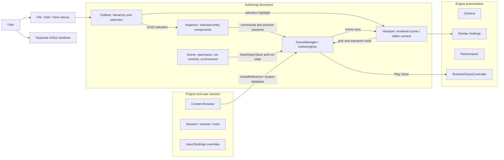

# RT2 current editor UI and workflow model

Grounded against commit `8b7f538477ecb482946675fd1755bd5bdbe728dc` on 2026-09-27. The working tree has untracked `docs/ui-prototype/`; this review did not edit it. Findings below are source-grounded. No live application was available or launched, so exact runtime layout, clickability, and error presentation have not been interactively verified.

Related proposal: [Editor workspace concept](editor-workspace-concept.md).

## Current ownership and user workflow

This is an ownership sketch, not a claim that all windows are docked in a fixed arrangement. The Outliner and Inspector are rendered by `SceneEditorUI`; the host renders Viewport and the remaining tool windows separately ([SceneEditorUI.cpp:24-28](../../../RT2App/src/SceneEditorUI.cpp), [WalnutApp.cpp:1424-1426](../../../RT2App/src/WalnutApp.cpp:1424)).

## Visible panels and entry points

| Current UI surface | What the user can do | Evidence |
| --- | --- | --- |
| **File menu** | New scene; Open project/scene/model through file picker; Open Project; Save; Save As; Exit. Unsaved-change coordination applies to document replacement/exit. | [WalnutApp.cpp:6655-6689](../../../RT2App/src/WalnutApp.cpp:6655), [WalnutApp.cpp:325-365](../../../RT2App/src/WalnutApp.cpp:325) |
| **Edit menu** | Undo and Redo; labels include command descriptions; Ctrl+Z / Ctrl+Shift+Z. | [WalnutApp.cpp:6692-6702](../../../RT2App/src/WalnutApp.cpp:6692) |
| **View menu** | Show/hide Camera, Performance, Render Settings, Scene, Session, Input Bindings, Content Browser, Outliner, Inspector; toggle Light/Camera icons and Physics Debug Lines. Viewport is always shown. | [WalnutApp.cpp:6704-6723](../../../RT2App/src/WalnutApp.cpp:6704) |
| **Outliner** | Search/filter and select scene entities; multi-select; add Empty/Child Empty, Point/Spot/Directional light, emissive sphere, Cube/Sphere/Plane; Import Scene and Load Mesh File; context actions include hierarchy operations, Hide/Show, Copy/Paste, Duplicate, Create Prefab Asset, Delete, and find prefab source. Delete key is handled. | [SceneEditorUI.cpp:1058-1150](../../../RT2App/src/SceneEditorUI.cpp:1058), [SceneEditorUI.cpp:1216-1288](../../../RT2App/src/SceneEditorUI.cpp:1216), [SceneEditorUI.cpp:1404-1555](../../../RT2App/src/SceneEditorUI.cpp:1404) |
| **Inspector** | Edits selected entity name, transform, visibility and available components. Includes mesh/material assignments and material values; punctual-light and camera controls; scripts and declared fields; physics body/shape and hinge/slider constraints; audio source authoring and clip preview. Components are added/removed through contextual component controls, not the prototype's generic searchable picker. Inspector content is selection-dependent. | [SceneEditorUI.cpp:1583-1778](../../../RT2App/src/SceneEditorUI.cpp:1583), [SceneEditorUI.cpp:1803](../../../RT2App/src/SceneEditorUI.cpp:1803), [SceneEditorUI.cpp:2191-2390](../../../RT2App/src/SceneEditorUI.cpp:2191), [SceneEditorUI.cpp:2562-2985](../../../RT2App/src/SceneEditorUI.cpp:2562), [SceneEditorUI.cpp:3814-4272](../../../RT2App/src/SceneEditorUI.cpp:3814) |
| **Viewport** | Shows engine-rendered scene; scene picking/selection; camera navigation and gizmo-based transform editing; viewport/editor actions and optional editor icons / physics debug overlay. It is always visible; render mode and tools belong here. | [WalnutApp.cpp:1542-1675](../../../RT2App/src/WalnutApp.cpp:1542), [WalnutApp.cpp:3314-3363](../../../RT2App/src/WalnutApp.cpp:3314) |
| **Scene** | Entity/resource counts and dirty state; New/Open/Save/Save As; Play/Pause/Step/Stop; environment HDR load/clear/intensity. Play resumes from Pause. | [WalnutApp.cpp:1424-1496](../../../RT2App/src/WalnutApp.cpp:1424), [WalnutApp.cpp:1498-1519](../../../RT2App/src/WalnutApp.cpp:1498) |
| **Camera** | Editor camera position, forward vector, vertical FOV, aperture/focus, render camera selection/inspection and camera bookmarks / view actions. Camera authoring controls are disabled outside Edit. | [WalnutApp.cpp:857-959](../../../RT2App/src/WalnutApp.cpp:857) |
| **Render Settings** | Renderer configuration rather than project assets: raster/path tracing mode, background, sampling, denoiser and available ray reconstruction / ReSTIR controls. Capability-dependent settings can be disabled when unsupported or incompatible. | [WalnutApp.cpp:1106-1400](../../../RT2App/src/WalnutApp.cpp:1106) |
| **Performance** | Live renderer/frame performance and selectable detail. This is a renderer tool window; it is not an engine Console. | [WalnutApp.cpp:960-1103](../../../RT2App/src/WalnutApp.cpp:960) |
| **Session** | Dirty/revision/status, open project metadata (project file/id, asset root, cache root), Refresh Assets, per-user last browse directory, recent scenes including missing-entry removal. “Standalone scene” is also represented. | [WalnutApp.cpp:1765-1847](../../../RT2App/src/WalnutApp.cpp:1765) |
| **Input Bindings** | Per-user runtime mapping overrides: Rebind/capture, Unbind, duplicate assignment warnings. Editor-owned contexts are read-only in the UI. | [WalnutApp.cpp:1850-2020](../../../RT2App/src/WalnutApp.cpp:1850) |
| **Content Browser** | Only operates with an open project. Search, refresh, import audio, browse asset types, import assets, drag/drop into scene, create/rename/move/delete assets and folders, inspect/use prefab assets. No open project displays a prompt instead. | [WalnutApp.cpp:2023-2050](../../../RT2App/src/WalnutApp.cpp:2023), [WalnutApp.cpp:2148-2240](../../../RT2App/src/WalnutApp.cpp:2148), [WalnutApp.cpp:2242-2380](../../../RT2App/src/WalnutApp.cpp:2242) |

There is no Console panel in the View menu or an ImGui `Console` window in these sources. Diagnostics/status are surfaced in Session, operation-specific UI, and application output/logging; do not label those as an existing dockable Console. Recovery Available, Unsaved Changes, Loading, GPU Init Failed, Scene Load Failed, input-capture, and asset rename/move/delete are modal flows in the host. Source anchors: [WalnutApp.cpp:803-815](../../../RT2App/src/WalnutApp.cpp:803), [WalnutApp.cpp:2396-2600](../../../RT2App/src/WalnutApp.cpp:2396).

## Context ownership, selection and edit-state rules

| Context | Owns / identity | Consequence for the UI |
| --- | --- | --- |
| Asset | Durable files, addressed by asset reference/path and subresource key. | Project Content Browser only exists when a project is open; selection here means asset selection and is not the scene-entity selection. Prefab and audio assets use real asset workflows. [glossary.md](../../../docs/glossary.md) defines the boundary. |
| Authoring | `SceneDocument`, durable UUIDs and edit history. | Outliner/context operations and Inspector commands edit authoring state; mutations participate in undo, dirty tracking, save and recovery. [SceneEditorUI.cpp:421-448](../../../RT2App/src/SceneEditorUI.cpp:421) |
| Scene | Live ECS entities and resource tables; transient entity handles. | UI selection stores UUIDs and resolves them into current scene entities; viewport picking feeds that same selection. Replacing/loading a document resets transient working state. [SceneEditorUI.cpp:282-296](../../../RT2App/src/SceneEditorUI.cpp:282), [SceneEditorUI.cpp:1028-1052](../../../RT2App/src/SceneEditorUI.cpp:1028) |
| GPU / renderer | Uploaded scene buffers and renderer settings. | Scene and material edits synchronize to GPU; renderer controls are independent of authoring assets and can depend on GPU feature support. [WalnutApp.cpp:398-450](../../../RT2App/src/WalnutApp.cpp:398) |
| Runtime | Play-session scene/state (runtime clone), scripts, physics/audio execution. | Play locks authoring; Pause freezes runtime; Step is available while paused; Stop restores edit session and authoring values. Runtime-only state is not the saved authoring scene. [WalnutApp.cpp:1457-1495](../../../RT2App/src/WalnutApp.cpp:1457), [RuntimeSceneController.h:182-250](../../../RT2App/src/RuntimeSceneController.h:182) |

Inspector inputs are not all immediate persistent mutations: continuous transform/light/camera/script edits may live-preview, then finalize into command history or restore on cancellation; physics authoring uses explicit working copies with Apply/Revert and conflict/error feedback. Play entry finalizes open preview sessions before locking authoring ([SceneEditorUI.cpp:596-606](../../../RT2App/src/SceneEditorUI.cpp:596), [SceneEditorUI.cpp:2160-2188](../../../RT2App/src/SceneEditorUI.cpp:2160)). A generic prototype “edit properties” loop hides these materially different commit behaviors.

## Core actual flows

### Create / import / edit / save

Create or open a project/scene from File; replacing an edited document routes through Unsaved Changes coordination. Create scene entities from Outliner Add. Import Scene and Load Mesh File use file pickers; Content Browser supports project asset workflows separately, including audio import and prefab instantiation. Selection in hierarchy or viewport populates Inspector. Commands and live previews update authoring, dirty state, scene-to-GPU sync and undo history. Save writes native scene data; Save As obeys project asset-root containment where a project is active. Evidence: [WalnutApp.cpp:325-365](../../../RT2App/src/WalnutApp.cpp:325), [SceneEditorUI.cpp:1071-1150](../../../RT2App/src/SceneEditorUI.cpp:1071), [WalnutApp.cpp:6363-6468](../../../RT2App/src/WalnutApp.cpp:6363).

### Playtest

From Scene, Play starts runtime, Pause suspends it, Play resumes, Step advances while paused, and Stop exits runtime. Authoring mutations are gated outside Edit; editor camera authoring is disabled; viewport switches from editor interaction to runtime presentation. Script/physics/audio capabilities exist in runtime and have authoring controls where applicable. Evidence: [WalnutApp.cpp:1457-1495](../../../RT2App/src/WalnutApp.cpp:1457), [SceneEditorUI.cpp:596-606](../../../RT2App/src/SceneEditorUI.cpp:596), [WalnutApp.cpp:2900-2926](../../../RT2App/src/WalnutApp.cpp:2900).

### Failure, recovery and diagnostics

Unsaved New/Open/Recent/Exit requests are mediated by save/discard/cancel choices. Scene recovery can be resumed or discarded. Load/import, asset resolution, input conflicts, audio audition/import, preview-session finalization, malformed physics references and script errors have distinct feedback paths; loading can be asynchronous. Error text may be in dialogs, Session status, local Inspector/browser UI or application output. The prototype's single toast/log affordance does not represent that current diagnostic model. Evidence: [WalnutApp.cpp:2396-2600](../../../RT2App/src/WalnutApp.cpp:2396), [WalnutApp.cpp:1752-1755](../../../RT2App/src/WalnutApp.cpp:1752), [scripting.md:320-355](../../../docs/scripting.md:320).

## Docking, visibility, persistence, shortcuts

The app uses ImGui windows and an ini layout snapshot, and loads/saves window visibility flags through editor settings ([WalnutApp.cpp:760-765](../../../RT2App/src/WalnutApp.cpp:760), [WalnutApp.cpp:5205-5229](../../../RT2App/src/WalnutApp.cpp:5205)). The window visibility defaults are Outliner/Inspector/Camera/Performance/Render Settings/Scene/Session visible, Input Bindings/Content Browser hidden ([WalnutApp.cpp:5809-5817](../../../RT2App/src/WalnutApp.cpp:5809)). The source confirms configurable separate windows, not a reviewed fixed layout or persisted prototype-like named workspace presets. File/Edit/View menus are the visibility entry points. Scene playback controls currently live in Scene, not a global toolbar.

Input action bindings are a separate runtime subsystem with project defaults and per-user overrides; they are not synonymous with editor keyboard shortcuts. The editor uses Ctrl+Z / Ctrl+Shift+Z and supports viewport camera actions, transform tools and selection/clipboard/delete handling; detailed mappings can be inspected in [WalnutApp.cpp:3314-3395](../../../RT2App/src/WalnutApp.cpp:3314), [WalnutApp.cpp:3365-3395](../../../RT2App/src/WalnutApp.cpp:3365), [SceneEditorUI.cpp:1270-1288](../../../RT2App/src/SceneEditorUI.cpp:1270). Exact shortcut discoverability and behavior under text focus need live verification.

## Verification boundary

This is a source-only UI and capability model at the recorded commit. It establishes what code constructs and connects, not that every ImGui popup, Vulkan-specific setting, platform file dialog, or content-browser action works in a live session. The current tree may have moved since the recorded commit; re-check line references before using this as implementation input.

Exported from the Traycer design record on 2026-09-28. This is a dated analysis snapshot; recheck source references before native implementation.
