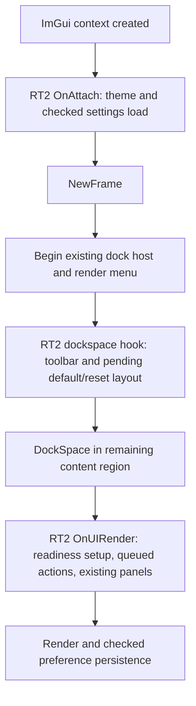

# Editor workspace overhaul

Accepted by independent technical review, 28 September 2026. Implementation has not started. Grounded against commit `d0ccf7c0693c778a09f1f9bc97ef5c6a60e08610` on `editor-workspace-overhaul`. This is off-roadmap work, not a numbered engine phase. No native implementation or build validation has been performed for this plan.

## Intent and settled scope

Implement the revised prototype as an incremental native ImGui workspace. The user selected native docking, preservation of saved layouts, and a first delivery covering the theme, default layout and persistent toolbar. Keep flat dark neutral-grey surfaces with indigo primary and violet secondary accents.

The first delivery changes where existing functionality is reached, while retaining engine commands, editor admission checks, entity selection, asset selection, preview finalization and document recovery. Existing users retain their arrangement; new users receive the proposed arrangement. The HTML remains a design reference, not a specification for invented engine behavior.

Audio work and prototype were checkpointed and pushed on `audio-integration-a8-acceptance`; implementation proceeds on `editor-workspace-overhaul`.

## Grounding

Paths below are repository-relative; line numbers describe the grounding commit.

| Evidence | Consequence |
| --- | --- |
| `Walnut/Walnut/src/Walnut/Application.cpp:746` enables docking; `:918` starts the frame; `:949` opens "DockSpace Demo"; `:958` obtains "VulkanAppDockspace"; `:959` submits DockSpace before menus and layers. | Extend the native host. Preserve its name and ID seed; reserve toolbar space before submitting the dock node. |
| `Walnut/Walnut/src/Walnut/Application.h:441` (template) and `:444` (shared-pointer overload) call OnAttach when pushing a layer; `Application.cpp:831` calls OnDetach before `:849` destroys ImGui. | Initialize RT2 workspace settings in OnAttach before the first frame; final persistence can run before UI context destruction. |
| `RT2App/src/WalnutApp.cpp:729` configures and loads the user ini from inside OnUIRender. | Current initialization occurs too late for first-frame docking. Move ownership rather than adding a second loader. |
| `RT2App/src/WalnutApp.cpp:5181` onward implements view_config.txt; `:5205` onward loads visibility; `:5215` writes it. Input Bindings and Content Browser are omitted, and save failures are silent. The observed exit call is `:345`. | Persist all existing visibility flags, detect failures, and save during normal use as well as accepted shutdown. |
| `Walnut/vendor/imgui/imgui.h:67` pins ImGui 1.87; `:961` documents manual ini ownership; `imgui_internal.h:3022` onward exposes DockBuilder. | Use the vendored API; isolate internal docking APIs in one UI adapter. No ImGui upgrade is needed. |
| `RT2App/src/WalnutApp.cpp:1457` onward defines transport; `:5246`, `:5400`, `:5737`, `:5746` own Play/Pause/Step/Stop. | Toolbar must call the same entry points, including audio-preview shutdown and runtime context preparation. |
| `RT2App/src/WalnutApp.cpp:5774` onward exposes Undo/Redo; `:5858` NewScene and `:6353` Save wrappers already exist. | Reuse owner-level handlers and availability; never implement a second command/history/runtime path. |
| `RT2App/src/SceneEditorUI.cpp:1072-1159` owns Add popup; `:1583` begins Inspector. `docs/glossary.md` documents popup scope and resource-context boundaries. | Shared Add menu content must execute within each caller's own popup scope. Keep entity Inspector separate from asset selection. |
| `RT2App/src/WalnutApp.cpp:1546` begins Viewport; `:6704` onward exposes View controls. | Keep one viewport and existing tool destinations. Preserve actual image bounds for picking and input capture. |
| `RT2ImGuiProbe/premake5.lua:7` and `:24-29` define a headless ImGui probe using vendored core sources. | Test docking/frame behavior here; do not add ImGui or Walnut to CPU engine tests. |

## Architecture and frame lifecycle

RT2 owns visual policy and settings. Walnut supplies one optional, generic layer hook inside the existing dock host, before DockSpace submission. A default no-op `OnDockspaceUI(uint32_t dockspaceId)` is sufficient; the hook receives an opaque ID rather than introducing ImGui into Layer.h. Keep the dockspace alive every frame even if host Begin returns false.

Use existing OnAttach for theme and ini initialization; a new pre-frame hook is unnecessary. Reorder the host's menu rendering before the new hook so the remaining content rectangle correctly excludes both menu and toolbar.

Proposed modules, finalized during implementation according to local conventions:

- `EditorWorkspaceState`: CPU-only preference parsing, startup source selection, visibility snapshot and checked persistence. Does not know ImGui node IDs.
- `EditorWorkspace`: native DockBuilder adapter, first-layout/reset application and integration with the existing host.
- `EditorTheme`: idempotent style assignment using the existing embedded font.
- `EditorToolbar`: renders a state snapshot and emits action requests. Owns neither scene state nor history.

Add an explicit production command seam: a CPU-linkable action/request type, queue, availability snapshot, and dispatcher with injected RT2 owner callbacks. Menu, existing Scene transport, shortcuts, toolbar and extracted Add menu contents must all use that seam for the actions being relocated. Requests carry stable action payloads, not renderer pointers. Revalidate availability at dispatch; suppress duplicate activation of the same action within a frame while preserving ordered distinct requests. Clear consumed requests so the next frame cannot replay them. Existing preview/admission and effectful methods remain authoritative inside the callbacks.

Include the seam in the CPU test closure and the native probe through both VS and premake definitions. CPU tests exercise availability, stale-state rejection and exactly one callback per accepted request. Probe tests exercise actual production route widgets/shortcut adapters emitting into this seam. These tests establish routing, not the correctness of real audio/GPU effects: RT2 native walkthroughs still verify those effects.

Toolbar requests are dispatched once by RT2 after its existing CLI/readiness and editor admission setup, before panels. Modal requests stay owned by the current modal renderer. No scene mutation occurs inside the host's menu/popup drawing stack. Menu and toolbar share action availability and dispatch helpers where necessary.

## Saved-layout contract

Retain `AppDataRoot()/imgui.ini` and `view_config.txt`. Do not move layout into project or scene documents, and do not merge it into EditorSettingsStore's unrelated schema.

Preserve window identities: Viewport, Outliner, Inspector, Content Browser, Session, Performance, Scene, Camera, Render Settings and Input Bindings. Preserve "DockSpace Demo" and "VulkanAppDockspace" as internal identities even if user-facing labels change later.

Classify a profile as new only when all three paths are confirmed absent: user ini (U), portable ini (P), and view_config (V). An existence/read error means protected existing state, never absence. Presence below includes empty files; the error/empty rules override loading. Do not use absence of an individual visibility key as the discriminator.

| U | P | V | Geometry source | Visibility defaults before applying valid V keys |
| --- | --- | --- | --- | --- |
| Absent | Absent | Absent | New default | New-profile defaults |
| Absent | Absent | Present | New default geometry | Legacy member defaults |
| Absent | Present | Absent | Portable seed | Legacy member defaults |
| Absent | Present | Present | Portable seed | Legacy member defaults |
| Present | Absent | Absent | User ini | Legacy member defaults |
| Present | Absent | Present | User ini | Legacy member defaults |
| Present | Present | Absent | User ini | Legacy member defaults |
| Present | Present | Present | User ini | Legacy member defaults |

| Startup condition | Behavior |
| --- | --- |
| Readable existing user ini | Load it before the first frame. Never build the new default automatically, even if there is no dock root or everything is floating. |
| No user ini, readable executable-directory portable ini | Load as a seed; never write back to the portable file. Subsequent settings go to the user directory. |
| Neither ini exists | Build the new default once, when the host has a valid content size. Honor any existing visibility config independently. |
| User ini is readable but empty | Protect the original; use a session-only default and show recovery status. Explicit Reset can back up the empty file and install the default. |
| User ini exists but cannot be read | Protect it and use a session-only default; do not fall back to the portable seed or overwrite it. Retry after access is repaired is the recovery path. Reset stays unavailable until a checked backup succeeds. |
| Existing nonempty ini has unfamiliar or partially damaged contents | Do not infer corruption merely from a missing dock node. ImGui's loader provides no complete validation result. Preserve the original bytes in a checked backup before the first rewrite; never claim semantic repair. |
| Explicit View > Reset Layout | Back up existing files successfully before rebuilding geometry and restoring default visibility. Failure to back up blocks reset and reports the path/error. |

Adopt manual ImGui persistence: set `io.IniFilename = nullptr` before the first NewFrame, use checked file reads with LoadIniSettingsFromMemory, and save SaveIniSettingsToMemory output using a checked temporary-file replacement. Observe WantSaveIniSettings and clear it only after success. Coalesce repeated failures with a bounded retry delay and a visible retry action; do not emit one error per frame.

Keep view_config's existing keys and default behavior when legacy keys are absent; add Input Bindings and Content Browser. Validate known values and performance-detail bounds; retain unknown keys. Capture close-button changes as well as View menu changes. Compare snapshots and debounce normal saves; flush on accepted exit/OnDetach while ImGui still exists. Headless operation must not rewrite interactive preferences.

Provide recovery UI in the persistence package itself: always-reachable View > Workspace Settings opens a status panel with the affected paths, last typed error, unsaved parts, Retry Load/Save and Reset Layout. Keep an in-memory WorkspacePersistenceStatus for the whole session until resolution; do not rely on transient stdout or a Session window that may be closed. Reconstruct protected state from file checks on each startup. Diagnostics also flow into the existing Session status channel. No new on-disk diagnostic journal is required.

Retry Load while protected explicitly discards session-only geometry after a successful read, with a confirmation if the user has changed it; failure leaves the session and original untouched. Retry Save only applies to a successfully loaded or explicitly reset profile. If access cannot be repaired, the user can continue using the session-only layout; persistence remains visibly unavailable. There is no destructive bypass for unreadable files. Apply the same protection to an unreadable visibility file. Offer recovery from readable paired backups through this panel, using the same checked replacement and error handling.

Explicit Reset forces a checked save of both geometry and visibility after the rebuilt windows have submitted; it must not wait for the usual debounce. Keep unsaved status until both writes succeed.

Use typed diagnostics for read, directory, write, flush and replacement errors. Keep the old destination intact on failure. A small preference-file writer is appropriate; the prefab-specific PathTransaction protocol is not an appropriate dependency.

The two existing files remain independently atomic, not a new cross-file transaction. A partial save must be reported as "workspace changes not fully saved", retain both original backups and retry only unsaved parts. A crash between replacements can restore mixed geometry/visibility; document this bounded limitation and offer reset/recovery from the paired backups. No success claim until both requested writes succeed.

## First default arrangement

Build with DockBuilder only for a genuinely new layout or explicit Reset. Never rebuild every frame or on resize.

1. Split a right-hand Inspector area, approximately 23% of available width.
2. Split a bottom area from the remainder, approximately 27% of height.
3. Split Outliner from the top remainder, approximately 20% of that width.
4. Place Viewport in the remaining center.

On first-layout/reset only, request SetNextWindowFocus when the visible Content Browser is first submitted, then clear the request. Probe the actual selected tab after submission; do not assign internal SelectedTabId. Skip this focus when preserved visibility hides the browser. Content Browser is thus the initially selected bottom tab for new profiles and Reset; Session and Performance share that dock. Inspector occupies the right. Scene, Camera, Render Settings and Input Bindings remain available through View and are assigned sensible right-side tabs when first opened. Scene retains Environment controls and its stable window identity.

New-profile visibility: Viewport, Outliner, Inspector, Content Browser, Session and Performance on; other tools off. A standalone scene shows the real project-required Content Browser state without preventing scene editing. Existing profile visibility remains unchanged, including legacy defaults for omitted keys.

Use ImGui logical dimensions. At small window sizes, constrain toolbar content and allow panel scrolling instead of enforcing impossible fixed widths. Test 1280x720 and high-DPI desktop sizes. Retain all user resizing, floating and tab ordering through native persistence.

## Theme and toolbar

Theme tokens start with neutral 900/850-equivalent surfaces, neutral borders/text, indigo focus/selection/primary controls and restrained violet secondary accents. Avoid blue-tinted panel backgrounds. Preserve conventional XYZ, warning, error and runtime-state semantics; verify disabled and selected text readability. Keep the embedded Roboto font initially. Apply style once from a base definition so repeated initialization cannot compound scale.

The toolbar is persistent above the dockspace, including when Scene is closed or the viewport floats. It does not introduce a separate Game view.

| Control | Existing behavior to reuse |
| --- | --- |
| Save | SaveRt2Scene/SaveCurrentScene, including existing chooser, preview finalization and errors |
| Undo / Redo | Existing CanUndo/CanRedo and owner handlers; same shortcuts and admission |
| Add | Shared SceneEditorUI menu content, existing entity/import commands and editor gates; each caller owns its popup |
| Play / Resume | Existing EnterPlay from Edit and existing Resume from Paused |
| Pause / Step / Stop | Existing runtime predicates and EnterPause/EnterStep/EnterStop |
| Scene/project and dirty indicator | Existing Session/document state; read-only display |
| Tools overflow at narrow widths | Existing window visibility controls, no new workspace preset feature |

Prioritize transport and save at narrow widths; move secondary controls into overflow without overlap or clipped actions. Give icon controls text tooltips. Use disabled states consistent with menus and keyboard paths.

Keep Scene controls during initial integration for parity comparison. Remove duplicated transport/document controls only after all routes pass the same acceptance checks; retain Scene's environment controls. This removal may be a follow-up commit, not a condition for the first useful delivery.

## Ordered work packages

| Package | Work and exit condition |
| --- | --- |
| Persistence foundation | Include View > Workspace Settings diagnostics/recovery UI in this package; no release of manual persistence without it. Characterize legacy settings; move initialization to OnAttach; checked persistence and backup/reset policy; all visibility flags covered. Existing saved layouts survive two restarts and failure injection leaves original files recoverable. |
| Theme and default docking | Apply neutral theme; add generic pre-dock hook; preserve host/window IDs; seed first-use layout and explicit reset. Customized layouts remain untouched. |
| Persistent toolbar | Shared action availability/dispatch; native toolbar and responsive overflow; extract Add contents without changing popup ownership. Every action follows existing engine semantics. |
| Native acceptance and cleanup | Probe coverage, Release/Debug gates and manual rendered UI walkthrough; update grounded documentation. Remove duplication only after parity is demonstrated. |

Each package is a reviewable commit. The first delivery ends after these packages; it does not require rebuilding every Inspector widget.

Follow-up work can regroup Camera, renderer and Environment presentation, improve Content Browser/Session discoverability, and polish specialized physics/audio/script workflows. Keep their current controls accessible until replacements have explicit parity coverage. Shared asset/entity Inspector, separate Game view, Console, generic component picker, Focus View and named layouts remain **proposed new interactions**, outside this implementation scope.

## Verification and acceptance

| Area | Required evidence |
| --- | --- |
| Persistence policy, CPU tests | User/portable/absent precedence; explicitly cover empty and unreadable portable ini and empty and unreadable view_config (empty portable seed remains protected until explicit Reset; unreadable portable seed remains session-only until repaired or explicitly reset without modifying the seed; readable empty view_config uses legacy defaults and is backed up before rewrite); legacy omitted flags and unknown keys; malformed known values; read/write/flush/replace failures; backups; partial save/retry; headless no-write. Use temporary directories, never the developer's real profile. |
| Native ImGui probe | Real 1.87 frame lifecycle, first-use default once, loaded dock IDs unchanged, floating-only layout retained, toolbar reduces dock region, resize without rebuild, reset, close/reopen visibility and popup ownership. Exercise production helpers rather than duplicating their algorithms. |
| Command regression | Toolbar/menu/shortcut routes agree; dispatch exactly once; Play from Edit, Resume from Paused, Step only Paused, Stop restores authoring; preview admission and audio audition shutdown remain intact. |
| Native manual walkthrough | Customized layout restart twice; portable migration; all tools reachable; toolbar persistent with Scene closed; actual viewport image picking/gizmos/drop/input capture; unsaved New/Open/Exit and recovery; standalone and project sessions; high DPI and small window. |
| Engine gates | Build RT2App, RT2Tests, RT2SliceRunner and RT2ImGuiProbe in Release and Debug using authoritative project files; run RT2Tests from repo root and run scripting regression gate. Compare against a freshly established baseline and current authoritative Test baseline, not historical phase counts. |

Keep new ImGui sources out of CPU engine test link closures. Update both authoritative VS projects and corresponding premake declarations as appropriate. Run `graphify update .` after source changes. Record actual build/test results and native manual limitations in a verification report; HTML event checks are not native acceptance.

## Remaining risks and review gate

- ImGui 1.87 DockBuilder is internal API: contain it and test against the vendored version.
- Loading settings before NewFrame fixes initialization order but changes first-frame behavior: test portable, floating and hidden-tab cases explicitly.
- ImGui does not expose complete ini parse validation; preserve originals rather than inventing a destructive "repair" heuristic.
- Toolbar focus must not redirect viewport shortcuts or change preview-finalization behavior.
- Separately persisted geometry and visibility can diverge on a crash between writes; checked paired backups bound recovery without expanding this into a general transaction system.
- Native rendering, DPI and input acceptance require running RT2; no such validation has occurred in drafting.

Independent critique identified command-routing, profile classification/recovery, initial-tab selection and package-boundary gaps. This revision addresses all four and corrects evidence anchors. Targeted independent recheck accepted the revision with no remaining blockers. Non-blocking test-case and evidence precision notes are incorporated. This is technical review acceptance, not a claim that implementation or native validation has occurred. No open product decision blocks the selected first slice; implementation details above are recommendations subject to that review.

